# **iOS**@[**Swift**](https://developer.apple.com/swift/)<font color=red>靶场项目</font>蓝皮书📘


<p align="left">
  <a></a>
  <a></a>
  <a></a>
  <a></a>
  <a></a>
  <a href="https://github.com/295060456/JobsSwiftBaseConfigDemo"></a>
  <a></a>
  <a href="https://github.com/295060456/JobsSwiftBaseConfigDemo/stargazers"></a>
  <a href="https://github.com/295060456/JobsSwiftBaseConfigDemo/network"></a>
  <a></a>
  <a></a>
  <a></a>
</p>


[toc]

当前总行数：

## 🔥 <font id=前言>前言</font>

> 温馨提示🔔：本文较长，需要⏬下载到本地以后，方能完整阅读。推荐阅读器👉[**Typora**](https://typora.io/)

* **工欲善其事必先利其器**
* **站在巨人的肩膀上，才能看得更远**
* **面向信仰编程**
* [**👉点我查看运行效果**](https://appetize.io/app/b_6jlimn7ue5vnmc4zq36aqam4jm)

## 一、🎯 项目白皮书 <a href="#前言" style="font-size:17px; color:green;"><b>🔼</b></a> <a href="#🔚" style="font-size:17px; color:green;"><b>🔽</b></a>

> 程序员是一个高消耗的职业，除了日常基本的业务开发以外，新事物的不断涌现也需要持续性的学习，所以是一件非常消耗精力的事；而且由于长期的高压、高情绪、熬夜，**会打乱人体内正常的内分泌节奏**，大概率也会逐渐的引发各种职业疾病。业内普遍认为程序员的**黄金年龄在25～35周岁**。那么，还是希望，在我们（亦或者是暂时性的）离开这个行业的时候，一定要为自己或者后人，留下点什么，算是这么多年的一个工作总结。此外，能最大化的辅助人，帮助其在极短的时间内去：<u>回忆/上手/学习/实验</u>这个编程语言下的工程项目。所以，此项目就一定是要结合商业需求去务实拓展，解决当前痛点。

* 品控标准（只能严格的保证编译器正常，而不能完全保证运行时的不出错）
  * 一定要保证这个工程的成功编译通过，方便以后项目直接进行引用，乃至开新版本
  * <font color=blue>**示例Demo可能因为相关Api的升级，没有及时的覆盖处理，可能会出现闪退。修复即可**</font>
* 自此以后，所有新开的项目都可以根据这个**根项目**来进行统一的调配和使用
  * 将它作为所有项目的母版和基类，最大限度的做到全局的统一
  * 日积月累的记录一些平时生产生活中萌发的一些优秀的想法、灵光一现的创意。包括但不仅限于：<u>语法糖的封装</u>、<u>方法的调用</u>，<u>第三方的选用</u>、以及一些心得体会
* 作为某些代码**实践靶场**，在实际开发过程中，是非常有必要的
  * 为我们快速且稳定的复现一些业务场景，作为代码实验室🧪，而搭建的一个平台
* 作为代码笔记，记录一些常用的代码，方便查阅
  * 主要形式是可以运行的代码 + 文字性叙述 + 图文混编讲解
  * 作为学习的资料，可以快速了解到一些常用的知识，大幅**降低学习成本**
  * 作为其他项目的参考，可以快速的了解到项目的架构，代码规范，以及一些设计模式
  * 这么一些优秀的成果，其来源不仅仅是来自于作者本身的持续付出与积累。更是这个领域大家庭中各路优秀作者的智慧结晶

## 二、👥 项目配置支持 <a href="#前言" style="font-size:17px; color:green;"><b>🔼</b></a> <a href="#🔚" style="font-size:17px; color:green;"><b>🔽</b></a>

### 1、系统环境配置 <a href="#前言" style="font-size:17px; color:green;"><b>🔼</b></a> <a href="#🔚" style="font-size:17px; color:green;"><b>🔽</b></a>

* Apple电脑的芯片分为**`intel芯片`**和**`M系列自研芯片`**。底层区别在于指令集的不同。但是Apple停止了对**`intel芯片`**机型的支持，无法更新MacOS到最新，间接的导致无法更新到最新版本的Xcode。软件开发相关的SDK其实也对MacOS的系统环境以及Xcode版本有关联影响。即：即便是都是使用统一版本的[**Swift**](https://developer.apple.com/swift/)也可能导致某些API报错（找不到）

* 如果Apple开发者账号，新加入了设备，需要在本地的xcode里面更新**开发描述文件**。否则打出的`*.ipa`包，没有办法在新加入的设备里面安装

  <table style="width:100%; table-layout:fixed;">
    <tr>
      <td>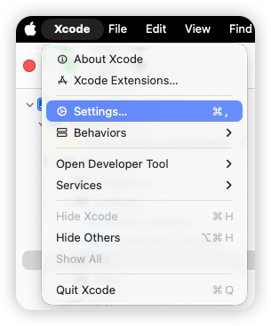</td>
      <td>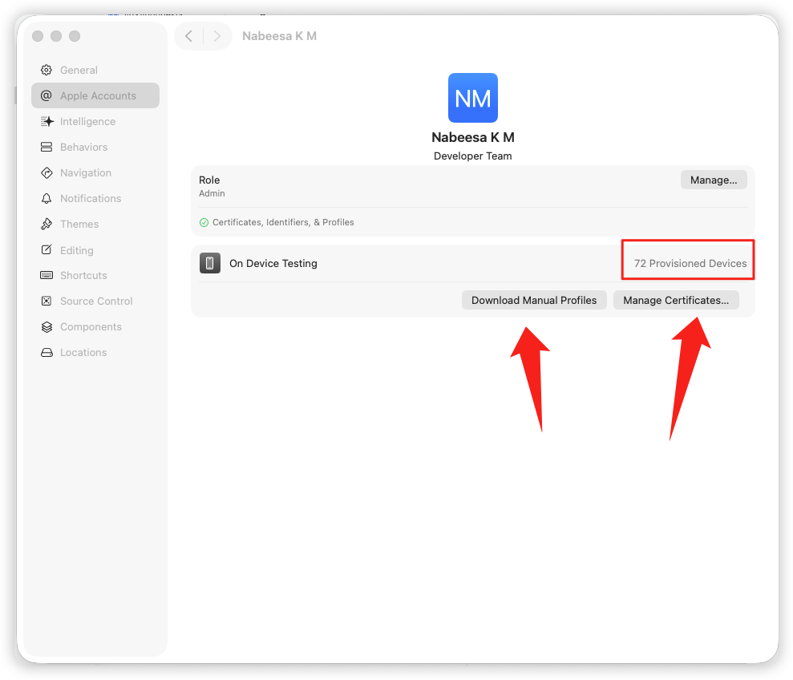</td>
    </tr>
  </table>


* 这个版本是「Xcode 当前自带 [**Swift**](https://developer.apple.com/swift/) 工具链」的版本，不一定与项目 **Build Settings** 中使用的版本完全一致（项目可选择旧版编译）。

  ```shell
  ➜  ~ xcrun swift --version
  swift-driver version: 1.127.14.1 Apple Swift version 6.2 (swiftlang-6.2.0.19.9 clang-1700.3.19.1)
  Target: arm64-apple-macosx26.0
  ```

* 找到`Swift Language Version`

  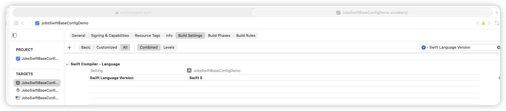

* 查项目里的配置：如果项目有多个 target，每个 target 可能定义不同的 `SWIFT_VERSION`，所以可能会有多行输出：

  ```shell
  ➜  MyApp git:(developer) ✗ grep SWIFT_VERSION MyApp.xcodeproj/project.pbxproj
  				SWIFT_VERSION = 5.0;
  				SWIFT_VERSION = 5.0;
  ```

  >```
  >YourProject.xcodeproj/
  > └── project.pbxproj   ✅ 实际配置文件
  >```

* **Mac OS 15** 以后，苹果采取了更加严格的权限写入机制。[**Swift**](https://developer.apple.com/swift/)项目如果要利用[**`Cocoapods`**](https://cocoapods.org/)来集成第三方，就需要在**xcode**里面做如下设置，否则编译失败：

  * <font size=5  color=red>在`xcode`里面设置优先级最高</font>

    `TARGETS`->`Build Settings`->`ENABLE_USER_SCRIPT_SANDBOXING`-><font color=red>`NO`</font>

    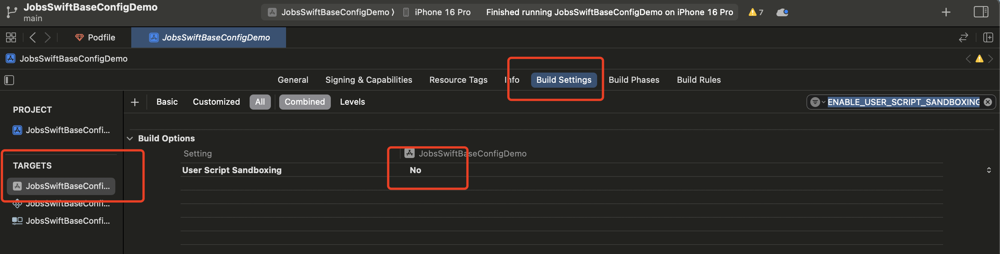
  
  * 或者，在 `Podfile` 里配置
  
    ```ruby
    pods_project = installer.pods_project
    pods_project.targets.each do |t|
      t.build_configurations.each do |config|
        config.build_settings['ENABLE_USER_SCRIPT_SANDBOXING'] = 'NO'
        config.build_settings['IPHONEOS_DEPLOYMENT_TARGET'] = '15.0'
      end
    end
    ```
  
  * 或者，[**脚本处理**](./【MacOS】⚙️双击禁用沙盒保证Cocoapods构建流程.command)
  
    ```shell
    #!/bin/zsh
    
    print_green()  { echo "\033[0;32m$1\033[0m"; }
    print_red()    { echo "\033[0;31m$1\033[0m"; }
    print_yellow() { echo "\033[0;33m$1\033[0m"; }
    
    print_green "🛠️ 脚本功能："
    echo "1️⃣ 自动识别 Flutter 或原生 iOS 工程"
    echo "2️⃣ 自动定位 Xcode 工程（.xcodeproj）文件"
    echo "3️⃣ 修改 ENABLE_USER_SCRIPT_SANDBOXING = NO，防止 CocoaPods 构建失败"
    echo ""
    
    SCRIPT_DIR=$(cd "$(dirname "$0")"; pwd)
    XCODEPROJ=""
    
    # 尝试自动识别 Flutter / iOS 工程路径
    if [[ -d "$SCRIPT_DIR/ios" && -d "$SCRIPT_DIR/lib" ]]; then
      print_green "📦 检测到 Flutter 工程，进入 ios 子目录查找 Xcode 工程..."
      PROJECT_DIR="$SCRIPT_DIR/ios"
    else
      print_green "📱 尝试在当前目录查找原生 iOS 工程..."
      PROJECT_DIR="$SCRIPT_DIR"
    fi
    
    # 自动寻找 .xcodeproj
    XCODEPROJ=$(find "$PROJECT_DIR" -maxdepth 1 -name "*.xcodeproj" | head -n 1)
    
    # 如果找不到，就让用户手动拖入
    if [[ -z "$XCODEPROJ" ]]; then
      print_red "❌ 未自动找到 .xcodeproj 文件"
      echo ""
      read "?👉 请手动拖入你的 .xcodeproj 工程文件，然后按回车：" XCODEPROJ
      XCODEPROJ=${XCODEPROJ%\"}
      XCODEPROJ=${XCODEPROJ#\"}
    fi
    
    # 校验路径有效性
    PBXPROJ_PATH="$XCODEPROJ/project.pbxproj"
    if [[ ! -f "$PBXPROJ_PATH" ]]; then
      print_red "❌ 找不到 project.pbxproj 文件，请确认路径正确"
      exit 1
    fi
    
    print_yellow "📂 目标工程：$XCODEPROJ"
    print_green  "🔍 正在查找 ENABLE_USER_SCRIPT_SANDBOXING 设置..."
    
    # ✅ 若已存在，则替换为 NO
    grep -q "ENABLE_USER_SCRIPT_SANDBOXING" "$PBXPROJ_PATH"
    if [[ $? -eq 0 ]]; then
      print_green "✅ 已找到 ENABLE_USER_SCRIPT_SANDBOXING，正在替换为 NO..."
      sed -i '' 's/ENABLE_USER_SCRIPT_SANDBOXING = YES;/ENABLE_USER_SCRIPT_SANDBOXING = NO;/g' "$PBXPROJ_PATH"
      sed -i '' 's/ENABLE_USER_SCRIPT_SANDBOXING = YES/ENABLE_USER_SCRIPT_SANDBOXING = NO/g' "$PBXPROJ_PATH"
    else
      print_green "➕ 未显式设置，添加 ENABLE_USER_SCRIPT_SANDBOXING = NO 到所有 buildSettings..."
      sed -i '' '/buildSettings = {/a\
    \        ENABLE_USER_SCRIPT_SANDBOXING = NO;
    ' "$PBXPROJ_PATH"
    fi
    
    print_green "🎉 修改完成！已将 ENABLE_USER_SCRIPT_SANDBOXING 设置为 NO"
    ```
  

### 2、开发周边支持 <a href="#前言" style="font-size:17px; color:green;"><b>🔼</b></a> <a href="#🔚" style="font-size:17px; color:green;"><b>🔽</b></a>

* [**JobsDocs**](https://github.com/295060456/JobsDocs)

  * [**中国公民身份证校验规则**](https://github.com/295060456/JobsDocs/blob/main/中国公民身份证校验规则.md/中国公民身份证校验规则.md)
  * [**iOS项目多环境配置**](https://github.com/295060456/JobsDocs/blob/main/iOS相关的文档和资料.md/iOS项目多环境配置.md/iOS项目多环境配置.md)

* [**过期的模拟器配件**](https://github.com/295060456/Xcode_Sys_lib)

* [**制作(发布)Pods组件**](https://github.com/JobsKits/JobsDocs/blob/main/制作(发布)Pods组件.md/制作(发布)Pods组件.md)

* [**CocoaPods**](https://cocoapods.org/)

* [**MacOS配置个人热点🛜**](https://github.com/295060456/JobsDocs/blob/main/MacOS配置个人热点🛜.md/MacOS配置个人热点🛜.md)

* [**Swift Package Dependence使用指南🧭**](https://github.com/295060456/JobsDocs/tree/main/Swift Package Dependence使用指南/Swift Package Dependence使用指南.md)

* [**Xcode文件模版的配置和使用**](https://github.com/295060456/xctemplate)

* [**苹果开发者账户续费**](https://account.apple.com/account/manage/section/payment)

* [**在线演示**](https://appetize.io) 👉 上传你的（支持iOS/Android）包，就能在线运行、演示、调试、自动化测试，还能嵌到网页或内部系统里给客服/销售/培训/QA 用

* [**配置SourceTree脚本**](https://github.com/295060456/SourceTree.sh)

* [**代码块**](https://github.com/295060456/JobsCodeSnippets)

* [**利用quicktype自动建立数据模型**](https://github.com/JobsKits/JobsDocs/blob/main/利用quicktype自动建立数据模型.md/利用quicktype自动建立数据模型.md)

* [**图片占位符**](https://picsum.photos/)

* [**snipaste**](https://www.snipaste.com/)：截图工具

* [**Sip**](https://sipapp.io/)：取色器

* [**帮小忙@腾讯QQ浏览器在线工具箱**](https://tool.browser.qq.com/)

* [**Mac破解软件**](https://mac.macxz.com/)

* [**波测**](https://www.boce.com/)

* [**向附近设备分享文件**](https://localsend.org/download)

* [**uuwallet@虚拟卡**](https://www.uuwallet.com/)

* [<font id=UI界面调试工具>**UI界面调试工具**</font>](https://lookin.work/)（必须是有线连接，并且**`Lookin.app`**要先于项目文件启动）

  > ```ruby
  > pod 'LookinServer', :subspecs => ['Swift'], :configurations => ['Debug']
  > ```

* [**Fastlane**](https://fastlane.tools/)：自动化工具集

  > 一个开源的 **移动应用（iOS / Android）自动化工具集**，目的是把那些繁琐、重复、容易出错的 App 构建 / 签名 / 发布 / 测试 / 上架 等流程，变成<u>写一个脚本、一键执行</u>的工作。

* [**SwiftLint**](https://github.com/realm/SwiftLint)：[**Swift**](https://developer.apple.com/swift/) 代码静态检查工具。 **自动分析 Swift 源代码，帮助保持统一、规范、可维护的代码风格**。

  > 原本要靠团队 Code Review 去发现的细节，[**SwiftLint**](https://github.com/realm/SwiftLint) 都能自动扫出来 ⚡️

  ```shell
  ➜  ~ brew install swiftlint
  ```

  * `.swiftlint.yml` 模板

    ```yml
    # =========================================
    # SwiftLint 配置文件（标准模板，含中文注释）
    # 放到仓库根目录，与 .gitignore 同级
    # =========================================
    
    # Swift 版本（有助于规则解析；不写也能跑）
    swift_version: 5.9
    
    # 选择使用哪种报告器：
    # - xcode（默认，警告出现在 Xcode Issues 面板）
    # - json / markdown / emoji 等
    reporter: xcode
    
    # 需要扫描的路径（相对仓库根；不填则扫描全仓库）
    # 一般列出你的 App 源码根目录，避免扫 Pods
    included:
      - JobsSwiftBaseConfigDemo
    
    # 需要忽略的路径（优先级高于 included）
    excluded:
      - Pods
      - Carthage
      - .build
      - DerivedData
      - Generated
      - Scripts
      - fastlane
      - **/*.generated.swift  # 忽略代码生成产物
    
    # 关闭的规则（团队共识下“不想看”的提示）
    disabled_rules:
      - trailing_whitespace           # 行尾空格
      - file_header                   # 文件头注释
      - redundant_objc_available      # 重复的 @available 提示（常与 #available 混用触发）
      - nesting                       # 允许较深的类型/语句嵌套
      - todo                          # 允许 TODO/FIXME 留存
      # - force_cast                  # 如你仍需强转可以关掉，但更推荐保留
      # - force_try                   # 如你仍需 try! 可以关掉
    
    # 选择性开启的“可选规则”（opt-in，不默认开启）
    # 这些通常更严格/更主观；按需取舍
    opt_in_rules:
      - empty_count                   # 建议用 isEmpty 而不是 .count == 0
      - operator_usage_whitespace     # 运算符两边空格
      - closure_spacing               # 闭包内部空格
      - explicit_init                 # 禁止冗余的 .init 调用
      - vertical_parameter_alignment_on_call # 调用对齐
      - discouraged_optional_boolean  # 不推荐 Optional<Bool>
    
    # -------------------- 基础阈值类规则 --------------------
    # 每行最大长度（超过 warning 给黄，超过 error 给红）
    line_length:
      warning: 160
      error: 200
      ignores_urls: true
      ignores_function_declarations: true
      ignores_comments: true
      ignores_interpolated_strings: true
    
    # 单文件最大行数
    file_length:
      warning: 600
      error: 1200
    
    # 类型（class/struct/enum）体积限制
    type_body_length:
      warning: 300
      error: 600
    
    # 函数体积限制（逻辑太多需要拆分）
    function_body_length:
      warning: 60
      error: 120
    
    # 圈复杂度（分支过多建议拆解）
    cyclomatic_complexity:
      warning: 12
      error: 20
      ignores_case_statements: true
    
    # 参数过多（可以推动重构或对象封装）
    function_parameter_count:
      warning: 6
      error: 8
    
    # 嵌套深度（if/for/switch/类型嵌套）
    # 已在 disabled_rules 里关了 nesting，就无需此项；如要启用可放开：
    # nesting:
    #   type_level: 2
    #   statement_level: 5
    
    # -------------------- 命名规范 --------------------
    # 标识符命名长度（变量/常量/参数）
    identifier_name:
      min_length: 2
      max_length: 50
      allowed_symbols: ["_"]          # 允许下划线
      excluded:                       # 以下短名不警告
        - id
        - x
        - y
        - i
        - j
        - w
        - h
        - rx
    
    # 类型命名（类/结构体/枚举/协议）
    type_name:
      min_length: 2
      max_length: 60
      excluded:
        - T
        - U
        - V
    
    # 枚举 case 命名（如需允许大写或特殊前缀可在此配置）
    enum_case_associated_values_count:
      warning: 5
      error: 8
    
    # -------------------- 风格/可读性 --------------------
    # 空行数量（可避免过多空行）
    vertical_whitespace:
      max_empty_lines: 2
    
    trailing_newline: warning          # 文件末尾需要换行
    
    # 导入顺序（按字母排序，同类合并）
    # 如你使用 Swift 5.9+ 的 import 子模块分组，可按需关闭
    sorted_imports: true
    
    # 明确的访问控制（public/internal/private）可选启用
    # explicit_acl: warning
    
    # 明确 self（仅在闭包中或歧义时要求 self）
    # explicit_self: warning
    
    # -------------------- 分析器规则（需使用 Swift 语义信息，较慢） --------------------
    # analyzer_rules 适合 CI 或本地全量检查，能发现更复杂问题
    analyzer_rules:
      - unused_declaration            # 未使用的声明（变量/函数/类型）
      - unused_import                 # 未使用的 import
    
    # -------------------- 自定义规则（可用正则自定团队风格） --------------------
    # 例如：禁止 print，统一用自家日志工具
    custom_rules:
      no_print:
        included: ".*\\.swift"
        name: "Avoid print"
        regex: "\\bprint\\s*\\("
        message: "请使用日志工具（如 JobsLog / os_log），不要直接使用 print。"
        severity: warning
    
      no_todo_merge:
        name: "No TODO in merge"
        regex: "(TODO|FIXME)"
        match_kinds:
          - comment
        severity: warning
    
    # -------------------- 规则严重级别统一提升/降低（可选） --------------------
    # 自定义 severity 的集中调整（需要时再开）
    # severity_configuration:
    #   warning: error
    
    # =========================================
    # 使用提示：
    # - 运行：swiftlint            # 仅检查
    # - 自动修复：swiftlint autocorrect
    # - 指定文件：swiftlint lint --path path/to/File.swift
    # - 在 Xcode Build Phases 添加 Run Script：swiftlint
    # =========================================
    ```

  * 工作原理（底层逻辑）

    * [**SwiftLint**](https://github.com/realm/SwiftLint) 读取你的项目源码
    * 根据 `.swiftlint.yml` 配置文件中定义的规则集
    * 使用 **SwiftSyntax / SourceKit** 分析 AST（抽象语法树）
    * 检查每条规则对应的模式
    * 把违反规则的地方以 <u>**warning / error**</u> 形式输出到控制台或 Xcode

  * 功能

    | 功能            | 说明                                                       |
    | --------------- | ---------------------------------------------------------- |
    | 🔍 代码风格检测  | 自动检查代码是否符合 Swift 官方推荐或自定义规范            |
    | 🚫 错误/警告提示 | 在 Xcode、终端显示黄色/红色提示                            |
    | 🧠 自动修复      | 可自动修复部分简单问题（如空格、缩进、空行）               |
    | 🧩 可配置规则    | 通过 `.swiftlint.yml` 自定义规则、忽略目录、排除特例       |
    | 🧱 CI 集成       | 能嵌入到 Xcode Build、Fastlane、GitHub Actions 中          |
    | 🔕 局部禁用      | 通过注释临时关闭规则，如：`// swiftlint:disable rule_name` |

### 3、第三方代码管理工具的配置 <a href="#前言" style="font-size:17px; color:green;"><b>🔼</b></a> <a href="#🔚" style="font-size:17px; color:green;"><b>🔽</b></a>

* **Podfile**

  ```ruby
  # Uncomment the next line to define a global platform for your project
  # ❤️TARGETS->Build Settings->ENABLE_USER_SCRIPT_SANDBOXING->NO❤️
  platform :ios, '13.0'   # ❤️ 顶层直接设 13.0，和 post_install 保持一致
  
  ## 通过 Bundler 运行 CocoaPods 命令
  ## bundle exec pod update
  #begin
  #  require 'bundler/setup'
  #  Bundler.setup(:default)
  #  puts 'Bundler setup completed'
  #  require 'cocoapods-downloader'
  #  puts 'cocoapods-downloader plugin loaded'
  #rescue LoadError => e
  #  puts 'cocoapods-downloader plugin could not be loaded'
  #  puts e.message
  #end
  #puts 'Podfile is being loaded...'
  # 加速 CocoaPods 依赖下载的工具 https://github.com/CocoaPods/cocoapods-downloader
  # 使用前提：gem install cocoapods-downloader
  #plugin 'cocoapods-downloader', {
  #  'https://github.com/CocoaPods/Specs.git' => [
  #    'https://mirrors.aliyun.com/pods/specs.git',
  #    'https://mirrors.tuna.tsinghua.edu.cn/git/CocoaPods/Specs.git',
  #    'https://mirrors.cloud.tencent.com/CocoaPods/Specs.git',
  #    'https://mirrors.ustc.edu.cn/CocoaPods/Specs.git'
  #  ]
  #}
  
  #plugin 'cocoapods-repo-update'
  
  ## 指明依赖库的来源地址
  #source 'https://cdn.cocoapods.org/'
  #source 'https://github.com/CocoaPods/Specs.git'# 使用官方默认地址（默认）
  #source 'https://github.com/Artsy/Specs.git'# 使用其他来源地址
  
  # 需要特别说明的：在 post_install 时，为了一些版本的兼容，需要遍历所有 target，调整一部分库的版本；但是如果开启了 generate_multiple_pod_projects 的话，由于项目结构的变化，installer.pod_targets 就没办法获得所有 pods 引入的 target 了
  install! 'cocoapods',# install! 只走一次，多次使用只以最后一个标准执行
    :deterministic_uuids => false,
    # ❤️ 暂时关掉 generate_multiple_pod_projects，避免 SnapKit 等 Swift-only 库 slice 异常
    # :generate_multiple_pod_projects => true,
    :disable_input_output_paths => true
  
  inhibit_all_warnings!
  # 用于指定你的 Pod 项目应使用静态库而不是动态库。
  # 这个选项主要用于解决某些与动态库相关的兼容性和性能问题。
  use_frameworks! :linkage => :static
  
  # 全局 modular headers（和 use_frameworks! 不能同时使用）
  #use_modular_headers!
  
  # 几乎每个App都会用到的
  def swiftAppCommon
    pod 'IQKeyboardManager'
    pod 'Alamofire', '~> 5.9'      # ❤️ 显式指定新版本
    pod 'Moya', :modular_headers => true
    pod 'SDWebImage'
    pod 'GKNavigationBarSwift'
    pod 'ReactiveSwift', '~> 6.7'  # ❤️ 新版本支持 arm64 模拟器
    pod 'lottie-ios'
    pod 'SnapKit', '~> 5.7'        # ❤️ 新版本支持 arm64 模拟器
    pod 'JXSegmentedView'
    pod "HTMLReader"
    pod 'KakaJSON'
    pod 'RxSwift'                  # 核心
    pod 'RxCocoa'                  # UI 绑定：UIKit、AppKit 的扩展
    pod 'RxRelay'                  # 安全替代 Variable，常用于 ViewModel
    pod 'NSObject+Rx'
  end
  
  # 调试框架
  def debugPods
  # pod 'Bugly'
  # pod 'DoraemonKit'
  # pod 'CocoaDebug'
  # pod 'FLEX'
  # pod 'JJException'
  # pod 'FBRetainCycleDetector'
    #pod 'LookinServer', :configurations => ['Debug']
  end
  
  # 基础的公共配置
  def cocoPodsConfig
    target 'JobsSwiftBaseConfigDemoTests' do
      inherit! :search_paths
    end
    target 'JobsSwiftBaseConfigDemoUITests' do
      inherit! :search_paths
    end
  
    pre_install do |installer|
      # 做一些安装之前的更改
    end
  
    post_install do |installer|
      require 'open3'
      is_apple_silicon = `uname -m`.strip == 'arm64'
  
      installer.pods_project.targets.each do |target|
        puts "!!!! #{target.name}"
        target.build_configurations.each do |config|
          config.build_settings['IPHONEOS_DEPLOYMENT_TARGET'] = '13.0'
          config.build_settings['CODE_SIGNING_ALLOWED'] = 'NO'
          config.build_settings['CODE_SIGNING_REQUIRED'] = 'NO'
          # ✅ 只有 Apple Silicon 模拟器下才排除 arm64
          # ❗️改为：不排除（删除可能被其他地方写入的排除项），保证生成 arm64-apple-ios-simulator slice
          if is_apple_silicon
            config.build_settings.delete('EXCLUDED_ARCHS[sdk=iphonesimulator*]')  # ❤️ 关键修改
          end
        end
      end
  
      installer.pods_project.build_configurations.each do |config|
        config.build_settings['ONLY_ACTIVE_ARCH'] = 'NO'
        # ❗️同理：不排除 arm64 模拟器
        if is_apple_silicon
          config.build_settings.delete('EXCLUDED_ARCHS[sdk=iphonesimulator*]')    # ❤️ 关键修改
        end
      end
    end
  end
  
  # ❤️新工程需要修改这里❤️
  target 'JobsSwiftBaseConfigDemo' do
    debugPods
    swiftAppCommon
    cocoPodsConfig
  end
  ```

* <font color=red id=SPM>**S**</font>wift <font color=red>**P**</font>ackage <font color=red>**M**</font>anager

  <div style="text-align: center;">
    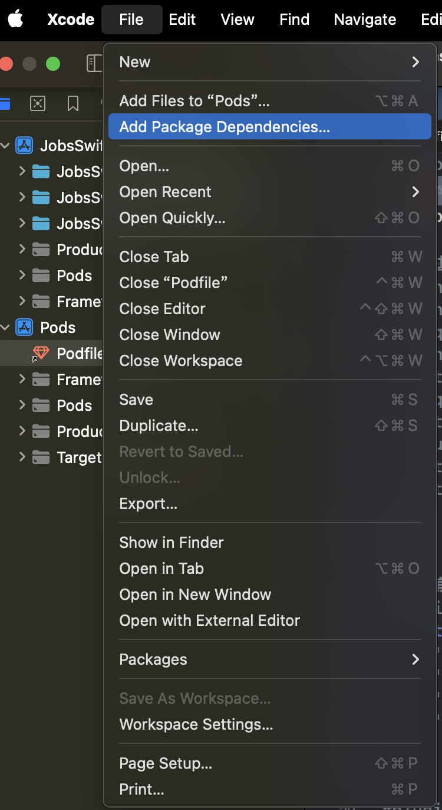
    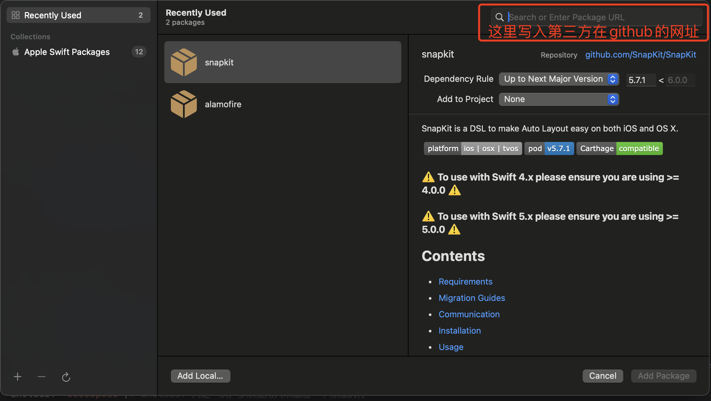
  </div>

### 4、一些适用于[Swift](https://developer.apple.com/swift/)的第三方框架（持续更新...）<a href="#前言" style="font-size:17px; color:green;"><b>🔼</b></a> <a href="#🔚" style="font-size:17px; color:green;"><b>🔽</b></a>

#### 4.1、[**DeviceKit**](https://github.com/devicekit/DeviceKit) <a href="#前言" style="font-size:17px; color:green;"><b>🔼</b></a> <a href="#🔚" style="font-size:17px; color:green;"><b>🔽</b></a>

#### 4.2、[**HandyJSON**](https://github.com/alibaba/HandyJSON) <a href="#前言" style="font-size:17px; color:green;"><b>🔼</b></a> <a href="#🔚" style="font-size:17px; color:green;"><b>🔽</b></a>

> 1、阿里巴巴开发
>
> 2、 **[Swift](https://developer.apple.com/swift/) 的 JSON 与模型映射库**
>
> 3、**简化 [Swift](https://developer.apple.com/swift/)  与 JSON 数据之间的序列化 / 反序列化过程**，避免传统方式下大量手写 `Codable`、`init(from:)` 或者 `Mappable` 的模板化代码
>
> 4、[**Swift**](https://developer.apple.com/swift/).[**Codable**](https://developer.apple.com/documentation/swift/codable) 🆚 [**HandyJSON**](https://github.com/alibaba/HandyJSON)
>
> ​	4.1、**Codable** 是苹果官方的，类型安全，但需要写 `CodingKeys`，代码量较大。适合 **严格的数据结构、编译期安全** 的项目。
>
> ​	4.2、**HandyJSON** 偏动态映射，更“自动化”，开发效率高，但类型安全性稍差（运行期做解析）。适合 **快速开发 / 需求变动大的场景**。
* 基本用法

  *  **JSON** ↔️ 模型

    定义模型

    ```swift
    import HandyJSON
    
    struct User: HandyJSON {
        var id: Int?
        var name: String?
        var age: Int?
    }
    ```

    JSON → 模型

    ```swift
    let json = "{\"id\":123, \"name\":\"Jobs\", \"age\":18}"
    if let user = User.deserialize(from: json) {
        print(user.name ?? "")  // 输出 "Jobs"
    }
    ```

    模型 → JSON

    ```swift
    let user = User(id: 123, name: "Jobs", age: 18)
    let jsonString = user.toJSONString()
    print(jsonString ?? "")
    ```
    
  * 枚举 + `HandyJSONEnum`： [**HandyJSON**](https://github.com/alibaba/HandyJSON) 对 **枚举序列化 / 反序列化** 的支持

    ```swift
    /**
     让枚举（必须是 原始值枚举，比如 Int 或 String）可以直接和 JSON 中的原始值互转。
     例如 JSON 返回 "status": 2，可以直接映射到 JXLoginStatus.normal_login。
     反过来，枚举转 JSON 时会自动输出原始值。
     */
    enum JXLoginStatus: Int, HandyJSONEnum {
        case didnot_login = 1
        case normal_login = 2
    }
    ```

#### 4.3、[**SnapKit**](https://github.com/SnapKit/SnapKit) <a href="#前言" style="font-size:17px; color:green;"><b>🔼</b></a> <a href="#🔚" style="font-size:17px; color:green;"><b>🔽</b></a>

  * 安装
  
    * [**Cocoapods**](https://cocoapods.org/)
    
      > 在 `Podfile` 中添加：
    
      ```ruby
      pod 'SnapKit'
      ```
    
    * [<font color=red>**S**</font>wift <font color=red>**P**</font>ackage <font color=red>**M**</font>anager](#SPM)
    
      > Xcode → File → Add Packages Dependency → 输入：
    
      ```url
      https://github.com/SnapKit/SnapKit
      ```
    
  * 导入
  
    ```swift
    import SnapKit
    ```
  
  * 调用
    
    * 创建视图并添加约束
    
      > 先加后用
      >
      > ```swift
      > let box = UIView()
      > box.backgroundColor = .red
      > view.addSubview(box)
      > 
      > box.snp.makeConstraints { make in
      >     make.center.equalToSuperview()    // 居中
      >     make.width.height.equalTo(100)    // 宽高 = 100
      > }
      > ```
    
    * 常用约束写法
    
      * 相对父视图
    
        ```swift
        make.top.equalToSuperview().offset(20)      // 距离父视图顶部 20
        make.left.equalToSuperview().offset(15)     // 左边距 15
        make.right.equalToSuperview().inset(15)     // 右边距 15（inset = -offset）
        make.bottom.equalToSuperview().offset(-20)  // 底边距 20
        ```
    
      * 相对其它视图
    
        ```swift
        make.top.equalTo(titleLabel.snp.bottom).offset(10)  // 距离 titleLabel 底部 10
        make.left.equalTo(icon.snp.right).offset(8)         // 距离 icon 右边 8
        ```
    
      * 固定大小
    
        ```swift
        make.width.equalTo(120)
        make.height.equalTo(50)
        ```
    
      * 宽高比
    
        ```swift
        make.width.equalTo(view.snp.height).multipliedBy(0.5) // 宽 = 高 * 0.5
        ```
    
      * 居中
    
        ```swift
        make.center.equalToSuperview()     // 完全居中
        make.centerX.equalToSuperview()    // 横向居中
        make.centerY.equalToSuperview()    // 纵向居中
        ```
    
      * 更新约束（`updateConstraints`）

        > 适合要修改部分约束的情况

        ```swift
        box.snp.updateConstraints { make in
            make.width.equalTo(200)   // 原来100 → 更新为200
        }
        ```

      * 重新设置约束（`remakeConstraints`）

        > 会先移除旧约束，再重新添加

        ```swift
        box.snp.remakeConstraints { make in
            make.center.equalToSuperview()
            make.size.equalTo(CGSize(width: 50, height: 50))
        }
        ```
      
      * 高级用法@优先级

        ```swift
        make.width.lessThanOrEqualTo(300).priority(.high)
        ```

      * 高级用法@SafeArea

        ```swift
        make.top.equalTo(view.safeAreaLayoutGuide.snp.top).offset(10)
        ```

      * 高级用法@链式多条件

        ```swift
        make.edges.equalToSuperview().inset(UIEdgeInsets(top: 10, left: 15, bottom: 20, right: 15))
        ```

#### 4.4、[**Alamofire**](https://github.com/Alamofire/Alamofire) <a href="#前言" style="font-size:17px; color:green;"><b>🔼</b></a> <a href="#🔚" style="font-size:17px; color:green;"><b>🔽</b></a>

> **Alamofire** 是 Swift 社区最流行的 **网络请求库**，基于 **URLSession** 封装，简化了 HTTP 请求、响应处理、JSON 解析、文件上传下载等操作。
>  它的特点是：
>
> - 语法简洁，链式调用
> - 内置 JSON/Plist 参数编码与解析
> - 支持上传/下载（含进度回调）
> - 支持认证（Basic Auth、OAuth Bearer Token 等）
> - 集成了网络请求队列、响应序列化、错误处理等常见功能
>
> 在 iOS 开发中，它相当于 Objective-C 时代的 **AFNetworking** 的 Swift 替代。

* 安装
  
    * [**Cocoapods**](https://cocoapods.org/)
    
      > 在 `Podfile` 中添加：
    
      ```ruby
      pod 'Alamofire'
      ```
    
    * [<font color=red>**S**</font>wift <font color=red>**P**</font>ackage <font color=red>**M**</font>anager](#SPM)
    
      > Xcode → File → Add Packages Dependency → 输入：
    
      ```url
      https://github.com/Alamofire/Alamofire.git
      ```
    
* 导入
  
    ```swift
  import Alamofire
  ```
  
* 调用
  
    * GET 请求
    
      ```swift
      import Alamofire
      
      AF.request("https://api.example.com/users").response { response in
          debugPrint(response)
      }
      ```
    
    * GET + JSON 解析
    
      ```swift
      AF.request("https://api.example.com/users")
          .responseJSON { response in
              switch response.result {
              case .success(let value):
                  print("返回 JSON: \(value)")
              case .failure(let error):
                  print("请求失败: \(error)")
              }
          }
      ```
    
    * POST 请求（带参数）
    
      ```swift
      let params: [String: Any] = [
          "username": "jobs",
          "password": "123456"
      ]
      
      AF.request("https://api.example.com/login",
                 method: .post,
                 parameters: params,
                 encoding: JSONEncoding.default)
          .responseJSON { response in
              print(response)
          }
      ```
    
    * 文件上传
    
      ```swift
      AF.upload(multipartFormData: { formData in
          formData.append(Data("jobs".utf8), withName: "username")
          formData.append(URL(fileURLWithPath: "/path/to/file.png"), withName: "file")
      }, to: "https://api.example.com/upload")
      .responseJSON { response in
          print(response)
      }
      ```
    
    * 文件下载
    
      ```swift
      let destination: DownloadRequest.Destination = { _, _ in
          let documentsURL = FileManager.default.urls(for: .documentDirectory, in: .userDomainMask)[0]
          let fileURL = documentsURL.appendingPathComponent("file.zip")
      
          return (fileURL, [.removePreviousFile, .createIntermediateDirectories])
      }
      
      AF.download("https://example.com/file.zip", to: destination)
          .downloadProgress { progress in
              print("下载进度: \(progress.fractionCompleted)")
          }
          .response { response in
              print("下载完成: \(response.fileURL)")
          }
      
      ```
    
    * 全局配置（比如统一 Header、超时设置）
    
      ```swift
      let configuration = URLSessionConfiguration.default
      configuration.timeoutIntervalForRequest = 30
      
      let session = Session(configuration: configuration)
      
      session.request("https://api.example.com/data").responseJSON { response in
          print(response)
      }
      ```
    
    * 链式调用
    
      ```swift
      AF.request("https://api.example.com/user")
          .validate(statusCode: 200..<300)
          .responseDecodable(of: User.self) { response in
              switch response.result {
              case .success(let user):
                  print("用户数据: \(user)")
              case .failure(let error):
                  print("错误: \(error)")
              }
          }

#### 4.5、[**Moya**](https://github.com/Moya/Moya) <a href="#前言" style="font-size:17px; color:green;"><b>🔼</b></a> <a href="#🔚" style="font-size:17px; color:green;"><b>🔽</b></a>

> - **定位**：[**Moya**](https://github.com/Moya/Moya) 是一个 **网络抽象层**（Networking Abstraction Layer）。
> - **底层**：它基于 [**Alamofire**](https://github.com/Alamofire/Alamofire) 实现请求发送，但对业务开发者屏蔽了繁琐的配置。
> - **核心思想**：用 **枚举（enum）+ 协议（TargetType）** 来定义接口。
>
> 这样做的好处：
>
> 1. **接口集中管理**：所有 API 路径、参数、请求方式写在一个地方，清晰可维护。
> 2. **避免魔法字符串**：不需要在代码里到处拼接 URL、HTTP 方法。
> 3. **更适合多人协作**：规范化 API 层，降低出错率。

* 安装
  
    * [**Cocoapods**](https://cocoapods.org/)
    
      > 在 `Podfile` 中添加：
    
      ```ruby
      pod 'Moya'
      ```
    
    * [<font color=red>**S**</font>wift <font color=red>**P**</font>ackage <font color=red>**M**</font>anager](#SPM)
    
      > Xcode → File → Add Packages Dependency → 输入：
    
      ```url
      https://github.com/Moya/Moya.git
      ```
    
* 导入
  
    ```swift
  import Moya
  ```

* 调用

  * 定义 API 枚举

    ```swift
    enum MyService {
        case getUser(id: Int)
        case createUser(name: String, age: Int)
    }
    
    // 遵循 TargetType 协议
    extension MyService: TargetType {
        var baseURL: URL { URL(string: "https://api.example.com")! }
    
        var path: String {
            switch self {
            case .getUser(let id):
                return "/user/\(id)"
            case .createUser:
                return "/user"
            }
        }
    
        var method: Moya.Method {
            switch self {
            case .getUser:
                return .get
            case .createUser:
                return .post
            }
        }
    
        var task: Task {
            switch self {
            case .getUser:
                return .requestPlain
            case .createUser(let name, let age):
                return .requestParameters(parameters: ["name": name, "age": age],
                                          encoding: JSONEncoding.default)
            }
        }
    
        var headers: [String: String]? {
            ["Content-Type": "application/json"]
        }
    }
    ```

  * 创建 Provider

    ```swift
    let provider = MoyaProvider<MyService>()
    ```

  * 发送请求

    ```swift
    // GET
    provider.request(.getUser(id: 1)) { result in
        switch result {
        case .success(let response):
            print("返回: \(response.data)")
        case .failure(let error):
            print("错误: \(error)")
        }
    }
    
    // POST
    provider.request(.createUser(name: "Jobs", age: 18)) { result in
        switch result {
        case .success(let response):
            print("创建成功: \(response.data)")
        case .failure(let error):
            print("失败: \(error)")
        }
    }
    ```

  * 插件机制（可以拦截请求/响应，例如统一打印日志、添加 token）

    ```swift
    final class NetworkLogger: PluginType {
        func willSend(_ request: RequestType, target: TargetType) {
            print("➡️ 请求: \(request.request?.url?.absoluteString ?? "")")
        }
    
        func didReceive(_ result: Result<Response, MoyaError>, target: TargetType) {
            print("⬅️ 响应: \(result)")
        }
    }
    
    let provider = MoyaProvider<MyService>(plugins: [NetworkLogger()])
    ```

  * 响应模型解析

    ```swift
    provider.request(.getUser(id: 1)) { result in
        switch result {
        case .success(let response):
            do {
                let user = try JSONDecoder().decode(User.self, from: response.data)
                print("用户: \(user)")
            } catch {
                print("解析失败: \(error)")
            }
        case .failure(let error):
            print("请求错误: \(error)")
        }
    }
    ```

  * **Stub（模拟数据）**：适合写单元测试或本地开发

    ```swift
    let stubProvider = MoyaProvider<MyService>(stubClosure: MoyaProvider.immediatelyStub)
    stubProvider.request(.getUser(id: 1)) { result in
        print(result)
    }
    ```

#### 4.6、[**ESPullToRefresh**](https://github.com/eggswift/pull-to-refresh?tab=readme-ov-file) <a href="#前言" style="font-size:17px; color:green;"><b>🔼</b></a> <a href="#🔚" style="font-size:17px; color:green;"><b>🔽</b></a>

> 比 [**MJRefresh**](https://github.com/CoderMJLee/MJRefresh) 更现代的 [**Swift**](https://developer.apple.com/swift/) 写法，支持自定义动画。

```swift
import ESPullToRefresh

tableView.es.addPullToRefresh {
    print("下拉刷新")
    DispatchQueue.main.asyncAfter(deadline: .now() + 1) {
        self.tableView.es.stopPullToRefresh()
    }
}

tableView.es.addInfiniteScrolling {
    print("上拉加载")
    DispatchQueue.main.asyncAfter(deadline: .now() + 1) {
        self.tableView.es.stopLoadingMore()
    }
}
```

#### 4.7、[**RxSwift**](https://github.com/ReactiveX/RxSwift) <a href="#前言" style="font-size:17px; color:green;"><b>🔼</b></a> <a href="#🔚" style="font-size:17px; color:green;"><b>🔽</b></a>

> **最小依赖**：只用 `RxSwift`。
>
> **MVVM 开发**：通常 `RxSwift + RxCocoa + RxRelay` 一起用。
>
> ✅ **优点**
>
> - 统一事件流（UI、网络、通知、定时器等）
> - 代码声明式，可读性好
> - 天然适合 MVVM 架构
>
> ⚠️ **缺点**
>
> - 学习曲线陡峭（操作符多）
> - 调试不直观（需要习惯事件流思维）
> - 不注意释放可能导致 **内存泄漏**

* 安装
  
    * [**Cocoapods**](https://cocoapods.org/)
    
      > 在 `Podfile` 中添加：
    
      ```ruby
      # 核心库
      pod 'RxSwift'                  # 核心
      pod 'RxCocoa'                  # UI 绑定：UIKit、AppKit 的扩展
      pod 'RxRelay'                  # 安全替代 Variable，常用于 ViewModel
      ```
    
    * [<font color=red>**S**</font>wift <font color=red>**P**</font>ackage <font color=red>**M**</font>anager](#SPM)
    
      > Xcode → File → Add Packages Dependency → 输入：
    
      ```url
      https://github.com/ReactiveX/RxSwift.git
      ```
    
* 导入
  
    ```swift
  import RxSwift    // 核心 Observable / Observer / Disposable
  import RxCocoa    // UI 控件绑定（如 textField.rx.text、button.rx.tap）
  import RxRelay    // BehaviorRelay / PublishRelay
  ```
  
* 调用
  
    > **按钮**：`tap.throttle + withLatestFrom(最新输入)`
  >
  > **输入**：`debounce + distinctUntilChanged + filter`
  >
  > **UI 绑定**：尽量用 `Driver/Signal`（主线程、无 error、共享）
  >
  > **监听**：`NotificationCenter.default.rx.notification(name[, object])`
  >
  > **解析**：`compactMap` 安全取 `userInfo`
  >
  > **性能**：`debounce/throttle/distinctUntilChanged/share(replay:)`
  >
  > **释放**：`disposed(by: bag)` 即可，无需 `removeObserver`
  
  * 按钮防连点（节流）
  
    ```swift
    loginBtn.rx.tap
        .throttle(.milliseconds(500), scheduler: MainScheduler.instance) // 500ms 内只认第一次
        .withLatestFrom(Observable.combineLatest(vm.username, vm.password)) // 点一下带最新输入
        .subscribe(onNext: { (u, p) in
            // do login(u, p)
        })
        .disposed(by: bag)
    ```
  
  * 输入框实时校验（长度/邮箱等）
  
    ```swift
    let usernameValid = usernameTF.rx.text.orEmpty
        .map { $0.count >= 3 }
        .distinctUntilChanged()
        .share(replay: 1)
    
    let passwordValid = passwordTF.rx.text.orEmpty
        .map { $0.count >= 6 }
        .distinctUntilChanged()
        .share(replay: 1)
    
    // 邮箱示例（可选）
    let emailValid = usernameTF.rx.text.orEmpty
        .map { text in
            let pattern = #"^[A-Z0-9._%+-]+@[A-Z0-9.-]+\.[A-Z]{2,}$"#
            return text.range(of: pattern, options: [.regularExpression, .caseInsensitive]) != nil
        }
        .share(replay: 1)
    ```
  
  * 启用按钮 + 视觉态
  
    ```swift
    Observable.combineLatest(usernameValid, passwordValid) { $0 && $1 }
        .bind(to: loginBtn.rx.isEnabled)
        .disposed(by: bag)
    
    Observable.combineLatest(usernameValid, passwordValid) { $0 && $1 }
        .map { $0 ? 1.0 : 0.5 }
        .bind(to: loginBtn.rx.alpha)
        .disposed(by: bag)
    ```
  
  * 搜索输入：去抖 + 去重 + 非空
  
    ```swift
    let searchText = searchTF.rx.text.orEmpty
        .debounce(.milliseconds(300), scheduler: MainScheduler.instance) // 停止输入300ms再发
        .distinctUntilChanged()
        .filter { !$0.isEmpty } // 过滤空串
        .share(replay: 1)
    
    searchText
        .subscribe(onNext: { query in
            // fire search(query)
        })
        .disposed(by: bag)
    ```
  
  * 限制最大长度（回写 UI）
  
    ```swift
    let limitedPwd = passwordTF.rx.text.orEmpty
        .map { String($0.prefix(20)) } // 最多 20 位
        .share(replay: 1)
    
    limitedPwd
        .bind(to: passwordTF.rx.text)
        .disposed(by: bag)
    ```
  
  * Return 键行为（下一步 / 提交）
  
    ```swift
    // 用户名回车 -> 焦点移到密码
    usernameTF.rx.controlEvent(.editingDidEndOnExit)
        .subscribe(onNext: { [weak self] in self?.passwordTF.becomeFirstResponder() })
        .disposed(by: bag)
    
    // 密码回车 -> 触发登录（带最新输入）
    passwordTF.rx.controlEvent(.editingDidEndOnExit)
        .withLatestFrom(Observable.combineLatest(vm.username, vm.password))
        .subscribe(onNext: { (u, p) in
            // do login(u, p)
        })
        .disposed(by: bag)
    ```
  
  * 用 Driver 做 UI 绑定（推荐）
  
    ```swift
    let canLogin = Observable.combineLatest(usernameValid, passwordValid) { $0 && $1 }
        .asDriver(onErrorJustReturn: false)
    
    canLogin
        .drive(loginBtn.rx.isEnabled)
        .disposed(by: bag)
    
    canLogin
        .map { $0 ? 1.0 : 0.5 }
        .drive(loginBtn.rx.alpha)
        .disposed(by: bag)
    ```
  
  * 实战最小组合（按钮点击 + 最新值 + 节流）
  
    ```swift
    let creds = Observable.combineLatest(usernameTF.rx.text.orEmpty,
                                         passwordTF.rx.text.orEmpty) { ($0, $1) }
        .share(replay: 1)
    
    loginBtn.rx.tap
        .throttle(.milliseconds(500), scheduler: MainScheduler.instance)
        .withLatestFrom(creds)
        .subscribe(onNext: { (u, p) in
            // do login(u, p)
        })
        .disposed(by: bag)
    ```
  
  * 监听系统通知（NotificationCenter → Rx）
  
    ```swift
    import RxSwift
    import RxCocoa
    
    let bag = DisposeBag()
    
    NotificationCenter.default.rx.notification(UIApplication.didBecomeActiveNotification)
        .subscribe(onNext: { _ in
            print("app 回到前台")
        })
        .disposed(by: bag)
    ```
  
  * 监听 + 取 `userInfo`（安全解包）
  
    ```swift
    extension Notification.Name {
        static let loginStateChanged = Notification.Name("loginStateChanged")
    }
    
    // 监听
    NotificationCenter.default.rx.notification(.loginStateChanged)
        .compactMap { $0.userInfo?["isLogin"] as? Bool }
        .distinctUntilChanged()
        .subscribe(onNext: { isLogin in
            print("登录态：\(isLogin)")
        })
        .disposed(by: bag)
    
    // 发送
    NotificationCenter.default.post(name: .loginStateChanged, object: nil, userInfo: ["isLogin": true])
    ```
  
  * 键盘通知：拿高度 & 动画时长（实战常用）
  
    ```swift
    let willChange = NotificationCenter.default.rx.notification(UIResponder.keyboardWillChangeFrameNotification)
    
    let keyboardInfo = willChange
        .compactMap { note -> (height: CGFloat, duration: TimeInterval) in
            let endFrame = (note.userInfo?[UIResponder.keyboardFrameEndUserInfoKey] as? NSValue)?.cgRectValue ?? .zero
            let duration = (note.userInfo?[UIResponder.keyboardAnimationDurationUserInfoKey] as? NSNumber)?.doubleValue ?? 0.25
            return (height: endFrame.height, duration: duration)
        }
        .share(replay: 1)
    
    keyboardInfo
        .subscribe(onNext: { info in
            // 调整底部约束 / contentInset
            // self.bottomConstraint.constant = info.height
            // UIView.animate(withDuration: info.duration) { self.view.layoutIfNeeded() }
        })
        .disposed(by: bag)
    ```
  
  * 搭配 `Driver`（主线程、无 error，用于驱动 UI）
  
    ```swift
    let becameActiveDriver: Driver<Void> =
        NotificationCenter.default.rx.notification(UIApplication.didBecomeActiveNotification)
            .map { _ in () }
            .asDriver(onErrorDriveWith: .empty())
    
    becameActiveDriver
        .drive(onNext: { print("刷新 UI") })
        .disposed(by: bag)
    ```
  
  * 过滤指定对象的通知（`object:`）
  
    ```swift
    let object = someObject
    
    NotificationCenter.default.rx.notification(.someName, object: object)
        .subscribe(onNext: { _ in print("只响应这个 object 的通知") })
        .disposed(by: bag)
    ```
  
  * throttle / debounce（通知风暴去抖）
  
    ```swift
    NotificationCenter.default.rx.notification(.NSManagedObjectContextDidSave)
        .debounce(.milliseconds(300), scheduler: MainScheduler.instance)
        .subscribe(onNext: { _ in
            // 合并短时间内的多次变更
        })
        .disposed(by: bag)
    ```
  
  * 生命周期通知（常用清单）
  
    ```swift
    NotificationCenter.default.rx.notification(UIApplication.willEnterForegroundNotification)
    NotificationCenter.default.rx.notification(UIApplication.didEnterBackgroundNotification)
    NotificationCenter.default.rx.notification(UIApplication.didReceiveMemoryWarningNotification)
    ```
  
  * 通知更适合**跨模块/系统级广播**；模块内通信优先 `Relay/Subject`。
  
    > **同模块/同层内**传播事件：用 `PublishRelay` / `BehaviorRelay` 比通知更类型安全、可测试。
  
    ```swift
    let evt = PublishRelay<Void>()
    evt.accept(())          // 发送
    evt.asSignal()          // 给 UI 绑定
    ```
  

#### 4.8、注入调试 <a href="#前言" style="font-size:17px; color:green;"><b>🔼</b></a> <a href="#🔚" style="font-size:17px; color:green;"><b>🔽</b></a>

* 同时支持 [**Swift**](https://developer.apple.com/swift/), **Objc**& **C++ **的代码热重载工具！
  * [**InjectionIII**](https://github.com/johnno1962/InjectionIII)
  * [**InjectionNext**](https://github.com/johnno1962/InjectionNext)
* [**UI界面调试工具**](#UI界面调试工具)

### 5、💥<font id=Info.plist>火力全开配置`Info.plist`</font> <a href="#前言" style="font-size:17px; color:green;"><b>🔼</b></a> <a href="#🔚" style="font-size:17px; color:green;"><b>🔽</b></a>

```xml
<?xml version="1.0" encoding="UTF-8"?>
<!DOCTYPE plist PUBLIC "-//Apple//DTD PLIST 1.0//EN" "http://www.apple.com/DTDs/PropertyList-1.0.dtd">
<plist version="1.0">
<dict>

    <key>UIApplicationSceneManifest</key>
    <dict>
        <key>UIApplicationSupportsMultipleScenes</key>
        <false/>
        <key>UISceneConfigurations</key>
        <dict>
            <key>UIWindowSceneSessionRoleApplication</key>
            <array>
                <dict>
                    <key>UISceneConfigurationName</key>
                    <string>Default Configuration</string>
                    <key>UISceneDelegateClassName</key>
                    <string>$(PRODUCT_MODULE_NAME).SceneDelegate</string>
                    <key>UISceneStoryboardFile</key>
                    <string>Main</string>
                </dict>
            </array>
        </dict>
    </dict>

    <key>NSAppTransportSecurity</key>
    <dict>
      <!-- ATS 配置：仅放开 WebView 内容的任意加载，其他网络请求仍受 ATS 约束 -->
      <key>NSAllowsArbitraryLoadsInWebContent</key>
      <true/>
    </dict>

    <!-- 适配 iOS 16+ 的 UI 兼容开关，不是隐私权限 -->
    <key>UIDesignRequiresCompatibility</key>
    <true/>

    <!-- ====== 相机 / 麦克风 / 相册 ====== -->

    <!-- 相机权限：用于拍照、扫码、视频录制等需要调用摄像头的场景 -->
    <key>NSCameraUsageDescription</key>
    <string>NSCameraUsageDescription</string>

    <!-- 麦克风权限：用于录音、视频通话、语音消息等需要采集声音的场景 -->
    <key>NSMicrophoneUsageDescription</key>
    <string>NSMicrophoneUsageDescription</string>

    <!-- 相册读取权限：从系统相册中选择、读取照片或视频 -->
    <key>NSPhotoLibraryUsageDescription</key>
    <string>NSPhotoLibraryUsageDescription</string>

    <!-- 相册写入权限：将拍摄或编辑后的图片/视频保存到系统相册 -->
    <key>NSPhotoLibraryAddUsageDescription</key>
    <string>NSPhotoLibraryAddUsageDescription</string>

    <!-- ====== 定位（使用期间 / 始终 / 临时精确） ====== -->

    <!-- 仅“使用期间”定位：App 在前台使用时访问位置信息（常见导航、附近服务） -->
    <key>NSLocationWhenInUseUsageDescription</key>
    <string>NSLocationWhenInUseUsageDescription</string>

    <!-- 始终 + 使用期间定位：前台 + 后台都可访问位置信息（持续导航、地理围栏） -->
    <key>NSLocationAlwaysAndWhenInUseUsageDescription</key>
    <string>NSLocationAlwaysAndWhenInUseUsageDescription</string>

    <!-- 旧系统兼容的“始终定位”描述，和上面的键配合使用 -->
    <key>NSLocationAlwaysUsageDescription</key>
    <string>NSLocationAlwaysUsageDescription</string>

    <!-- iOS 14+ 临时“精确定位”用途声明，需要详细说明每个用途场景 -->

    <!-- 精确导航：比如驾车/步行导航时需要高精度定位 -->
    <key>NSLocationTemporaryUsageDescriptionDictionary</key>
    <dict>
        <key>NavigationPrecise</key>
        <string>NavigationPrecise</string>

        <!-- 附近搜索：查找周边服务、设备、门店等 -->
        <key>NearbySearch</key>
        <string>NearbySearch</string>

        <!-- AR 锚点：在增强现实场景中进行精确定位和放置锚点 -->
        <key>ARAnchors</key>
        <string>ARAnchors</string>
    </dict>

    <!-- ====== 蓝牙（旧/新） ====== -->

    <!-- 始终蓝牙权限：App 在前台或后台都可与蓝牙设备交互 -->
    <key>NSBluetoothAlwaysUsageDescription</key>
    <string>NSBluetoothAlwaysUsageDescription</string>

    <!-- 旧键：蓝牙外设权限，用于发现/连接/通信附近的蓝牙设备 -->
    <key>NSBluetoothPeripheralUsageDescription</key>
    <string>NSBluetoothPeripheralUsageDescription</string>

    <!-- ====== 通讯录 / 日历 / 提醒事项 ====== -->

    <!-- 通讯录权限：读取联系人用于选择联系人、自动填充等 -->
    <key>NSContactsUsageDescription</key>
    <string>NSContactsUsageDescription</string>

    <!-- 日历基础权限：读取/写入日历事件（旧键，兼容性用途） -->
    <key>NSCalendarsUsageDescription</key>
    <string>NSCalendarsUsageDescription</string>

    <!-- iOS 17+ 日历“完全访问”：可读、可写、可修改所有日历事件 -->
    <key>NSCalendarsFullAccessUsageDescription</key>
    <string>NSCalendarsFullAccessUsageDescription</string>

    <!-- iOS 17+ 日历“仅写入”：只能往日历里添加事件，不能读取已有事件 -->
    <key>NSCalendarsWriteOnlyAccessUsageDescription</key>
    <string>NSCalendarsWriteOnlyAccessUsageDescription</string>

    <!-- 提醒事项基础权限：读取/创建提醒（旧键，兼容性用途） -->
    <key>NSRemindersUsageDescription</key>
    <string>NSRemindersUsageDescription</string>

    <!-- iOS 17+ 提醒事项“完全访问”：读、写、改所有待办/提醒 -->
    <key>NSRemindersFullAccessUsageDescription</key>
    <string>NSRemindersFullAccessUsageDescription</string>

    <!-- iOS 17+ 提醒事项“仅写入”：只能添加新的待办，不读取已有记录 -->
    <key>NSRemindersWriteOnlyAccessUsageDescription</key>
    <string>NSRemindersWriteOnlyAccessUsageDescription</string>

    <!-- ====== 健康 / 运动与健身（HealthKit） ====== -->

    <!-- 健康数据读取权限：从 HealthKit 读取健康/体征/运动数据 -->
    <key>NSHealthShareUsageDescription</key>
    <string>NSHealthShareUsageDescription</string>

    <!-- 健康数据写入权限：向 HealthKit 写入运动记录、健康指标等 -->
    <key>NSHealthUpdateUsageDescription</key>
    <string>NSHealthUpdateUsageDescription</string>

    <!-- 临床健康档案读取：访问医院/诊所等来源的临床健康记录 -->
    <key>NSHealthClinicalHealthRecordsShareUsageDescription</key>
    <string>NSHealthClinicalHealthRecordsShareUsageDescription</string>

    <!-- 运动与健身权限：访问加速度计、步数等运动数据 -->
    <key>NSMotionUsageDescription</key>
    <string>NSMotionUsageDescription</string>

    <!-- ====== 语音 / Siri / Face ID ====== -->

    <!-- 语音识别权限：将语音实时转成文字（非录音本身） -->
    <key>NSSpeechRecognitionUsageDescription</key>
    <string>NSSpeechRecognitionUsageDescription</string>

    <!-- Siri 权限：使用 Siri 执行语音指令、快捷指令 -->
    <key>NSSiriUsageDescription</key>
    <string>NSSiriUsageDescription</string>

    <!-- Face ID 权限：用面容识别进行登录、支付或敏感操作验证 -->
    <key>NSFaceIDUsageDescription</key>
    <string>NSFaceIDUsageDescription</string>

    <!-- ====== 家庭(HomeKit) / 本地网络 / Bonjour ====== -->

    <!-- HomeKit 权限：控制和管理智能家居设备（灯、门锁等） -->
    <key>NSHomeKitUsageDescription</key>
    <string>NSHomeKitUsageDescription</string>

    <!-- 本地网络权限：在局域网中发现并连接其它设备或服务 -->
    <key>NSLocalNetworkUsageDescription</key>
    <string>NSLocalNetworkUsageDescription</string>

    <!-- Bonjour 服务列表：声明需要发现的局域网服务类型 -->
    <key>NSBonjourServices</key>
    <array>
        <!-- 按需添加你真实使用的服务类型；下面是示例 -->
        <string>_http._tcp.</string>
        <string>_airplay._tcp.</string>
        <string>_yourservice._tcp.</string>
    </array>

    <!-- ====== NFC ====== -->

    <!-- NFC 权限：读取 NFC 标签或与支持 NFC 的设备交互 -->
    <key>NFCReaderUsageDescription</key>
    <string>NFCReaderUsageDescription</string>

    <!-- ====== Apple Music / 媒体库 ====== -->

    <!-- 媒体库权限：访问系统音乐库，读取/播放音乐 -->
    <key>NSAppleMusicUsageDescription</key>
    <string>NSAppleMusicUsageDescription</string>

    <!-- ====== 广告跟踪（ATT） ====== -->

    <!-- App Tracking 权限：用于跨 App / 网站的广告归因与个性化推荐 -->
    <key>NSUserTrackingUsageDescription</key>
    <string>NSUserTrackingUsageDescription</string>

    <!-- ====== Nearby Interaction（U1/超宽带） ====== -->

    <!-- 近距离交互权限：利用 UWB/超宽带进行超近距离定位与设备协同 -->
    <key>NSNearbyInteractionUsageDescription</key>
    <string>NSNearbyInteractionUsageDescription</string>

    <!-- ====== TV Provider（视频订阅账户） ====== -->

    <!-- 电视供应商账户权限：验证用户订阅，用于播放付费频道/视频 -->
    <key>NSVideoSubscriberAccountUsageDescription</key>
    <string>NSVideoSubscriberAccountUsageDescription</string>

    <!-- ====== 关键提醒（Critical Alerts，需要特权能力） ====== -->

    <!-- 关键提醒权限：在静音/勿扰模式下仍可发出高优先级通知 -->
    <key>NSCriticalAlertsUsageDescription</key>
    <string>NSCriticalAlertsUsageDescription</string>

    <!-- ====== 专注状态共享（Focus Status） ====== -->

    <!-- 读取专注状态：根据当前专注模式调整通知/消息的发送时机 -->
    <key>NSFocusStatusUsageDescription</key>
    <string>NSFocusStatusUsageDescription</string>

    <!-- ====== 暴露通知（Exposure Notification，需要特权能力） ====== -->

    <!-- 暴露通知权限：用于疫情等场景下的接触风险提醒（需官方授权） -->
    <key>NSExposureNotificationUsageDescription</key>
    <string>NSExposureNotificationUsageDescription</string>

</dict>
</plist>
```

```swift
/* 
  InfoPlist.strings (English)
  JobsSwiftBaseConfigDemo

  Created by Jobs on 11/17/25.
  
*/

/* ====== Camera / Microphone / Photo Library ====== */
"NSCameraUsageDescription" = "This app requires access to the camera to take photos and record videos.";
"NSMicrophoneUsageDescription" = "This app requires access to the microphone to record audio and videos.";
"NSPhotoLibraryUsageDescription" = "This app requires access to your photo library to select and read your photos and videos.";
"NSPhotoLibraryAddUsageDescription" = "This app requires permission to save photos and videos to your photo library.";

/* ====== Location (When In Use / Always / Temporary Precise) ====== */
"NSLocationWhenInUseUsageDescription" = "To provide location-based services, this app needs access to your location while you are using it.";
"NSLocationAlwaysAndWhenInUseUsageDescription" = "To support continuous location features (navigation, geofencing, etc.), this app needs access to your location in the foreground and background.";
"NSLocationAlwaysUsageDescription" = "This app needs access to your location in the foreground and background to provide full location services.";

/* iOS 14+ temporary precise location reasons */
"NavigationPrecise" = "Used for precise navigation and route planning.";
"NearbySearch" = "Used to find nearby services and devices.";
"ARAnchors" = "Used for precise positioning and anchors in augmented reality experiences.";

/* ====== Bluetooth ====== */
"NSBluetoothAlwaysUsageDescription" = "This app needs Bluetooth access to connect to and manage nearby devices.";
"NSBluetoothPeripheralUsageDescription" = "This app needs Bluetooth access to discover, connect to, and communicate with nearby devices.";

/* ====== Contacts / Calendars / Reminders ====== */
"NSContactsUsageDescription" = "This app needs access to your contacts to select people or autofill their information.";

"NSCalendarsUsageDescription" = "This app needs access to your calendars to read and write your events.";
"NSCalendarsFullAccessUsageDescription" = "This app needs full access to your calendars to read, create, and edit your events.";
"NSCalendarsWriteOnlyAccessUsageDescription" = "This app needs permission to add events to your calendars (write-only, without reading existing events).";

"NSRemindersUsageDescription" = "This app needs access to your reminders to read and create tasks.";
"NSRemindersFullAccessUsageDescription" = "This app needs full access to your reminders to read, create, and edit tasks.";
"NSRemindersWriteOnlyAccessUsageDescription" = "This app needs permission to add tasks to your reminders (write-only, without reading existing tasks).";

/* ====== Health / Motion & Fitness ====== */
"NSHealthShareUsageDescription" = "This app needs to read your health data to provide health-related features and analysis.";
"NSHealthUpdateUsageDescription" = "This app needs to write health data to log your activities and vital signs.";
"NSHealthClinicalHealthRecordsShareUsageDescription" = "This app needs to read your clinical health records to provide related services and suggestions.";
"NSMotionUsageDescription" = "This app needs access to motion and fitness data (accelerometer, step count, etc.) to track and analyze your activity.";

/* ====== Speech / Siri / Face ID ====== */
"NSSpeechRecognitionUsageDescription" = "This app needs speech recognition to convert your voice into text.";
"NSSiriUsageDescription" = "This app uses Siri to perform voice commands and shortcuts.";
"NSFaceIDUsageDescription" = "This app uses Face ID to quickly and securely verify your identity.";

/* ====== HomeKit / Local Network / Bonjour ====== */
"NSHomeKitUsageDescription" = "This app needs access to your home data to control and manage your HomeKit devices.";
"NSLocalNetworkUsageDescription" = "This app needs access to your local network to discover and connect to devices or services on your LAN.";

/* ====== NFC ====== */
"NFCReaderUsageDescription" = "This app needs to use NFC to read and interact with supported nearby tags and devices.";

/* ====== Apple Music / Media Library ====== */
"NSAppleMusicUsageDescription" = "This app needs access to your media library to read and play your music.";

/* ====== App Tracking Transparency (ATT) ====== */
"NSUserTrackingUsageDescription" = "To provide more personalized content and ads, this app requests permission to track your activity; your privacy will not be misused.";

/* ====== Nearby Interaction ====== */
"NSNearbyInteractionUsageDescription" = "This app needs Nearby Interaction to enable ultra-short-range positioning and device interactions.";

/* ====== TV Provider (Video Subscriber Account) ====== */
"NSVideoSubscriberAccountUsageDescription" = "This app needs access to your TV provider account to verify your subscription and play content.";

/* ====== Critical Alerts ====== */
"NSCriticalAlertsUsageDescription" = "This app needs to send critical alerts so important events can be notified even in Silent or Do Not Disturb mode.";

/* ====== Focus Status ====== */
"NSFocusStatusUsageDescription" = "This app needs to read your Focus status so it can send notifications and messages at appropriate times.";

/* ====== Exposure Notification ====== */
"NSExposureNotificationUsageDescription" = "This app needs Exposure Notifications to alert you to possible contact risks (enabled only where authorized).";
```

```swift
/* 
  InfoPlist.strings (Chinese, Simplified)
  JobsSwiftBaseConfigDemo

  Created by Jobs on 11/17/25.
  
*/

/* ====== 相机 / 麦克风 / 相册 ====== */
"NSCameraUsageDescription" = "需要访问相机用于拍摄照片或视频。";
"NSMicrophoneUsageDescription" = "需要访问麦克风用于录音或视频录制。";
"NSPhotoLibraryUsageDescription" = "需要访问相册以选择和读取您的照片与视频。";
"NSPhotoLibraryAddUsageDescription" = "需要写入相册以保存您拍摄或编辑的图片/视频。";

/* ====== 定位（使用期间 / 始终 / 临时精确） ====== */
"NSLocationWhenInUseUsageDescription" = "为提供与位置相关的服务，需要在您使用 App 期间访问位置信息。";
"NSLocationAlwaysAndWhenInUseUsageDescription" = "为实现持续定位（导航/地理围栏等），需要在前台与后台访问位置信息。";
"NSLocationAlwaysUsageDescription" = "需要在前台与后台访问位置信息以提供完整定位服务。";

/* iOS 14+ 临时“精确定位”用途声明 */
"NavigationPrecise" = "用于精确导航与路线规划。";
"NearbySearch" = "用于查找附近的服务与设备。";
"ARAnchors" = "用于增强现实场景的精确定位与锚点。";

/* ====== 蓝牙（旧/新） ====== */
"NSBluetoothAlwaysUsageDescription" = "需要使用蓝牙以连接或管理附近的设备。";
"NSBluetoothPeripheralUsageDescription" = "需要使用蓝牙以发现、连接或与周边设备通信。";

/* ====== 通讯录 / 日历 / 提醒事项 ====== */
"NSContactsUsageDescription" = "需要访问通讯录以选择联系人或自动填充信息。";

"NSCalendarsUsageDescription" = "需要访问日历以读取或写入您的日程。";
"NSCalendarsFullAccessUsageDescription" = "需要完整访问您的日历以读取、创建与修改日程。";
"NSCalendarsWriteOnlyAccessUsageDescription" = "需要向您的日历添加事件（仅写入，不读取已有事件）。";

"NSRemindersUsageDescription" = "需要访问提醒事项以读取或创建待办。";
"NSRemindersFullAccessUsageDescription" = "需要完整访问提醒事项以读取、创建与修改待办。";
"NSRemindersWriteOnlyAccessUsageDescription" = "需要向提醒事项添加待办（仅写入，不读取已有待办）。";

/* ====== 健康 / 运动与健身 ====== */
"NSHealthShareUsageDescription" = "需要读取健康数据以提供健康相关功能与分析。";
"NSHealthUpdateUsageDescription" = "需要写入健康数据以记录您的运动或体征。";
"NSHealthClinicalHealthRecordsShareUsageDescription" = "需要读取您的临床健康记录以提供相关服务与建议。";
"NSMotionUsageDescription" = "需要访问运动与健身数据（加速度计/步数）以统计与分析活动。";

/* ====== 语音 / Siri / Face ID ====== */
"NSSpeechRecognitionUsageDescription" = "需要进行语音识别以将您的语音转换为文本。";
"NSSiriUsageDescription" = "需要使用 Siri 以执行语音指令或快捷操作。";
"NSFaceIDUsageDescription" = "需要使用 Face ID 以快速完成安全验证。";

/* ====== 家庭(HomeKit) / 本地网络 / Bonjour ====== */
"NSHomeKitUsageDescription" = "需要访问家庭数据以控制或管理您的家庭设备。";
"NSLocalNetworkUsageDescription" = "需要访问本地网络以发现和连接局域网中的设备或服务。";

/* ====== NFC ====== */
"NFCReaderUsageDescription" = "需要使用 NFC 以读取或交互支持的近场标签/设备。";

/* ====== Apple Music / 媒体库 ====== */
"NSAppleMusicUsageDescription" = "需要访问您的媒体库以读取或播放音乐。";

/* ====== 广告跟踪（ATT） ====== */
"NSUserTrackingUsageDescription" = "为提供更个性化的内容与广告体验，需要请求跟踪权限；我们不会滥用您的隐私。";

/* ====== Nearby Interaction（U1/超宽带） ====== */
"NSNearbyInteractionUsageDescription" = "需要使用近距离交互以实现超近距定位与设备交互。";

/* ====== TV Provider（视频订阅账户） ====== */
"NSVideoSubscriberAccountUsageDescription" = "需要访问您的电视供应商账户以验证订阅并播放内容。";

/* ====== 关键提醒（Critical Alerts） ====== */
"NSCriticalAlertsUsageDescription" = "需要发送关键提醒以在静音或勿扰模式下也能通知重要事件。";

/* ====== 专注状态共享（Focus Status） ====== */
"NSFocusStatusUsageDescription" = "需要读取您的专注状态以在合适的时机发送通知或消息。";

/* ====== 暴露通知（Exposure Notification） ====== */
"NSExposureNotificationUsageDescription" = "需要使用暴露通知以提醒可能的接触风险（仅在获得授权的地区与用途下启用）。";
```

### 6、APP名 <a href="#前言" style="font-size:17px; color:green;"><b>🔼</b></a> <a href="#🔚" style="font-size:17px; color:green;"><b>🔽</b></a>

> 快速自检
>
> ```swift
> let displayName =
>     Bundle.main.object(forInfoDictionaryKey: "CFBundleDisplayName")
>     ?? Bundle.main.object(forInfoDictionaryKey: "CFBundleName")
> print("DisplayName =", displayName ?? "nil")
> ```

#### 6.1、**`CFBundleName`**  <a href="#前言" style="font-size:17px; color:green;"><b>🔼</b></a> <a href="#🔚" style="font-size:17px; color:green;"><b>🔽</b></a>

* 内部包名/工程产物名，用户通常看不到；缺省时可能被用来兜底显示。

```xml
<key>CFBundleName</key>
<string>$(PRODUCT_NAME)</string>
```

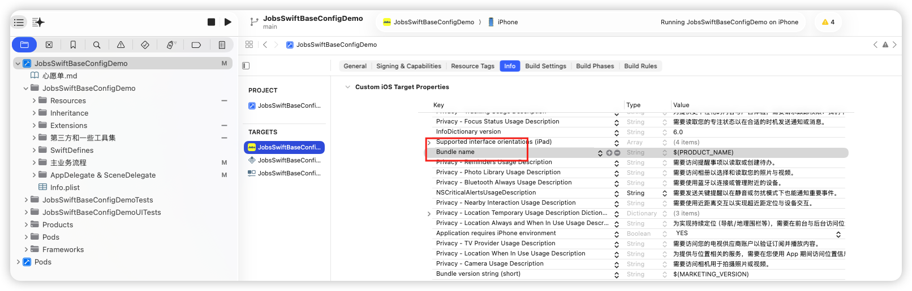

#### 6.2、桌面名  <a href="#前言" style="font-size:17px; color:green;"><b>🔼</b></a> <a href="#🔚" style="font-size:17px; color:green;"><b>🔽</b></a>

* 单语言显示名

  ```xml
  <!--Info.plist-->
  <key>CFBundleDisplayName</key>
  <string>你的名字</string>
  ```

* 多语言显示名：在各语言的 **`InfoPlist.strings`** 里写

  ```
  "CFBundleDisplayName" = "中文名或英文名";
  ```

### 7、利用`*.xcconfig`配置Xcode工程项目 <a href="#前言" style="font-size:17px; color:green;"><b>🔼</b></a> <a href="#🔚" style="font-size:17px; color:green;"><b>🔽</b></a>

#### 7.1、新建配置文件 <a href="#前言" style="font-size:17px; color:green;"><b>🔼</b></a> <a href="#🔚" style="font-size:17px; color:green;"><b>🔽</b></a>

<table style="width:100%; table-layout:fixed;">
  <tr>
    <td>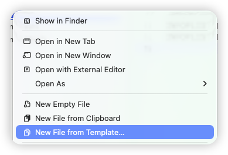</td>
    <td>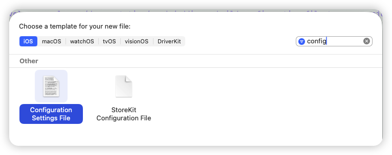</td>
  </tr>
</table>

#### 7.2、自动识别关联 <a href="#前言" style="font-size:17px; color:green;"><b>🔼</b></a> <a href="#🔚" style="font-size:17px; color:green;"><b>🔽</b></a>

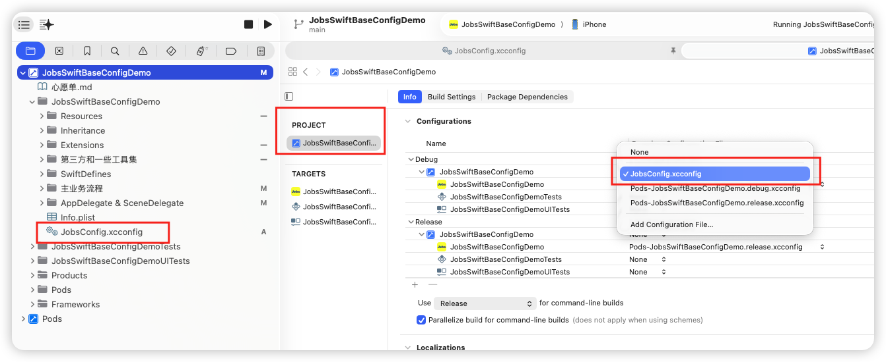

#### 7.3、`*.xcconfig`里面的内容 <a href="#前言" style="font-size:17px; color:green;"><b>🔼</b></a> <a href="#🔚" style="font-size:17px; color:green;"><b>🔽</b></a>

```swift
//
//  Config.xcconfig
//  JobsSwiftBaseConfigDemo
//
//  Created by Mac on 11/1/25.
//

// Configuration settings file format documentation can be found at:
// https://developer.apple.com/documentation/xcode/adding-a-build-configuration-file-to-your-project

PRODUCT_NAME = SwiftDemo
APP_DISPLAY_NAME = SwiftDemo
INFOPLIST_KEY_CFBundleDisplayName = $(APP_DISPLAY_NAME)
INFOPLIST_KEY_CFBundleName = $(PRODUCT_NAME)
```

### 8、应用程序图片 <a href="#前言" style="font-size:17px; color:green;"><b>🔼</b></a> <a href="#🔚" style="font-size:17px; color:green;"><b>🔽</b></a>

#### 8.1、iOS <a href="#前言" style="font-size:17px; color:green;"><b>🔼</b></a> <a href="#🔚" style="font-size:17px; color:green;"><b>🔽</b></a>

> 1️⃣ **@3x 的引入点是 iPhone 6 Plus（iOS 8）**。
>  6/7/8 的 **非 Plus** 机型始终是 **@2x**；6/7/8 **Plus** 是 **@3x**（而且渲染 1242×2208 后再下采样到 1080×1920 显示，这是当年的 downsampling 特性）。
>
> 2️⃣ **后来大量机型是 @3x**：iPhone X、XS/XS Max、11 Pro/Pro Max、12/12 mini/12 Pro/Pro Max、13/13 mini/13 Pro/Pro Max、14/14 Plus/14 Pro/Pro Max、15/15 Plus/15 Pro/Pro Max（以及后续大多数）。
>  **仍是 @2x 的典型**：iPhone XR、iPhone 11、各代 iPhone SE。
>
> 3️⃣ **iPad 到现在都没有 @3x**，都是 **@2x**（含 iPad Pro）。

* 启动图
  * 历史标准
    * **iPhone 3GS**：320×480 → `Default~iphone.png`
    * **iPhone 4/4S**（Retina）：640×960 → `Default@2x~iphone.png`
    * **iPhone 5/5s/SE(1st)**：640×1136 → `Default-568h@2x~iphone.png`
    * **iPhone 6/7/8**：750×1334 → `Default-667h@2x.png`（或 LaunchImage 槽位 `375w-667h@2x`）
    * **iPhone 6/7/8 Plus**：1242×2208（系统缩放到 1080×1920 显示）→ `Default-736h@3x.png` / 槽位 `414w-736h@3x`
    * **iPad（非 Retina）**：768×1024（竖）/ 1024×768（横）。**iPad Retina**：1536×2048（竖）/ 2048×1536（横）
    * **iPhone X / XS**：1125×2436（竖）等刘海机型在静态图时代也有人配，但官方当时已更**鼓励用 Launch Storyboard 适配安全区**。
  * 👉 当前，苹果已彻底废弃静态 **LaunchImage**，上架App Store多尺寸位图会被拒。必须用 **LaunchScreen.storyboard** 自适应布局（Auto Layout／Safe Area／矢量或等比约束）。<font color=red>**如果非要放品牌图，用约束让它自适应 @2x/@3x，而不是提交一堆固定像素图**</font>
* 应用程序图标
  * App Store（营销图标）：**1024×1024 px**，**不允许透明**（无 alpha）
  * 在设备上的必需尺寸（像素）
    * iPhone 主屏：**180×180**（@3x），**120×120**（@2x）
    * iPad 主屏：**167×167**（iPad Pro），**152×152**（iPad）
    * Spotlight：**120×120**（iPhone @3x）、**80×80**（@2x，含 iPad）
    * 设置（Settings）：**87×87**（@3x iPhone）、**58×58**（@2x，含 iPad）
    * 通知（Notifications）：**60×60**（@3x iPhone）、**40×40**（@2x，含 iPad）

#### 8.2、Android <a href="#前言" style="font-size:17px; color:green;"><b>🔼</b></a> <a href="#🔚" style="font-size:17px; color:green;"><b>🔽</b></a>

> ldpi：（@0.75x）

* 启动图
  * 品牌横幅：**200×80 dp** →
    * mdpi：200×80 （@1x）
    * hdpi：300×120（@1.5x）
    * xhdpi：400×160（@2x）
    * xxhdpi：600×240（@3x）
    * xxxhdpi：800×320（@4x）
* 应用程序图标
  * 带背景的应用图标：**240×240 dp**（内容需装进 **160 dp** 直径圆内）
    * mdpi：240；360；480；720；960 px
  * 无背景的应用图标：**288×288 dp**（内容需装进 **192 dp** 圆内）
    * mdpi：288；432；576；864；1152 px
  * **自适应图标（Adaptive Icon，API 26+）**：前景层 + 背景层 **各 108×108 dp** 画布；**前景可视安全区建议 ≤66×66 dp**，四周 **18 dp** 供蒙版/动效裁切。常见像素导出：
    * mdpi：108 px
    * hdpi：162 px
    * xhdpi：216 px
    * xxhdpi：324 px
    * xxxhdpi：432 px
  * **旧设备（Legacy Launcher 图标）**（如仍需兼容）：48、72、96、144、192 px（mdpi…xxxhdpi）
  * **Google Play 上架图标（商店用）**：**512×512 px, 32-bit PNG, sRGB，≤1MB**（Play 会统一蒙版/投影）。这与启动器图标不同，单独上传。

### 9、📦 [**Swift**](https://developer.apple.com/swift/).<font color=red>Package</font> <a href="#前言" style="font-size:17px; color:green;"><b>🔼</b></a> <a href="#🔚" style="font-size:17px; color:green;"><b>🔽</b></a>

* 检查版本

  ```shell
  swift --version
  ```

  > ```shell
  > swift-driver version: 1.127.14.1 Apple Swift version 6.2.1 (swiftlang-6.2.1.4.8 clang-1700.4.4.1)
  > Target: arm64-apple-macosx26.0
  > ```

* 依据系统模版，手动创建`swift package`

  ```shell
  swift package init --type macro --name MyMacros
  ```

* 构建（成功后方可通过Xcode添加进 [**Swift**](https://developer.apple.com/swift/)项目中）

  ```
  swift build
  ```

  > ```shell
  > ➜  MyMacrosClean swift build                             
  > [1/1] Planning build
  > Building for debugging...
  > [17/17] Applying MyMacrosClient
  > Build complete! (2.56s)
  > ```


* 系统包可以用Git进行统一管理，最后再手动引入工程。例如：[**swift-syntax**](https://github.com/swiftlang/swift-syntax)

* 通过Xcode添加进 [**Swift**](https://developer.apple.com/swift/)项目中👇

  <table style="width:100%; table-layout:fixed;">
    <tr>
      <td>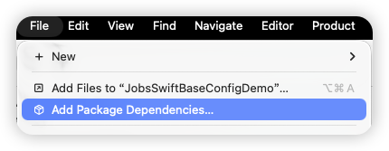</td>
      <td>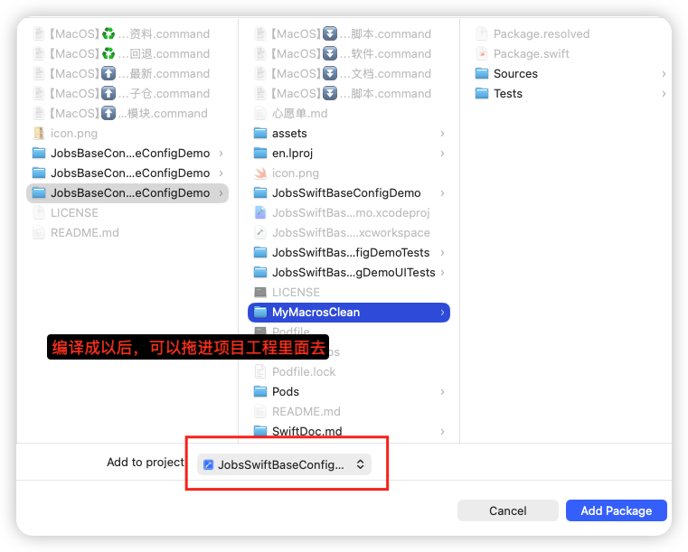</td>
    </tr>
    <tr>
      <td>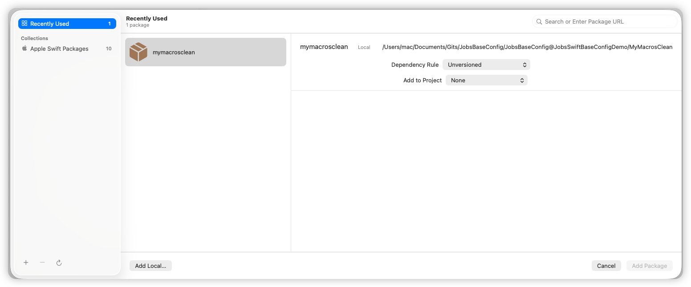</td>
      <td>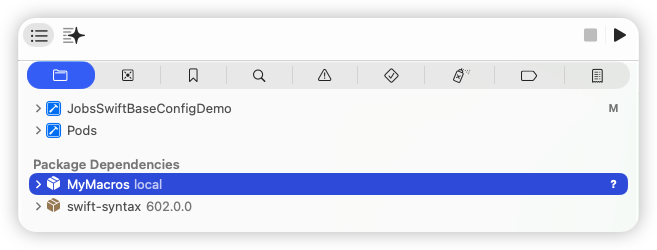</td>
    </tr>
  </table>
  
* 删除（涉及到3处）

  * `Xcode` 👉 `File` 👉 `Add Package Dependencies`

    

  * 工程`x.xcodeproj `👉 `PROJECT` 👉 `Package Dependencies`

    

  * 工程`x.xcodeproj `👉 `TARGETS` 👉 `General `👉 `Frameworks,Libraries,and Embedded Content`

    

### 10、其他 <a href="#前言" style="font-size:17px; color:green;"><b>🔼</b></a> <a href="#🔚" style="font-size:17px; color:green;"><b>🔽</b></a>

* 👉 [**Swift**](https://developer.apple.com/swift/) 的<u>API 展望（提前声明未来能力）</u>这种机制，**在Objc世界几乎不存在**

  ```
  @available(iOS 26.0, *)
  public static var presentationIntent: UIWritingToolsResultOptions { get }
  ```

  > 1️⃣ `.presentationIntent` 是 Apple 未来（iOS 26.0）才准备开放的能力；
  >
  > 2️⃣` .list`、`.table` 可能会在 **18.x 或 19.x** 的系统中逐步启用；
  >
  > 3️⃣ 当前 18.0 SDK 虽有声明，但实现未激活。

* 个别地区（比如：柬埔寨），需要将浏览器语言改为英文状态，方可进入[**苹果开发者网站**](https://developer.apple.com/)

* 打开苹果的[<font color=red>**反馈助理**</font>](applefeedback://)

  > ```url
  > feedbackassistant://
  > ```

* <font color=red>**C**</font>ommand <font color=red>**L**</font>ine <font color=red>**T**</font>ools <a href="#前言" style="font-size:17px; color:green;"><b>🔼</b></a> <a href="#🔚" style="font-size:17px; color:green;"><b>🔽</b></a>
  
  * 安装
  
    * （通过终端）下载安装`Command Line Tools`
  
      ```
      xcode-select --install
      ```
  
    * 通过 Xcode 安装
  
      * 打开 Xcode
      * 在菜单栏选择 **Xcode > Settings > Locations**
      * 在 <font color=red>**C**</font>ommand <font color=red>**L**</font>ine <font color=red>**T**</font>ools 下拉菜单中选择对应的 Xcode 版本
  
  * 卸载
  
    ```shell
    sudo rm -rf /Library/Developer/CommandLineTools
    xcode-select --install
    ```
  
  * 切换
  
    ```shell
    sudo xcode-select -s /Applications/Xcode.app/Contents/Developer
    ```
  
  * 验证命令
  
    ```shell
    ➜  ~ xcode-select -p
    /Applications/Xcode.app/Contents/Developer
    ```
  
  * 查看<font color=red>**C**</font>ommand <font color=red>**L**</font>ine <font color=red>**T**</font>ools版本
  
    ```shell
    ➜  ~ pkgutil --pkg-info=com.apple.pkg.CLTools_Executables
    package-id: com.apple.pkg.CLTools_Executables
    version: 26.0.0.0.1.1757719676
    volume: /
    location: /
    install-time: 1758341956
    ```
  
* **ObjC**和[**Swift**](https://developer.apple.com/swift/)混编以后，📦打包的体积会变大
  
  * [**Swift**](https://developer.apple.com/swift/) 标准库要随 App 打包：iOS 系统里不内置 [**Swift**](https://developer.apple.com/swift/) 标准库（至少不能依赖它一定存在），只要项目里用了 [**Swift**](https://developer.apple.com/swift/)，就得把 `libswift*.dylib` 一起带上。**体感增量：~2–7 MB/架构（压缩后更小）**，取决于用到的模块数量
  * 混编本身不会重复打包 **ObjC** 运行时：**ObjC** Runtime 属于系统，纯 **ObjC** 和混编在这方面没差
  * 链接器选项可能放大：比如 `-ObjC` 可能把静态库里很多不需要的对象一起拉进来，造成膨胀（和是否混编无关，但混编项目更容易“全都要”）

## 三、💻代码讲解 <a href="#前言" style="font-size:17px; color:green;"><b>🔼</b></a> <a href="#🔚" style="font-size:17px; color:green;"><b>🔽</b></a>

### 1、平台区分引用库 <a href="#前言" style="font-size:17px; color:green;"><b>🔼</b></a> <a href="#🔚" style="font-size:17px; color:green;"><b>🔽</b></a>

```swift
#if os(OSX)
    import AppKit
#endif

#if os(iOS) || os(tvOS)
    import UIKit
#endif
```

### 2、⛓️<font id=懒加载+链式调用>懒加载+链式调用</font> <a href="#前言" style="font-size:17px; color:green;"><b>🔼</b></a> <a href="#🔚" style="font-size:17px; color:green;"><b>🔽</b></a>

#### 2.1、🏷️`UILabel` <a href="#前言" style="font-size:17px; color:green;"><b>🔼</b></a> <a href="#🔚" style="font-size:17px; color:green;"><b>🔽</b></a>

* ```swift
  let label = UILabel()
     .byFont(.systemFont(ofSize: 16))
     .byTextColor(.black)
     .byText("目录".localized())
     .byTextAlignment(.center)
     .makeLabelByShowingType(.oneLineTruncatingTail)
     .bgImage(UIImage(named: "bg_pattern"))
     .byNextText(" → More")
  ```

* [给 `UILabel` 里的文字加 **下划线**，并且可以指定下划线的颜色](#给UILabel里的文字加下划线并且可以指定下划线的颜色@实现逻辑)

  > ```swift
  > UILabel().underline(color:PYConst.main_color)
  > ```

#### 2.2、🔘`UIBUtton` <a href="#前言" style="font-size:17px; color:green;"><b>🔼</b></a> <a href="#🔚" style="font-size:17px; color:green;"><b>🔽</b></a>

> * **按钮选中/非选中**
>
>   ```swift
>   sender.isSelected.toggle()
>   ```
>
> * **防止用户快速连续点按钮**
>
>   ```swift
>   sender.disableAfterClick(interval: 2)
>   ```
>

##### 2.2.1、🔘普通按钮（事件追加） <a href="#前言" style="font-size:17px; color:green;"><b>🔼</b></a> <a href="#🔚" style="font-size:17px; color:green;"><b>🔽</b></a>

```swift
private lazy var exampleButton: UIButton = {
    UIButton.sys()
        /// 普通字符串@设置主标题
        .byTitle("显示", for: .normal)
        .byTitle("隐藏", for: .selected)
        .byTitleColor(.systemBlue, for: .normal)
        .byTitleColor(.systemRed, for: .selected)
        .byTitleFont(.systemFont(ofSize: 16, weight: .medium))
        /// 普通字符串@设置副标题
        .bySubTitle("显示", for: .normal)
        .bySubTitle("隐藏", for: .selected)
        .bySubTitleColor(.systemBlue, for: .normal)
        .bySubTitleColor(.systemRed, for: .selected)
        .bySubTitleFont(.systemFont(ofSize: 16, weight: .medium))
        /// 富文本字@设置主标题
        .byRichTitle(JobsRichText.make([
            JobsRichRun(.text("¥99")).font(.systemFont(ofSize: 18, weight: .semibold)).color(.systemRed),
            JobsRichRun(.text(" /月")).font(.systemFont(ofSize: 16)).color(.white)
        ]))
         /// 富文本字@设置副标题
        .byRichSubTitle(JobsRichText.make([
            JobsRichRun(.text("原价 ")).font(.systemFont(ofSize: 12)).color(.white.withAlphaComponent(0.8)),
            JobsRichRun(.text("¥199")).font(.systemFont(ofSize: 12, weight: .medium)).color(.systemYellow)
        ]))
        /// 按钮图片@图文关系
        .byImage(UIImage(systemName: "eye.slash"), for: .normal)                // 未选中图标
        .byImage(UIImage(systemName: "eye"), for: .selected)                    // 选中图标
        .byContentEdgeInsets(UIEdgeInsets(top: 4, left: 8, bottom: 4, right: 8))// 图文内边距
        .byTitleEdgeInsets(UIEdgeInsets(top: 0, left: 6, bottom: 0, right: -6)) // 图标与文字间距
        /// 点击@播放声音
        .byTapSound("Sounddd.wav")    
        /// 普通@点按事件触发
        .onTap { [weak self] sender in
            guard let self else { return }
            sender.isSelected.toggle()
            // 文字与图标自动切换
            self.passwordTF.isSecureTextEntry.toggle()
            self.passwordTF.togglePasswordVisibility()
            print("👁 当前状态：\(sender.isSelected ? "隐藏密码" : "显示密码")")
        }
			  /// 追加@点按事件触发
				.onTapAppend{ sender in
						print("追加的点按事件")
				}
        /// 右上角提示文案@小红点
        .byCornerDot(diameter: 10, offset: .init(horizontal: -4, vertical: 4))// 红点
        /// 右上角提示文案@文字
        .byCornerBadgeText("NEW") { cfg in
            cfg.byOffset(.init(horizontal: -6, vertical: 6))
                .byInset(.init(top: 2, left: 6, bottom: 2, right: 6))
                .byBgColor(.systemRed)
                .byFont(.systemFont(ofSize: 11, weight: .bold))
                .byShadow(color: UIColor.black.withAlphaComponent(0.25),
                          radius: 2,
                          opacity: 0.6,
                          offset: .init(width: 0, height: 1))
        }
        /// 普通@长按事件触发
        .onLongPress(minimumPressDuration: 0.8) { btn, gr in
             if gr.state == .began {
                 btn.alpha = 0.6
                 print("长按开始 on \(btn)")
             } else if gr.state == .ended || gr.state == .cancelled {
                 btn.alpha = 1.0
                 print("长按结束")
             }
         }
  			/// 追加@长按事件触发
        .onLongPressAppend(minimumPressDuration: 0.8) { btn, gr in
             print("追加的长按事件")
				}
        .byAddTo(view) { [unowned self] make in
            make.top.equalTo(self.view.safeAreaLayoutGuide.snp.top).offset(40)
            make.left.right.equalToSuperview().inset(24)
            make.height.equalTo(44)
        }
        /// UIButtonConfiguration
        if #available(iOS 15.0, *) {
            b.byConfiguration { c in
                c.byTitle("背景图：Base64 / URL")
                    .byBaseForegroundCor(.white)
                    .byContentInsets(.init(top: 16, leading: 16, bottom: 16, trailing: 16))
                    .byCornerStyle(.large)
                    .byImagePlacement(.trailing)
                    .byImagePadding(8)
            }
        } else {
            b.byTitle("背景图：Base64 / URL", for: .normal)
                .byTitleColor(.white, for: .normal)
                .byContentEdgeInsets(.init(top: 16, left: 16, bottom: 16, right: 16))
                .byBgColor(.systemBlue)
        }
}()
```

##### 2.2.2、⏰ <font color=red id=计数按钮>**计数按钮**</font> <a href="#前言" style="font-size:17px; color:green;"><b>🔼</b></a> <a href="#🔚" style="font-size:17px; color:green;"><b>🔽</b></a>

> * ⏰ 计时器开始
>
>   * 正计时
>
>     ```swift
>     self?.startButton.startTimer(
>         total: nil,                 // ❤️ 不传 => 正计时
>         interval: self.intervalSec,
>         kind: self.currentKind
>     )
>     ```
>
>   * 倒计时
>
>     ```swift
>     let total = self.parseCountdownTotal(10)
>     btn.startTimer(
>         total: total, // ❤️ 传 total => 倒计时
>         interval: self.intervalSec,
>         kind: self.currentKind
>     )
>     ```
>
> * ⏰ 计时器暂停
>
>   ```swift
>   self?.startButton.pauseTimer()
>   self?.countdownButton.pauseTimer()
>   ```
>
> * ⏰ 计时器重新开始（恢复计时）
>
>   ```swift
>   self?.startButton.resumeTimer()
>   self?.countdownButton.resumeTimer()
>   ```
>
> * ⏰ 计时器销毁
>
>   > 触发回调后销毁定时器
>
>   ```swift
>   self?.startButton.fireTimerOnce()
>   self?.countdownButton.fireTimerOnce()
>   ```
>
> * ⏰ 计时器停止 
>
>   > 销毁但不触发回调
>
>   ```swift
>   self?.startButton.stopTimer()
>   self?.countdownButton.stopTimer()
>   ```
>

###### 2.2.2.1、⏰ 正计时计数按钮 <a href="#前言" style="font-size:17px; color:green;"><b>🔼</b></a> <a href="#🔚" style="font-size:17px; color:green;"><b>🔽</b></a>

```swift
// MARK: - 开始按钮（正计时：不传 total；按钮标题自动显示 elapsed）
private lazy var startButton: UIButton = {
    UIButton(type: .system)
        .byTitle("开始", for: .normal)
        .byTitleFont(.systemFont(ofSize: 22, weight: .bold))
        .byTitleColor(.white, for: .normal)
        .byBackgroundColor(.systemBlue, for: .normal)
        .byCornerRadius(10)
        .byMasksToBounds(true)
        // 每 tick：更新时间 & 最近触发时间
        .onTimerTick { [weak self] btn, elapsed, _, kind in
            guard let self else { return }
            // 正计时：elapsed（秒）已由按钮内部自动设置为标题，这里只补充 lastFireLabel
            self.lastFireLabel.text = "Last: " + Self.fmt(Date())
        }
        // 状态变化：驱动控制键（暂停/继续/Fire/停止）的可用与配色
        .onTimerStateChange { [weak self] _, _, new in
            self?.updateControlButtons(by: new)
        }
        // 点击开始：不传 total => 正计时
        .onTap { [weak self] btn in
            guard let self else { return }
            self.lastFireLabel.text = "Last: -"
            btn.startTimer(
                total: nil,                 // ❤️ 不传 => 正计时
                interval: self.intervalSec,
                kind: self.currentKind
            )
        }
        .byAddTo(view) { [unowned self] make in
            make.top.equalTo(countdownField.snp.bottom).offset(14)
            make.left.equalToSuperview().offset(horizontalInset)
            make.right.equalToSuperview().inset(horizontalInset)
            make.height.equalTo(56)
        }
}()
```

###### 2.2.2.2、⏰ 倒计时计数按钮 <a href="#前言" style="font-size:17px; color:green;"><b>🔼</b></a> <a href="#🔚" style="font-size:17px; color:green;"><b>🔽</b></a>

```swift
// MARK: - 倒计时演示按钮（同一套 API：传 total => 倒计时）
private lazy var countdownButton: UIButton = {
    UIButton(type: .system)
        .byTitle("获取验证码", for: .normal)
        .byTitleColor(.white, for: .normal)
        .byBackgroundColor(.systemGreen, for: .normal)
        .onCountdownTick { [weak self] btn, remain, total, kind in
            guard let self else { return }
            print("⏱️ [\(kind.jobs_displayName)] \(remain)/\(total)")
            self.lastFireLabel.text = "Last: " + Self.fmt(Date())
            btn.byTitle("还剩 \(remain)s", for: .normal)
        }
        .onCountdownFinish { _, kind in
            print("✅ [\(kind.jobs_displayName)] 倒计时完成")
        }
        .onTap { [weak self] btn in
            guard let self else { return }
            let total = self.parseCountdownTotal(10)
            btn.startTimer(
                total: total, // ❤️ 传 total => 倒计时
                interval: self.intervalSec,
                kind: self.currentKind
            )
            // 关键：等 startTimer 把 "10s" 设好后再加前缀，避免被覆盖
            DispatchQueue.main.async {
                let cur = btn.title(for: .normal) ?? "\(total)s"
                if !cur.hasPrefix("还剩 ") {
                    btn.byTitle("还剩 \(cur)", for: .normal)
                }
            }
        }
        .byAddTo(view) { [unowned self] make in
            make.top.equalTo(self.hintLabel.snp.bottom).offset(20)
            make.left.equalToSuperview().offset(horizontalInset)
            make.right.equalToSuperview().inset(horizontalInset)
            make.height.equalTo(50)
        }
}()
```

##### 2.2.3、🔘 <font id=网络图按钮>**网络图按钮**</font>@背景图/前景图

* [**SDWebImage**](https://github.com/SDWebImage/SDWebImage)

  ```swift
  /// 按钮网络背景图@SDWebImage
  private lazy var btnBG: UIButton = {
      UIButton.sys()
          .byCornerRadius(12)
          .byClipsToBounds(true)
          .byTitle("我是主标题@SDWebImage")
          .bySubTitle("我是副标题@SDWebImage")
          .sd_imageURL("https://picsum.photos/3000/2000")
          .sd_placeholderImage(nil)
          .sd_options([.scaleDownLargeImages, .retryFailed])
          .sd_bgNormalLoad()// 之前是配置项，这里才是真正决定渲染背景图/前景图
          .byAddTo(scrollView) { [unowned self] make in
              make.top.equalTo(wrapperImgViewSD.snp.bottom).offset(24)
              make.left.equalTo(scrollView.frameLayoutGuide.snp.left).offset(20)
              make.right.equalTo(scrollView.frameLayoutGuide.snp.right).inset(20)
              make.height.equalTo(64)
          }
  }()
  ```

  ```swift
  /// 按钮网络前景图@SDWebImage
  private lazy var btnImage: UIButton = {
      UIButton.sys()
          .byCornerRadius(12)
          .byBorderWidth(1)
          .byBorderColor(UIColor.systemGray3)
          .byClipsToBounds(true)
          .byTitle("我是主标题@SDWebImage")
          .bySubTitle("我是副标题@SDWebImage")
          .sd_imageURL("https://picsum.photos/200")
          .sd_placeholderImage(nil)
          .sd_options([.retryFailed, .highPriority, .scaleDownLargeImages])
          .sd_normalLoad()// 之前是配置项，这里才是真正决定渲染背景图/前景图
          .byAddTo(scrollView) { [unowned self] make in
              make.top.equalTo(btnBG.snp.bottom).offset(16)
              make.left.equalTo(scrollView.frameLayoutGuide.snp.left).offset(20)
              make.right.equalTo(scrollView.frameLayoutGuide.snp.right).inset(20)
              make.height.greaterThanOrEqualTo(56)
          }
  }()
  ```

* [**Kingfisher**](https://github.com/onevcat/Kingfishe)

  ```swift
  /// 按钮网络背景图@Kingfisher
  private lazy var btnBG_KF: UIButton = {
      UIButton.sys()
          .byCornerRadius(12)
          .byClipsToBounds(true)
          .byTitle("我是主标题@Kingfisher")
          .bySubTitle("我是副标题@Kingfisher")
          .kf_imageURL("https://picsum.photos/300/200")
          .kf_placeholderImage(nil)
          .kf_options([
              .processor(DownsamplingImageProcessor(size: CGSize(width: 500, height: 200))),
              .scaleFactor(UIScreen.main.scale),
              .cacheOriginalImage,
              .transition(.fade(0.25)),
              .retryStrategy(DelayRetryStrategy(maxRetryCount: 2, retryInterval: .seconds(1)))
          ])
          .kf_bgNormalLoad()// 之前是配置项，这里才是真正决定渲染背景图/前景图
          .byAddTo(scrollView) { [unowned self] make in
              make.top.equalTo(btnImage.snp.bottom).offset(24)
              make.left.equalTo(scrollView.frameLayoutGuide.snp.left).offset(20)
              make.right.equalTo(scrollView.frameLayoutGuide.snp.right).inset(20)
              make.height.equalTo(64)
          }
  }()
  ```

  ```swift
  /// 按钮网络前景图@Kingfisher
  private lazy var btnImage_KF: UIButton = {
      UIButton.sys()
          .byCornerRadius(12)
          .byBorderWidth(1)
          .byBorderColor(UIColor.systemGray3)
          .byClipsToBounds(true)
          .byTitle("我是主标题@Kingfisher")
          .bySubTitle("我是副标题@Kingfisher")
          .kf_imageURL("https://picsum.photos/200")
          .kf_placeholderImage(nil)
          .kf_options([
              .processor(DownsamplingImageProcessor(size: CGSize(width: 64, height: 64))),
              .scaleFactor(UIScreen.main.scale),
              .cacheOriginalImage,
              .transition(.fade(0.25)),
              .retryStrategy(DelayRetryStrategy(maxRetryCount: 2, retryInterval: .seconds(1)))
          ])
          .kf_normalLoad() // 之前是配置项，这里才是真正决定渲染背景图/前景图
          .byAddTo(scrollView) { [unowned self] make in
              make.top.equalTo(btnBG_KF.snp.bottom).offset(16)
              make.left.equalTo(scrollView.frameLayoutGuide.snp.left).offset(20)
              make.right.equalTo(scrollView.frameLayoutGuide.snp.right).inset(20)
              make.height.equalTo(64)
          }
  }()
  ```

##### 2.2.4、🔘 旋转按钮 <a href="#前言" style="font-size:17px; color:green;"><b>🔼</b></a> <a href="#🔚" style="font-size:17px; color:green;"><b>🔽</b></a>

```swift
private lazy var suspendSpinBtn: UIButton = {
    UIButton(type: .system)
        .byTitle("0", for: .normal) // 中间数字：秒
        .byTitleFont(.systemFont(ofSize: 22, weight: .bold))
        .byTitleColor(.white, for: .normal)
        .byBackgroundColor(.systemOrange, for: .normal)
        .byCornerRadius(25)
        .byMasksToBounds(true)

        // 正计时：每秒触发一次
        .startTimer(total: nil, interval: 1.0, kind: .gcd)

        // 每 tick：更新中心数字
        .onTimerTick { [weak self] btn, elapsed, _, _ in
            guard let _ = self else { return }
            let sec = Int(elapsed)             // 累计秒
            // 只有变化时才刷新，避免不必要的重绘
            if btn.title(for: .normal) != "\(sec)" {
                btn.byTitle("\(sec)", for: .normal)
                    .bySetNeedsUpdateConfiguration()
            }
        }
        // 长按：原逻辑
        .onLongPress(minimumPressDuration: 0.8) { btn, _ in
            JobsToast.show(
                text: "长按了悬浮按钮",
                config: JobsToast.Config()
                    .byBgColor(.systemGreen.withAlphaComponent(0.9))
                    .byCornerRadius(12)
            )
        }
        // 点击：保持原来的 Toast（不改动计时逻辑）
        .onTap { [weak self] btn in
            guard let _ = self else { return }
            btn.playTapBounce(haptic: .light)  // 👈 临时放大→回弹（不注册任何手势/事件）
            if btn.jobs_isSpinning {
                // 暂停旋转
                btn.bySpinPause()
                // 暂停计时（保留已累计秒，不重置）
                btn.timer?.pause()        // ✅ 推荐：你的统一内核挂在 button.timer 上
                // 如果你有封装方法，则用：btn.pauseTimer()
                JobsToast.show(
                    text: "已暂停旋转 & 计时",
                    config: .init().byBgColor(.systemGreen.withAlphaComponent(0.9)).byCornerRadius(12)
                )
            } else {
                // 恢复旋转
                btn.bySpinStart()
                // 恢复计时（从暂停处继续累加）
                btn.timer?.resume()       // ✅ 推荐
                // 如果你有封装方法，则用：btn.resumeTimer()
                JobsToast.show(
                    text: "继续旋转 & 计时",
                    config: .init().byBgColor(.systemGreen.withAlphaComponent(0.9)).byCornerRadius(12)
                )
            }
        }
        // 悬浮配置
        .bySuspend { cfg in
            cfg
                .byContainer(view)
//                    .byStart(.bottomRight)
                .byStart(.point(CGPoint(x: 300.w, y: 500))) // 起始点（可用区域坐标）
                .byFallbackSize(CGSize(width: 50, height: 50))
                .byHapticOnDock(true)
        }
}()
```

#### 2.3、`UITableView` <a href="#前言" style="font-size:17px; color:green;"><b>🔼</b></a> <a href="#🔚" style="font-size:17px; color:green;"><b>🔽</b></a>

```swift
private lazy var tableView: UITableView = {
    UITableView(frame: .zero, style: .insetGrouped)
        .byDataSource(self)
        .byDelegate(self)
        .registerCell(UITableViewCell.self)
        .byNoContentInsetAdjustment()
        .bySeparatorStyle(.singleLine)
        .byNoSectionHeaderTopPadding()
    
        .jobs_emptyButtonProvider { [unowned self] in
            UIButton(type: .system)
                .byTitle("暂无数据", for: .normal)
                .bySubTitle("点我填充示例数据", for: .normal)
                .byImage("tray".sysImg, for: .normal)
                .byImagePlacement(.top)
                .onTap { [weak self] _ in
                    guard let self else { return }
                    self.items = (1...10).map { "Row \($0)" }
                    self.tableView.reloadData()   // ✅ reload 后会自动评估空态，无需你再手动调用
                }
                // 可选：不满意默认居中 -> 自定义布局
                .jobs_setEmptyLayout { btn, make, host in
                    make.centerX.equalTo(host)
                    make.centerY.equalTo(host).offset(-40)
                    make.leading.greaterThanOrEqualTo(host).offset(16)
                    make.trailing.lessThanOrEqualTo(host).inset(16)
                    make.width.lessThanOrEqualTo(host).multipliedBy(0.9)
                }
        }

//            .byContentInset(UIEdgeInsets(
//                top: UIApplication.jobsSafeTopInset + 30,
//                left: 0,
//                bottom: 0,
//                right: 0
//            ))
            // 下拉刷新 Header
            .configRefreshHeader(component: JobsDefaultHeader(),
                                 container: self,
                                 trigger: 66) { [weak self] in
                guard let self else { return }
                Task { @MainActor in
                    try? await Task.sleep(nanoseconds: 1_000_000_000)
                    self.rows = 20
                    self.tableView.byReloadData()
                    self.tableView.switchRefreshHeader(to: .normal)
                    self.tableView.switchRefreshFooter(to: .normal) // 复位“无更多”
                }
            }
            // 上拉加载 Footer
            .configRefreshFooter(component: JobsDefaultFooter(),
                                          container: self,
                                          trigger: 66) { [weak self] in
                guard let self else { return }
                Task { @MainActor in
                    try? await Task.sleep(nanoseconds: 1_000_000_000)
                    if self.rows < 60 {
                        self.rows += 20
                        self.tableView.byReloadData()
                        self.tableView.switchRefreshFooter(to: .normal)
                    } else {
                        self.tableView.switchRefreshFooter(to: .noMoreData)
                    }
                }
            }

        .byAddTo(view) {[unowned self] make in
            if view.jobs_hasVisibleTopBar() {
                make.top.equalTo(self.gk_navigationBar.snp.bottom).offset(10)
                make.left.right.bottom.equalToSuperview()
            } else {
                make.edges.equalToSuperview()
            }
        }
}()
```

#### 2.4、`UICollectionView` <a href="#前言" style="font-size:17px; color:green;"><b>🔼</b></a> <a href="#🔚" style="font-size:17px; color:green;"><b>🔽</b></a>

* [**`UICollectionViewFlowLayout`**](#UICollectionViewFlowLayout)

* **`UICollectionView`**

  ```swift
  private lazy var collectionView: UICollectionView = {
      UICollectionView(frame: .zero, collectionViewLayout: flowLayout)
          .byDataSource(self)
          .byDelegate(self)
          .registerCell(UICollectionViewCell.self)
          .byBackgroundView(nil)
          .byDragInteractionEnabled(false)
  
          // 空态按钮（与 UITableView Demo 一致）
          .jobs_emptyButtonProvider { [unowned self] in
              UIButton.sys()
                  .byTitle("暂无数据", for: .normal)
                  .bySubTitle("点我填充示例数据", for: .normal)
                  .byImage(UIImage(systemName: "square.grid.2x2"), for: .normal)
                  .byImagePlacement(.top)
                  .onTap { [weak self] _ in
                      guard let self else { return }
                      self.items = (1...12).map { "Item \($0)" }
                      self.collectionView.byReloadData()        // ✅ reload 后自动评估空态
                  }
                  // 可选：自定义空态按钮布局
                  .jobs_setEmptyLayout { btn, make, host in
                      make.centerX.equalTo(host)
                      make.centerY.equalTo(host).offset(-40)
                      make.leading.greaterThanOrEqualTo(host).offset(16)
                      make.trailing.lessThanOrEqualTo(host).inset(16)
                      make.width.lessThanOrEqualTo(host).multipliedBy(0.9)
                  }
          }
  
              // 下拉刷新 Header
              .configRefreshHeader(component: JobsDefaultHeader(),
                                   container: self,
                                   trigger: 66) { [weak self] in
                  guard let self else { return }
                  Task { @MainActor in
                      try? await Task.sleep(nanoseconds: 1_000_000_000)
                      self.rows = 20
                      self.tableView.byReloadData()
                      self.tableView.switchRefreshHeader(to: .normal)
                      self.tableView.switchRefreshFooter(to: .normal) // 复位“无更多”
                  }
              }
              // 上拉加载 Footer
              .configRefreshFooter(component: JobsDefaultFooter(),
                                            container: self,
                                            trigger: 66) { [weak self] in
                  guard let self else { return }
                  Task { @MainActor in
                      try? await Task.sleep(nanoseconds: 1_000_000_000)
                      if self.rows < 60 {
                          self.rows += 20
                          self.tableView.byReloadData()
                          self.tableView.switchRefreshFooter(to: .normal)
                      } else {
                          self.tableView.switchRefreshFooter(to: .noMoreData)
                      }
                  }
              }
  
          .byAddTo(view) { [unowned self] make in
              if view.jobs_hasVisibleTopBar() {
                  make.top.equalTo(self.gk_navigationBar.snp.bottom).offset(10)
                  make.left.right.bottom.equalToSuperview()
              } else {
                  make.edges.equalToSuperview()
              }
          }
  }()
  ```
  
* 协议：**`UICollectionViewDataSource`**、**`UICollectionViewDelegate`**、**`UICollectionViewDelegateFlowLayout`**

  ```swift
  // ============================== UICollectionViewDataSource ==============================
  func numberOfSections(in collectionView: UICollectionView) -> Int { 1 }
  
  func collectionView(_ collectionView: UICollectionView, numberOfItemsInSection section: Int) -> Int {
      items.count
  }
  
  func collectionView(_ collectionView: UICollectionView,
                      cellForItemAt indexPath: IndexPath) -> UICollectionViewCell {
      let cell: UICollectionViewCell = collectionView.dequeueCell(UICollectionViewCell.self, for: indexPath)
      let label: UILabel
      if let exist = cell.contentView.viewWithTag(1001) as? UILabel {
          label = exist
      } else {
          label = UILabel()
              .byNumberOfLines(1)
              .byTextAlignment(.center)
              .byFont(.systemFont(ofSize: 16, weight: .medium))
              .byTextColor(.label)
              .byTag(1001)
              .byAddTo(cell.contentView) { make in     // ✅ 加到 contentView
                  make.edges.equalToSuperview().inset(8)
              }
  
          // 背景 & 圆角（只需设一次）
          cell.contentView.byBgColor(.secondarySystemBackground)
              .byCornerRadius(10)
              .byMasksToBounds(true)
      }
  
      label.text = items[indexPath.item]
      return cell
  }
  // ============================== UICollectionViewDelegate ==============================
  func collectionView(_ collectionView: UICollectionView, didSelectItemAt indexPath: IndexPath) {
      print("✅ didSelect Item: \(indexPath.item)")
      collectionView.deselectItem(at: indexPath, animated: true)
  }
  
  // ============================== UICollectionViewDelegateFlowLayout ==============================
  func collectionView(_ collectionView: UICollectionView,
                      layout collectionViewLayout: UICollectionViewLayout,
                      sizeForItemAt indexPath: IndexPath) -> CGSize {
      // 计算 2 列卡片宽度（考虑 sectionInset / interItemSpacing）
      guard let layout = collectionViewLayout as? UICollectionViewFlowLayout else {
          return CGSize(width: 100, height: 60)
      }
      let inset = layout.sectionInset
      let spacing = layout.minimumInteritemSpacing
      let columns: CGFloat = 2
      let totalH = inset.left + inset.right + (columns - 1) * spacing
      let w = floor((collectionView.bounds.width - totalH) / columns)
      return CGSize(width: w, height: 64)
  }
  ```

#### 2.5、<font id=UICollectionViewFlowLayout>`UICollectionViewFlowLayout`</font> <a href="#前言" style="font-size:17px; color:green;"><b>🔼</b></a> <a href="#🔚" style="font-size:17px; color:green;"><b>🔽</b></a>

```swift
private lazy var flowLayout: UICollectionViewFlowLayout = {
    UICollectionViewFlowLayout()
        .byScrollDirection(.vertical)
        .byMinimumLineSpacing(10)
        .byMinimumInteritemSpacing(10)
        .bySectionInset(UIEdgeInsets(top: 10, left: 12, bottom: 10, right: 12))
}()
```

#### 2.6、`UIImageView` <a href="#前言" style="font-size:17px; color:green;"><b>🔼</b></a> <a href="#🔚" style="font-size:17px; color:green;"><b>🔽</b></a>

* 字符串本地图

  ```swift
  /// UIImageView@字符串本地图
  private lazy var localImgView: UIImageView = {
      UIImageView()
          .byImage("Ani".img)
          .byContentMode(.scaleAspectFill)
          .byClipsToBounds()
          .onTap { iv in
              toastBy("单击图片：\(iv)")
           }
          .onLongPress(minDuration: 0.8, movement: 12, touches: 1, name: "customLongPress") { iv, gr in
              switch gr.state {
              case .began:
                  toastBy("长按开始 on \(iv)")
              case .ended, .cancelled, .failed:
                  toastBy("长按结束 on \(iv)")
              default:
                  break
              }
          }
          .byAddTo(scrollView) { [unowned self] make in
              make.top.equalTo(scrollView.contentLayoutGuide.snp.top).offset(10.h)
              make.left.equalTo(scrollView.frameLayoutGuide.snp.left).offset(20.w)
              make.right.equalTo(scrollView.frameLayoutGuide.snp.right).inset(20.w)
              make.height.equalTo(180.h)
          }
  }()
  ```
  
* [**Kingfisher**](https://github.com/onevcat/Kingfishe)

  ```swift
  /// UIImageView字符串网络图@Kingfisher
  private lazy var asyncImgView: UIImageView = {
      UIImageView()
          .byAsyncImageKF("https://picsum.photos/200/300", fallback: "唐老鸭".img)
          .byContentMode(.scaleAspectFill)
          .byClipsToBounds()
          .onTap { iv in
              toastBy("单击图片：\(iv)")
           }
          .onLongPress(minDuration: 0.8, movement: 12, touches: 1, name: "customLongPress") { iv, gr in
              switch gr.state {
              case .began:
                  toastBy("长按开始 on \(iv)")
              case .ended, .cancelled, .failed:
                  toastBy("长按结束 on \(iv)")
              default:
                  break
              }
          }
          .byAddTo(scrollView) { [unowned self] make in
              make.top.equalTo(localImgView.snp.bottom).offset(20.h)
              make.left.equalTo(scrollView.frameLayoutGuide.snp.left).offset(20.w)
              make.right.equalTo(scrollView.frameLayoutGuide.snp.right).inset(20.w)
              make.height.equalTo(180.h)
          }
  }()
  ```

  ```swift
  /// UIImageView网络图（失败兜底图）@Kingfisher
  private lazy var wrapperImgView: UIImageView = {
      UIImageView()
          .byContentMode(.scaleAspectFill)
          .byClipsToBounds()
          .kf_setImage(from: "https://picsum.photos/200", placeholder: "Ani".img)
          .onTap { iv in
              toastBy("单击图片：\(iv)")
           }
          .onLongPress(minDuration: 0.8, movement: 12, touches: 1, name: "customLongPress") { iv, gr in
              switch gr.state {
              case .began:
                  toastBy("长按开始 on \(iv)")
              case .ended, .cancelled, .failed:
                  toastBy("长按结束 on \(iv)")
              default:
                  break
              }
          }
          .byAddTo(scrollView) { [unowned self] make in
              make.top.equalTo(asyncImgViewSD.snp.bottom).offset(20.h)
              make.left.equalTo(scrollView.frameLayoutGuide.snp.left).offset(20.w)
              make.right.equalTo(scrollView.frameLayoutGuide.snp.right).inset(20.w)
              make.height.equalTo(180.h)
          }
  }()
  ```

* [**SDWebImage**](https://github.com/SDWebImage/SDWebImage)

  ```swift
  /// UIImageView字符串网络图@SDWebImage
  private lazy var asyncImgViewSD: UIImageView = {
      UIImageView()
          .byAsyncImageSD("https://picsum.photos/400/300", fallback: "唐老鸭".img)
          .byContentMode(.scaleAspectFill)
          .byClipsToBounds()
          .onTap { iv in
              toastBy("单击图片：\(iv)")
           }
          .onLongPress(minDuration: 0.8, movement: 12, touches: 1, name: "customLongPress") { iv, gr in
              switch gr.state {
              case .began:
                  toastBy("长按开始 on \(iv)")
              case .ended, .cancelled, .failed:
                  toastBy("长按结束 on \(iv)")
              default:
                  break
              }
          }
          .byAddTo(scrollView) { [unowned self] make in
              make.top.equalTo(asyncImgView.snp.bottom).offset(20.h)
              make.left.equalTo(scrollView.frameLayoutGuide.snp.left).offset(20.w)
              make.right.equalTo(scrollView.frameLayoutGuide.snp.right).inset(20.w)
              make.height.equalTo(180.h)
          }
  }()
  ```
  
  ```swift
  /// UIImageView网络图（失败兜底图）@SDWebImage
  private lazy var wrapperImgViewSD: UIImageView = {
      UIImageView()
          .byContentMode(.scaleAspectFill)
          .byClipsToBounds()
          .sd_setImage(from: "https://picsum.photos/200", placeholder: "Ani".img)
          .onTap { iv in
              toastBy("单击图片：\(iv)")
           }
          .onLongPress(minDuration: 0.8, movement: 12, touches: 1, name: "customLongPress") { iv, gr in
              switch gr.state {
              case .began:
                  toastBy("长按开始 on \(iv)")
              case .ended, .cancelled, .failed:
                  toastBy("长按结束 on \(iv)")
              default:
                  break
              }
          }
          .byAddTo(scrollView) { [unowned self] make in
              make.top.equalTo(wrapperImgView.snp.bottom).offset(20.h)
              make.left.equalTo(scrollView.frameLayoutGuide.snp.left).offset(20.w)
              make.right.equalTo(scrollView.frameLayoutGuide.snp.right).inset(20.w)
              make.height.equalTo(180.h)
          }
  }()
  ```

#### 2.7、`UIToolbar` <a href="#前言" style="font-size:17px; color:green;"><b>🔼</b></a> <a href="#🔚" style="font-size:17px; color:green;"><b>🔽</b></a>

```
private lazy var passwordAccessory: UIToolbar = {
    UIToolbar().byItems([
        UIBarButtonItem()
            .byTitle("清空")
            .byTitleFont(.systemFont(ofSize: 15))
            .byTitleColor(.systemRed)
            .byStyle(.plain)
            .onTap { [weak self] _ in
                guard let self = self else { return }   // ✅ 确保生命周期安全
                /// TODO
            },
        UIBarButtonItem(systemItem: .flexibleSpace),
        UIBarButtonItem()
            .byTitle("完成")
            .byTitleFont(.systemFont(ofSize: 15))
            .byTitleColor(.systemYellow)
            .byStyle(.done)
            .onTap { [weak self] _ in
                guard let self = self else { return }   // ✅ 确保生命周期安全
                view.endEditing(true)
            },
    ])
    .bySizeToFit()
    .byAddTo(view) { [unowned self] make in
        make.top.equalTo(self.view.safeAreaLayoutGuide.snp.top).offset(40)
        make.left.right.equalToSuperview().inset(24)
        make.height.equalTo(44)
    }
}()
```

#### 2.8、`UIBarButtonItem`  <a href="#前言" style="font-size:17px; color:green;"><b>🔼</b></a> <a href="#🔚" style="font-size:17px; color:green;"><b>🔽</b></a>

```swift
private lazy var barButtonItem: UIBarButtonItem = {
    UIBarButtonItem()
        .byTitle("完成")
        .byTitleFont(.systemFont(ofSize: 15))
        .byTitleColor(.systemYellow)
        .byStyle(.done)
        .onTap { [weak self] _ in
            guard let self = self else { return }   // ✅ 确保生命周期安全
            view.endEditing(true)
    }
}()
```

#### 2.9、🌍`WKWebView` <a href="#前言" style="font-size:17px; color:green;"><b>🔼</b></a> <a href="#🔚" style="font-size:17px; color:green;"><b>🔽</b></a>

```swift
import WebKit

private lazy var webView: WKWebView = {
    WKWebView(frame: .zero, configuration: WKWebViewConfiguration()
        .byWebsiteDataStore(.default())
        .byAllowsInlineMediaPlayback(true)
        .byUserContentController(WKUserContentController().byAddUserScript(Self.makeBridgeUserScript()))
        .byDefaultWebpagePreferences { wp in
            wp.allowsContentJavaScript = true
        }
    )
    .byAddTo(view) { [unowned self] make in
        make.top.equalTo(textField.snp.bottom).offset(12)
        make.centerX.equalToSuperview()
        make.height.equalTo(36)
    }
}()
```

#### 2.10、🌍`BaseWebView` <a href="#前言" style="font-size:17px; color:green;"><b>🔼</b></a> <a href="#🔚" style="font-size:17px; color:green;"><b>🔽</b></a>

> 在` Info.plist `添加👇（更通用的 **ATS** 配置，避免为某域名单独开洞）
>
> ```xml
> <key>NSAppTransportSecurity</key>
> <dict>
> <!-- 仅放开 Web 内容，其他网络请求仍受 ATS 约束 -->
> <key>NSAllowsArbitraryLoadsInWebContent</key><true/>
> </dict>
> ```

```swift
private lazy var web: BaseWebView = { [unowned self] in
        return BaseWebView()
            .byBgColor(.clear)
            .byAllowedHosts([])                  // 不限域
            .byOpenBlankInPlace(true)
            .byDisableSelectionAndCallout(false)
            .byUserAgentSuffixProvider { _ in
                // 按请求动态追加 UA 后缀；nil = 使用系统默认 UA。
                // 需要区分页面时在此 return "YourApp/1.0"
                return nil
            }
//            .byNormalizeMToWWW(false)               // ❗️关闭 m→www
//            .byForceHTTPSUpgrade(false)             // ❗️关闭 http→https
//            .bySafariFallbackOnHTTP(false)          // ❗️关闭 Safari 兜底
//            .byInjectRedirectSanitizerJS(false)     // 可关，避免干涉 H5 自己跳转
            /// URL 重写策略（默认不重写；这里保持关闭）
            .byURLRewriter { _ in
                // 例如要做 http→https 升级：检测 url.scheme == "http" 再返回新 URL
                // 现在返回 nil 表示不改写
                return nil
            }
            /// Safari 兜底（默认不开）；返回 true 即交给 Safari 打开
            .bySafariFallbackRule { _ in
                return false
            }
            /// 一键开导航栏（默认标题=webView.title，默认有返回键）
            .byNavBarEnabled(true)
            .byNavBarStyle { s in
                s.byHairlineHidden(false)
                 .byBackgroundColor(.systemBackground)
                 .byTitleAlignmentCenter(true)
            }
            /// 自定义返回键（想隐藏就：.byNavBarBackButtonProvider { nil }）
            .byNavBarBackButtonProvider {
                UIButton(type: .system)
                    .byBackgroundColor(.clear)
                    .byImage(UIImage(systemName: "chevron.left"), for: .normal)
                    .byTitle("返回", for: .normal)
                    .byTitleFont(.systemFont(ofSize: 16, weight: .medium))
                    .byTitleColor(.label, for: .normal)
                    .byContentEdgeInsets(.init(top: 6, left: 10, bottom: 6, right: 10))
                    .byTapSound("Sound.wav")
            }
            /// 返回行为：优先后退，否则关闭当前控制器
            .byNavBarOnBack { [weak self] in
                guard let self else { return }
                closeByResult("")
            }
            .byAddTo(view) { [unowned self] make in
                make.edges.equalToSuperview()
            }
            /// 以下是依据前端暴露的自定义方法进行的JS交互
            .registerMobileAction("navigateToHome") {  [weak self] body, reply in
                /// 跳转到首页
                self!.closeByResult("")
                reply(nil)
            }
            .registerMobileAction("getToken") {  [weak self] body, reply in

                reply(nil)
            }
            .registerMobileAction("navigateToSecurityCenter") {  [weak self] body, reply in
                /// 跳转福利中心
                reply(nil)
            }
            .registerMobileAction("navigateToLogin") {  [weak self] body, reply in
                /// 跳转到登录页
                reply(nil)
            }
            .registerMobileAction("navigateToDeposit") {  [weak self] body, reply in
                /// 跳转到充值页
                reply(nil)
            }
            .registerMobileAction("closeWebView") {  [weak self] body, reply in
                /// 关闭WebView
                reply(nil)
            }
            .registerMobileAction("showToast") {  [weak self] body, reply in
                /// 显示Toast
                JobsToast.show(
                    text: body.stringValue(for: "message") ?? "",
                    config: JobsToast.Config()
                        .byBgColor(.systemGreen.withAlphaComponent(0.9))
                        .byCornerRadius(12)
                )
                reply(nil)
            }
    }()
```

* 加载线上 URL

  ```swift
  web.loadBy("https://www.baidu.com")
  /// 或者
  web.loadBy(URL(string: "https://www.baidu.com")!)
  ```

* 加载[**内置的HTML代码**](#内置的HTML代码)

  ```swift
  web.loadHTMLBy(Self.demoHTML, baseURL: nil)
  ```

* 加载本地**`*.HTML`**文件@[**bundle**](#bundle)

  ```swift
  web.loadBundleHTMLBy(named: "BaseWebViewDemo")
  ```

#### 2.11、✍️`UITextField` <a href="#前言" style="font-size:17px; color:green;"><b>🔼</b></a> <a href="#🔚" style="font-size:17px; color:green;"><b>🔽</b></a>

> ```swift
> override func loadView() {
>    super.loadView()
>    // 建议在 App 启动时调用一次
>    UITextField.enableDeleteBackwardBroadcast()
> }
> ```

##### 2.11.1、📮 邮箱输入框 <a href="#前言" style="font-size:17px; color:green;"><b>🔼</b></a> <a href="#🔚" style="font-size:17px; color:green;"><b>🔽</b></a>

* 一般性封装 

  ```swift
  ///邮箱输入框
  private lazy var emailTF: UITextField = {
      UITextField()
          // 数据源
          .byDelegate(self)
          // 基础视觉
          .byPlaceholder("请输入邮箱（至少 3 个字符）")
          .byTextColor(.label)
          .byFont(.systemFont(ofSize: 16))
          .byTextAlignment(.natural)
          .byBorderStyle(.roundedRect)
          .byClearButtonMode(.whileEditing)
  
          .byInputAccessoryView(accessory)
          // 键盘
          .byKeyboardType(.emailAddress)
          .byKeyboardAppearance(.dark)
          .byReturnKeyType(.next)
          .byEnablesReturnKeyAutomatically(true)
          // 智能输入
          .byAutocapitalizationType(.none)
          .byAutocorrectionType(.no)
          .bySpellCheckingType(.no)
          .bySmartQuotesType(.no)
          .bySmartDashesType(.no)
          .bySmartInsertDeleteType(.no)
          // 内容类型
          .byTextContentType(.emailAddress)
          // 编辑属性
          .byAllowsEditingTextAttributes(true)
          .byDefaultTextAttributes([.kern: 0.5]) // 字距
          .byTypingAttributes([.foregroundColor: UIColor.label])
          // 左/右视图
          //.byLeftView(makeIcon("envelope"), mode: .always)
          .byLeftIcon(UIImage(systemName: "envelope"),
                      tint: .secondaryLabel,
                      size: .init(width: 18, height: 18),
                      leading: 12, spacing: 8)
          .onChange { tf, input, old, isDeleting in
              let new = tf.text ?? ""
              print("✏️ input='\(input)' old='\(old)' new='\(new)' deleting=\(isDeleting)")
  
              // 示例：6~20 位有效态样式
              let ok = (6...20).contains(new.count)
              tf.layer.borderWidth = 1
              tf.layer.borderColor = (ok ? UIColor.systemGreen : UIColor.systemRed).cgColor
              tf.layer.masksToBounds = true
              if #available(iOS 13.0, *) { tf.layer.cornerCurve = .continuous }
          }
          .byAddTo(view) { [unowned self] make in
              make.top.equalTo(textField.snp.bottom).offset(12)
              make.centerX.equalToSuperview()
              make.height.equalTo(36)
          }
  }()
  
  // iOS 17+
  if #available(iOS 17.0, *) {
      emailTF.byInlinePredictionType(.default)
  }
  // iOS 18+（演示：即使邮箱框也能设置，不影响）
  if #available(iOS 18.0, *) {
      emailTF.byMathExpressionCompletionType(.default)
             .byWritingToolsBehavior(.default)
      		   .byAllowedWritingToolsResultOptions([])
  }
  ```

* 功能性封装

  * 删除按键的监听

    ```swift
    // MARK: Rx 绑定 —— 删除键广播
    emailTF.didPressDelete
        .subscribe(onNext: { [weak self] in
            guard let self else { return }
            print("🗑 delete on emailTF:", self.emailTF.text ?? "")
        })
        .disposed(by: rx.disposeBag)
    ```

  * 用`textInput`限定输入字符过滤条件

    ```swift
    // MARK: Rx 绑定 —— 邮箱：去空格 + 最长 8 + 简单规则
    emailTF.textInput(
        maxLength: 8,
        formatter: { $0.trimmingCharacters(in: .whitespaces) },
        validator: { $0.count >= 3 && $0.contains("@") }
    ).isValid
        .subscribe(onNext: { print("📧 email valid:", $0) })
        .disposed(by: rx.disposeBag)
    ```

##### 2.11.2、🔒 密码输入框 <a href="#前言" style="font-size:17px; color:green;"><b>🔼</b></a> <a href="#🔚" style="font-size:17px; color:green;"><b>🔽</b></a>

* 一般性封装（`.byLimitLength(5)// 输入长度限制`）

  > ```swift
  > passwordTF.isSecureTextEntry.toggle()/// 切换输入框 明文/密文
  > ```

  ```swift
  /// 密码输入框
  private lazy var tf1: UITextField = {
      UITextField()
          .byDelegate(self) // 数据源
          .byPlaceholder("请输入密码（6-20 位）")
          .bySecureTextEntry(true)
          .byInputAccessoryView(UIToolbar().byItems([
              UIBarButtonItem()
                  .byTitle("清空")
                  .byTitleFont(.systemFont(ofSize: 15))
                  .byTitleColor(.systemRed)
                  .byStyle(.plain)
                  .onTap { [weak self] _ in
                      guard let self = self else { return }   // ✅ 确保生命周期安全
                      /// TODO
                  },
              UIBarButtonItem(systemItem: .flexibleSpace),
              UIBarButtonItem()
                  .byTitle("完成")
                  .byTitleFont(.systemFont(ofSize: 15))
                  .byTitleColor(.systemYellow)
                  .byStyle(.done)
                  .onTap { [weak self] _ in
                      guard let self = self else { return }   // ✅ 确保生命周期安全
                      view.endEditing(true)
                  },
          ])
          .bySizeToFit())                                     // ✅ 给密码框自定义 inputAccessoryView
          .byBorderStyle(.roundedRect)
          .byReturnKeyType(.done)
          .byTextContentType(.password)
          .byPasswordRules(nil) // 也可自定义
      //            .byLeftView(Self.makeIcon("lock"), mode: .always)
          .byLeftIcon(UIImage(systemName: "lock"),
                      tint: .secondaryLabel,
                      size: .init(width: 18, height: 18),
                      leading: 12, spacing: 8)
          .byRightView(UIButton(type: .system)
                       // 普通文字：未选中状态标题
                       .byTitle("显示", for: .normal)
                       // 选中状态标题
                       .byTitle("隐藏", for: .selected)
                       // 文字颜色：区分状态
                       .byTitleColor(.systemBlue, for: .normal)
                       .byTitleColor(.systemRed, for: .selected)
                       // 字体统一
                       .byTitleFont(.systemFont(ofSize: 16, weight: .medium))
                       // 图标（SF Symbol）
                       .byImage(UIImage(systemName: "eye.slash"), for: .normal)   // 未选中图标
                       .byImage(UIImage(systemName: "eye"), for: .selected)       // 选中图标
                       // 图文内边距
                       .byContentEdgeInsets(UIEdgeInsets(top: 4, left: 8, bottom: 4, right: 8))
                       // 图标与文字间距
                       .byTitleEdgeInsets(UIEdgeInsets(top: 0, left: 6, bottom: 0, right: -6))
                       // 点按事件（统一入口）
                       .onTap { [weak self] sender in
                           guard let self else { return }
                           sender.isSelected.toggle()
                           // 文字与图标自动切换
                           self.passwordTF.isSecureTextEntry.toggle()
                           self.passwordTF.togglePasswordVisibility()
                           print("👁 当前状态：\(sender.isSelected ? "隐藏密码" : "显示密码")")
                       }, mode: .always)
          .byInputView(datePicker) // 演示自定义 inputView：点密码框弹日期（纯展示，不建议真实项目这么用）
          // 限制输入
          .byLimitLength(12) {[weak self] isLimited, tf in
              guard let self else { return }
              tipLabel.byVisible(isLimited)
          }
          .onChange { tf, input, old, isDeleting in
              let new = tf.text ?? ""
              print("✏️ input='\(input)' old='\(old)' new='\(new)' deleting=\(isDeleting)")
  
              // 示例：6~20 位有效态样式
              let ok = (6...20).contains(new.count)
              tf.layer.borderWidth = 1
              tf.layer.borderColor = (ok ? UIColor.systemGreen : UIColor.systemRed).cgColor
              tf.layer.masksToBounds = true
              if #available(iOS 13.0, *) { tf.layer.cornerCurve = .continuous }
          }
          .byAddTo(view) { [unowned self] make in
              make.top.equalTo(textField.snp.bottom).offset(12)
              make.centerX.equalToSuperview()
              make.height.equalTo(36)
          }
  }()
  ```

* 功能性封装

  * 用`textInput`限定输入字符过滤条件（但是没有设置输入长度限制，输入长度限制用`.byLimitLength(5)`）

    ```swift
    // MARK: Rx 绑定 —— 密码：不做任何限制，只是监听（不要传 nil，直接用默认）
    passwordTF.textInput(
        maxLength: 5,
        formatter: { $0.trimmingCharacters(in: .whitespaces) },
        validator: nil
    )
    .isValid
    .subscribe(onNext: { print("🔐 password valid:", $0) })
    .disposed(by: rx.disposeBag)
    ```

  * 删除按键的监听

    ```swift
    // MARK: 监听删除键（无 .rx）
    passwordTF.didPressDelete
        .subscribe(onNext: { print("delete pressed") })
        .disposed(by: rx.disposeBag)
    ```

#### 2.12、✍️`UITextView` <a href="#前言" style="font-size:17px; color:green;"><b>🔼</b></a> <a href="#🔚" style="font-size:17px; color:green;"><b>🔽</b></a>

##### 2.12.1、基础样式 <a href="#前言" style="font-size:17px; color:green;"><b>🔼</b></a> <a href="#🔚" style="font-size:17px; color:green;"><b>🔽</b></a>

```swift
private lazy var tv: UITextView = { [unowned self] in
    UITextView()
        .byText("这里展示基础链式调用：字体、颜色、边框、内边距等。")
        .byFont(.systemFont(ofSize: 16))
        .byTextColor(.label)
        .byTextAlignment(.left)
        .byEditable(true)
        .bySelectable(true)
        .byTextContainerInset(UIEdgeInsets(top: 8, left: 10, bottom: 8, right: 10))
        .byRoundedBorder(color: .systemGray4, width: 1, radius: 8)
        .onChange { tv, input, old, isDeleting in
            let new = tv.text ?? ""
            print("✏️ input='\(input)' old='\(old)' new='\(new)' deleting=\(isDeleting)")

            // 6~20 有效：绿边，否则红边
            let ok = (6...20).contains(new.count)
            tv.layer.borderWidth = 1
            tv.layer.borderColor = (ok ? UIColor.systemGreen : UIColor.systemRed).cgColor
            tv.layer.masksToBounds = true
            if #available(iOS 13.0, *) { tv.layer.cornerCurve = .continuous }
        }
        .onBackspace { tv in
            print("👈 backspace: len=\(tv.text?.count ?? 0)")
        }
        .byAddTo(self.view) { [unowned self] make in
            make.top.equalTo(self.textField.snp.bottom).offset(12)
            make.centerX.equalToSuperview()
            make.height.equalTo(36)
        }
}()
```

##### 2.12.2、**金额输入（只限定数字）** <a href="#前言" style="font-size:17px; color:green;"><b>🔼</b></a> <a href="#🔚" style="font-size:17px; color:green;"><b>🔽</b></a>

```swift
private func demo_RxTextInput() {
    addSectionTitle("2️⃣ 金额输入（formatter + validator + maxLength）")

    let tvMoney = UITextView()
        .byFont(.monospacedDigitSystemFont(ofSize: 16, weight: .regular))
        .byKeyboardType(.decimalPad)
        .byTextContainerInset(UIEdgeInsets(top: 6, left: 8, bottom: 6, right: 8))
        .byRoundedBorder(color: .systemGray4, width: 1, radius: 8)
        .byText("123.45")

    stack.addArrangedSubview(tvMoney)
    tvMoney.snp.makeConstraints { $0.height.equalTo(80) }

    tvMoney.textInput(
        maxLength: 12,
        formatter: JobsFormatters.decimal(scale: 2),
        validator: JobsValidators.decimal(min: 0, max: 999_999),
        distinct: true
    )
    .isValid
    .distinctUntilChanged()
    .observe(on: MainScheduler.instance)
    .subscribe(onNext: { ok in
        tvMoney.layer.borderColor = (ok ? UIColor.systemGreen : UIColor.systemRed).cgColor
    })
    .disposed(by: rx.disposeBag)
}
```

##### 2.12.3、**手机号输入** <a href="#前言" style="font-size:17px; color:green;"><b>🔼</b></a> <a href="#🔚" style="font-size:17px; color:green;"><b>🔽</b></a>

```swift
private func demo_PhoneInput() {
    addSectionTitle("3️⃣ 手机号输入（3-4-4 分组 + 11 位校验）")

    let tvPhone = UITextView()
        .byFont(.systemFont(ofSize: 16))
        .byKeyboardType(.numberPad)
        .byRoundedBorder(color: .systemGray4, width: 1, radius: 8)
        .byText("13800138000")

    stack.addArrangedSubview(tvPhone)
    tvPhone.snp.makeConstraints { $0.height.equalTo(80) }

    tvPhone.textInput(
        maxLength: 13,
        formatter: JobsFormatters.phoneCN(),
        validator: JobsValidators.phoneCN(),
        distinct: true
    )
    .isValid
    .distinctUntilChanged()
    .observe(on: MainScheduler.instance)
    .subscribe(onNext: { ok in
        tvPhone.layer.borderColor = (ok ? UIColor.systemGreen : UIColor.systemOrange).cgColor
    })
    .disposed(by: rx.disposeBag)
}
```

##### 2.12.4、**富文本**展示 <a href="#前言" style="font-size:17px; color:green;"><b>🔼</b></a> <a href="#🔚" style="font-size:17px; color:green;"><b>🔽</b></a>

```swift
private lazy var tvBlue: UITextView = { [unowned self] in
    return UITextView()
        .byAttributedText(NSMutableAttributedString(
            string: "🔗 默认蓝色链接（系统样式）：",
            attributes: [
                .font: UIFont.systemFont(ofSize: 15),
                .foregroundColor: UIColor.secondaryLabel
            ])
            .add(NSAttributedString(
                string: " Apple 官网",
                attributes: [
                    .link: URL(string: "https://www.apple.com")!,
                    .font: UIFont.boldSystemFont(ofSize: 16)
                ]))
            .add(NSAttributedString(
                string: "\n客服电话：400-123-4567",
                attributes: [.font: UIFont.systemFont(ofSize: 15)]
            )))
        .byEditable(false)
        .bySelectable(true)
        .byDataDetectorTypes([.link, .phoneNumber])   // 系统自动识别
        .byTextContainerInset(UIEdgeInsets(top: 8, left: 10, bottom: 8, right: 10))
        .byRoundedBorder(color: .systemGray4, width: 1, radius: 8)
        .byAddTo(self.view) { [unowned self] make in
            make.top.equalTo(self.tv.snp.bottom).offset(12)   // 紧跟在 tv 下面
            make.centerX.equalToSuperview()
            make.height.equalTo(36)
        }
}()
```

##### 2.12.5、查找高亮 <a href="#前言" style="font-size:17px; color:green;"><b>🔼</b></a> <a href="#🔚" style="font-size:17px; color:green;"><b>🔽</b></a>

```swift
private func demo_Find_Border_WritingTools() {
    addSectionTitle("5️⃣ 查找 / 高亮 / Writing Tools")
    // 文本视图
    let tvFind = UITextView()
        .byText("""
        支持 iOS16+ 的查找（⌘F / 按钮触发），以及 iOS17+ 的系统边框样式。
        iOS18+ 支持 textHighlightAttributes（用于系统查找/写作工具等场景）。
        下面按钮可手动打开查找面板，并演示高亮。
        """)
        .byFont(.systemFont(ofSize: 15))
        .byTextContainerInset(UIEdgeInsets(top: 8, left: 10, bottom: 8, right: 10))
    tvFind.byRoundedBorder(color: .systemGray4, width: 1, radius: 8)
    // iOS16+ 开启系统查找
    if #available(iOS 16.0, *) {
        tvFind.byFindInteractionEnabled(true)
    }

    // iOS18+：配置高亮颜色（在系统“查找结果/写作工具”时由系统使用）
    if #available(iOS 18.0, *) {
        tvFind.byTextHighlightAttributes([
            .backgroundColor: UIColor.systemYellow.withAlphaComponent(0.35)
        ])
    }

    stack.addArrangedSubview(tvFind)
    tvFind.snp.makeConstraints { $0.height.equalTo(160) }

    // ——— 工具按钮区 ———
    let btnRow = UIStackView()
        .byAxis(.horizontal)
        .bySpacing(8)
        .byAlignment(.fill)
        .byDistribution(.fillEqually)

    let btnFind  = UIButton(type: .system)
    btnFind.setTitle("打开查找面板", for: .normal)

    let btnHi    = UIButton(type: .system)
    btnHi.setTitle("模拟高亮“iOS”", for: .normal)

    let btnClear = UIButton(type: .system)
    btnClear.setTitle("清除高亮", for: .normal)

    btnRow.addArrangedSubview(btnFind)
    btnRow.addArrangedSubview(btnHi)
    btnRow.addArrangedSubview(btnClear)
    stack.addArrangedSubview(btnRow)

    // 打开系统查找 UI（iOS16+）
    if #available(iOS 16.0, *) {
        btnFind.addAction(UIAction { _ in
            tvFind.becomeFirstResponder()
            tvFind.findInteraction?.presentFindNavigator(showingReplace: false)
        }, for: .touchUpInside)
    } else {
        btnFind.isEnabled = false
        btnFind.setTitle("系统版本需 ≥ iOS16", for: .normal)
    }

    // 模拟把“iOS”全部高亮（演示效果；与 iOS18 的 textHighlightAttributes 无冲突）
    btnHi.addAction(UIAction { _ in
        let text = tvFind.text as NSString? ?? ""
        let full = NSRange(location: 0, length: text.length)
        let regex = try? NSRegularExpression(pattern: "iOS", options: .caseInsensitive)
        tvFind.textStorage.beginEditing()
        regex?.enumerateMatches(in: text as String, options: [], range: full) { match, _, _ in
            if let r = match?.range {
                tvFind.textStorage.addAttributes(
                    [.backgroundColor: UIColor.systemYellow.withAlphaComponent(0.35)],
                    range: r
                )
            }
        }
        tvFind.textStorage.endEditing()
    }, for: .touchUpInside)

    // 清除模拟高亮
    btnClear.addAction(UIAction { _ in
        let full = NSRange(location: 0, length: (tvFind.text as NSString?)?.length ?? 0)
        tvFind.textStorage.beginEditing()
        tvFind.textStorage.removeAttribute(.backgroundColor, range: full)
        tvFind.textStorage.endEditing()
    }, for: .touchUpInside)
}
```

##### 2.12.6、数据的双向绑定 <a href="#前言" style="font-size:17px; color:green;"><b>🔼</b></a> <a href="#🔚" style="font-size:17px; color:green;"><b>🔽</b></a>

```swift
private func demo_TwoWayBinding() {
    addSectionTitle("6️⃣ 双向绑定示例：A ⇄ B ⇄ Relay")

    let tvA = UITextView()
        .byRoundedBorder(color: .systemGray4, width: 1, radius: 8)
        .byFont(.systemFont(ofSize: 16))
        .byText("输入框 A")

    let tvB = UITextView()
        .byRoundedBorder(color: .systemGray4, width: 1, radius: 8)
        .byFont(.systemFont(ofSize: 16))
        .byText("输入框 B")

    stack.addArrangedSubview(tvA)
    tvA.snp.makeConstraints { $0.height.equalTo(80) }
    stack.addArrangedSubview(tvB)
    tvB.snp.makeConstraints { $0.height.equalTo(80) }

    let label = UILabel()
        .byFont(.systemFont(ofSize: 13))
        .byTextColor(.secondaryLabel)
        .byText("Relay: —")
    stack.addArrangedSubview(label)

    let relay = BehaviorRelay<String>(value: "Hello Relay")

    let d1 = tvA.bindTwoWay(relay, initial: .fromRelay)
    let d2 = tvB.bindTwoWay(relay, initial: .fromRelay)
    let d3 = relay.asDriver().drive(onNext: { v in label.text = "Relay: \(v)" })

    disposeBag.insert(d1, d2, d3)
}
```

##### 2.12.7、**删除键监听** <a href="#前言" style="font-size:17px; color:green;"><b>🔼</b></a> <a href="#🔚" style="font-size:17px; color:green;"><b>🔽</b></a>

```swift
private func demo_DeleteBackward_Observe() {
    addSectionTitle("7️⃣ 删除键监听")

    let tv = UITextView()
        .byRoundedBorder(color: .systemGray4, width: 1, radius: 8)
        .byFont(.systemFont(ofSize: 16))
        .byText("删除我试试看 👇")
    stack.addArrangedSubview(tv)
    tv.snp.makeConstraints { $0.height.equalTo(80) }

    let hint = UILabel()
        .byFont(.systemFont(ofSize: 13))
        .byTextColor(.systemPink)
        .byText("⌫ 删除键触发")
    hint.isHidden = true
    stack.addArrangedSubview(hint)

    tv.didPressDelete
        .observe(on: MainScheduler.instance)
        .subscribe(onNext: {
            hint.isHidden = false
            hint.alpha = 1
            UIView.animate(withDuration: 0.3, delay: 0.8, options: []) {
                hint.alpha = 0
            } completion: { _ in hint.isHidden = true }
        })
        .disposed(by: rx.disposeBag)
}
```

#### 2.13、`GKNavigationBarSwift` <a href="#前言" style="font-size:17px; color:green;"><b>🔼</b></a> <a href="#🔚" style="font-size:17px; color:green;"><b>🔽</b></a>

```swift
jobsSetupGKNav(
    title: "Demo 列表",
    leftButton:UIButton.sys()
        .byFrame(CGRect(x: 0, y: 0, width: 32.w, height: 32.h))
        /// 按钮图片@图文关系
        .byImage("list.bullet".sysImg, for: .normal)
        .byImage("list.bullet".sysImg, for: .selected)
        /// 事件触发@点按
        .onTap { [weak self] sender in
            guard let self else { return }
            sender.isSelected.toggle()
            debugOnly {  // 仅 Debug 执行
                JobsToast.show(
                    text: "点按了列表按钮",
                    config: JobsToast.Config()
                        .byBgColor(.systemGreen.withAlphaComponent(0.9))
                        .byCornerRadius(12)
                )
            }
        }
        /// 事件触发@长按
        .onLongPress(minimumPressDuration: 0.8) { btn, gr in
             if gr.state == .began {
                 btn.alpha = 0.6
                 print("长按开始 on \(btn)")
             } else if gr.state == .ended || gr.state == .cancelled {
                 btn.alpha = 1.0
                 print("长按结束")
             }
        },
    rightButtons: [
        UIButton.sys()
            /// 按钮图片@图文关系
            .byImage("moon.circle.fill".sysImg, for: .normal)
            .byImage("moon.circle.fill".sysImg, for: .selected)
            /// 事件触发@点按
            .onTap { [weak self] sender in
                guard let self else { return }
                sender.isSelected.toggle()
                guard let ws = UIApplication.shared.connectedScenes.first as? UIWindowScene,
                      let win = ws.windows.first else { return }
                win.overrideUserInterfaceStyle =
                    (win.overrideUserInterfaceStyle == .dark) ? .light : .dark
                print("🌓 主题已切换 -> \(win.overrideUserInterfaceStyle == .dark ? "Dark" : "Light")")
            },
        UIButton.sys()
            /// 按钮图片@图文关系
            .byImage("globe".sysImg, for: .normal)
            .byImage("globe".sysImg, for: .selected)
            /// 事件触发@点按
            .onTap { [weak self] sender in
                guard let self else { return }
                sender.isSelected.toggle()
                print("🌐 切换语言 tapped（占位）")
            },
        UIButton.sys()
            /// 按钮图片@图文关系
            .byImage("stop.circle.fill".sysImg, for: .normal)
            .byImage("stop.circle.fill".sysImg, for: .selected)
            /// 事件触发@点按
            .onTap { [weak self] sender in
                guard let self else { return }
                sender.isSelected.toggle()
                print("🛑 手动停止刷新")
                isPullRefreshing = false
                isLoadingMore    = false
                tableView.pullDownStop()
                tableView.pullUpStop()
            }
    ]
)
```

#### 2.14、👋 手势的封装（使用）<a href="#前言" style="font-size:17px; color:green;"><b>🔼</b></a> <a href="#🔚" style="font-size:17px; color:green;"><b>🔽</b></a>

> 因为手势只能添加到**UIView**及其子类上，所以我们对**UIView**进行扩充

* **链式调用**

  * 直接设置手势（未锚定视图）

    * Tap（点击）

      ```swift
      // MARK: - 点击 Tap
      UIView().jobs_addGesture(
          UITapGestureRecognizer
              .byConfig { gr in
                  print("Tap 触发 on: \(String(describing: gr.view))")
              }
              .byTaps(2)                       // 双击
              .byTouches(1)                    // 单指
              .byCancelsTouchesInView(true)
              .byEnabled(true)
              .byName("customTap")
      )
      ```

      ```swift
      final class DemoInnerView: UIView {
          override init(frame: CGRect) {
              super.init(frame: frame)
      
              isUserInteractionEnabled = true
              jobs_addGesture(
                  UITapGestureRecognizer
                      .byConfig { gr in
                          DemoDetailVC()
                              .byData(DemoModel(id: 7, title: "详情"))
                              .onResult { id in
                                  print("回来了 id=\(id)")
                              }
                              .byPush(self)           // 自带防重入，连点不重复
                      }
              )
          }
      
          required init?(coder: NSCoder) {
              fatalError("init(coder:) has not been implemented")
          }
      }
      ```

    * 长按 LongPress

      ```swift
      // MARK: - 长按 LongPress
      UIView().addGestureRecognizer(
          UILongPressGestureRecognizer
              .byConfig { gr in
                  if gr.state == .began {
                      print("长按开始")
                  } else if gr.state == .ended {
                      print("长按结束")
                  }
              }
              .byMinDuration(0.8)              // 最小按压时长
              .byMovement(12)                  // 允许移动距离
              .byTouches(1)                    // 单指
      )
      ```

    * 拖拽 Pan

      ```swift
      // MARK: - 拖拽 Pan
      UIView().jobs_addGesture(
          UIPanGestureRecognizer
              .byConfig { gr in
                  let p = (gr as! UIPanGestureRecognizer).translation(in: gr.view)
                  if gr.state == .changed {
                      print("拖拽中: \(p)")
                  } else if gr.state == .ended {
                      print("拖拽结束")
                  }
              }
              .byMinTouches(1)
              .byMaxTouches(2)
              .byCancelsTouchesInView(true)
      )
      ```

    * 轻扫 Swipe（单方向）

      ```swift
      // MARK: - 轻扫 Swipe（单方向）
      UIView().jobs_addGesture(
          UISwipeGestureRecognizer
              .byConfig { _ in
                  print("👉 右滑触发")
              }
              .byDirection(.right)
              .byTouches(1)
      )
      ```

    * 轻扫 Swipe（多方向）

      ```swift
      // MARK: - 轻扫 Swipe（多方向）
      let swipeContainer = UIView()
      swipeContainer.jobs_addGesture(
          UISwipeGestureRecognizer
              .byConfig { _ in print("← 左滑") }
              .byDirection(.left)
      )
      swipeContainer.jobs_addGesture(
          UISwipeGestureRecognizer
              .byConfig { _ in print("→ 右滑") }
              .byDirection(.right)
      )
      swipeContainer.jobs_addGesture(
          UISwipeGestureRecognizer
              .byConfig { _ in print("↑ 上滑") }
              .byDirection(.up)
      )
      swipeContainer.jobs_addGesture(
          UISwipeGestureRecognizer
              .byConfig { _ in print("↓ 下滑") }
              .byDirection(.down)
      )
      ```

    * 捏合 Pinch

      ```swift
      // MARK: - 捏合 Pinch
      UIView().jobs_addGesture(
          UIPinchGestureRecognizer
              .byConfig { _ in }
              .byOnScaleChange { gr, scale in
                  if gr.state == .changed {
                      print("缩放比例: \(scale)")
                  }
              }
              .byScale(1.0)
      )
      ```

    * 旋转 Rotate

      ```swift
      // MARK: - 旋转 Rotate
      UIView().jobs_addGesture(
          UIRotationGestureRecognizer
              .byConfig { _ in }
              .byOnRotationChange { gr, r in
                  if gr.state == .changed {
                      print("旋转角度(弧度): \(r)")
                  }
              }
              .byRotation(0)
      )
      ```

  * 直接设置手势（已锚定视图）

    ```swift
    let views = UIView()
        .addTapAction { gr in
            print("点击 \(gr.view!)")
        }
        .addLongPressAction { gr in
            if gr.state == .began { print("长按开始") }
        }
        .addPanAction { gr in
            let p = (gr as! UIPanGestureRecognizer).translation(in: gr.view)
            print("拖拽中: \(p)")
        }
        .addPinchAction { gr in
            let scale = (gr as! UIPinchGestureRecognizer).scale
            print("缩放比例：\(scale)")
        }
        .addRotationAction { gr in
            let rotation = (gr as! UIRotationGestureRecognizer).rotation
            print("旋转角度：\(rotation)")
        }
    ```

* <font color=red>在已有的手势触发事件里面新增手势行为：`byAction`</font>

  ```swift
  UIView().jobs_addGesture(UISwipeGestureRecognizer()
      .byDirection(.left)
      .byAction { gr in print("左滑 \(gr.view!)") })
  ```

* **多个方向的 swipe 并存**

  ```swift
  // 同一 view 上同时添加四个方向的 swipe
  let idL = view.addSwipeActionMulti(direction: .left)  { gr in print("←") }
  let idR = view.addSwipeActionMulti(direction: .right) { gr in print("→") }
  let idU = view.addSwipeActionMulti(direction: .up)    { gr in print("↑") }
  let idD = view.addSwipeActionMulti(direction: .down)  { gr in print("↓") }
  
  // 指定 id，方便链式与管理
  view.addSwipeActionMulti(use: "swipe.left", direction: .left) { _ in }
      .addSwipeActionMulti(use: "swipe.right", direction: .right) { _ in }
  
  // 精确移除某一个
  view.removeSwipeActionMulti(id: idL)
  // 或批量移除该类手势
  view.removeAllSwipeActionsMulti()
  ```

#### 2.15、<font id=UIAlertController>`UIAlertController`</font> <a href="#前言" style="font-size:17px; color:green;"><b>🔼</b></a> <a href="#🔚" style="font-size:17px; color:green;"><b>🔽</b></a>

* 最简单的 Alert：主/副标题 + 取消_确定@按钮行为监听 + 中间弹出 + 点击空白区域不可取消

  ```swift
  // MARK: 最简单的 Alert：主/副标题 + 取消_确定@按钮行为监听 + 中间弹出 + 点击空白区域不可取消
  private lazy var simpleAlert: UIAlertController = {
      UIAlertController
          .makeAlert("提示", "这是一条简单提示")
          .byAddCancel { [weak self] _ in
              guard let self else { return }
              print("Cancel")
              // TODO: 这里写你的取消逻辑
          }
          .byAddOK { [weak self] _ in
              guard let self else { return }
              print("OK")
              // TODO: 这里写你的确认逻辑
          }
  }()
  ```

* 最简单的 Alert：主/副标题 + 取消_确定@按钮行为监听 + 中间弹出 + 点击空白区域不可取消

  ```swift
  // MARK: 最简单的 Alert：主/副标题 + 取消_确定@按钮行为监听 + 中间弹出 + 点击空白区域不可取消
  private lazy var simpleAlert: UIAlertController = {
      UIAlertController
          .makeAlert("重命名", "请输入新的名称")
  //        .bySDBgImageView("https://picsum.photos/800/600",
  //                         image: "唐老鸭".img,
  //                         hideSystemBackdrop: true)
  //        .byKFBgImageView("https://picsum.photos/800/600",
  //                         image: "唐老鸭".img,
  //                         hideSystemBackdrop: true)
          .byBgImage("唐老鸭".img)                      // 本地图背景（同步阶段，无动画）
          .byCardBorder(width: 1, color: .systemBlue)   // 外层卡片描边
          .byAddTextField(placeholder: "新名称",
                          borderWidth: nil,             // ← 不给 tf 自身描边
                          borderColor: nil,
                          cornerRadius: 8) { alert, tf, input, oldText, isDeleting in
              let ok = alert.actions.first { $0.title == "确定" }
              ok?.isEnabled = !(tf.text ?? "").trimmingCharacters(in: .whitespacesAndNewlines).isEmpty
          }
          .byTextFieldOuterBorder(at: 0, width: 1, color: .systemBlue, cornerRadius: 10, insets: .init(top: 6, left: 12, bottom: 6, right: 12)) // ← 给灰色容器描边
          .byAddCancel { _ in                          // ✅ 一个回调（只给 action）
              print("Cancel tapped")
          }
          .byAddOK{ alert, _ in                 // 需要 alert + action 的回调
              let name = alert.textField(at: 0)?.text ?? ""
              print("new name =", name)
          }
          .byTintColor(.systemBlue)
          .byPresent(self)
  }()
  ```

* 主标题 + 相机_相册_取消@按钮行为监听 + 屏幕底部弹出 + 点击空白区域可取消

  ```swift
  // MARK: 主标题 + 相机_相册_取消@按钮行为监听 + 屏幕底部弹出 + 点击空白区域可取消
  private lazy var simpleAlert: UIAlertController = {
      UIAlertController
          .makeActionSheet("选择来源", nil)
          .byAddAction(title: "相机") { _ in
              print("camera")
          }
          .byAddAction(title: "相册") { _ in
              print("photos")
          }
          .byAddCancel { _ in
              print("Cancel tapped")
          }
          .byPresent(self)
  }()
  ```

* 主标题 + 删除_取消@按钮行为监听 + 从按钮自身位置（锚点）弹出 + 点击空白区域可取消

  ```swift
  // MARK: 主标题 + 删除_取消@按钮行为监听 + 从按钮自身位置（锚点）弹出 + 点击空白区域可取消
  private lazy var simpleAlert: UIAlertController = {
      UIAlertController
          .makeActionSheet("操作", nil)
          .byAddDestructive("删除") { _ in
              print("delete")
          }
          .byAddCancel { _ in
              print("Cancel tapped")
          }
          .byPresent(self, anchor: .view(sender, sender.bounds)) // 指定锚点
  }()
  ```

### 3、📏 设备尺寸相关 <a href="#前言" style="font-size:17px; color:green;"><b>🔼</b></a> <a href="#🔚" style="font-size:17px; color:green;"><b>🔽</b></a>

#### 3.1、📏 [按比例（默认比例1）获取屏幕宽高@兼容设备横竖屏](#获取屏幕尺寸@实现逻辑) <a href="#前言" style="font-size:17px; color:green;"><b>🔼</b></a> <a href="#🔚" style="font-size:17px; color:green;"><b>🔽</b></a>

```swift
let w = ScreenWidth()
let h = ScreenHeight()
```

#### 3.2、📏 [**全局比例尺**](#全局比例尺@实现逻辑) <a href="#前言" style="font-size:17px; color:green;"><b>🔼</b></a> <a href="#🔚" style="font-size:17px; color:green;"><b>🔽</b></a>

* 入口配置

  ```swift
  import UIKit
  
  @main
  class AppDelegate: UIResponder, UIApplicationDelegate {
  
      func application(
          _ application: UIApplication,
          didFinishLaunchingWithOptions launchOptions: [UIApplication.LaunchOptionsKey: Any]?
      ) -> Bool {
          JXScale.setup(designWidth: 375, designHeight: 812, useSafeArea: false)
          return true
      }
  
      // MARK: UISceneSession Lifecycle
      func application(
          _ application: UIApplication,
          configurationForConnecting connectingSceneSession: UISceneSession,
          options: UIScene.ConnectionOptions
      ) -> UISceneConfiguration {
          return UISceneConfiguration(name: "Default Configuration", sessionRole: connectingSceneSession.role)
      }
  }
  ```

* 调用

  ```swift
  CGRect(x: 20.w, y: 100.h, width: 200.w, height: 40.h)
  ```

### 4、🖨️ 日志打印工具的封装使用 <a href="#前言" style="font-size:17px; color:green;"><b>🔼</b></a> <a href="#🔚" style="font-size:17px; color:green;"><b>🔽</b></a>

> 时间+文件全名+当前的打印触发行数+当前所在方法名+顶层main+具体的打印内容

```swift
// MARK: - 打印示例
private func printDemo() {
    // 1) 普通文本 / 参数混合
    log("你好，世界", 123, true)
    // 2) JSON：自动识别 String/Data/字典/数组（默认 pretty + 中文还原）
    log(#"{"key":"\u7231\u60c5"}"#)                 // String JSON
    log(["user": "张三", "tags": ["iOS","Swift"]])  // 字典/数组
    log(DataFromNetwork(
        statusCode: 200,
        message: "OK",
        url: URL(string: "https://api.example.com/users")!,
        headers: ["Content-Type": "application/json"],
        body: #"{"user":"\u5f20\u4e09","tags":["iOS","Swift"],"ok":true}"#.data(using: .utf8),
        receivedAt: Date(),
        retryable: false
    ))                            // Data
    // 3) 对象：自动反射为 JSON（防环、可控深度）
    struct User { let id: Int; let name: String }
    let u = User(id: 1, name: "张三")
    log(u)                      // .auto 下会转对象 JSON
    log(u, mode: .object)       // 强制对象模式（不走 stringify）
    // 4) 指定级别（仍是一个入口）
    log("启动完成", level: .info)
    log("接口慢",  level: .warn)
    log(["err": "timeout"], level: .error)
    log(["arr": ["\\u7231\\u60c5", 1]], level: .debug)
}
```

> ```swift
> 📝 10:16:56 | CNIDDemoVC.swift:97 | printDemo() | main → 你好，世界 123 true
> 📝 10:16:56 | CNIDDemoVC.swift:99 | printDemo() | main → {
>   "key" : "爱情"
> }
> 📝 10:16:56 | CNIDDemoVC.swift:100 | printDemo() | main → {
>   "user" : "张三",
>   "tags" : [
>     "iOS",
>     "Swift"
>   ]
> }
> 📝 10:16:56 | CNIDDemoVC.swift:101 | printDemo() | main → {
>   "_type" : "DataFromNetwork",
>   "_props" : {
>     "body" : {
>       "<Data>" : 56
>     },
>     "statusCode" : 200,
>     "headers" : {
>       "Content-Type" : "application\/json"
>     },
>     "url" : "https:\/\/api.example.com\/users",
>     "message" : "OK",
>     "receivedAt" : "2025-10-03T03:16:56Z",
>     "retryable" : false
>   }
> }
> 📝 10:16:56 | CNIDDemoVC.swift:113 | printDemo() | main → {
>   "_props" : {
>     "name" : "张三",
>     "id" : 1
>   },
>   "_type" : "User"
> }
> 📝 10:16:56 | CNIDDemoVC.swift:114 | printDemo() | main → {
>   "_props" : {
>     "name" : "张三",
>     "id" : 1
>   },
>   "_type" : "User"
> }
> ℹ️ 10:16:56 | CNIDDemoVC.swift:116 | printDemo() | main → 启动完成
> ⚠️ 10:16:56 | CNIDDemoVC.swift:117 | printDemo() | main → 接口慢
> ❌ 10:16:56 | CNIDDemoVC.swift:118 | printDemo() | main → {
>   "err" : "timeout"
> }
> 🐞 10:16:56 | CNIDDemoVC.swift:119 | printDemo() | main → {
>   "arr" : [
>     "爱情",
>     1
>   ]
> }
> ```

### 5、避免从 `XIB`/`Storyboard` 初始化 <a href="#前言" style="font-size:17px; color:green;"><b>🔼</b></a> <a href="#🔚" style="font-size:17px; color:green;"><b>🔽</b></a>

```swift
required init?(coder: NSCoder) {
    fatalError()
}
```

### 6、🖼️ <font color=red>**使用`Color Set`**</font> <a href="#前言" style="font-size:17px; color:green;"><b>🔼</b></a> <a href="#🔚" style="font-size:17px; color:green;"><b>🔽</b></a>

* 选中图片以后，跳到第四个选项卡

  ```swift
  if #available(iOS 11.0, *) {
      UIColor(named: "TextColor0")
  }
  ```

  <p align="center">
    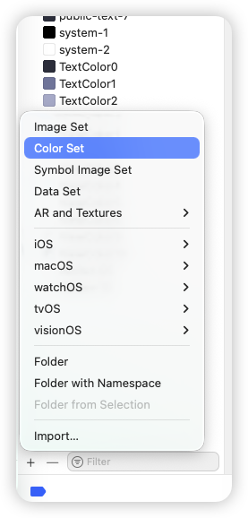
    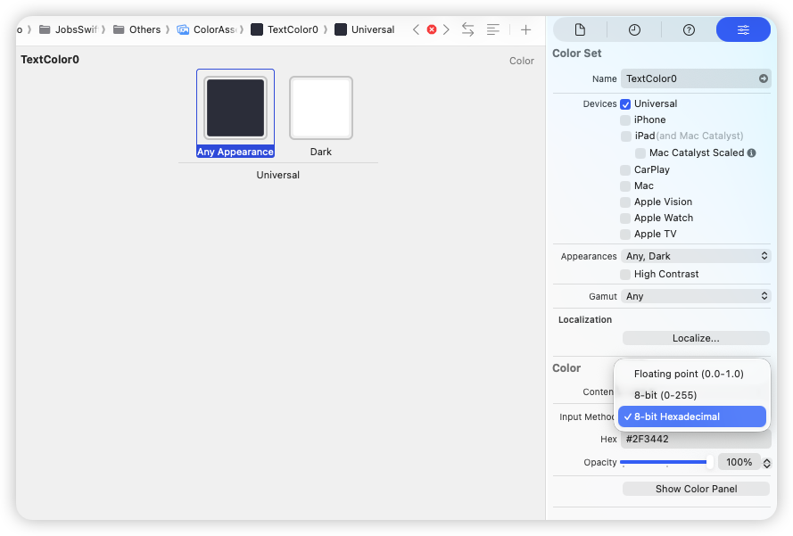
  </p>

* 支持暗黑模式

  > Dark优先级高一些，如果在Dark里面没有找到对应的图片，会去Any找
  >
  > ```swift
  > self.nameLabel.textColor = .textColor1// 代码里面只对应一个值。但是在textColor1这个资源包里面区分 白天/黑夜
  > ```

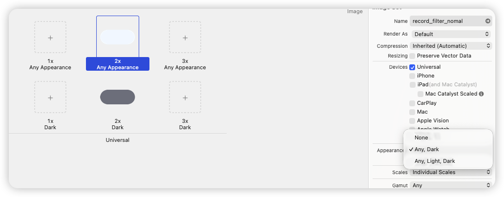

### 7、网络鉴权`Code`的封装 <a href="#前言" style="font-size:17px; color:green;"><b>🔼</b></a> <a href="#🔚" style="font-size:17px; color:green;"><b>🔽</b></a>

> - `r0.code` 是 `Int?`
>
> - `JXAuthCode.tokenEmpty` 是一个 **枚举值 (`JXAuthCode`)**
>
> - [**Swift**](https://developer.apple.com/swift/) 不允许直接比较 `Int` 和 `JXAuthCode`。
>
>   ```swift
>   if r0.code == JXAuthCode.tokenEmpty.rawValue
>       || r0.code == JXAuthCode.tokenInvalid.rawValue
>       || r0.code == JXAuthCode.loginExpired.rawValue
>       || r0.code == JXAuthCode.authorizationFail.rawValue {
>       print("需要重新登录")
>   }
>   ```

* 定义封装

  ```swift
  // MARK: -网络鉴权
  public enum JXAuthCode: UInt {
      case tokenEmpty        = 10006  // 令牌为空
      case tokenInvalid      = 10007  // 令牌错误
      case loginExpired      = 10008  // 登陆过期
      case authorizationFail = 10014  // 授权失败
      case success           = 10000  // 成功
  }
  ```

  ```swift
  // MARK: - 扩展 Int 与 JXAuthCode 的比较。避免写rawValue
  public func ==(lhs: Int?, rhs: JXAuthCode) -> Bool {
      guard let lhs = lhs else { return false }
      return lhs == Int(rhs.rawValue)
  }
  
  public func ==(lhs: Int, rhs: JXAuthCode) -> Bool {
      return lhs == Int(rhs.rawValue)
  }
  
  public func ==(lhs: JXAuthCode, rhs: Int?) -> Bool {
      guard let rhs = rhs else { return false }
      return Int(lhs.rawValue) == rhs
  }
  
  public func ==(lhs: JXAuthCode, rhs: Int) -> Bool {
      return Int(lhs.rawValue) == rhs
  }
  
  // MARK: - 扩展 Int 与 JXAuthCode 的不等于
  public func !=(lhs: Int?, rhs: JXAuthCode) -> Bool {
      !(lhs == rhs)
  }
  
  public func !=(lhs: Int, rhs: JXAuthCode) -> Bool {
      !(lhs == rhs)
  }
  
  public func !=(lhs: JXAuthCode, rhs: Int?) -> Bool {
      !(lhs == rhs)
  }
  
  public func !=(lhs: JXAuthCode, rhs: Int) -> Bool {
      !(lhs == rhs)
  }
  ```

* 使用

  ```swift
  if (r0.code == JXAuthCode.tokenEmpty // 令牌为空
   || r0.code == 10007 // 令牌错误
   || r0.code == 10008 // 登陆过期
   || r0.code == 10056
   || r0.code == 10014)// 授权失败
  {/*TODO*/}
  ```


### 8、富文本的封装使用 <a href="#前言" style="font-size:17px; color:green;"><b>🔼</b></a> <a href="#🔚" style="font-size:17px; color:green;"><b>🔽</b></a>

#### 8.1、设置富文本 <a href="#前言" style="font-size:17px; color:green;"><b>🔼</b></a> <a href="#🔚" style="font-size:17px; color:green;"><b>🔽</b></a>

* ```swift
  UILabel().richTextBy(runs, paragraphStyle: ps)
  ```

* ```swift
  UITextView().richTextBy(runs, paragraphStyle: ps)
  ```

* ```swift
  UITextField().richTextBy(runs, paragraphStyle: ps)
  ```

#### 8.2、富文本形式 <a href="#前言" style="font-size:17px; color:green;"><b>🔼</b></a> <a href="#🔚" style="font-size:17px; color:green;"><b>🔽</b></a>

* 下划线

  ```swift
  // 段落样式
  let ps = jobsMakeParagraphStyle {
      $0.alignment = .center
      $0.lineSpacing = 6
  }
  // 富文本配置数组
  let runs: [JobsRichRun] = [
      JobsRichRun(.text("欢迎使用 "))
          .font(.systemFont(ofSize: 18))
          .color(.secondaryLabel),
  
      JobsRichRun(.text("JobsRichText "))
          .font(.boldSystemFont(ofSize: 18))
          .color(.systemBlue)
          .underline(.single, color: .systemBlue),
  
      JobsRichRun(.text("封装示例"))
          .font(.systemFont(ofSize: 18))
          .strike(.single, color: .systemRed)
  ]
  ```

* 超链接

  ```swift
  let ps = jobsMakeParagraphStyle {
      $0.alignment = .center
      $0.lineSpacing = 4
  }
  
  let runs: [JobsRichRun] = [
      JobsRichRun(.text("如需帮助，请联系 "))
          .font(.systemFont(ofSize: 15))
          .color(.secondaryLabel),
  
      JobsRichRun(.text("专属客服"))
          .font(.systemFont(ofSize: 15))
          .color(.systemBlue)
          .link("click://customer")
  ]
  ```

  > <font color=red>**富文本的点击事件处理**</font>
  >
  > * 利用 **`UITextViewDelegate`** 处理点击事件
  >
  >   ```swift
  >   extension RichTextDemoVC: UITextViewDelegate {
  >       // MARK: ✅ iOS17+ 新 API
  >       @available(iOS 17.0, *)
  >       func textView(_ textView: UITextView,
  >                     textItemMenuConfiguration configuration: UITextItem.MenuConfiguration,
  >                     for textRange: UITextRange,
  >                     point: CGPoint) -> UITextItem.MenuConfiguration? {
  >           // 可自定义菜单行为（复制/打开/分享）
  >           return configuration
  >       }
  >   
  >       @available(iOS 17.0, *)
  >       func textView(_ textView: UITextView,
  >                     primaryActionFor textItem: UITextItem) -> UIAction? {
  >   
  >           switch textItem.content {
  >           case .link(let url):
  >               if url.scheme == "click" {
  >                   print("点击事件")
  >                   // 返回 nil 表示不执行系统默认行为
  >                   return nil
  >               }
  >               return nil
  >   
  >           default:
  >               // 非 link 类型的内容，保持默认
  >               return nil
  >           }
  >       }
  >       // MARK: ✅ iOS16 及以下旧 API
  >       @available(iOS, introduced: 10.0, deprecated: 17.0, message: "Use textView(_:primaryActionFor:) on iOS17+ instead")
  >       func textView(_ textView: UITextView,
  >                     shouldInteractWith URL: URL,
  >                     in characterRange: NSRange,
  >                     interaction: UITextItemInteraction) -> Bool {
  >           if URL.scheme == "click" {
  >               print("点击事件")
  >               return false
  >           }
  >           return true
  >       }
  >   }
  >   ```
  >
  > * 利用 [**RxSwift**](https://github.com/ReactiveX/RxSwift)/[**RxCocoa**](https://github.com/ReactiveX/RxSwift) 处理点击事件
  >
  >   ```swift
  >   // 🔹订阅点击（RAC风格）
  >   textView.linkTap
  >           .observe(on: MainScheduler.instance)
  >           .subscribe(onNext: { [weak self] url in
  >               guard let self else { return }
  >               if url.scheme == "click" {
  >                   self.presentAlert(for: url.absoluteString)
  >               }
  >           })
  >           .disposed(by: disposeBag)
  >   ```

* 富文本@图

  ```swift
  // 图标附件
  let config = UIImage.SymbolConfiguration(pointSize: 16, weight: .medium)
  let image = UIImage(systemName: "paperclip", withConfiguration: config)!
  let att = NSTextAttachment()
  att.image = image
  
  let ps = jobsMakeParagraphStyle {
      $0.alignment = .center
      $0.lineSpacing = 2
  }
  
  let runs: [JobsRichRun] = [
      JobsRichRun(.attachment(att, CGSize(width: 16, height: 16))),
      JobsRichRun(.text("  附件说明"))
          .font(.systemFont(ofSize: 15))
          .color(.secondaryLabel)
  ]
  ```

### 9、<font id=弱引用的等价写法>**弱引用的等价写法**</font> <a href="#前言" style="font-size:17px; color:green;"><b>🔼</b></a> <a href="#🔚" style="font-size:17px; color:green;"><b>🔽</b></a>

* ```swift
  guard let `self` = self else { return }
  ```

  * 传统写法，[用了反引号 ``self``，把关键字 <font color=red>**`self`**</font> 当作常量名，避开关键字冲突](#swift关键字用作变量名) 

  * 实际意义：

    ```swift
    if let tmp = self {
        let `self` = tmp   // 临时强引用
    } else {
        return
    }
    ```

  * 后续用的就是新的强引用 `self`

* ```swift
  someAsync { [weak self] in
      self?.doSomething()// 每次都要写 ?，如果要调用多行逻辑就会很啰嗦。
  }
  ```

* ```swift
  guard let self else { return }
  ```

  * [**Swift**](https://developer.apple.com/swift/) 5.7+ 简写写法，更简洁

  * 相当于

    ```swift
    guard let self = self else { return }
    ```

  * 编译器自动把右边的 `self` 当作可选（`Self?`），左边的 `self` 当作新的解包常量。

* ```swift
  guard let strongSelf = self else { return }
  ```

  * 兼容**Objc**的代码风格
  * 命名不同，读起来更直观，避免关键字混淆
  * 后续用`strongSelf`

* 模式匹配

  ```swift
  someAsync { [weak self] in
      guard case let self? = self else { return }
      self.doSomething()
  }
  ```

* 更函数式

  > 可读性差，不常见。

  ```swift
  someAsync { [weak self] in
      self.map { $0.doSomething() }// 这里 self 是 Optional，用 map 只在有值时执行。
  }
  ```

### 10、对通知名的封装 <a href="#前言" style="font-size:17px; color:green;"><b>🔼</b></a> <a href="#🔚" style="font-size:17px; color:green;"><b>🔽</b></a>

* ```swift
  import Foundation
  /// 通知分类
  extension Notification.Name {
      /// 用户登陆
      static let userDidLogin = Notification.Name("userDidLogin")
      /// 跳转在线客服通知
      static let pushOnlineCustomerService = Notification.Name("pushOnlineCustomerService")
  }
  ```

  > ```swift
  > Notification.Name.userDidLogin
  > NotificationCenter.default.post(name: .userDidLogin, object: nil)
  > ```

* ```swift
  import Foundation
  /// 通知分类
  extension Notification {
      struct Jobs {
      /// 用户登陆
      static let userDidLogin = Notification.Name("userDidLogin")
      /// 跳转在线客服通知
      static let pushOnlineCustomerService = Notification.Name("pushOnlineCustomerService")
      }
  }
  ```

  > ```swift
  > Notification.Jobs.userDidLogin
  > NotificationCenter.default.post(name: .userDidLogin, object: nil)
  > ```

### 11、<font id=回调主线程>回调主线程（2大手段）</font><a href="#前言" style="font-size:17px; color:green;"><b>🔼</b></a> <a href="#🔚" style="font-size:17px; color:green;"><b>🔽</b></a>

> 若调用点本身在主线程：**立即**执行（不延迟）。若调用点不在主线程/不在主 Actor：需要一次**actor hop**，通常要求 `await` 才能调用。
>
> ```swift
> /// 这个函数必须在主线程运行
> /// 主线程隔离的声明
> @MainActor
> func updateUI() {
>     // UI 更新
> }
> ```

#### 11.1、**C.GCD系列**@传统轻量 <a href="#前言" style="font-size:17px; color:green;"><b>🔼</b></a> <a href="#🔚" style="font-size:17px; color:green;"><b>🔽</b></a>

> 1️⃣ **GCD 的底层实现** → 在 **`libdispatch`** 里（C 语言库），属于 **Darwin** 系统的一部分
>
> 2️⃣ **在 iOS / macOS 上** → GCD 是 **系统级 API**，不是 `Foundation` 提供的
>
> 3️⃣ **[Swift](https://developer.apple.com/swift/) 里使用 `DispatchQueue`** → 其实是 Apple 在 `Dispatch` 模块里给 GCD 做的 [**Swift**](https://developer.apple.com/swift/) 封装
>
> 4️⃣ 底层调度框架，性能好、粒度细，API 偏底层
>
> 5️⃣ 特点：**只管时机与排队**，不提供并发隔离

* ```swift
  /// 强制下一帧（哪怕当前已在主线程，也要等一等）：
  // ⚠️ 别在主线程用 main.sync，会死锁
  DispatchQueue.main.async {
      // UI 更新
  }
  ```

  * ⚠️ 别在主线程用 **`main.sync`**，会死锁🔒

    ```swift
    ❌ 错误示例1
    final class DeadlockVC: UIViewController {
        override func viewDidLoad() {
            super.viewDidLoad()
            // 🚨 当前就在主线程执行
            DispatchQueue.main.sync {
                // 这个 block 会排到主队列，但调用方“同步等待”它完成
                // 主队列又被当前这行代码占着 -> 永远轮不到执行 -> 死锁卡死
                self.view.backgroundColor = .systemRed
            }
        }
    }
    ❌ 错误示例2
    @IBAction func onTap(_ sender: UIButton) {
        print("A")
        // 🚨 UI 事件回调在主线程
        DispatchQueue.main.sync {
            print("B") // 永远到不了这里 -> 死锁
        }
        print("C")
    }
    ```

* **`Foundation`.OperationQueue**

  > 高层封装（基于**Objc**/[**Swift**](https://developer.apple.com/swift/)），内部默认还是用 **GCD** 调度

  ```swift
  /// 封装在 GCD 之上，多了依赖/取消/QoS/暂停
  OperationQueue.main.addOperation {
      // UI 更新
  }
  ```

* 遗留 API

  ```swift
  performSelector(onMainThread:)
  ```

#### 11.2、**[Swift](https://developer.apple.com/swift/).Concurrency.MainActor（执行器层）**@<font color=red>**现代推荐方式**</font> <a href="#前言" style="font-size:17px; color:green;"><b>🔼</b></a> <a href="#🔚" style="font-size:17px; color:green;"><b>🔽</b></a>

* 立刻切主线程并等结果

  ```swift
  let value = await MainActor.run { /* UI 读写 */ }
  ```

* 异步，下一轮再跑

  * ```swift
    Task {
        await updateUI()
    }
    ```

  * ```swift
    Task { @MainActor in
        /// UI 更新
    }
    ```

### 12、`Block/闭包` 的安全调用 <a href="#前言" style="font-size:17px; color:green;"><b>🔼</b></a> <a href="#🔚" style="font-size:17px; color:green;"><b>🔽</b></a>

> 以下为等价调用

* **Objc**

  ```objective-c
  if (success) {
      success(YES);
  }
  ```

* [**Swift**](https://developer.apple.com/swift/)

  * ```swift
    if let success = success {
        success(true)
    }
    ```

  * ```swift
    success?(true)
    ```

### 13、Then（自定义/使用）<a href="#前言" style="font-size:17px; color:green;"><b>🔼</b></a> <a href="#🔚" style="font-size:17px; color:green;"><b>🔽</b></a>

* 定义

  ```swift
  // MARK: - 少量便捷 then（可选）
  public protocol Then {}
  extension Then where Self: AnyObject {
      @discardableResult
      func then(_ block: (Self) -> Void) -> Self {
          block(self); return self
      }
  }
  extension NSObject: Then {}
  ```

* 使用

  ```swift
  let label = UILabel().then {
      $0.text = "Hello"
      $0.textColor = .red
      $0.textAlignment = .center
  }
  ```

### 14、对[**SnapKit**](https://github.com/SnapKit/SnapKit)的封装使用 <a href="#前言" style="font-size:17px; color:green;"><b>🔼</b></a> <a href="#🔚" style="font-size:17px; color:green;"><b>🔽</b></a>

* 集成

  ```ruby
  pod 'SnapKit'
  ```

* 使用

  ```swift
  import SnapKit
  
  private lazy var view: UIView = {
      UIView().byAddTo(subView) { [unowned self] make in
              make.top.equalTo(self.view.safeAreaLayoutGuide.snp.top).offset(40)
              make.left.right.equalToSuperview().inset(24)
              make.height.equalTo(44)
          }   
  }()
  ```

### 15、🧭 自定义导航栏 <a href="#前言" style="font-size:17px; color:green;"><b>🔼</b></a> <a href="#🔚" style="font-size:17px; color:green;"><b>🔽</b></a>

#### 15.1、[**基于控制器层的自定义导航栏@GKNavigationBarSwift**](https://github.com/QuintGao/GKNavigationBarSwift)的二次封装和使用 <a href="#前言" style="font-size:17px; color:green;"><b>🔼</b></a> <a href="#🔚" style="font-size:17px; color:green;"><b>🔽</b></a>

* 集成

  ```ruby
  pod 'GKNavigationBarSwift'
  ```

* 使用

  ```swift
  import GKNavigationBarSwift
  
  override func viewDidLoad() {
      super.viewDidLoad()
          jobsSetupGKNav(
              title: "Demo 列表",
              leftButton:UIButton.sys()
                  .byFrame(CGRect(x: 0, y: 0, width: 32.w, height: 32.h))
                  /// 按钮图片@图文关系
                  .byImage(UIImage(systemName: "list.bullet"), for: .normal)
                  .byImage(UIImage(systemName: "list.bullet"), for: .selected)
                  /// 事件触发@点按
                  .onTap { [weak self] sender in
                      guard let self else { return }
                      sender.isSelected.toggle()
                      debugOnly {  // 仅 Debug 执行
                          JobsToast.show(
                              text: "点按了列表按钮",
                              config: JobsToast.Config()
                                  .byBgColor(.systemGreen.withAlphaComponent(0.9))
                                  .byCornerRadius(12)
                          )
                      }
                  }
                  /// 事件触发@长按
                  .onLongPress(minimumPressDuration: 0.8) { btn, gr in
                       if gr.state == .began {
                           btn.alpha = 0.6
                           print("长按开始 on \(btn)")
                       } else if gr.state == .ended || gr.state == .cancelled {
                           btn.alpha = 1.0
                           print("长按结束")
                       }
                  },
              rightButtons: [
                  UIButton.sys()
                      /// 按钮图片@图文关系
                      .byImage(UIImage(systemName: "moon.circle.fill"), for: .normal)
                      .byImage(UIImage(systemName: "moon.circle.fill"), for: .selected)
                      /// 事件触发@点按
                      .onTap { [weak self] sender in
                          guard let self else { return }
                          sender.isSelected.toggle()
                          print("🌓 主题已切换 -> \(win.overrideUserInterfaceStyle == .dark ? "Dark" : "Light")")
                      },
                  UIButton.sys()
                      /// 按钮图片@图文关系
                      .byImage(UIImage(systemName: "globe"), for: .normal)
                      .byImage(UIImage(systemName: "globe"), for: .selected)
                      /// 事件触发@点按
                      .onTap { [weak self] sender in
                          guard let self else { return }
                          sender.isSelected.toggle()
                          print("🌐 切换语言 tapped（占位）")
                      },
                  UIButton.sys()
                      /// 按钮图片@图文关系
                      .byImage(UIImage(systemName: "stop.circle.fill"), for: .normal)
                      .byImage(UIImage(systemName: "stop.circle.fill"), for: .selected)
                      /// 事件触发@点按
                      .onTap { [weak self] sender in
                          guard let self else { return }
                          sender.isSelected.toggle()
                          print("🛑 手动停止刷新")
                      }
              ]
          )
  }
  ```

#### 15.2、基于视图层的自定义导航栏 <a href="#前言" style="font-size:17px; color:green;"><b>🔼</b></a> <a href="#🔚" style="font-size:17px; color:green;"><b>🔽</b></a>

```swift
// 🔽 一键开导航栏（默认标题=webView.title，默认有返回键）
UIView().byNavBarEnabled(true)
    .byNavBarStyle { s in
        s.byHairlineHidden(false)
            .byBackgroundColor(.systemBackground)
            .byTitleAlignmentCenter(true)
    }
    // 自定义返回键（想隐藏就：.byNavBarBackButtonProvider { nil }）
    .byNavBarBackButtonProvider {
        UIButton(type: .system)
            .byBackgroundColor(.clear)
            .byImage(UIImage(systemName: "chevron.left"), for: .normal)
            .byTitle("返回", for: .normal)
            .byTitleFont(.systemFont(ofSize: 16, weight: .medium))
            .byTitleColor(.label, for: .normal)
            .byContentEdgeInsets(.init(top: 6, left: 10, bottom: 6, right: 10))
            .byTapSound("Sound.wav")
    }
    // 返回行为：优先后退，否则 pop
    .byNavBarOnBack { [weak self] in
        guard let self else { return }
        closeByResult("") /// 系统的通用返回
    }
    .byAddTo(view) { [unowned self] make in
        if view.jobs_hasVisibleTopBar() {
            make.top.equalTo(self.gk_navigationBar.snp.bottom).offset(10) // 若你确信此时已存在，才去取
            make.left.right.bottom.equalToSuperview()
        } else {
            make.edges.equalToSuperview()
        }
    }
```

### 16、获取高频系统关键量 <a href="#前言" style="font-size:17px; color:green;"><b>🔼</b></a> <a href="#🔚" style="font-size:17px; color:green;"><b>🔽</b></a>

* `jobsNearestVC` 👉 从任意 **UIResponder**（View / VC）向上找到最近的宿主 VC；若全程找不到则兜底到 **`keyWindow`** 的 **root**

* `UIApplication.jobsKeyWindow()?` 👉 统一的 **KeyWindow** 获取（**支持 iOS 13 多场景；老系统兜底**）

* ` UIApplication.jobsTopMostVC()` 👉（递归解析）获取当前“最顶层可见”的 **UIViewController**
* `UIResponder.jobsCurrentFirstResponder()` 👉 定位当前第一响应者

### 17、<font color=red>推页面@带参数</font>（`push`/`present`）<a href="#前言" style="font-size:17px; color:green;"><b>🔼</b></a> <a href="#🔚" style="font-size:17px; color:green;"><b>🔽</b></a>

> 1️⃣ 封装在`UIResponder`层，能全覆盖：**任意控制器**和**任意视图**
>
> 2️⃣ 设计只有一个入参，当多参数的时候，建议封装成一个模型，进行整体传入，方便管理
>
> 3️⃣ 这个参数可以是：字符串、基本数据类型、自定义模型（类/结构体）、字典、数组
>
> 4️⃣ <font color=red>**框架内部防止了多次点击造成的多次推出页面的问题**</font>
>
> ```swift
> .byData(DemoModel(id: 7, title: "详情"))// 自定义模型类 DemoModel（类/结构体）
> .byData(["id": 7, "title": "详情", "price": 9.9])// 字典
> .byData(["大树","小草","太阳"])// 数组
> .byData("Jobs")// 字符串
> .byData(3.14)// 基本数据类型
> ```

* 强行`push`页面进行展示。发起者可以是：任意控制器（**即便这个控制器目前是不具备导航控制器的**）、任意视图

  ```swift
  DemoDetailVC()
      .byData(Data)
      .onResult { id in
          print("回来了 id=\(id)")
      }
      .byPush(self)           // 自带防重入，连点不重复
      .byCompletion{
          print("结束")
      }
  ```

* 强行`present`页面进行展示。发起者可以是：任意控制器（**即便这个控制器目前是不具备导航控制器的**）、任意视图

  * 系统默认高度

    ```swift
    DemoDetailVC()
        .byData(Data)
        .onResult { name in
            print("回来了 \(name)")
        }
        .byPresent(self)           // 自带防重入，连点不重复
        .byCompletion{
            print("结束")
        }
    ```
  
  * 自定义`present`的页面高度
  
    ```swift
    HalfSheetDemoVC()
        .byModalPresentationStyle(.custom)
        .byTransitioningDelegate(self)
        .byData(Data)
        .onResult { id in
            print("回来了 \(id)")
        }
        .byPresent(self)           // 自带防重入，连点不重复
        .byCompletion{
            print("结束")
        }
    ```

### 18、<font id=字符串加载图片资源>依据<font color=red>**字符串**</font>加载图片资源</font>（本地/网络）<a href="#前言" style="font-size:17px; color:green;"><b>🔼</b></a> <a href="#🔚" style="font-size:17px; color:green;"><b>🔽</b></a>

#### 18.1、取本地图片 <a href="#前言" style="font-size:17px; color:green;"><b>🔼</b></a> <a href="#🔚" style="font-size:17px; color:green;"><b>🔽</b></a>

```swift
/// 本地图像名（在 Assets 中放一张叫 "Ani" 的图）
localImageView.image = "Ani".img
```

#### 18.2、取网络图片@[**Kingfisher**](https://github.com/onevcat/Kingfisher) <a href="#前言" style="font-size:17px; color:green;"><b>🔼</b></a> <a href="#🔚" style="font-size:17px; color:green;"><b>🔽</b></a>

> ```ruby
> pod 'Kingfisher'                         # https://github.com/onevcat/Kingfisher             ❤️ Swift平台上的SDWebImage平替
> ```
>
> ```swift
> import Kingfisherx
> ```

* 直接取，不处理失败兜底

  ```swift
  /// UIImageView字符串网络图@Kingfisher
  private lazy var asyncImgView: UIImageView = {
      let imageView = UIImageView()
          .byContentMode(.scaleAspectFill)
          .byClipsToBounds()
          .byAddTo(scrollView) { [unowned self] make in
              make.top.equalTo(localImgView.snp.bottom).offset(20)
              make.left.equalTo(scrollView.frameLayoutGuide.snp.left).offset(20)
              make.right.equalTo(scrollView.frameLayoutGuide.snp.right).inset(20)
              make.height.equalTo(180)
          }
      Task {
          do {
              imageView.byImage(try await "https://picsum.photos/200/300".kfLoadImage())
              print("✅ 加载成功 (KF async)")
          } catch {
              print("❌ 加载失败 (KF async)：\(error)")
          }
      }
      return imageView
  }()
  ```

* 失败兜底处理

  ```swift
  /// UIImageView网络图（失败兜底图）@Kingfisher
  private lazy var wrapperImgView: UIImageView = {
      UIImageView()
          .byContentMode(.scaleAspectFill)
          .byClipsToBounds()
          .kf_setImage(from: "https://picsum.photos/200", placeholder: "Ani".img)
          .byAddTo(scrollView) { [unowned self] make in
              make.top.equalTo(asyncImgViewSD.snp.bottom).offset(20)
              make.left.equalTo(scrollView.frameLayoutGuide.snp.left).offset(20)
              make.right.equalTo(scrollView.frameLayoutGuide.snp.right).inset(20)
              make.height.equalTo(180)
          }
  }()
  ```

#### 18.3、取网络图片@[**SDWebImage**](https://github.com/SDWebImage/SDWebImage) <a href="#前言" style="font-size:17px; color:green;"><b>🔼</b></a> <a href="#🔚" style="font-size:17px; color:green;"><b>🔽</b></a>

>```ruby
>pod 'SDWebImage'                         # https://github.com/SDWebImage/SDWebImage          ❤️
>```
>
>```swift
>import SDWebImage
>```

* 直接取，不处理失败兜底

  ```swift
  /// UIImageView字符串网络图@SDWebImage
  private lazy var asyncImgViewSD: UIImageView = {
      let imageView = UIImageView()
          .byContentMode(.scaleAspectFill)
          .byClipsToBounds()
          .byAddTo(scrollView) { [unowned self] make in
              make.top.equalTo(asyncImgView.snp.bottom).offset(20)
              make.left.equalTo(scrollView.frameLayoutGuide.snp.left).offset(20)
              make.right.equalTo(scrollView.frameLayoutGuide.snp.right).inset(20)
              make.height.equalTo(180)
          }
      Task {
          do {
              imageView.byImage(try await "https://picsum.photos/400/300".sdLoadImage())
              print("✅ 加载成功 (SD async)")
          } catch {
              print("❌ 加载失败 (SD async)：\(error)")
          }
      }
      return imageView
  }()
  ```

* 失败兜底处理

  ```swift
  /// UIImageView网络图（失败兜底图）@SDWebImage
  private lazy var wrapperImgViewSD: UIImageView = {
      UIImageView()
          .byContentMode(.scaleAspectFill)
          .byClipsToBounds()
          .sd_setImage(from: "https://picsum.photos/200", placeholder: "Ani".img)
          .byAddTo(scrollView) { [unowned self] make in
              make.top.equalTo(wrapperImgView.snp.bottom).offset(20)
              make.left.equalTo(scrollView.frameLayoutGuide.snp.left).offset(20)
              make.right.equalTo(scrollView.frameLayoutGuide.snp.right).inset(20)
              make.height.equalTo(180)
          }
  }()
  ```

### 19、点击事件的封装 <a href="#前言" style="font-size:17px; color:green;"><b>🔼</b></a> <a href="#🔚" style="font-size:17px; color:green;"><b>🔽</b></a>

#### 19.1、封装在`UIControl` 层的点击事件 <a href="#前言" style="font-size:17px; color:green;"><b>🔼</b></a> <a href="#🔚" style="font-size:17px; color:green;"><b>🔽</b></a>

* ```swift
  private lazy var toggle: UISwitch = {
      UISwitch()
          .onJobsChange { (sw: UISwitch) in
              print("开关状态：\(sw.isOn)")
          }
  }()
  ```
  
* ```swift
  private lazy var datePicker: UIDatePicker = {
      UIDatePicker()
          .byDatePickerMode(.date)
          .onJobsChange { (picker: UIDatePicker) in
              print("选择日期：\(picker.date)")
          }
  }()
  ```
  
* ```swift
  private lazy var slider: UISlider = {
      UISlider()
          .onJobsChange { (slider: UISlider) in
              print("滑块值：\(slider.value)")
          }
  }()
  ```
  
* ```swift
  private lazy var textField: UITextField = {
      UITextField()
          .onJobsEvent(.editingChanged) { (tf: UITextField) in
              print("文字变化：\(tf.text ?? "")")
          }
  }()
  ```
  
* ```swift
  private lazy var kindSeg: UISegmentedControl = {
      UISegmentedControl(items: ["Foundation", "GCD", "DisplayLink", "RunLoopCore"])
          .bySelectedSegmentIndex(0)
          .byAddTo(view) { [unowned self] make in
              make.top.equalTo(self.view.safeAreaLayoutGuide.snp.top).offset(16)
              make.left.right.equalToSuperview().inset(16)
              make.height.equalTo(34)
          }
          .onJobsChange { [weak self] (_: UISegmentedControl) in
              self?.onKindChanged()
          }
  }()
  ```

#### 19.2、[**封装在`UIButton` 层的点击事件**](#UIButton) <a href="#前言" style="font-size:17px; color:green;"><b>🔼</b></a> <a href="#🔚" style="font-size:17px; color:green;"><b>🔽</b></a>

```swift
let button = UIButton(type: .system)
    .byTitle("提交")
    .onTap { btn in
        print("✅ 使用 UIButton 专属 UIAction 实现")
    }
```

### 20、🌡️ 启动检测 <a href="#前言" style="font-size:17px; color:green;"><b>🔼</b></a> <a href="#🔚" style="font-size:17px; color:green;"><b>🔽</b></a>

```swift
AppLaunchManager.handleLaunch(
    firstInstall: {
        log("🚀 新用户引导 / 初始化配置")
    },
    firstToday: {
        log("☀️ 每日签到弹窗 / 刷新缓存")
    },
    normal: {
        log("➡️ 正常启动 / 常规逻辑")
    }
)
```

### 21、🍡 字符串 <a href="#前言" style="font-size:17px; color:green;"><b>🔼</b></a> <a href="#🔚" style="font-size:17px; color:green;"><b>🔽</b></a>

#### 21.1、🍡 通用格式的转换  <a href="#前言" style="font-size:17px; color:green;"><b>🔼</b></a> <a href="#🔚" style="font-size:17px; color:green;"><b>🔽</b></a>

* **`String`** → **`Int`**

  ```swift
  "123".toInt()   
  // ✅ 输出：123
  // 📘 说明：将字符串转为 Int，如果包含非数字字符则返回 nil
  ```

* **`String`** → **`Int64`**

  ```swift
  "9876543210".toInt64()   
  // ✅ 输出：9876543210
  // 📘 说明：适用于超出 Int 范围的大整数
  ```

* **`String`** → **`Double`**

  ```swift
  "3.14159".toDouble()   
  // ✅ 输出：3.14159
  // 📘 说明：支持小数点与千分位（如 "1,234.56" → 1234.56）
  ```

* **`String`** → **`Double`**（带精度控制）

  ```swift
  "3.1".toDouble(2, 2)   
  // ✅ 输出：3.10
  // 📘 说明：限制最多 2 位小数，最少也显示 2 位（自动补零）
  ```

* **`String`** → **`Float`**

  ```swift
  "123.45".toFloat()   
  // ✅ 输出：123.45
  // 📘 说明：浮点数版本（精度略低于 Double）

* **`String`** → **`Bool`**

  ```swift
  "true".toBool()     // ✅ true
  "False".toBool()    // ✅ false
  "YES".toBool()      // ✅ true
  "no".toBool()       // ✅ false
  "1".toBool()        // ✅ true
  "0".toBool()        // ✅ false
  "maybe".toBool()    // ❌ nil（无法识别）
  // 📘 说明：大小写不敏感
  ```

* **`String`** → **`NSString`**

  ```swift
  "你好".toNSString   
  // ✅ 输出：NSString("你好")
  // 📘 说明：Swift String 转 Foundation NSString
  ```

* <font color=red>**`String`** → **`NSAttributedString`**</font>

  ```swift
  "Hello".rich   
  // ✅ 输出：NSAttributedString("Hello")
  // 📘 说明：将普通字符串转为富文本（无样式）
  ```

* <font color=red>**`String`** → **`NSAttributedString`**</font> 带属性

  ```swift
  "红色加粗".rich([
      .foregroundColor: UIColor.red,
      .font: UIFont.boldSystemFont(ofSize: 18)
  ])
  // ✅ 输出：红色加粗（富文本样式）
  // 📘 说明：附加字体与颜色属性
  ```

#### 21.2、🍡 [**字符串加载图片资源**](#字符串加载图片资源) <a href="#前言" style="font-size:17px; color:green;"><b>🔼</b></a> <a href="#🔚" style="font-size:17px; color:green;"><b>🔽</b></a>

#### 21.3、🍡 字符串打开 <a href="#前言" style="font-size:17px; color:green;"><b>🔼</b></a> <a href="#🔚" style="font-size:17px; color:green;"><b>🔽</b></a>

* 打开网站 / **`Scheme`**（带参）

  ```swift
  "www.baidu.com".open()
  "https://example.com/search?q=中文 关键词".open()
  ```

* 打电话（仅支持真机）

  ```swift
  "13434343434".call()
  ```

* 发邮件（带参）

  ```swift
  "test@qq.com".mail()
  ```

  ```swift
  "ops@company.com".mail(
      subject: "反馈",
      body: "你好，遇到一个问题..."
  )
  ```

  ```swift
  "a@b.com,c@d.com".mail(
      subject: "日报",
      body: "<b>今天完成：</b><br/>1. xxx<br/>2. yyy",
      isHTML: true,
      cc: ["pm@company.com"],
      bcc: ["boss@company.com"]
  ) { result in
      print("mail result = \(result)")
  }
  ```

### 22、⏰ 计时器（按钮）的封装 <a href="#前言" style="font-size:17px; color:green;"><b>🔼</b></a> <a href="#🔚" style="font-size:17px; color:green;"><b>🔽</b></a>

> 1️⃣ 将 iOS系统内置的4大基本计时器（`NSTimer`/`GCD`/`DisplayLink`/`RunLoop`）以协议的方式进行统一封装：开始、暂停、重启、停止、销毁
>
> 2️⃣ 按钮当前的状态 **`TimerState`** 置于按钮内部（外界依据按钮当前状态来进行业务安排）
>
> 3️⃣ 正计时与倒计时的差异就在于是否传值**`total`**
>
> 4️⃣ 纯链式调用，代码块，方便调试

#### 22.1、⏰[（`NSTimer`/`GCD`/`DisplayLink`/`RunLoop`）统一协议方便调用](#定时器) <a href="#前言" style="font-size:17px; color:green;"><b>🔼</b></a> <a href="#🔚" style="font-size:17px; color:green;"><b>🔽</b></a>

```swift
public protocol JobsTimerProtocol: AnyObject {
    /// 当前是否运行中
    var isRunning: Bool { get }
    /// 启动计时器
    func start()
    /// 暂停计时器
    func pause()
    /// 恢复计时器
    func resume()
    /// 停止计时器（销毁@有回调）
    func fireOnce()
    /// 停止计时器（销毁@无回调）
    func stop()
    /// 注册回调（每 tick 执行一次）
    @discardableResult
    func onTick(_ block: @escaping () -> Void) -> Self
    /// 注册完成回调（用于一次性定时器或倒计时）
    @discardableResult
    func onFinish(_ block: @escaping () -> Void) -> Self
}
```

#### 22.2、使用 <a href="#前言" style="font-size:17px; color:green;"><b>🔼</b></a> <a href="#🔚" style="font-size:17px; color:green;"><b>🔽</b></a>

```swift
JobsTimerFactory.make(kind: .displayLink,
                      config: JobsTimerConfig(interval: 1, repeats: true, tolerance: 0.002, queue: .main)) {
    ///  日期打印
    print(Date().formatted(date: .numeric, time: .standard))
}.start()
```

#### 22.3、[计数按钮](#计数按钮) <a href="#前言" style="font-size:17px; color:green;"><b>🔼</b></a> <a href="#🔚" style="font-size:17px; color:green;"><b>🔽</b></a>

### 23、跑马灯+轮播图 <a href="#前言" style="font-size:17px; color:green;"><b>🔼</b></a> <a href="#🔚" style="font-size:17px; color:green;"><b>🔽</b></a>

* 跑马灯

  ```swift
  // MARK: - 1. 向上连续滚动
  private lazy var upContinuousMarquee: JobsMarqueeView = { [unowned self] in
      JobsMarqueeView()
          .byDirection(.up)
          .byScrollMode(.continuous(speed: 40))
          .byItemSizeMode(.fitContent)   // 典型公告跑马灯
          .byDataSourceButtons([
              UIButton.sys()
                  .byBackgroundColor(.systemYellow.withAlphaComponent(0.2), for: .normal)
                  .byTitle("向上连续 · 公告 1", for: .normal)
                  .byTitleColor(.label, for: .normal)
                  .byTitleFont(.systemFont(ofSize: 14, weight: .medium))
                  .bySubTitle("更多内容 1", for: .normal)
                  .bySubTitleColor(.secondaryLabel, for: .normal)
                  .bySubTitleFont(.systemFont(ofSize: 11, weight: .regular))
                  .byImage("megaphone.fill".sysImg, for: .normal)
                  .byContentEdgeInsets(UIEdgeInsets(top: 4, left: 8, bottom: 4, right: 8))
                  .byTitleEdgeInsets(UIEdgeInsets(top: 0, left: 6, bottom: 0, right: -6))
                  .byTapSound("Sound.wav")
                  .onTap { sender in
                      print("🔔 向上连续 · 公告 1 tapped, selected=\(sender.isSelected)")
                      toastBy(sender.title!)
                  }
                  .onLongPress(minimumPressDuration: 0.8) { btn, gr in
                      if gr.state == .began {
                          btn.alpha = 0.6
                          print("长按开始 on \(btn)")
                      } else if gr.state == .ended || gr.state == .cancelled {
                          btn.alpha = 1.0
                          print("长按结束")
                      }
                  },
              UIButton.sys()
                  .byBackgroundColor(.systemYellow.withAlphaComponent(0.2), for: .normal)
                  .byTitle("向上连续 · 公告 2", for: .normal)
                  .byTitleColor(.label, for: .normal)
                  .byTitleFont(.systemFont(ofSize: 14, weight: .medium))
                  .bySubTitle("更多内容 2", for: .normal)
                  .bySubTitleColor(.secondaryLabel, for: .normal)
                  .bySubTitleFont(.systemFont(ofSize: 11, weight: .regular))
                  .byImage("megaphone.fill".sysImg, for: .normal)
                  .byContentEdgeInsets(UIEdgeInsets(top: 4, left: 8, bottom: 4, right: 8))
                  .byTitleEdgeInsets(UIEdgeInsets(top: 0, left: 6, bottom: 0, right: -6))
                  .byTapSound("Sound.wav")
                  .onTap { sender in
                      print("🔔 向上连续 · 公告 2 tapped, selected=\(sender.isSelected)")
                      toastBy(sender.title!)
                  }
                  .onLongPress(minimumPressDuration: 0.8) { btn, gr in
                      if gr.state == .began {
                          btn.alpha = 0.6
                          print("长按开始 on \(btn)")
                      } else if gr.state == .ended || gr.state == .cancelled {
                          btn.alpha = 1.0
                          print("长按结束")
                      }
                  },
              UIButton.sys()
                  .byBackgroundColor(.systemYellow.withAlphaComponent(0.2), for: .normal)
                  .byTitle("向上连续 · 公告 3", for: .normal)
                  .byTitleColor(.label, for: .normal)
                  .byTitleFont(.systemFont(ofSize: 14, weight: .medium))
                  .bySubTitle("更多内容 3", for: .normal)
                  .bySubTitleColor(.secondaryLabel, for: .normal)
                  .bySubTitleFont(.systemFont(ofSize: 11, weight: .regular))
                  .byImage("megaphone.fill".sysImg, for: .normal)
                  .byContentEdgeInsets(UIEdgeInsets(top: 4, left: 8, bottom: 4, right: 8))
                  .byTitleEdgeInsets(UIEdgeInsets(top: 0, left: 6, bottom: 0, right: -6))
                  .byTapSound("Sound.wav")
                  .onTap { sender in
                      print("🔔 向上连续 · 公告 3 tapped, selected=\(sender.isSelected)")
                      toastBy(sender.title!)
                  }
                  .onLongPress(minimumPressDuration: 0.8) { btn, gr in
                      if gr.state == .began {
                          btn.alpha = 0.6
                          print("长按开始 on \(btn)")
                      } else if gr.state == .ended || gr.state == .cancelled {
                          btn.alpha = 1.0
                          print("长按结束")
                      }
                  }
          ])
          .byBgColor(.randomColor)
          .byAddTo(self.scrollView) { [unowned self] make in
              if #available(iOS 11.0, *) {
                  make.top.equalTo(self.scrollView.contentLayoutGuide.snp.top).offset(10)
                  make.left.equalTo(self.scrollView.frameLayoutGuide.snp.left).offset(self.horizontalInset)
                  make.right.equalTo(self.scrollView.frameLayoutGuide.snp.right).inset(self.horizontalInset)
              } else {
                  make.top.equalTo(self.scrollView.snp.top).offset(10)
                  make.left.equalTo(self.scrollView).offset(self.horizontalInset)
                  make.right.equalTo(self.scrollView).inset(self.horizontalInset)
              }
              make.height.equalTo(self.marqueeHeight)
          }
  }()
  ```

* 轮播图

  ```swift
  // MARK: - 13. Kingfisher@背景图
  private lazy var kingfisherImageButtonsMarquee: JobsMarqueeView = { [unowned self] in
      JobsMarqueeView()
          .byDirection(.left)
          .byScrollMode(.frequency(interval: 1.0))
          .byItemSizeMode(.fillBounds)
          .byDataSourceButtons ([
              UIButton.sys()
                  .byTitle("我是UIButton主标题@Kingfisher").byTitleColor(.red)
                  .bySubTitle("我是UIButton副标题@Kingfisher").bySubTitleColor(.yellow)
                  .kf_imageURL("https://picsum.photos/" + ScreenWidth().toString(0) + "/" + self.marqueeHeight.toString(0))
                  .kf_placeholderImage("唐老鸭".img)
                  .kf_options([
                      .processor(DownsamplingImageProcessor(size: CGSize(width: 500, height: 200))),
                      .scaleFactor(UIScreen.main.scale),
                      .cacheOriginalImage,
                      .transition(.fade(0.25)),
                      .retryStrategy(DelayRetryStrategy(maxRetryCount: 2, retryInterval: .seconds(1)))
                  ])
                  .kf_bgNormalLoad()// 之前是配置项，这里才是真正决定渲染背景图/前景图
                  .byTapSound("Sound.wav")
                  .onTap { sender in
                      print("🔴 Kingfisher@背景图 1 tapped, selected=\(sender.isSelected)")
                      toastBy("点击了Kingfisher@背景图")
                  }
                  .onLongPress(minimumPressDuration: 0.8) { btn, gr in
                      if gr.state == .began {
                          btn.alpha = 0.6
                          print("长按开始 on \(btn)")
                      } else if gr.state == .ended || gr.state == .cancelled {
                          btn.alpha = 1.0
                          print("长按结束")
                      }
                  },
              UIButton.sys()
                  .byTitle("我是UIButton主标题@Kingfisher").byTitleColor(.red)
                  .bySubTitle("我是UIButton副标题@Kingfisher").bySubTitleColor(.yellow)
                  .kf_imageURL("https://picsum.photos/" + ScreenWidth().toString(0) + "/" + self.marqueeHeight.toString(0))
                  .kf_placeholderImage("唐老鸭".img)
                  .kf_options([
                      .processor(DownsamplingImageProcessor(size: CGSize(width: 500, height: 200))),
                      .scaleFactor(UIScreen.main.scale),
                      .cacheOriginalImage,
                      .transition(.fade(0.25)),
                      .retryStrategy(DelayRetryStrategy(maxRetryCount: 2, retryInterval: .seconds(1)))
                  ])
                  .kf_bgNormalLoad()// 之前是配置项，这里才是真正决定渲染背景图/前景图
                  .byTapSound("Sound.wav")
                  .onTap { sender in
                      print("🔴 Kingfisher@背景图 2 tapped, selected=\(sender.isSelected)")
                      toastBy("点击了Kingfisher@背景图")
                  }
                  .onLongPress(minimumPressDuration: 0.8) { btn, gr in
                      if gr.state == .began {
                          btn.alpha = 0.6
                          print("长按开始 on \(btn)")
                      } else if gr.state == .ended || gr.state == .cancelled {
                          btn.alpha = 1.0
                          print("长按结束")
                      }
                  },
              UIButton.sys()
                  .byTitle("我是UIButton主标题@Kingfisher").byTitleColor(.red)
                  .bySubTitle("我是UIButton副标题@Kingfisher").bySubTitleColor(.yellow)
                  .kf_imageURL("https://picsum.photos/" + ScreenWidth().toString(0) + "/" + self.marqueeHeight.toString(0))
                  .kf_placeholderImage("唐老鸭".img)
                  .kf_options([
                      .processor(DownsamplingImageProcessor(size: CGSize(width: 500, height: 200))),
                      .scaleFactor(UIScreen.main.scale),
                      .cacheOriginalImage,
                      .transition(.fade(0.25)),
                      .retryStrategy(DelayRetryStrategy(maxRetryCount: 2, retryInterval: .seconds(1)))
                  ])
                  .kf_bgNormalLoad()// 之前是配置项，这里才是真正决定渲染背景图/前景图
                  .byTapSound("Sound.wav")
                  .onTap { sender in
                      print("🔴 Kingfisher@背景图 3 tapped, selected=\(sender.isSelected)")
                      toastBy("点击了Kingfisher@背景图")
                  }
                  .onLongPress(minimumPressDuration: 0.8) { btn, gr in
                      if gr.state == .began {
                          btn.alpha = 0.6
                          print("长按开始 on \(btn)")
                      } else if gr.state == .ended || gr.state == .cancelled {
                          btn.alpha = 1.0
                          print("长按结束")
                      }
                  },
          ])
          .byBgColor(.randomColor)
          .byAddTo(self.scrollView) { [unowned self] make in
              make.top.equalTo(self.sdWebImageButtonsMarquee.snp.bottom).offset(self.verticalSpacing)
              make.left.right.height.equalTo(self.upContinuousMarquee)
              // 🔚 最后一条封底，决定 scrollView.contentSize.height
              if #available(iOS 11.0, *) {
                  make.bottom.equalTo(self.scrollView.contentLayoutGuide.snp.bottom).inset(20)
              } else {
                  make.bottom.equalTo(self.scrollView.snp.bottom).inset(20)
              }
          }
  }()
  ```

### 24、控制器添加背景图 <a href="#前言" style="font-size:17px; color:green;"><b>🔼</b></a> <a href="#🔚" style="font-size:17px; color:green;"><b>🔽</b></a>

* 本地背景图

  ```swift
  bgImageView().byImage("唐老鸭".img)
  ```

* 网络背景图

  ```swift
  Task { @MainActor in
      bgImageView().byImage(await "https://picsum.photos/400/300".sdLoadImage(fallbackImage: "唐老鸭".img))
  }
  ```

  ```swift
  Task { @MainActor in
      bgImageView().byImage(await "https://picsum.photos/400/300".kfLoadImage(fallbackImage: "唐老鸭".img))
  }
  ```

### 25、弹出窗 <a href="#前言" style="font-size:17px; color:green;"><b>🔼</b></a> <a href="#🔚" style="font-size:17px; color:green;"><b>🔽</b></a>

#### 25.1、**`JobsToast`** <a href="#前言" style="font-size:17px; color:green;"><b>🔼</b></a> <a href="#🔚" style="font-size:17px; color:green;"><b>🔽</b></a>

* 自定义持续动画时间

  ```swift
  JobsToast.show(
      text: "当前控制器销毁成功",
      config: JobsToast.Config()
          .byBgColor(.systemGreen.withAlphaComponent(0.9))
          .byCornerRadius(12)
          .duration = 2.5       // ⬅️ 停留 2.5s
  )
  ```

* 自定义入场动画时间

  ```swift
  JobsToast.show(
      text: "已保存",
      showDuration: 0.30   // ⬅️ 入场动画 0.30s（默认 0.18）
  )
  ```

* 自定义事件

  ```swift
  JobsToast.show(
      text: "点我重试",
      tap: { btn in
          print("用户点击了 Toast 按钮：\(btn)")
          /// TODO
      }
  )
  ```

#### 25.2、[`UIAlertController`](#UIAlertController) <a href="#前言" style="font-size:17px; color:green;"><b>🔼</b></a> <a href="#🔚" style="font-size:17px; color:green;"><b>🔽</b></a> 

* 最简单的 Alert：主/副标题 + 取消_确定@按钮行为监听 + 中间弹出 + 点击空白区域不可取消

  ```swift
  // MARK: 最简单的 Alert：主/副标题 + 取消_确定@按钮行为监听 + 中间弹出 + 点击空白区域不可取消
  private lazy var simpleAlert: UIAlertController = {
      UIAlertController
          .makeAlert("提示", "这是一条简单提示")
          .byAddCancel { [weak self] _ in
              guard let self else { return }
              print("Cancel")
              // TODO: 这里写你的取消逻辑
          }
          .byAddOK { [weak self] _ in
              guard let self else { return }
              print("OK")
              // TODO: 这里写你的确认逻辑
          }
  }()
  ```

* 最简单的 Alert：主/副标题 + 取消_确定@按钮行为监听 + 中间弹出 + 点击空白区域不可取消

  ```swift
  // MARK: 最简单的 Alert：主/副标题 + 取消_确定@按钮行为监听 + 中间弹出 + 点击空白区域不可取消
  private lazy var simpleAlert: UIAlertController = {
      UIAlertController
          .makeAlert("重命名", "请输入新的名称")
  //        .bySDBgImageView("https://picsum.photos/800/600",
  //                         image: "唐老鸭".img,
  //                         hideSystemBackdrop: true)
  //        .byKFBgImageView("https://picsum.photos/800/600",
  //                         image: "唐老鸭".img,
  //                         hideSystemBackdrop: true)
          .byBgImage("唐老鸭".img)                      // 本地图背景（同步阶段，无动画）
          .byCardBorder(width: 1, color: .systemBlue)   // 外层卡片描边
          .byAddTextField(placeholder: "新名称",
                          borderWidth: nil,             // ← 不给 tf 自身描边
                          borderColor: nil,
                          cornerRadius: 8) { alert, tf, input, oldText, isDeleting in
              let ok = alert.actions.first { $0.title == "确定" }
              ok?.isEnabled = !(tf.text ?? "").trimmingCharacters(in: .whitespacesAndNewlines).isEmpty
          }
          .byTextFieldOuterBorder(at: 0,
                                  width: 1,
                                  color: .systemBlue,
                                  cornerRadius: 10,
                                  insets: .init(top: 6, left: 12, bottom: 6, right: 12)) // ← 给灰色容器描边
          .byAddCancel { _ in                          // ✅ 一个回调（只给 action）
              print("Cancel tapped")
          }
          .byAddOK{ alert, _ in                 // 需要 alert + action 的回调
              let name = alert.textField(at: 0)?.text ?? ""
              print("new name =", name)
          }
          .byTintColor(.systemBlue)
          .byPresent(self)
  }()
  ```

* 主标题 + 相机_相册_取消@按钮行为监听 + 屏幕底部弹出 + 点击空白区域可取消

  ```swift
  // MARK: 主标题 + 相机_相册_取消@按钮行为监听 + 屏幕底部弹出 + 点击空白区域可取消
  private lazy var simpleAlert: UIAlertController = {
      UIAlertController
          .makeActionSheet("选择来源", nil)
          .byAddAction(title: "相机") { _ in
              print("camera")
          }
          .byAddAction(title: "相册") { _ in
              print("photos")
          }
          .byAddCancel { _ in
              print("Cancel tapped")
          }
          .byPresent(self)
  }()
  ```

* 主标题 + 删除_取消@按钮行为监听 + 从按钮自身位置（锚点）弹出 + 点击空白区域可取消

  ```swift
  // MARK: 主标题 + 删除_取消@按钮行为监听 + 从按钮自身位置（锚点）弹出 + 点击空白区域可取消
  private lazy var simpleAlert: UIAlertController = {
      UIAlertController
          .makeActionSheet("操作", nil)
          .byAddDestructive("删除") { _ in
              print("delete")
          }
          .byAddCancel { _ in
              print("Cancel tapped")
          }
          .byPresent(self, anchor: .view(sender, sender.bounds)) // 指定锚点
  }()
  ```

### 26、调用系统设备（内部有鉴权@需配置[**`Info.plist`**](#Info.plist) <a href="#前言" style="font-size:17px; color:green;"><b>🔼</b></a> <a href="#🔚" style="font-size:17px; color:green;"><b>🔽</b></a>

#### 26.1、调用iOS系统相机@照相 <a href="#前言" style="font-size:17px; color:green;"><b>🔼</b></a> <a href="#🔚" style="font-size:17px; color:green;"><b>🔽</b></a>

```swift
#if targetEnvironment(simulator)
  showToast("模拟器无法使用相机"); return
  #else
  guard UIImagePickerController.isSourceTypeAvailable(.camera) else {
      showToast("此设备不支持相机"); return
  }
  pickFromCamera(allowsEditing: false) { [weak self] img in
      guard let self else { return }
      showToast("已拍照 1 张")
      self.showCameraImage(img)
  }
#endif
```

#### 26.2、调用iOS系统相机@录像 <a href="#前言" style="font-size:17px; color:green;"><b>🔼</b></a> <a href="#🔚" style="font-size:17px; color:green;"><b>🔽</b></a>

```swift
#if targetEnvironment(simulator)
showToast("模拟器无法录制视频"); return
#else
MediaPickerService.recordVideo(from: self, maxDuration: 30, quality: .typeHigh) { [weak self] url in
    guard let self else { return }
    showToast("已录制 1 段视频")
    self.showCameraVideo(url)
}
#endif
```

#### 26.3、调用iOS系统相册@选照片 <a href="#前言" style="font-size:17px; color:green;"><b>🔼</b></a> <a href="#🔚" style="font-size:17px; color:green;"><b>🔽</b></a>

```swift
/// maxSelection:最大可选
pickFromPhotoLibrary(maxSelection: imageMaxSelection, imagesOnly: true) { [weak self] imgs in
    guard let self else { return }
    showToast(imgs.isEmpty ? "未选择图片" : "已选择 \(imgs.count) 张")
    self.showAlbumImages(imgs)
}
```

#### 26.4、调用iOS系统相册@选视频 <a href="#前言" style="font-size:17px; color:green;"><b>🔼</b></a> <a href="#🔚" style="font-size:17px; color:green;"><b>🔽</b></a>

```swift
/// maxSelection:最大可选
pickVideosFromLibrary(maxSelection: 1) { [weak self] urls in
    guard let self, let u = urls.first else { return }
    showToast("已选择 1 个视频")
    self.showCameraVideo(u)
}
```

### 27、[📖](https://sdwebimage.github.io/documentation/sdwebimage/) [**`SDWebImage`**](https://github.com/SDWebImage/SDWebImage) <a href="#前言" style="font-size:17px; color:green;"><b>🔼</b></a> <a href="#🔚" style="font-size:17px; color:green;"><b>🔽</b></a>

#### 27.1、`SDAnimatedImage` <a href="#前言" style="font-size:17px; color:green;"><b>🔼</b></a> <a href="#🔚" style="font-size:17px; color:green;"><b>🔽</b></a>

* **SDAnimatedImage 是 [`SDWebImage`](https://github.com/SDWebImage/SDWebImage) 提供的“可播放的动态图像对象”**（继承自 `UIImage`），搭配 **`SDAnimatedImageView`** 来播放。它解决了 `UIImage.animatedImage…` 一次性把所有帧解码进内存、容易内存暴涨/掉帧的问题
  
  * **按需解码**：不是把 **GIF**/**APNG**/**WebP** 全部帧一次性放进内存，而是“边播边解码 + 帧缓存策略”，显著降低峰值内存
  * **多格式动画**：不仅是 **GIF**，还支持 **APNG**、**WebP**、**HEIC**/**HEIF**、**AVIF** 等（通过对应 coder 插件）
  * **可控缓存**：有最大缓冲区、帧复用等策略，平衡 **CPU 解码** 🆚 **内存占用**
  * **即插即用**：API 形态跟 `UIImage` 相近；只要把 `SDAnimatedImage` 赋给 `SDAnimatedImageView.image` 就能平滑播放
  * **更顺滑**：基于 `CADisplayLink` 的驱动，按每帧的真实 duration 播放，不容易掉帧或节奏不对
  
* 和系统 `UIImage.animatedImage…` 的差异

  | 点       | `UIImage.animatedImage` | `SDAnimatedImage`                                     |
  | -------- | ----------------------- | ----------------------------------------------------- |
  | 解码策略 | 预解所有帧              | 按需解码 + 帧缓存                                     |
  | 内存峰值 | 高（帧数×分辨率×通道）  | 低很多                                                |
  | 支持格式 | 主要 **GIF**            | **GIF**/**APNG**/**WebP**/**HEIC**/**AVIF**（配插件） |
  | 播放视图 | `UIImageView`           | `SDAnimatedImageView`（更顺滑、控件化）               |

* 使用方式

  * 基本用法

    ```swift
    import SDWebImage
    import SDWebImageWebPCoder // 如果需要 WebP 动画
    
    // 1) 可选：注册额外的 coder（一次性）
    SDImageCodersManager.shared.addCoder(SDImageWebPCoder.shared)
    
    // 2) 构造动态图像对象
    let data: Data = /* 来自网络或本地 */
    let animated = SDAnimatedImage(data: data)   // 也可 SDAnimatedImage(named: "xxx.gif")
    
    // 3) 用 SDAnimatedImageView 播放
    let imageView = SDAnimatedImageView(frame: .zero)
    imageView.contentMode = .scaleAspectFit
    imageView.image = animated                   // 关键：不是 UIImageView
    imageView.startAnimating()                   // 可省略：设置 image 后会自动播放
    
    // 常见控制
    // imageView.stopAnimating()
    // imageView.animationRepeatCount = 0 // 0 = 无限循环（和 UIImageView 一致）
    ```

  * 从 URL 加载（最常见）

    ```swift
    let iv = SDAnimatedImageView()
    iv.sd_setImage(with: URL(string: "https://example.com/a.webp")) // 自动识别动图并按需解码
    ```

* 特别注意

  * **一定用 `SDAnimatedImageView`** 来播 `SDAnimatedImage`，不要用系统 `UIImageView`。
  * 需要 **WebP**/**AVIF** 等，**别忘装对应 coder 插件并注册**。
  * 超大、超长动图仍会吃 CPU，必要时**限制尺寸/帧率或懒加载**。

### 28、悬浮视图 <a href="#前言" style="font-size:17px; color:green;"><b>🔼</b></a> <a href="#🔚" style="font-size:17px; color:green;"><b>🔽</b></a>

```swift
UIView().bySuspend { cfg in
    cfg
        .byContainer(view)
        .byFallbackSize(CGSize(width: 88, height: 44))
        .byDocking(.nearestEdge)
        .byInsets(UIEdgeInsets(top: 20, left: 16, bottom: 34, right: 16))
        .byHapticOnDock(true)
}

/// 或

UIView().suspend(
    .default
        .byContainer(view)
        .byFallbackSize(CGSize(width: 88, height: 44))
        .byDocking(.nearestEdge)
        .byInsets(UIEdgeInsets(top: 20, left: 16, bottom: 34, right: 16))
        .byHapticOnDock(true)
)
```

### 29、旋转视图 <a href="#前言" style="font-size:17px; color:green;"><b>🔼</b></a> <a href="#🔚" style="font-size:17px; color:green;"><b>🔽</b></a>

```swift
btn.onTap { [weak self] btn in
			 guard let _ = self else { return }
       btn.playTapBounce(haptic: .light)  // 👈 临时放大→回弹（不注册任何手势/事件）
       if btn.jobs_isSpinning {
           // 暂停旋转
           btn.bySpinPause()
           // 暂停计时（保留已累计秒，不重置）
           btn.timer?.pause()        // ✅ 推荐：你的统一内核挂在 button.timer 上
           // 如果你有封装方法，则用：btn.pauseTimer()
           JobsToast.show(
               text: "已暂停旋转 & 计时",
               config: .init().byBgColor(.systemGreen.withAlphaComponent(0.9)).byCornerRadius(12)
           )
       } else {
           // 恢复旋转
           btn.bySpinStart()
           // 恢复计时（从暂停处继续累加）
           btn.timer?.resume()       // ✅ 推荐
           // 如果你有封装方法，则用：btn.resumeTimer()
           JobsToast.show(
               text: "继续旋转 & 计时",
               config: .init().byBgColor(.systemGreen.withAlphaComponent(0.9)).byCornerRadius(12)
           )
       }
}
```

### 30、角标提示@右上角提示文案 <a href="#前言" style="font-size:17px; color:green;"><b>🔼</b></a> <a href="#🔚" style="font-size:17px; color:green;"><b>🔽</b></a>

* 展示

  * 右上角自定义文字

    ```swift
    UIView().byCornerBadgeText("NEW") { cfg in
                cfg.byOffset(.init(horizontal: -6, vertical: 6))
                    .byInset(.init(top: 2, left: 6, bottom: 2, right: 6))
                    .byBgColor(.systemRed)
                    .byFont(.systemFont(ofSize: 11, weight: .bold))
                    .byShadow(color: UIColor.black.withAlphaComponent(0.25),
                              radius: 2,
                              opacity: 0.6,
                              offset: .init(width: 0, height: 1))
            }
    ```

  * 右上角小红点

    ```swift
    UIView().byCornerDot(diameter: 10, offset: .init(horizontal: -4, vertical: 4))// 红点
    ```

* 关闭

  ```swift
  UIButton(type: .system)
      /// 事件触发@点按
      .onTap { [weak self] sender in
          guard let self else { return }
          sender.isSelected.toggle()
          if sender.isSelected {
              sender.byCornerDot(diameter: 10, offset: .init(horizontal: -4, vertical: 4))
          } else {
              sender.removeCornerBadge()
          }
          JobsToast.show(
              text: "优惠@点按事件",
              config: JobsToast.Config()
                  .byBgColor(.systemGreen.withAlphaComponent(0.9))
                  .byCornerRadius(12)
          )
      }
  ```

### 31、条件编译 <a href="#前言" style="font-size:17px; color:green;"><b>🔼</b></a> <a href="#🔚" style="font-size:17px; color:green;"><b>🔽</b></a>

#### 31.1、`DEBUG` 模式下才允许做的事 <a href="#前言" style="font-size:17px; color:green;"><b>🔼</b></a> <a href="#🔚" style="font-size:17px; color:green;"><b>🔽</b></a>

* 定义

  ```swift
  // MARK: - DEBUG 模式下才允许做的事
  @inline(__always)
  func debugOnly(_ work: @escaping @MainActor () -> Void) {
      #if DEBUG
      Task { @MainActor in work() }
      #endif
  }
  ```

* 使用

  ```swift
  debugOnly {  // 仅 Debug 执行
      JobsToast.show(
          text: "当前控制器销毁成功",
          config: JobsToast.Config()
              .byBgColor(.systemGreen.withAlphaComponent(0.9))
              .byCornerRadius(12)
      )
  }
  ```

#### 31.2、代码启用（当引入某第三方后）<a href="#前言" style="font-size:17px; color:green;"><b>🔼</b></a> <a href="#🔚" style="font-size:17px; color:green;"><b>🔽</b></a>

```swift
#if canImport(Kingfisher)
import UIKit
import Kingfisher
import ObjectiveC.runtime
/// TODO
#endif
```

### 32、💼 <font color=green id=bundle>**Bundle**</font> <a href="#前言" style="font-size:17px; color:green;"><b>🔼</b></a> <a href="#🔚" style="font-size:17px; color:green;"><b>🔽</b></a>

* 打印当前**Bundle**的路径

  ```swift
  print("Bundle:", Bundle.main.bundlePath)
  ```

* 查找当前的**Bundle**包里面是否存在后缀名为**html**的文件

  ```swift
  let all = Bundle.main.urls(forResourcesWithExtension: "html", subdirectory: nil) ?? []
  print("SomeThing in bundle:", all.map { $0.lastPathComponent })
  ```

### 33、返回到上一页 <a href="#前言" style="font-size:17px; color:green;"><b>🔼</b></a> <a href="#🔚" style="font-size:17px; color:green;"><b>🔽</b></a>

* [**定义在控制器层的返回功能**](#关闭页面实现逻辑)

  ```swift
  closeByResult("")
  ```

### 34、给控制器带上导航控制器 <a href="#前言" style="font-size:17px; color:green;"><b>🔼</b></a> <a href="#🔚" style="font-size:17px; color:green;"><b>🔽</b></a>

```swift
class SceneDelegate: UIResponder, UIWindowSceneDelegate {
    var window: UIWindow?
    func scene(
        _ scene: UIScene,
        willConnectTo session: UISceneSession,
        options connectionOptions: UIScene.ConnectionOptions
    ) {
        guard let windowScene = (scene as? UIWindowScene) else { return }
        self.window = UIWindow(windowScene: windowScene)
            .byRootViewController(RootListVC().jobsNav.jobsNavContainer)
            .byMakeKeyAndVisible()
    }
}
```

### 35、**`NavigationBar`**的显隐控制 <a href="#前言" style="font-size:17px; color:green;"><b>🔼</b></a> <a href="#🔚" style="font-size:17px; color:green;"><b>🔽</b></a>

#### 35.1、对系统的导航栏 <a href="#前言" style="font-size:17px; color:green;"><b>🔼</b></a> <a href="#🔚" style="font-size:17px; color:green;"><b>🔽</b></a>

* 官方姿势

  ```swift
  override func viewWillAppear(_ animated: Bool) {
      super.viewWillAppear(animated)
      navigationController?.setNavigationBarHidden(true, animated: animated)
  }
  
  override func viewWillDisappear(_ animated: Bool) {
      super.viewWillDisappear(animated)
      navigationController?.setNavigationBarHidden(false, animated: animated)
  }
  ```

* 进入本页隐藏；离开自动还原

  ```swift
  override func viewDidLoad() {
      super.viewDidLoad()
      byNavBarHiddenLifecycle(true)   // 进入本页隐藏；离开自动还原
  }
  ```

* 随时随地显隐

  ```
  override func viewDidLoad() {
      super.viewDidLoad()
      self.byNavBarHidden(true)
  }
  ```

#### 35.2、对[**`GKNavigationBarSwift`**]( https://github.com/QuintGao/GKNavigationBarSwift) <a href="#前言" style="font-size:17px; color:green;"><b>🔼</b></a> <a href="#🔚" style="font-size:17px; color:green;"><b>🔽</b></a>

```swift
override func viewWillAppear(_ animated: Bool) {
    super.viewWillAppear(animated)
    byGKNavBarHidden(true)          // 彻底隐藏
    // 或：byGKNavTransparent(true)  // 透明沉浸式
}

override func viewWillDisappear(_ animated: Bool) {
    super.viewWillDisappear(animated)
    byGKNavBarHidden(false)         // 还原
    // 或：byGKNavTransparent(false)
}
```

### 36、修改状态栏颜色@当前控制器页面 <a href="#前言" style="font-size:17px; color:green;"><b>🔼</b></a> <a href="#🔚" style="font-size:17px; color:green;"><b>🔽</b></a>

* 修改**Info.plist**

  ```xml
  <!--  默认 UIViewControllerBasedStatusBarAppearance 就是 YES  -->
  <key>UIViewControllerBasedStatusBarAppearance</key>
  <true/>
  ```

* **`UIViewController`**

  ```swift
  override func viewDidLoad() {
      super.viewDidLoad()
      view.backgroundColor = .systemBackground
  }
  
  override func viewWillAppear(_ animated: Bool) {
      super.viewWillAppear(animated)
      overrideUserInterfaceStyle = .dark
      setNeedsStatusBarAppearanceUpdate()
  }
  
  override var preferredStatusBarStyle: UIStatusBarStyle {
      // 深色外观时，常用白字
      .lightContent   // 浅色外观用 .darkContent
  }
  ```

### 37、动画 <a href="#前言" style="font-size:17px; color:green;"><b>🔼</b></a> <a href="#🔚" style="font-size:17px; color:green;"><b>🔽</b></a>

* **`UIView`**点击放大动画

  ```swift
  btn.playTapBounce(haptic: .light)  // 👈 临时放大→回弹（不注册任何手势/事件）
  ```

* **`UIView`**旋转动画

  * 开始旋转（基于 CALayer，不改 view.transform；与点击放大可叠加）
    
    ```swift
    btn.bySpinStart()
    ```
    
  * 暂停旋转（保持当前角度）

    ```swift
    btn.bySpinPause()
    ```

  * 恢复旋转（从暂停角度继续）

    ```swift
    btn.bySpinResume()
    ```

  * 停止并移除旋转动画

    ```swift
    btn.bySpinStop()
    ```

### 38、多语言国际化 <a href="#前言" style="font-size:17px; color:green;"><b>🔼</b></a> <a href="#🔚" style="font-size:17px; color:green;"><b>🔽</b></a>

#### 38.1、对`info.plist`文件里面用到的字符串进行多语言国际化的处理 <a href="#前言" style="font-size:17px; color:green;"><b>🔼</b></a> <a href="#🔚" style="font-size:17px; color:green;"><b>🔽</b></a>

> 只能靠 **`InfoPlist.strings` 做多语言**，不能用 `NSLocalizedString` 那一套在运行时切。

* 新建语言映射文件`InfoPlist.strings`

  <table style="width:100%; table-layout:fixed;">
    <tr>
      <td>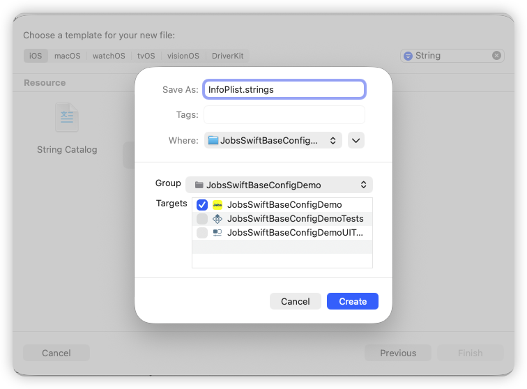</td>
      <td>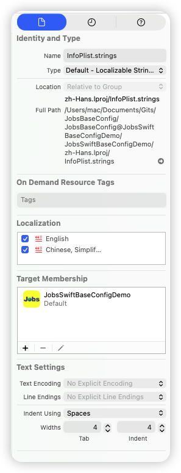</td>
    </tr>
  </table>

  * `InfoPlist.strings (English)`

    ```
    /* 
     InfoPlist.strings (English)
      JobsSwiftBaseConfigDemo
    
      Created by Jobs on 11/17/25.
      
    */
    
    /* ====== Camera / Microphone / Photo Library ====== */
    "NSCameraUsageDescription" = "This app requires access to the camera to take photos and record videos.";
    "NSMicrophoneUsageDescription" = "This app requires access to the microphone to record audio and videos.";
    "NSPhotoLibraryUsageDescription" = "This app requires access to your photo library to select and read your photos and videos.";
    "NSPhotoLibraryAddUsageDescription" = "This app requires permission to save photos and videos to your photo library.";
    
    /* ====== Location (When In Use / Always / Temporary Precise) ====== */
    "NSLocationWhenInUseUsageDescription" = "To provide location-based services, this app needs access to your location while you are using it.";
    "NSLocationAlwaysAndWhenInUseUsageDescription" = "To support continuous location features (navigation, geofencing, etc.), this app needs access to your location in the foreground and background.";
    "NSLocationAlwaysUsageDescription" = "This app needs access to your location in the foreground and background to provide full location services.";
    
    /* iOS 14+ temporary precise location reasons */
    "NavigationPrecise" = "Used for precise navigation and route planning.";
    "NearbySearch" = "Used to find nearby services and devices.";
    "ARAnchors" = "Used for precise positioning and anchors in augmented reality experiences.";
    
    /* ====== Bluetooth ====== */
    "NSBluetoothAlwaysUsageDescription" = "This app needs Bluetooth access to connect to and manage nearby devices.";
    "NSBluetoothPeripheralUsageDescription" = "This app needs Bluetooth access to discover, connect to, and communicate with nearby devices.";
    
    /* ====== Contacts / Calendars / Reminders ====== */
    "NSContactsUsageDescription" = "This app needs access to your contacts to select people or autofill their information.";
    
    "NSCalendarsUsageDescription" = "This app needs access to your calendars to read and write your events.";
    "NSCalendarsFullAccessUsageDescription" = "This app needs full access to your calendars to read, create, and edit your events.";
    "NSCalendarsWriteOnlyAccessUsageDescription" = "This app needs permission to add events to your calendars (write-only, without reading existing events).";
    
    "NSRemindersUsageDescription" = "This app needs access to your reminders to read and create tasks.";
    "NSRemindersFullAccessUsageDescription" = "This app needs full access to your reminders to read, create, and edit tasks.";
    "NSRemindersWriteOnlyAccessUsageDescription" = "This app needs permission to add tasks to your reminders (write-only, without reading existing tasks).";
    
    /* ====== Health / Motion & Fitness ====== */
    "NSHealthShareUsageDescription" = "This app needs to read your health data to provide health-related features and analysis.";
    "NSHealthUpdateUsageDescription" = "This app needs to write health data to log your activities and vital signs.";
    "NSHealthClinicalHealthRecordsShareUsageDescription" = "This app needs to read your clinical health records to provide related services and suggestions.";
    "NSMotionUsageDescription" = "This app needs access to motion and fitness data (accelerometer, step count, etc.) to track and analyze your activity.";
    
    /* ====== Speech / Siri / Face ID ====== */
    "NSSpeechRecognitionUsageDescription" = "This app needs speech recognition to convert your voice into text.";
    "NSSiriUsageDescription" = "This app uses Siri to perform voice commands and shortcuts.";
    "NSFaceIDUsageDescription" = "This app uses Face ID to quickly and securely verify your identity.";
    
    /* ====== HomeKit / Local Network / Bonjour ====== */
    "NSHomeKitUsageDescription" = "This app needs access to your home data to control and manage your HomeKit devices.";
    "NSLocalNetworkUsageDescription" = "This app needs access to your local network to discover and connect to devices or services on your LAN.";
    
    /* ====== NFC ====== */
    "NFCReaderUsageDescription" = "This app needs to use NFC to read and interact with supported nearby tags and devices.";
    
    /* ====== Apple Music / Media Library ====== */
    "NSAppleMusicUsageDescription" = "This app needs access to your media library to read and play your music.";
    
    /* ====== App Tracking Transparency (ATT) ====== */
    "NSUserTrackingUsageDescription" = "To provide more personalized content and ads, this app requests permission to track your activity; your privacy will not be misused.";
    
    /* ====== Nearby Interaction ====== */
    "NSNearbyInteractionUsageDescription" = "This app needs Nearby Interaction to enable ultra-short-range positioning and device interactions.";
    
    /* ====== TV Provider (Video Subscriber Account) ====== */
    "NSVideoSubscriberAccountUsageDescription" = "This app needs access to your TV provider account to verify your subscription and play content.";
    
    /* ====== Critical Alerts ====== */
    "NSCriticalAlertsUsageDescription" = "This app needs to send critical alerts so important events can be notified even in Silent or Do Not Disturb mode.";
    
    /* ====== Focus Status ====== */
    "NSFocusStatusUsageDescription" = "This app needs to read your Focus status so it can send notifications and messages at appropriate times.";
    
    /* ====== Exposure Notification ====== */
    "NSExposureNotificationUsageDescription" = "This app needs Exposure Notifications to alert you to possible contact risks (enabled only where authorized).";
    ```

  * `InfoPlist.strings (Chinese, Simplified)`

    ```
    /* 
     InfoPlist.strings (Chinese, Simplified)
      JobsSwiftBaseConfigDemo
    
      Created by Jobs on 11/17/25.
      
    */
    
    /* ====== 相机 / 麦克风 / 相册 ====== */
    "NSCameraUsageDescription" = "需要访问相机用于拍摄照片或视频。";
    "NSMicrophoneUsageDescription" = "需要访问麦克风用于录音或视频录制。";
    "NSPhotoLibraryUsageDescription" = "需要访问相册以选择和读取您的照片与视频。";
    "NSPhotoLibraryAddUsageDescription" = "需要写入相册以保存您拍摄或编辑的图片/视频。";
    
    /* ====== 定位（使用期间 / 始终 / 临时精确） ====== */
    "NSLocationWhenInUseUsageDescription" = "为提供与位置相关的服务，需要在您使用 App 期间访问位置信息。";
    "NSLocationAlwaysAndWhenInUseUsageDescription" = "为实现持续定位（导航/地理围栏等），需要在前台与后台访问位置信息。";
    "NSLocationAlwaysUsageDescription" = "需要在前台与后台访问位置信息以提供完整定位服务。";
    
    /* iOS 14+ 临时“精确定位”用途声明 */
    "NavigationPrecise" = "用于精确导航与路线规划。";
    "NearbySearch" = "用于查找附近的服务与设备。";
    "ARAnchors" = "用于增强现实场景的精确定位与锚点。";
    
    /* ====== 蓝牙（旧/新） ====== */
    "NSBluetoothAlwaysUsageDescription" = "需要使用蓝牙以连接或管理附近的设备。";
    "NSBluetoothPeripheralUsageDescription" = "需要使用蓝牙以发现、连接或与周边设备通信。";
    
    /* ====== 通讯录 / 日历 / 提醒事项 ====== */
    "NSContactsUsageDescription" = "需要访问通讯录以选择联系人或自动填充信息。";
    
    "NSCalendarsUsageDescription" = "需要访问日历以读取或写入您的日程。";
    "NSCalendarsFullAccessUsageDescription" = "需要完整访问您的日历以读取、创建与修改日程。";
    "NSCalendarsWriteOnlyAccessUsageDescription" = "需要向您的日历添加事件（仅写入，不读取已有事件）。";
    
    "NSRemindersUsageDescription" = "需要访问提醒事项以读取或创建待办。";
    "NSRemindersFullAccessUsageDescription" = "需要完整访问提醒事项以读取、创建与修改待办。";
    "NSRemindersWriteOnlyAccessUsageDescription" = "需要向提醒事项添加待办（仅写入，不读取已有待办）。";
    
    /* ====== 健康 / 运动与健身 ====== */
    "NSHealthShareUsageDescription" = "需要读取健康数据以提供健康相关功能与分析。";
    "NSHealthUpdateUsageDescription" = "需要写入健康数据以记录您的运动或体征。";
    "NSHealthClinicalHealthRecordsShareUsageDescription" = "需要读取您的临床健康记录以提供相关服务与建议。";
    "NSMotionUsageDescription" = "需要访问运动与健身数据（加速度计/步数）以统计与分析活动。";
    
    /* ====== 语音 / Siri / Face ID ====== */
    "NSSpeechRecognitionUsageDescription" = "需要进行语音识别以将您的语音转换为文本。";
    "NSSiriUsageDescription" = "需要使用 Siri 以执行语音指令或快捷操作。";
    "NSFaceIDUsageDescription" = "需要使用 Face ID 以快速完成安全验证。";
    
    /* ====== 家庭(HomeKit) / 本地网络 / Bonjour ====== */
    "NSHomeKitUsageDescription" = "需要访问家庭数据以控制或管理您的家庭设备。";
    "NSLocalNetworkUsageDescription" = "需要访问本地网络以发现和连接局域网中的设备或服务。";
    
    /* ====== NFC ====== */
    "NFCReaderUsageDescription" = "需要使用 NFC 以读取或交互支持的近场标签/设备。";
    
    /* ====== Apple Music / 媒体库 ====== */
    "NSAppleMusicUsageDescription" = "需要访问您的媒体库以读取或播放音乐。";
    
    /* ====== 广告跟踪（ATT） ====== */
    "NSUserTrackingUsageDescription" = "为提供更个性化的内容与广告体验，需要请求跟踪权限；我们不会滥用您的隐私。";
    
    /* ====== Nearby Interaction（U1/超宽带） ====== */
    "NSNearbyInteractionUsageDescription" = "需要使用近距离交互以实现超近距定位与设备交互。";
    
    /* ====== TV Provider（视频订阅账户） ====== */
    "NSVideoSubscriberAccountUsageDescription" = "需要访问您的电视供应商账户以验证订阅并播放内容。";
    
    /* ====== 关键提醒（Critical Alerts） ====== */
    "NSCriticalAlertsUsageDescription" = "需要发送关键提醒以在静音或勿扰模式下也能通知重要事件。";
    
    /* ====== 专注状态共享（Focus Status） ====== */
    "NSFocusStatusUsageDescription" = "需要读取您的专注状态以在合适的时机发送通知或消息。";
    
    /* ====== 暴露通知（Exposure Notification） ====== */
    "NSExposureNotificationUsageDescription" = "需要使用暴露通知以提醒可能的接触风险（仅在获得授权的地区与用途下启用）。";
    ```

* `Info.plist`

  ```xml
  <?xml version="1.0" encoding="UTF-8"?>
  <!DOCTYPE plist PUBLIC "-//Apple//DTD PLIST 1.0//EN" "http://www.apple.com/DTDs/PropertyList-1.0.dtd">
  <plist version="1.0">
  <dict>
  
      <key>UIApplicationSceneManifest</key>
      <dict>
          <key>UIApplicationSupportsMultipleScenes</key>
          <false/>
          <key>UISceneConfigurations</key>
          <dict>
              <key>UIWindowSceneSessionRoleApplication</key>
              <array>
                  <dict>
                      <key>UISceneConfigurationName</key>
                      <string>Default Configuration</string>
                      <key>UISceneDelegateClassName</key>
                      <string>$(PRODUCT_MODULE_NAME).SceneDelegate</string>
                      <key>UISceneStoryboardFile</key>
                      <string>Main</string>
                  </dict>
              </array>
          </dict>
      </dict>
  
      <key>NSAppTransportSecurity</key>
      <dict>
        <!-- ATS 配置：仅放开 WebView 内容的任意加载，其他网络请求仍受 ATS 约束 -->
        <key>NSAllowsArbitraryLoadsInWebContent</key>
        <true/>
      </dict>
  
      <!-- 适配 iOS 16+ 的 UI 兼容开关，不是隐私权限 -->
      <key>UIDesignRequiresCompatibility</key>
      <true/>
  
      <!-- ====== 相机 / 麦克风 / 相册 ====== -->
  
      <!-- 相机权限：用于拍照、扫码、视频录制等需要调用摄像头的场景 -->
      <key>NSCameraUsageDescription</key>
      <string>NSCameraUsageDescription</string>
  
      <!-- 麦克风权限：用于录音、视频通话、语音消息等需要采集声音的场景 -->
      <key>NSMicrophoneUsageDescription</key>
      <string>NSMicrophoneUsageDescription</string>
  
      <!-- 相册读取权限：从系统相册中选择、读取照片或视频 -->
      <key>NSPhotoLibraryUsageDescription</key>
      <string>NSPhotoLibraryUsageDescription</string>
  
      <!-- 相册写入权限：将拍摄或编辑后的图片/视频保存到系统相册 -->
      <key>NSPhotoLibraryAddUsageDescription</key>
      <string>NSPhotoLibraryAddUsageDescription</string>
  
      <!-- ====== 定位（使用期间 / 始终 / 临时精确） ====== -->
  
      <!-- 仅“使用期间”定位：App 在前台使用时访问位置信息（常见导航、附近服务） -->
      <key>NSLocationWhenInUseUsageDescription</key>
      <string>NSLocationWhenInUseUsageDescription</string>
  
      <!-- 始终 + 使用期间定位：前台 + 后台都可访问位置信息（持续导航、地理围栏） -->
      <key>NSLocationAlwaysAndWhenInUseUsageDescription</key>
      <string>NSLocationAlwaysAndWhenInUseUsageDescription</string>
  
      <!-- 旧系统兼容的“始终定位”描述，和上面的键配合使用 -->
      <key>NSLocationAlwaysUsageDescription</key>
      <string>NSLocationAlwaysUsageDescription</string>
  
      <!-- iOS 14+ 临时“精确定位”用途声明，需要详细说明每个用途场景 -->
  
      <!-- 精确导航：比如驾车/步行导航时需要高精度定位 -->
      <key>NSLocationTemporaryUsageDescriptionDictionary</key>
      <dict>
          <key>NavigationPrecise</key>
          <string>NavigationPrecise</string>
  
          <!-- 附近搜索：查找周边服务、设备、门店等 -->
          <key>NearbySearch</key>
          <string>NearbySearch</string>
  
          <!-- AR 锚点：在增强现实场景中进行精确定位和放置锚点 -->
          <key>ARAnchors</key>
          <string>ARAnchors</string>
      </dict>
  
      <!-- ====== 蓝牙（旧/新） ====== -->
  
      <!-- 始终蓝牙权限：App 在前台或后台都可与蓝牙设备交互 -->
      <key>NSBluetoothAlwaysUsageDescription</key>
      <string>NSBluetoothAlwaysUsageDescription</string>
  
      <!-- 旧键：蓝牙外设权限，用于发现/连接/通信附近的蓝牙设备 -->
      <key>NSBluetoothPeripheralUsageDescription</key>
      <string>NSBluetoothPeripheralUsageDescription</string>
  
      <!-- ====== 通讯录 / 日历 / 提醒事项 ====== -->
  
      <!-- 通讯录权限：读取联系人用于选择联系人、自动填充等 -->
      <key>NSContactsUsageDescription</key>
      <string>NSContactsUsageDescription</string>
  
      <!-- 日历基础权限：读取/写入日历事件（旧键，兼容性用途） -->
      <key>NSCalendarsUsageDescription</key>
      <string>NSCalendarsUsageDescription</string>
  
      <!-- iOS 17+ 日历“完全访问”：可读、可写、可修改所有日历事件 -->
      <key>NSCalendarsFullAccessUsageDescription</key>
      <string>NSCalendarsFullAccessUsageDescription</string>
  
      <!-- iOS 17+ 日历“仅写入”：只能往日历里添加事件，不能读取已有事件 -->
      <key>NSCalendarsWriteOnlyAccessUsageDescription</key>
      <string>NSCalendarsWriteOnlyAccessUsageDescription</string>
  
      <!-- 提醒事项基础权限：读取/创建提醒（旧键，兼容性用途） -->
      <key>NSRemindersUsageDescription</key>
      <string>NSRemindersUsageDescription</string>
  
      <!-- iOS 17+ 提醒事项“完全访问”：读、写、改所有待办/提醒 -->
      <key>NSRemindersFullAccessUsageDescription</key>
      <string>NSRemindersFullAccessUsageDescription</string>
  
      <!-- iOS 17+ 提醒事项“仅写入”：只能添加新的待办，不读取已有记录 -->
      <key>NSRemindersWriteOnlyAccessUsageDescription</key>
      <string>NSRemindersWriteOnlyAccessUsageDescription</string>
  
      <!-- ====== 健康 / 运动与健身（HealthKit） ====== -->
  
      <!-- 健康数据读取权限：从 HealthKit 读取健康/体征/运动数据 -->
      <key>NSHealthShareUsageDescription</key>
      <string>NSHealthShareUsageDescription</string>
  
      <!-- 健康数据写入权限：向 HealthKit 写入运动记录、健康指标等 -->
      <key>NSHealthUpdateUsageDescription</key>
      <string>NSHealthUpdateUsageDescription</string>
  
      <!-- 临床健康档案读取：访问医院/诊所等来源的临床健康记录 -->
      <key>NSHealthClinicalHealthRecordsShareUsageDescription</key>
      <string>NSHealthClinicalHealthRecordsShareUsageDescription</string>
  
      <!-- 运动与健身权限：访问加速度计、步数等运动数据 -->
      <key>NSMotionUsageDescription</key>
      <string>NSMotionUsageDescription</string>
  
      <!-- ====== 语音 / Siri / Face ID ====== -->
  
      <!-- 语音识别权限：将语音实时转成文字（非录音本身） -->
      <key>NSSpeechRecognitionUsageDescription</key>
      <string>NSSpeechRecognitionUsageDescription</string>
  
      <!-- Siri 权限：使用 Siri 执行语音指令、快捷指令 -->
      <key>NSSiriUsageDescription</key>
      <string>NSSiriUsageDescription</string>
  
      <!-- Face ID 权限：用面容识别进行登录、支付或敏感操作验证 -->
      <key>NSFaceIDUsageDescription</key>
      <string>NSFaceIDUsageDescription</string>
  
      <!-- ====== 家庭(HomeKit) / 本地网络 / Bonjour ====== -->
  
      <!-- HomeKit 权限：控制和管理智能家居设备（灯、门锁等） -->
      <key>NSHomeKitUsageDescription</key>
      <string>NSHomeKitUsageDescription</string>
  
      <!-- 本地网络权限：在局域网中发现并连接其它设备或服务 -->
      <key>NSLocalNetworkUsageDescription</key>
      <string>NSLocalNetworkUsageDescription</string>
  
      <!-- Bonjour 服务列表：声明需要发现的局域网服务类型 -->
      <key>NSBonjourServices</key>
      <array>
          <!-- 按需添加你真实使用的服务类型；下面是示例 -->
          <string>_http._tcp.</string>
          <string>_airplay._tcp.</string>
          <string>_yourservice._tcp.</string>
      </array>
  
      <!-- ====== NFC ====== -->
  
      <!-- NFC 权限：读取 NFC 标签或与支持 NFC 的设备交互 -->
      <key>NFCReaderUsageDescription</key>
      <string>NFCReaderUsageDescription</string>
  
      <!-- ====== Apple Music / 媒体库 ====== -->
  
      <!-- 媒体库权限：访问系统音乐库，读取/播放音乐 -->
      <key>NSAppleMusicUsageDescription</key>
      <string>NSAppleMusicUsageDescription</string>
  
      <!-- ====== 广告跟踪（ATT） ====== -->
  
      <!-- App Tracking 权限：用于跨 App / 网站的广告归因与个性化推荐 -->
      <key>NSUserTrackingUsageDescription</key>
      <string>NSUserTrackingUsageDescription</string>
  
      <!-- ====== Nearby Interaction（U1/超宽带） ====== -->
  
      <!-- 近距离交互权限：利用 UWB/超宽带进行超近距离定位与设备协同 -->
      <key>NSNearbyInteractionUsageDescription</key>
      <string>NSNearbyInteractionUsageDescription</string>
  
      <!-- ====== TV Provider（视频订阅账户） ====== -->
  
      <!-- 电视供应商账户权限：验证用户订阅，用于播放付费频道/视频 -->
      <key>NSVideoSubscriberAccountUsageDescription</key>
      <string>NSVideoSubscriberAccountUsageDescription</string>
  
      <!-- ====== 关键提醒（Critical Alerts，需要特权能力） ====== -->
  
      <!-- 关键提醒权限：在静音/勿扰模式下仍可发出高优先级通知 -->
      <key>NSCriticalAlertsUsageDescription</key>
      <string>NSCriticalAlertsUsageDescription</string>
  
      <!-- ====== 专注状态共享（Focus Status） ====== -->
  
      <!-- 读取专注状态：根据当前专注模式调整通知/消息的发送时机 -->
      <key>NSFocusStatusUsageDescription</key>
      <string>NSFocusStatusUsageDescription</string>
  
      <!-- ====== 暴露通知（Exposure Notification，需要特权能力） ====== -->
  
      <!-- 暴露通知权限：用于疫情等场景下的接触风险提醒（需官方授权） -->
      <key>NSExposureNotificationUsageDescription</key>
      <string>NSExposureNotificationUsageDescription</string>
  
  </dict>
  </plist>
  ```


#### 38.2、对全局普通的字符串进行多语言国际化的处理 <a href="#前言" style="font-size:17px; color:green;"><b>🔼</b></a> <a href="#🔚" style="font-size:17px; color:green;"><b>🔽</b></a>

* 新建语言映射文件`*.strings`
 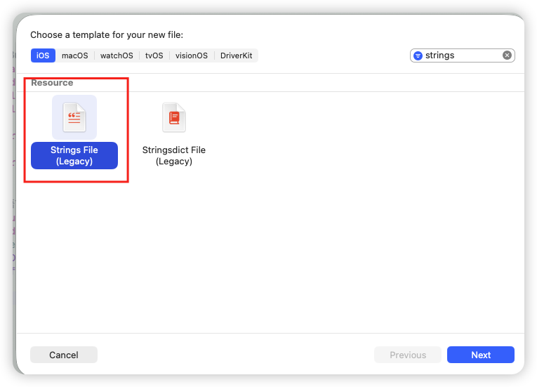

 * `Localizable.strings (English)` **中文为键**

   ```
   "🔑 注册登录" = "🔑 Sign in / Register";
   ```

 * `Localizable.strings (Chinese, Simplified)`

   ```
   "🔑 注册登录" = "🔑 注册登录";
   ```

* 启动配置
  
  ```swift
  func application(
      _ application: UIApplication,
      didFinishLaunchingWithOptions launchOptions: [UIApplication.LaunchOptionsKey: Any]?
  ) -> Bool {
      TRLang.bundleProvider = { LanguageManager.shared.localizedBundle }
      TRLang.localeCodeProvider = { LanguageManager.shared.currentLanguageCode }
      return true
  }
  ```
  
* 使用方式，Api类[**Flutter**](https://flutter.dev)

   ```swift
   "🔑 注册登录".tr
   ```

* 说明

   * 切换语言的时候，是通过发通知来转换的
   * 对于已经赋值的UI控件，还是需要重新赋值。**`*.tr`**只是改变字符串

### 39、PDF <a href="#前言" style="font-size:17px; color:green;"><b>🔼</b></a> <a href="#🔚" style="font-size:17px; color:green;"><b>🔽</b></a>

```swift
import PDFKit // 系统API

private lazy var pdfView: PDFView = {
    PDFView()
        .byAutoScales(NO) // 交给我们手动控制
        .byDisplayMode(.singlePageContinuous)
        .byDisplayDirection(.vertical)
        .byBgColor(.secondarySystemBackground)
        .byAddTo(view) { [unowned self] make in
            make.top.equalTo(view.safeAreaLayoutGuide.snp.top)
            make.leading.trailing.equalTo(view.safeAreaLayoutGuide)
            make.bottom.equalTo(thumbnailView.snp.top)
        }
}()

private lazy var thumbnailView: PDFThumbnailView = { [unowned self] in
    PDFThumbnailView()
        .byLayoutMode(.horizontal)
        .byThumbnailSize(CGSize(width: 60, height: 80))
        .byBgColor(.tertiarySystemBackground)
        .byContentInset(UIEdgeInsets(top: 6, left: 8, bottom: 6, right: 8))
        .byAddTo(view) { [unowned self] make in
            make.leading.trailing.equalTo(view.safeAreaLayoutGuide)
            make.bottom.equalTo(view.safeAreaLayoutGuide.snp.bottom)
            make.height.equalTo(96)
        }
}()

thumbnailView.byPDFView(to: pdfView)

override func viewDidLayoutSubviews() {
    super.viewDidLayoutSubviews()
    pdfView.byFitScale(max: 4.0)
        .byFitNow(maxScale: 4.0)
}
/// 可选增强（避免旋转后又变样）：
override func viewWillTransition(to size: CGSize, with coordinator: UIViewControllerTransitionCoordinator) {
    super.viewWillTransition(to: size, with: coordinator)
    coordinator.animate(alongsideTransition: { _ in
        let fit = self.pdfView.scaleFactorForSizeToFit
        self.pdfView.minScaleFactor = fit
        self.pdfView.maxScaleFactor = max(fit, 4.0)
        self.pdfView.scaleFactor   = fit
    })
}
```

### 40、软键盘退出 <a href="#前言" style="font-size:17px; color:green;"><b>🔼</b></a> <a href="#🔚" style="font-size:17px; color:green;"><b>🔽</b></a>

```swift
jobsDismissKeyboard()
```

### 41、`UITableViewCell`  的数据配置体系（`UICollectionViewCell` 同理）<a href="#前言" style="font-size:17px; color:green;"><b>🔼</b></a> <a href="#🔚" style="font-size:17px; color:green;"><b>🔽</b></a>

* 此协议用于 `UITableViewCell` 亦可用于`UICollectionViewCell` 

  ```swift
  // MARK: - 统一的「任意配置」协议
  public protocol JobsConfigCellProtocol: AnyObject {
      /// any 可以是任意类型（struct / enum / tuple / dict），
      /// 在具体 cell 里自己去解包。
      @discardableResult
      func byConfigure(_ any: Any?) -> Self
  }
  ```

* 通过一束**数据束**进行管理，除了能携带必要的配置信息以外，**还可以携带一些特定的数据（data: Any?）**

  ```swift
  // MARK: - 通用于 UITableViewCell 和 UICollectionViewCell 的模型组件
  public struct JobsCellConfig {
      public let title: String?
      public let detail: String?
      public let image: UIImage?
      public let data: Any?
  
      public init(title: String? = nil,
                  detail: String? = nil,
                  image: UIImage? = nil,
                  data: Any? = nil) {
          self.title = title
          self.detail = detail
          self.image = image
          self.data = data 
      }
  }
  ```

* 给所有的`UITableViewCell`添加此协议（**`JobsConfigCellProtocol`**）所赋予的方法（**`byConfigure`**）,以传递数据模型（**`JobsCellConfig`**）

  ```swift
  extension UITableViewCell: JobsConfigCellProtocol {
      @discardableResult
      @objc
      public func byConfigure(_ any: Any?) -> Self {
          // 如果不是给普通 value1 用的，直接忽略
          guard let cfg = any as? JobsCellConfig else { return self }
          if #available(iOS 14.0, *) {
              return byContentConfiguration { content in
                  // 你自己的 UIListContentConfiguration DSL 写法
                  content
                      .byText(cfg.title)
                      .bySecondaryText(cfg.detail)
                      .byImage(cfg.image)
              }
          } else {
              // 旧系统依赖 textLabel / detailTextLabel
              if let title = cfg.title {
                  textLabel?.byText(title)
              }
              if let detail = cfg.detail {
                  detailTextLabel?.byText(detail)
              }
              if let image = cfg.image {
                  imageView?.byImage(image)
              };return self
          }
      }
  }
  ```

* 在自定义的`UITableViewCell`里面进行自我解析

  ```swift
  final class AvatarCell: UITableViewCell {
  
      private lazy var avatarView: UIImageView = {
          UIImageView()
              .byContentMode(.scaleAspectFill)
              .byClipsToBounds(true)
              .byCornerRadius(22)
              .byBgColor(.systemGray5)
              .byAddTo(contentView) { [unowned self] make in
                  make.size.equalTo(CGSize(width: 44, height: 44))
                  make.centerY.equalToSuperview()
                  // 预留 disclosureIndicator 的空间
                  make.trailing.equalToSuperview().inset(16)
              }
      }()
  
      override init(style: UITableViewCell.CellStyle, reuseIdentifier: String?) {
          super.init(style: .value1, reuseIdentifier: reuseIdentifier)
          bySelectionStyle(.none)
              .byAccessoryType(.disclosureIndicator)
  
          textLabel?.byFont(.systemFont(ofSize: 16)).byTextColor(.label)
          detailTextLabel?.byFont(.systemFont(ofSize: 14)).byTextColor(.secondaryLabel)
          avatarView.byVisible(YES)
      }
  
      required init?(coder: NSCoder) {
          fatalError("init(coder:) has not been implemented")
      }
  
      @discardableResult
      @objc
      override func byConfigure(_ any: Any?) -> Self {
          guard let cfg = any as? JobsCellConfig else { return self }
  
          // 头像行只关心 title + image，detail 直接忽略
          if let title = cfg.title {
              textLabel?.byText(title)
          }
          if let image = cfg.image {
              avatarView.byImage(image)
          }
          return self
      }
  }
  ```

### 42、🎨 字符串取色（校验规定格式）<a href="#前言" style="font-size:17px; color:green;"><b>🔼</b></a> <a href="#🔚" style="font-size:17px; color:green;"><b>🔽</b></a>

```swift
/// 支持格式：
/// "#RRGGBB" / "RRGGBB" / "0xRRGGBB"
/// "#RGB"   / "RGB"
/// "#AARRGGBB" / "AARRGGBB"

"#353a3e".cor          // OK → 正常色
"353a3e".cor           // OK
"0x353a3e".cor         // OK
"#FFF".cor             // OK → 展开成 #FFFFFF
"80FF0000".cor         // OK → alpha=0x80, red
"乱七八糟".cor         // ❌ → 直接红色

"80FF0000".cor(alpha: 1) // alpha 走字符串里的 0x80，而不是你传的 1
"垃圾".cor(.black)        // 非法 → black
```

### 43、网络数据的监听 <a href="#前言" style="font-size:17px; color:green;"><b>🔼</b></a> <a href="#🔚" style="font-size:17px; color:green;"><b>🔽</b></a>

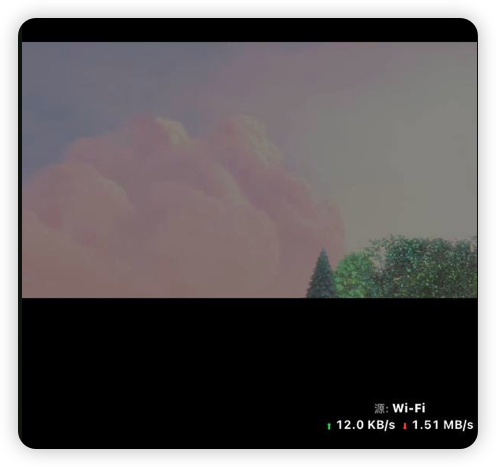

#### 43.1、监听：数据来源 + 上行⬆️ / 下载⬇️ <a href="#前言" style="font-size:17px; color:green;"><b>🔼</b></a> <a href="#🔚" style="font-size:17px; color:green;"><b>🔽</b></a>

```swift
networkNormalListenerBy(view) // 普通文本
networkRichListenerBy(view) // 富文本
```

```swift
/// 手动移除
deinit {
    JobsNetworkTrafficMonitorStop()  /// 停止网络实时监听
}
```

#### 43.2、监听第一次数据源 <a href="#前言" style="font-size:17px; color:green;"><b>🔼</b></a> <a href="#🔚" style="font-size:17px; color:green;"><b>🔽</b></a>

```swift
 jobsWaitNetworkDataReady(
     onWiFiReady: {
         print("✅ Wi-Fi 已有真实流量")
     },
     onCellularReady: {
         print("✅ 蜂窝已实际可用，可以走后续逻辑")
         // 比如这里再去重试接口、发起播放等
     }
 )
```

```swift
/// 手动移除
deinit {
    JobsCancelWaitNetworkDataReady()       /// 停止网络数据源监听
}
```

### 44、将不同的数据合二为一（普通字符串➕富文本字符串）<a href="#前言" style="font-size:17px; color:green;"><b>🔼</b></a> <a href="#🔚" style="font-size:17px; color:green;"><b>🔽</b></a>

* 通过**`func byConfigure(_ any: Any?) -> Self`**对外统一接收唯一的数据束（这里是**`JobsCellConfig`**），方便管理

  ```swift
  // MARK: - 统一的「任意配置」协议
  public protocol JobsConfigCellProtocol: AnyObject {
      /// any 可以是任意类型（struct / enum / tuple / dict），
      /// 在具体 cell 里自己去解包。
      @discardableResult
      func byConfigure(_ any: Any?) -> Self
  }
  ```

  ```swift
  extension UITableViewCell: JobsConfigCellProtocol {
      @discardableResult
      @objc
      public func byConfigure(_ any: Any?) -> Self {
          // 如果不是给普通 value1 用的，直接忽略
          guard let cfg = any as? JobsCellConfig else { return self }
          if #available(iOS 14.0, *) {
              return self
                  .byJobsText(cfg.title)                  // 解析为普通字符串
                  .bySecondaryJobsText(cfg.detail)        // 解析为富文本字符串
                  .byImage(cfg.image)
          } else {
              // 旧系统依赖 textLabel / detailTextLabel
              if let title = cfg.title {
                  textLabel?.byJobsAttributedText(title)
              }
              if let detail = cfg.detail {
                  detailTextLabel?.byJobsAttributedText(detail)
              }
              if let image = cfg.image {
                  imageView?.byImage(image)
              };return self
          }
      }
  }
  ```

* 自定义数据（模型）层**`JobsCellConfig`**

  * 数据模型里面的数据类型是**`JobsText`**

    ```swift
    // MARK: - 通用于 UITableViewCell 和 UICollectionViewCell 的模型组件
    public struct JobsCellConfig {
        public let title: JobsText?
        public let detail: JobsText?
        public let image: UIImage?
        public let data: Any?
    
        public init(title: JobsText? = nil,
                    detail: JobsText? = nil,
                    image: UIImage? = nil,
                    data: Any? = nil) {
            self.title = title
            self.detail = detail
            self.image = image
            self.data = data
        }
    }
    ```

  * 枚举里面的值的类型是**`JobsText`**

    ```swift
    // MARK: - 行模型
    private enum EditProfileRow: CaseIterable {
        case avatar
        case nickname
        case gender
    
        var title: JobsText {
            switch self {
            case .avatar:     return "头像"
            case .nickname:   return "昵称"
            case .gender:     return "性别"
            }
        }
    		/// ❤️ 这里的字段“detail”，既可以是String类型，也可以是NSAttributedString类型。合二为一
        var detail: JobsText? {
            switch self {
            case .avatar:
                return nil
            case .nickname:
              	/// 富文本
                return JobsText(JobsRichText.make([
                    JobsRichRun(.text("等级达到2级才能修改昵称"))
                        .font(.systemFont(ofSize: 14))
                        .color(.systemRed),
                    JobsRichRun(.text("Eric"))
                        .font(.systemFont(ofSize: 14, weight: .semibold))
                        .color(.secondaryLabel)
                ]))
            case .gender:
                /// 普通文本
                return "female"
        }
    }
    ```

* 数据灌入

  ```swift
  tableView.py_dequeueReusableCell(withType: BaseTableViewCellByValue1.self, for: indexPath)
           .byConfigure(JobsCellConfig(title: row.title,detail:row.detail))
  ```

* <font color=red>**数据解析（核心）**</font>

  * 解析数据到`UILabel`

    ```swift
    extension UILabel {
        @discardableResult
        func byJobsAttributedText(_ text: JobsText?) -> Self {
            guard let text else { return self }
            self.attributedText = text.asAttributed
            return self
        }
        @discardableResult
        func byJobsText(_ text: JobsText?) -> Self {
            guard let text else { return self }
            self.text = text.asString
            return self
        }
    }
    ```

  * 解析数据到`UITableViewCell`

    ```swift
    public extension UITableViewCell {
        /// 解析为富文本
        func byJobsAttributedText(_ text: JobsText?) -> Self {
            guard let text else { return self }
            if #available(iOS 14.0, *) {
                return byContentConfiguration { $0.attributedText = text.asAttributed }
            } else {
                self.textLabel?.attributedText = text.asAttributed
                return self
            };
        }
        /// 解析为普通文本
        func byJobsText(_ text: JobsText?) -> Self {
            guard let text else { return self }
            if #available(iOS 14.0, *) {
                return byContentConfiguration { $0.text = text.asString }
            } else {
                self.textLabel?.text = text.asString
                return self
            };
        }
    }
    ```

### 45、有序字典 <a href="#前言" style="font-size:17px; color:green;"><b>🔼</b></a> <a href="#🔚" style="font-size:17px; color:green;"><b>🔽</b></a>

iOS 的原生字典，在打印的时候不会按照键值对的添加先后顺序打印。此时需要用到[**OrderedDictionary**](https://github.com/apple/swift-collections#)

```ruby
pod 'swift-collections'                  # https://github.com/apple/swift-collections#       ❤️ 有序字典
```

```swift
/// https://github.com/apple/swift-collections#
/// 同一个类型，不同接入方式的 module 名不一样
#if canImport(Collections)
import Collections          // ✅ Pod 或 SPM 直接接 apple/swift-collections
#elseif canImport(OrderedCollections)
import OrderedCollections   // ✅ SPM 只接 OrderedCollections product 的情况
#endif
```

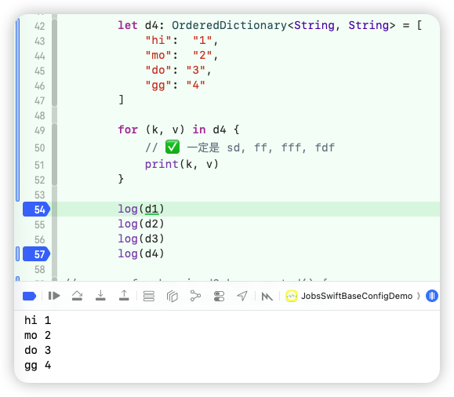

### 46、[**安全取值**](#Subscript) <a href="#前言" style="font-size:17px; color:green;"><b>🔼</b></a> <a href="#🔚" style="font-size:17px; color:green;"><b>🔽</b></a>

* 安全取字符

  ```swift
  let s = "Jobs"
  print(s[1] as Any)   // Optional("o")
  print(s[10] as Any)  // nil
  ```

* 安全取数组

  ```swift
  let arr = [10, 20, 30]
  
  let a = arr[safe:1]              // Optional(20)
  let b = arr[safe:99]             // nil
  print(a as Any)   // Optional(20)
  print(b as Any)  // nil
  ```

* 安全取字典

  ```swift
  let dict = ["a": 1, "b": 2]
  
  let x = dict[safe: "a"]                 // Optional(1)
  let y = dict[safe: "zzz"]               // nil
  
  print(x as Any)   // Optional("o")
  print(y as Any)   // nil
  ```
  
* 安全取`UICollectionViewCell`

  ```swift
  let cell = collectionView[section: 0, item: 3]
  let cell1 = collectionView[section: 0, item: 300]
  print("")
  ```
  
* 安全取`UITableViewCell`

  ```swift
  let cell = tableView[section: 0, row: 3]
  let cell1 = tableView[section: 12, row: 3]
  print("")
  ```

### 47、`UserDefaults.standard` <a href="#前言" style="font-size:17px; color:green;"><b>🔼</b></a> <a href="#🔚" style="font-size:17px; color:green;"><b>🔽</b></a>

```swift
public let UD = UserDefaults.standard

struct UserInfoModel: Codable {
    let id: Int
    let name: String
    let isVIP: Bool
}
```

#### 47.1、存取对象 <a href="#前言" style="font-size:17px; color:green;"><b>🔼</b></a> <a href="#🔚" style="font-size:17px; color:green;"><b>🔽</b></a>

* **存对象**

  ```swift
  func udSave(){
      UD.save(UserInfoModel(id: 1001, name: "Jobs", isVIP: true), forKey: "kUserInfo")
  }
  ```

* **取对象**

  ```swift
  func udRead(){
      // 读取时指定类型
      if let loadedUser = UD.load(UserInfoModel.self, forKey: "kUserInfo") {
          print(loadedUser.id)     // 1001
          print(loadedUser.name)   // Jobs
          print(loadedUser.isVIP)  // true
      } else {
          print("还没有存过用户信息")
      }
  }
  ```

#### 47.2、存取[**Swift**](https://developer.apple.com/swift/)的基本数据类型 <a href="#前言" style="font-size:17px; color:green;"><b>🔼</b></a> <a href="#🔚" style="font-size:17px; color:green;"><b>🔽</b></a>

* **存 Int**

  ```swift
  func udSaveAge() {
      let age = 18
      UD.save(age, forKey: "kUserAge")   // T = Int（Int: Codable）
  }
  ```

* **取 Int**

  ```swift
  func udReadAge() {
      let age: Int? = UD.load(Int.self, forKey: "kUserAge")
      if let age {
          print("当前年龄：\(age)")
      } else {
          print("还没有存过年龄")
      }
  }
  ```

### 48、旋转的抽奖轮盘 <a href="#前言" style="font-size:17px; color:green;"><b>🔼</b></a> <a href="#🔚" style="font-size:17px; color:green;"><b>🔽</b></a>

* ```swift
  private lazy var wheelView: LuckyWheelView = {
      LuckyWheelView()
          .bySegments([
              .init(text: "一等奖".tr,
                    textFont: .systemFont(ofSize: 12, weight: .medium),
                    textColor: .randomColor,
                    backgroundColor: .randomColor,
                    placeholderImage: "globe".sysImg,
                    imageURLString:"https://picsum.photos/30"),
              .init(text: "二等奖".tr,
                    textFont: .systemFont(ofSize: 12, weight: .medium),
                    textColor: .randomColor,
                    backgroundColor: .randomColor,
                    placeholderImage: "plus".sysImg,
                    imageURLString:"https://picsum.photos/30"),
              .init(text: "三等奖".tr,
                    textFont: .systemFont(ofSize: 12, weight: .medium),
                    textColor: .randomColor,
                    backgroundColor: .randomColor,
                    placeholderImage: "message".sysImg,
                    imageURLString:"https://picsum.photos/30"),
              .init(text: "谢谢参与".tr,
                    textFont: .systemFont(ofSize: 12, weight: .medium),
                    textColor: .randomColor,
                    backgroundColor: .randomColor,
                    placeholderImage: "tray".sysImg,
                    imageURLString:"https://picsum.photos/30"),
          ])
          .byPointerDirection(.right) // 停止锚点作为中奖结果
          .bySpinDuration(3.0)
          .byInitialVelocity(25.0)
          .byPanRotationEnabled(true)
          .onSegmentTap { segment in
              /// 短按和旋转停止后的中奖结果
              toastBy("🍀 短按扇形 \(String(describing: segment.text?.rnl))")
          }
          .onSegmentLongPress { segment, gr in
              if gr.state == .began {
                  toastBy("👆 长按开始 \(String(describing: segment.text?.rnl))")
              }
          }
          .byAddTo(view) { make in
              make.center.equalToSuperview()
              make.width.height.equalTo(300)
          }
  }()
  ```

* ```swift
   wheelView.stopSpin() // 停止
  ```

### 49、屏幕常亮 <a href="#前言" style="font-size:17px; color:green;"><b>🔼</b></a> <a href="#🔚" style="font-size:17px; color:green;"><b>🔽</b></a>

```swift
// MARK: - 屏幕常亮
public extension NSObject {
    /// 屏幕是否保持常亮
    var isScreenAlwaysOn: Bool {
        get { UIApplication.shared.isIdleTimerDisabled }
        set { UIApplication.shared.isIdleTimerDisabled = newValue }
    }
    /// 开启常亮
    func keepScreenOn() {
        UIApplication.shared.isIdleTimerDisabled = true
    }
    /// 关闭常亮
    func endScreenOn() {
        UIApplication.shared.isIdleTimerDisabled = false
    }
}
```

### 50、自定义进度条 <a href="#前言" style="font-size:17px; color:green;"><b>🔼</b></a> <a href="#🔚" style="font-size:17px; color:green;"><b>🔽</b></a>

* 解决痛点：系统进度条（不能定义前进方向以及实时进度值）

* 快捷创建

  ```swift
  /// 自定义进度条：实时进度值、前进方向
  private lazy var progressView: JobsProgressView = {
      JobsProgressView()
          .byDirection(.leftToRight)
          .byValueMode(.countDown)   // 初始：显示为 100→0
          .byTrackColor(.systemGray5)
          .byLabelBackgroundColor(.secondarySystemBackground)
          .byLabelFont(.monospacedDigitSystemFont(ofSize: 12, weight: .medium))
          .byAddTo(view) { [unowned self] make in
              make.top.equalTo(modeToggleButton.snp.bottom).offset(24.h)
              make.left.equalToSuperview().offset(40.w)
              make.right.equalToSuperview().inset(40.w)
              make.height.equalTo(80.h) /// 给点高度让上方 label 有空间移动
          }
  }()
  ```

* 手动设置进度（动画呈现）

  ```swift
  private var currentProgress: CGFloat = 0
  progressView.setProgress(currentProgress, animated: true)
  ```

## 四、[**Swift**](https://developer.apple.com/swift/) 语言特性 <a href="#前言" style="font-size:17px; color:green;"><b>🔼</b></a> <a href="#🔚" style="font-size:17px; color:green;"><b>🔽</b></a>

### 1、注解 <a href="#前言" style="font-size:17px; color:green;"><b>🔼</b></a> <a href="#🔚" style="font-size:17px; color:green;"><b>🔽</b></a>

> [**Swift**](https://developer.apple.com/swift/) 不支持运行时反射注解
>
> 随着[**Swift**](https://developer.apple.com/swift/)版本的不断更新，也会出现新的注解。比如：<font color=red>**`@freestanding`**</font> **从 [Swift](https://developer.apple.com/swift/) 5.9 开始** 才正式可用的（也就是 Xcode 15 对应的那个 [**Swift**](https://developer.apple.com/swift/) 版本）。

#### 1.1、系统注解 <a href="#前言" style="font-size:17px; color:green;"><b>🔼</b></a> <a href="#🔚" style="font-size:17px; color:green;"><b>🔽</b></a>

##### 1.1.1、<font color=red>**`@available(...)`**</font>/ <font color=red>**`@unavailable(...)`**</font> <a href="#前言" style="font-size:17px; color:green;"><b>🔼</b></a> <a href="#🔚" style="font-size:17px; color:green;"><b>🔽</b></a>

> 控制平台/版本可用性、弃用信息

```swift
@available(iOS 14, *) 
func foo() {}

@available(*, deprecated, message: "Use newFoo()")
func oldFoo() {}

@unavailable(iOS, message: "Not on iOS")
func macOnly() {}
```

##### 1.1.2、<font color=red>**`@main`**</font>指定程序入口 <a href="#前言" style="font-size:17px; color:green;"><b>🔼</b></a> <a href="#🔚" style="font-size:17px; color:green;"><b>🔽</b></a>

> 取代旧的 `@UIApplicationMain` / `@NSApplicationMain`

```swift
@main
struct AppMain {
  static func main() { /* ... */ }
}
```

##### 1.1.3、<font color=red>**`@inlinable`**</font>/ <font color=red>**`@usableFromInline`**</font> <a href="#前言" style="font-size:17px; color:green;"><b>🔼</b></a> <a href="#🔚" style="font-size:17px; color:green;"><b>🔽</b></a>

> 跨模块内联/符号可见性微控（发布库时常用）

```swift
@inlinable public func add(_ a:Int,_ b:Int)->Int { a+b }
@usableFromInline internal let cache = ...
```

##### 1.1.4、<font color=red>**`@frozen`**</font> <a href="#前言" style="font-size:17px; color:green;"><b>🔼</b></a> <a href="#🔚" style="font-size:17px; color:green;"><b>🔽</b></a>

> * 冻结 `enum` 的布局，保证 **ABI** 稳定（库作者用）
>   *  [**API 🆚 ABI**](#API🆚ABI)
>   * [**ABI不兼容**](#ABI不兼容)

```swift
@frozen public enum ColorSpace { case srgb, displayP3 }
```

##### 1.1.5、<font color=red>**`@discardableResult`**</font> <a href="#前言" style="font-size:17px; color:green;"><b>🔼</b></a> <a href="#🔚" style="font-size:17px; color:green;"><b>🔽</b></a>

> 允许丢弃返回值（链式 API 常用）

```swift
@discardableResult
func setTitle(_ s:String) -> Self { /* ... */ return self }
```

##### 1.1.6、<font color=red>**`@escaping`**</font> <a href="#前言" style="font-size:17px; color:green;"><b>🔼</b></a> <a href="#🔚" style="font-size:17px; color:green;"><b>🔽</b></a>

> 标记逃逸闭包参数

```swift
func asyncOp(_ block: @escaping ()->Void) { /* store & call later */ }
```

##### 1.1.7、<font color=red>**`@autoclosure`**</font> <a href="#前言" style="font-size:17px; color:green;"><b>🔼</b></a> <a href="#🔚" style="font-size:17px; color:green;"><b>🔽</b></a>

> 调用端可省略 `{}` 延迟求值

```swift
func assert(_ cond: @autoclosure ()->Bool) {}
assert(1 < 2)   // 等价于 { 1 < 2 }
```

##### 1.1.8、<font color=red>**`@Sendable`**</font> <a href="#前言" style="font-size:17px; color:green;"><b>🔼</b></a> <a href="#🔚" style="font-size:17px; color:green;"><b>🔽</b></a>

> 并发安全闭包（跨 **actor**/线程）

```swift
func run(_ job: @Sendable ()->Void) {}
```

##### 1.1.9、<font id=@MainActor color=red>**`@MainActor`**</font>/ 自定义 <font color=red>**`@globalActor`**</font> <a href="#前言" style="font-size:17px; color:green;"><b>🔼</b></a> <a href="#🔚" style="font-size:17px; color:green;"><b>🔽</b></a>

> 它代表了一个**特殊的 actor**，这个 actor 绑定在 **主线程（主 runloop）** 上
>
> 被标记为 <font color=red>**`@MainActor`**</font> 的函数 / 属性 / 类型，**逻辑上归属于这个 actor 的隔离域**
>
> 如果标注在类型上，这个类型里的 **所有存储属性和实例方法**，默认都视为 <font color=red>**`@MainActor`**</font>
>
> 如果标注在属性 / 全局变量上，只会针对这个属性 / 全局变量 <font color=red>**`@MainActor`**</font>

* 编译器层面的效果（静态检查）

  ```swift
  @MainActor
  class MyViewModel {
      var title: String = ""
      func updateUI() {
          // 就算 updateUI 写的是 func（同步函数），对别的 actor 来说它也是“逻辑异步”的，
        	// 因为要先 hop 到 MainActor 的执行器，这一步本身就是异步的，所以你还是要 await。这不是“标注”，是实打实改变了调用方式。
      }
  }
  
  actor Worker {
      func doWork(vm: MyViewModel) async {
          vm.title = "xxx"      // ❌ 跨 actor 访问 main actor 隔离的属性
          vm.updateUI()         // ❌ 跨 actor 调用 main actor 隔离的方法
      }
  }
  /// 必须 通过 await + 自动 hop 来调用：
  actor Worker {
      func doWork(vm: MyViewModel) async {
          await vm.updateUI()   // ✅ 编译器知道：这里要 hop 到 MainActor
      }
  }
  ```

* 运行时层面的效果（线程/执行器切换）

  * 发现你在非 <font color=red>**`@MainActor`**</font> 上 `await` 一个 `@MainActor` 函数
  * 自动做一件有点像 `DispatchQueue.main.async` 的事：**跳到主 actor（主线程）上执行这段代码**
  * 确保这段代码在主线程运行

* <font color=red>**`@MainActor(unsafe)`**</font>

  * 告诉编译器“这玩意算 <font color=red>**`@MainActor`**</font> 的”，但是 **实际运行时不保证真在主线程**，主要是为了一些过渡场景做兼容
  * 这个一般不推荐乱用，尤其是在搞 UI 的时候

* `nonisolated` 打洞

  ```swift
  /// 如果把一个类标记为 @MainActor，但有些方法又明确希望任何线程都能调用，可以：
  @MainActor
  final class MyViewModel {
      var state: String = ""
      nonisolated func logState() {
          // 这里不能直接访问 state（因为打破了隔离）
          // 但可以做不依赖隔离的逻辑，比如打印
          print("log")
      }
  }
  ```

##### 1.1.10、<font color=red>**`@preconcurrency`**</font> <a href="#前言" style="font-size:17px; color:green;"><b>🔼</b></a> <a href="#🔚" style="font-size:17px; color:green;"><b>🔽</b></a>

> 为旧接口提供向后兼容的并发注释（迁移期会见到）

##### 1.1.11、<font color=red>**`@objc`**</font>/ <font color=red>**`@objcMembers`**</font>/ <font color=red>**`@nonobjc`**</font> <a href="#前言" style="font-size:17px; color:green;"><b>🔼</b></a> <a href="#🔚" style="font-size:17px; color:green;"><b>🔽</b></a>

* <font color=red>**`@objc`**</font>

  * 把 **[Swift](https://developer.apple.com/swift/) 符号暴露给 Objc运行时** 用的标记。只有暴露后，才能用 **selector / KVC / KVO / 目标-动作** 等基于 Obj-C Runtime 的机制。

  * 仅 `@objc` 只是“可见”，**不强制动态派发**；需要消息发送（`objc_msgSend`）就用 `dynamic`（`dynamic` 会隐式带上 `@objc`）。

  * 什么时候必须用❓

    * **Target-Action**（按钮、手势、定时器等）

      ```
      @objc func didTap(_ sender: UIButton) { ... }
      button.addTarget(self, action: #selector(didTap(_:)), for: .touchUpInside)
      ```

    * KVO / KVC

      ```
      @objc dynamic var titleText: String = ""   // KVO 需要动态派发
      ```

    * selector 版通知回调

      ```
      @objc private func onLangChanged(_ n: Notification) { ... }
      NotificationCenter.default.addObserver(self,
                                             selector: #selector(onLangChanged(_:)),
                                             name: .JobsLanguageDidChange, object: nil)
      ```

    * **可选协议方法**（只有 `@objc protocol` 才能 `optional`）

      ```
      @objc protocol JobsDelegate: AnyObject {
          @objc optional func didFinish(_ vc: UIViewController)
      }
      ```

  * 什么时候不需要❓

    * 全是 **纯 [Swift](https://developer.apple.com/swift/)** 闭包回调（你自己的 `.onTap { }` / Rx / Combine）。
    * 纯 [**Swift**](https://developer.apple.com/swift/) 调用、没有 selector/KVO/KVC 的场景。
    * 不对外暴露给 ObjC 的类型/方法。

  * 特别注意

    * **忘了继承 `NSObject`**：即使 `@objc` 了，某些机制仍用不了。
    * **KVO 只写了 `@objc`**：没 `dynamic` 不会触发。
    * **方法重载** 导致 selector 冲突：用 `@objc(customName:)` 指定。
    * **扩展里暴露**：在 extension 成员上单独加 `@objc`，或对类用 `@objcMembers`（同文件）。
    * **可见性**：`private` 成员给 Obj-C 用不到；一般用 `internal`/`@objc` 即可（必要时 `@objc public`）。

* <font color=red>**`@objcMembers`**</font>

  * 写在 **类** 上，让**该类的成员默认都暴露**到 ObjC（同文件内的扩展也受影响）。
  * 风险：暴露过多，ABI/二进制体积膨胀，调度开销↑。**不建议全开**，精确标注更好。

* <font color=red>**`@nonobjc`**</font>

##### 1.1.12、<font color=red>**`@warn_unqualified_access`**</font> <a href="#前言" style="font-size:17px; color:green;"><b>🔼</b></a> <a href="#🔚" style="font-size:17px; color:green;"><b>🔽</b></a>

> 未加类型前缀调用时产生警告，逼调用方加前缀，避免 API 名称冲突

```swift
@warn_unqualified_access
func ambiguous() {}
```

##### 1.1.13、<font color=red>**`@dynamicMemberLookup `**</font>& <font color=red>**`@dynamicCallable`**</font> <a href="#前言" style="font-size:17px; color:green;"><b>🔼</b></a> <a href="#🔚" style="font-size:17px; color:green;"><b>🔽</b></a>

> 让类型支持 `obj.someName` 动态解析或像函数一样被“调用”

```swift
@dynamicMemberLookup
struct JSON {
  subscript(dynamicMember key: String) -> JSON { /* ... */ JSON() }
}
```

##### 1.1.14、<font color=red>**`@resultBuilder`**</font> <a href="#前言" style="font-size:17px; color:green;"><b>🔼</b></a> <a href="#🔚" style="font-size:17px; color:green;"><b>🔽</b></a>

> **SwiftUI** 等 **DSL** 背后的机制。你用到的多是框架提供的具体 **builder**

```swift
@resultBuilder
struct HTMLBuilder { /* ... */ }
```

##### 1.1.15、<font color=red>**`@testable`**</font> **import ModuleName**  <a href="#前言" style="font-size:17px; color:green;"><b>🔼</b></a> <a href="#🔚" style="font-size:17px; color:green;"><b>🔽</b></a>

> 允许测试访问目标模块的 **internal** 成员

##### 1.1.16、<font color=red>**`@IBAction`**</font>/ <font color=red>**`@IBOutlet`**</font> <a href="#前言" style="font-size:17px; color:green;"><b>🔼</b></a> <a href="#🔚" style="font-size:17px; color:green;"><b>🔽</b></a>

> 连接 storyboard/xib

```swift
@IBAction func didTap(_ sender: UIButton) {}
@IBOutlet weak var titleLabel: UILabel!
```

##### 1.1.17、<font color=red>**`@IBInspectable`**</font>/ <font color=red>**`@IBDesignable`**</font> <a href="#前言" style="font-size:17px; color:green;"><b>🔼</b></a> <a href="#🔚" style="font-size:17px; color:green;"><b>🔽</b></a>

> 在 IB 可编辑/实时渲染自定义视图属性

```swift
@IBDesignable
class CardView: UIView {
  @IBInspectable var corner: CGFloat = 8
}
```

##### 1.1.18、<font color=red>**`@NSManaged`**</font> <a href="#前言" style="font-size:17px; color:green;"><b>🔼</b></a> <a href="#🔚" style="font-size:17px; color:green;"><b>🔽</b></a>

> **Core Data**动态解析属性/方法（不需要自己实现存取器）

```swift
class User: NSManagedObject {
  @NSManaged var name: String
}
```

##### 1.1.19、<font color=red>**`@NSCopying`**</font> <a href="#前言" style="font-size:17px; color:green;"><b>🔼</b></a> <a href="#🔚" style="font-size:17px; color:green;"><b>🔽</b></a>

> 属性赋值时自动拷贝（要求值类型实现 `NSCopying`）

```swift
class Foo: NSObject {
  @NSCopying var path: NSString = ""
}
```

##### 1.1.20、<font color=red>**`@State`**</font>/<font color=red>**`@Binding`**</font>/<font color=red>**`@StateObject`**</font>/<font color=red>**`@ObservedObject`**</font>/<font color=red>**`@Environment`**</font>/<font color=red>**`@EnvironmentObject`**</font>/<font color=red>**`@AppStorage`**</font>/<font color=red>**`@SceneStorage`**</font>/<font color=red>**`@FocusState`**</font> <a href="#前言" style="font-size:17px; color:green;"><b>🔼</b></a> <a href="#🔚" style="font-size:17px; color:green;"><b>🔽</b></a>

```swift
struct Counter: View {
  @State private var count = 0
  var body: some View { Text("\(count)") }
}
```

##### 1.1.21、<font color=red>**`@Published`**</font> <a href="#前言" style="font-size:17px; color:green;"><b>🔼</b></a> <a href="#🔚" style="font-size:17px; color:green;"><b>🔽</b></a>

```swift
class VM: ObservableObject {
  @Published var name = ""
}
```

##### 1.1.22、<font color=red>**`@unchecked`**</font> <a href="#前言" style="font-size:17px; color:green;"><b>🔼</b></a> <a href="#🔚" style="font-size:17px; color:green;"><b>🔽</b></a>

> 它是 **[Swift](https://developer.apple.com/swift/) 的一个属性修饰符**，目前主要和 **协议 `Sendable`** 结合使用
>
> 本质就是 [**Swift**](https://developer.apple.com/swift/) 提供的一个 **安全逃生口**

```swift
/// 跳过编译器的并发安全检查，由开发者自己保证。
@unchecked Sendable
```

* 背景：并发安全检查

  > 从 [**Swift**](https://developer.apple.com/swift/) 5.5 引入并发（`async/await`、`Task` 等）开始，苹果为了防止 **数据竞争**，提出了一个协议：
  >
  > ```swift
  > protocol Sendable { }
  > ```
  >
  > 一个类型如果要在 **多线程 / 并发任务** 中安全传递，就必须是 `Sendable`
  >
  > - 值类型（`struct`，内部全是 `Sendable` 成员） → 自动符合 `Sendable`。
  > - 引用类型（`class`） → 默认 **不是 `Sendable`**，因为引用可能被多线程同时访问，造成数据竞争。

##### 1.1.23、<font color=red>**`@resultBuilder`**</font> <a href="#前言" style="font-size:17px; color:green;"><b>🔼</b></a> <a href="#🔚" style="font-size:17px; color:green;"><b>🔽</b></a>

##### 1.1.24、<font color=red>**`@ViewBuilder`**</font> <a href="#前言" style="font-size:17px; color:green;"><b>🔼</b></a> <a href="#🔚" style="font-size:17px; color:green;"><b>🔽</b></a>

##### 1.1.25、<font color=red>**`@SceneBuilder`**</font> <a href="#前言" style="font-size:17px; color:green;"><b>🔼</b></a> <a href="#🔚" style="font-size:17px; color:green;"><b>🔽</b></a>

##### 1.1.26、<font color=red>**`@ToolbarContentBuilder`**</font> <a href="#前言" style="font-size:17px; color:green;"><b>🔼</b></a> <a href="#🔚" style="font-size:17px; color:green;"><b>🔽</b></a>

##### 1.1.27、<font color=red>**`@CommandsBuilder`**</font>  <a href="#前言" style="font-size:17px; color:green;"><b>🔼</b></a> <a href="#🔚" style="font-size:17px; color:green;"><b>🔽</b></a>

##### 1.1.28、<font color=red>**`@LibraryContentBuilder`**</font>  <a href="#前言" style="font-size:17px; color:green;"><b>🔼</b></a> <a href="#🔚" style="font-size:17px; color:green;"><b>🔽</b></a>

#### 1.2、🙋 <font color=red>**自定义注解**</font> <a href="#前言" style="font-size:17px; color:green;"><b>🔼</b></a> <a href="#🔚" style="font-size:17px; color:green;"><b>🔽</b></a>

* 宏 ([**Swift**](https://developer.apple.com/swift/) 5.9+ / [**Swift**](https://developer.apple.com/swift/) Macros)

  > [**Swift**](https://developer.apple.com/swift/) 5.9 引入了 **宏系统**，可以写类似 `@CodingKeys`、`@AddCompletionHandler` 的 **编译期注解/代码生成**。
  >  例如 Apple 提供的 `@freestanding(expression)` / `@attached(peer)` 等。
  >  未来这就是 [**Swift**](https://developer.apple.com/swift/) 版的“注解系统”。

  ```swift
  @MyMacro
  struct Foo { ... }
  ```

### 2、协议 <a href="#前言" style="font-size:17px; color:green;"><b>🔼</b></a> <a href="#🔚" style="font-size:17px; color:green;"><b>🔽</b></a>

* [**Swift**](https://developer.apple.com/swift/) 的系统协议大概分几大类

  * **值语义**：`RawRepresentable`, `CaseIterable`（几乎只在 <font color=red>**enum**</font> 上有意义）

    * 类型 <-> 原始值 双向映射，常用于枚举和 ID 包装类型

      ```swift
      protocol RawRepresentable {
          associatedtype RawValue
          init?(rawValue: RawValue)
          var rawValue: RawValue { get }
      }
      ```

    * 让枚举自动生成 `allCases`，可以遍历所有 case

      ```swift
      protocol CaseIterable {
          associatedtype AllCases: Collection where AllCases.Element == Self
          static var allCases: AllCases { get }
      }
      ```

  * **比较/哈希**：`Equatable`, `Comparable`, `Hashable`

    * 定义判等逻辑，`==` 运算符

      ```swift
      protocol Equatable {
          static func == (lhs: Self, rhs: Self) -> Bool
      }
      ```

    * 提供 `<` 实现，编译器能推导出 `>`, `<=`, `>=`

      ```swift
      protocol Comparable : Equatable {
          static func < (lhs: Self, rhs: Self) -> Bool
      }
      ```

    * 可作为 `Set` 元素或 `Dictionary` key，要和 `Equatable` 保持一致性

      ```swift
      protocol Hashable : Equatable {
          func hash(into hasher: inout Hasher)
      }
      ```

  * **集合**：`Sequence`, `Collection`

    * 可以被 `for-in` 遍历

      ```swift
      protocol Sequence {
          associatedtype Iterator: IteratorProtocol
          func makeIterator() -> Iterator
      }
      ```

    * 支持下标、索引

      ```swift
      /// Array、Dictionary、Set 都符合
      protocol Collection : Sequence {
          associatedtype Index : Comparable
          var startIndex: Index { get }
          var endIndex: Index { get }
          subscript(position: Index) -> Element { get }
          func index(after i: Index) -> Index
      }
      ```

  * **表示/调试**：`CustomStringConvertible`

    * 自定义 print() 显示的内容

      ```swift
      protocol CustomStringConvertible {
          var description: String { get }
      }
      ```

  * **序列化**：`Codable`

    * 自动/手动 JSON / Plist 序列化与反序列化

      ```swift
      typealias Codable = Decodable & Encodable
      
      protocol Encodable {
          func encode(to encoder: Encoder) throws
      }
      protocol Decodable {
          init(from decoder: Decoder) throws
      }
      ```

  * **并发**：`Sendable`

    * 表示类型在并发中安全传递。Swift Concurrency 的一部分

      ```swift
      protocol Sendable { }
      ```

  * **Foundation桥接**：`NSCopying`, `NSSecureCoding`

    * 用于对象复制 `copy()`

      ```swift
      @objc protocol NSCopying {
          func copy(with zone: NSZone? = nil) -> Any
      }
      ```

    * 用于持久化、传输

      ```swift
      /// 支持安全归档 / 解档 
      @objc protocol NSSecureCoding : NSCoding {
          static var supportsSecureCoding: Bool { get }
      }
      ```

*  `associatedtype`

  * `associatedtype` 表示 **协议里的占位类型**。
  * 它不是具体的类型，而是“类型参数”，等到**某个具体类型去遵守协议时再指定**。
  * 可以理解为 **泛型的协议版**。
  
*  在 [**Swift**](https://developer.apple.com/swift/) 里，**没实现**协议要求（包括属性的 getter/setter）会<font color=red>**编译期报错**</font>，**不会**等到运行期才“野指针崩溃”。只有走 **`@objc` 可选协议** 的老路，且**强行解包/不做判断**，才可能在运行期崩。

*  [**Swift**](https://developer.apple.com/swift/)  ↔ **Objc** 协议对照

  | Swift 协议                                                   | 作用                     | [**Swift**](https://developer.apple.com/swift/) 用法      | Objc 对应                                                    |
  | ------------------------------------------------------------ | ------------------------ | --------------------------------------------------------- | ------------------------------------------------------------ |
  | <font color=red>`Equatable`</font>                           | 判等                     | `struct A: Equatable { let id:Int }`                      | 覆写 `-isEqual:`                                             |
  | <font color=red>`Comparable`</font>                          | 排序比较                 | `struct A: Comparable { static func < (...) -> Bool }`    | 实现 `-compare:`（返回 `NSComparisonResult`），或提供排序 block |
  | <font color=red>`Hashable`</font>                            | 可做 `Set`/字典键        | `struct A: Hashable { var id:Int }`                       | 覆写 `-isEqual:` + `-hash`                                   |
  | <font color=red>`Identifiable`</font>                        | 唯一标识（SwiftUI/List） | `struct Row: Identifiable { let id: UUID }`               | 自定义 `-identifier` 方法（无统一协议），或用主键字段        |
  | `RawRepresentable`                                           | 原始值映射               | `enum T:Int { case a=1 }`（自动符合）                     | `NS_ENUM(NSInteger, T){ T_a=1 }` + 自写“原始值 ↔ 枚举”转换函数 |
  | `CaseIterable`                                               | 枚举遍历                 | `enum T: CaseIterable { case a,b }`                       | 无等价；手写 `+allValues` 返回数组                           |
  | <font color=green>`CustomStringConvertible`</font>           | 打印友好文案             | `var description:String { ... }`                          | 覆写 `-description`                                          |
  | <font color=green>`CustomDebugStringConvertible`</font>      | 调试文案                 | `var debugDescription:String { ... }`                     | 覆写 `-debugDescription`                                     |
  | <font color=purple >`Error`</font>                           | 可抛出错误               | `enum E: Error { case bad }`                              | 约定 `NSError`（域/码/信息），或自定义 `NSError` 工厂        |
  | <font color=purple >`LocalizedError`</font>                  | 本地化错误               | `var errorDescription:String?`                            | 用 `NSError` 的 `localizedDescription`                       |
  | `Codable` (`Encodable`/`Decodable`)                          | JSON/Plist 编解码        | `struct A: Codable { ... }`                               | `NSSecureCoding`（归档）或第三方 JSON（YYModel/MJExtension），或手写 KVC |
  | <font color=blue>`Sequence`</font>                           | 可 for-in                | `struct S: Sequence { func makeIterator()->I }`           | 遵循 `NSFastEnumeration`（如 `NSArray`）                     |
  | <font color=blue>`IteratorProtocol`</font>                   | 迭代器                   | `struct I: IteratorProtocol { mutating func next()->T? }` | 自定义枚举器对象，配合 `NSFastEnumeration`                   |
  | <font color=blue>`Collection`</font>/<br>`BidirectionalCollection`/<br>`RandomAccessCollection` | 可下标/索引集合          | `struct C: Collection { ... }`                            | `NSArray`/`NSDictionary` 系列；自定义需实现 `NSFastEnumeration` + 下标方法 |
  | `ExpressibleBy*Literal` 系列                                 | 字面量初始化             | `struct A: ExpressibleByStringLiteral { ... }`            | 无等价；提供工厂方法或分类初始化                             |
  | `Sendable`                                                   | 并发可安全传递           | `struct A: Sendable { ... }`                              | 无等价；靠线程安全约束（不可变/锁/队列）                     |
  | `NSCopying`                                                  | 拷贝                     | `class A: NSCopying { -copyWithZone: }`                   | 同名协议（Foundation）                                       |
  | `NSMutableCopying`                                           | 可变拷贝                 | `-mutableCopyWithZone:`                                   | 同名协议（Foundation）                                       |
  | `NSSecureCoding`                                             | 安全归档                 | `+supportsSecureCoding` / 编解码                          | 同名协议（Foundation）                                       |
  | `NSObjectProtocol`                                           | 基础行为                 | ——                                                        | 同名协议（Objc 基础）                                        |

### 3、属性 <a href="#前言" style="font-size:17px; color:green;"><b>🔼</b></a> <a href="#🔚" style="font-size:17px; color:green;"><b>🔽</b></a>

#### 3.1、`存储属性` <a href="#前言" style="font-size:17px; color:green;"><b>🔼</b></a> <a href="#🔚" style="font-size:17px; color:green;"><b>🔽</b></a>

> 1️⃣ 真正存放在内存里的变量/常量。可以是 `var`（可变）或 `let`（不可变）
>
> 2️⃣ <font color=red>只能定义在 **类** 和 **结构体** 里</font>。<font color=blue>不能定义在拓展（**extension**）里</font>
>
> 3️⃣ `let` 的存储属性只能在初始化时赋值
>
> 4️⃣ 类里的存储属性如果不是可选，就必须在 `init` 前全部初始化

```swift
struct User {
    var name: String      // 可变存储属性
    let id: Int           // 不可变存储属性
}
```

#### 3.2、`计算属性` <a href="#前言" style="font-size:17px; color:green;"><b>🔼</b></a> <a href="#🔚" style="font-size:17px; color:green;"><b>🔽</b></a>

> 1️⃣ 不直接存储值，而是通过 **getter/setter** 计算出来。**每次访问都会重新计算**
>
> 2️⃣ 计算属性不支持 `async throws`
>
> 3️⃣ <font color=red>可以定义在 **类、结构体、枚举**里</font>

```swift
struct Rectangle {
    var width: Double
    var height: Double
    
    var area: Double {        // 只读计算属性
        width * height
    }
    
    var halfWidth: Double {   // 可读写计算属性
        get { width / 2 }
        set { width = newValue * 2 }
    }
}
```

#### 3.3、`类型属性` <a href="#前言" style="font-size:17px; color:green;"><b>🔼</b></a> <a href="#🔚" style="font-size:17px; color:green;"><b>🔽</b></a>

> 1️⃣ 属于 **类型本身**，而不是实例。类似于 **ObjC**/**Java** 的 `static` 成员。
>
> 2️⃣ 用关键字： <font color=red>**`static`**</font>（值不可被子类重写） 或 <font color=red>**`class`**</font> （只能用于类，允许子类重写）。

```swift
struct Config {
    static let maxCount = 10   // 类型属性
}

print(Config.maxCount)   // 直接通过类型访问
```

#### 3.4、`延迟存储属性`（懒加载） <a href="#前言" style="font-size:17px; color:green;"><b>🔼</b></a> <a href="#🔚" style="font-size:17px; color:green;"><b>🔽</b></a>

> 用 `lazy` 修饰，<font color=red>**只有第一次访问时才初始化**</font>。
>
> 常用于初始化成本较高，或者依赖外部数据的属性。

* [**懒加载+链式调用**](#懒加载+链式调用)

#### 3.5、<font id=属性观察器>`属性观察器`</font> <a href="#前言" style="font-size:17px; color:green;"><b>🔼</b></a> <a href="#🔚" style="font-size:17px; color:green;"><b>🔽</b></a>

> 1️⃣ 可以给存储属性加 `willSet` / `didSet`。用于监控属性值变化
>
> 2️⃣ <font color=red>**不能直接用在计算属性上**</font>（计算属性可以直接在 `set` 里写逻辑）

* 默认名

  > 在 [**Swift**](https://developer.apple.com/swift/) 的 **属性观察器** 里，如果不写参数名，系统默认给两个名字
  >
  > - `willSet` 里面的新值叫 **`newValue`**
  > - `didSet` 里面的旧值叫 **`oldValue`**

  ```swift
  var score: Int = 0 {
      willSet {   // 这里的 newValue 默认存在
          print("即将改成 \(newValue)")
      }
      didSet {    // 这里的 oldValue 默认存在
          print("从 \(oldValue) 改成 \(score)")
      }
  }
  ```


* 懒加载 + 属性观察器

  ```swift
  final class Demo {
      lazy var cache: [Int] = {
          print("lazy init")
          return [1, 2, 3]
      }() {
          willSet { print("willSet cache ->", newValue) }
          didSet  { print("didSet cache  <-", oldValue) }
      }
  }
  ```

* 自定义参数名

  ```swift
  var score: Int = 0 {
      willSet(newScore) {
          print("即将改成 \(newScore)")   // 用 newScore 代替 newValue
      }
      didSet(previousScore) {
          print("从 \(previousScore) 改成 \(score)") // 用 previousScore 代替 oldValue
      }
  }
  ```
  
* 与初始化 / 析构的关系

  ```swift
  final class X {
      var a: Int = 0 {
          willSet { print("willSet a ->", newValue) }
          didSet  { print("didSet  a <-", oldValue) }
      }
  
      init() {
          a = 1            // 不触发 willSet/didSet（构造期间）
      }
  
      deinit {
          a = 2            // 不触发 willSet/didSet（析构期间）
      }
  }
  ```

### 4、属性包装器 <font color=red>**@propertyWrapper**</font> <a href="#前言" style="font-size:17px; color:green;"><b>🔼</b></a> <a href="#🔚" style="font-size:17px; color:green;"><b>🔽</b></a>

* <font color=red>**`@propertyWrapper`**</font>看起来像“注解”，但它**不是纯元数据**，而是**一段可执行、带状态的包装类型**，会真实改写这个属性的存取过程。它也不是给编译器看的静态标签

* 干预（拦截并自定义）属性的**`init`** / **`set`** / **`get`**过程，将同质化操作提取出来，便于代码的解耦。多用于架构层面，以下是使用对比👇

  * 不使用属性包装器

    ```swift
    struct Settings_NoWrapper {
        var enableHaptics: Bool {
            get { UserDefaults.standard.object(forKey: "enableHaptics") as? Bool ?? true }
            set { UserDefaults.standard.set(newValue, forKey: "enableHaptics") }
        }
        var username: String {
            get { UserDefaults.standard.string(forKey: "username") ?? "guest" }
            set { UserDefaults.standard.set(newValue, forKey: "username") }
        }
    }
    ```

  * 使用属性包装器

    ```swift
    @propertyWrapper
    struct Defaults<T> {
        let key: String
        let defaultValue: T
        var wrappedValue: T {
            get { (UserDefaults.standard.object(forKey: key) as? T) ?? defaultValue }
            set { UserDefaults.standard.set(newValue, forKey: key) }
        }
    }
    
    struct Settings {
        @Defaults(key: "enableHaptics", defaultValue: true)  var enableHaptics: Bool
        @Defaults(key: "username",      defaultValue: "guest") var username: String
    }
    ```

### 5、💼 [**Swift**](https://developer.apple.com/swift/) 闭包 <a href="#前言" style="font-size:17px; color:green;"><b>🔼</b></a> <a href="#🔚" style="font-size:17px; color:green;"><b>🔽</b></a>

#### 5.1、**闭包表达式** <a href="#前言" style="font-size:17px; color:green;"><b>🔼</b></a> <a href="#🔚" style="font-size:17px; color:green;"><b>🔽</b></a>

* `{ (参数) -> 返回 in 语句 }`

#### 5.2、[**Swift**](https://developer.apple.com/swift/) 里的闭包分类 <a href="#前言" style="font-size:17px; color:green;"><b>🔼</b></a> <a href="#🔚" style="font-size:17px; color:green;"><b>🔽</b></a>

##### 5.2.1、🌪️ <font id=尾随闭包>**尾随闭包（语法糖）**</font> <a href="#前言" style="font-size:17px; color:green;"><b>🔼</b></a> <a href="#🔚" style="font-size:17px; color:green;"><b>🔽</b></a>

> 纯粹是 **语法糖**，和闭包本质没区别。
> 用在函数的最后一个参数是闭包时，让代码更简洁。

* 单个闭包参数

  ```swift
  func doSomething(action: () -> Void) { action() }
  
  // 尾随闭包写法
  doSomething {
      print("尾随闭包执行")
  }
  ```

* 多个参数 + 最后一个是闭包

  ```swift
  func fetchData(from url: String, completion: (String) -> Void) {
      print("开始请求：\(url)")
      completion("服务端返回数据")
  }
  
  // 调用：只有最后一个闭包能用尾随闭包语法
  fetchData(from: "https://api.xxx.com") { data in
      print("结果：\(data)")
  }
  ```

* 多个参数，闭包不在最后

  ```swift
  func doSomething(first: () -> Void, second: () -> Void) {
      first()
      second()
  }
  
  // 调用
  doSomething(first: {
      print("第一个闭包")
  }, second: {
      print("第二个闭包")
  })
  ```

* 多个闭包参数，最后一个用尾随闭包

  ```swift
  func animate(duration: Double,
               animations: () -> Void,
               completion: () -> Void) {
      print("动画开始，持续 \(duration)s")
      animations()
      completion()
  }
  
  // 调用：最后一个闭包可以尾随
  animate(duration: 0.3, animations: {
      print("执行动画内容")
  }) {
      print("动画结束")
  }
  ```

* 多个尾随闭包（[**Swift**](https://developer.apple.com/swift/) 5.3+ 新语法）

  ```swift
  func animate(duration: Double,
               animations: () -> Void,
               completion: () -> Void) {
      print("动画开始，持续 \(duration)s")
      animations()
      completion()
  }
  
  // 调用：两个闭包都能用尾随闭包写法
  animate(duration: 0.3) {
      print("执行动画内容")
  } completion: {
      print("动画结束")
  }
  ```

##### 5.2.2、逃逸<font color=red>**`@escaping`**</font>/非逃逸闭包 <a href="#前言" style="font-size:17px; color:green;"><b>🔼</b></a> <a href="#🔚" style="font-size:17px; color:green;"><b>🔽</b></a>

> 1️⃣ 当一个闭包在函数**返回之后**还会被**持有或执行**时，这个闭包就是「逃逸闭包」。
>
> 2️⃣ 逃逸闭包用 <font color=red>**`@escaping`**</font> 标记，会在函数返回后才调用
>
> 3️⃣ 常见于 **异步回调/存储/跨越生命周期**、任务完成时通知
>
> 4️⃣ **默认**：参数闭包是**非逃逸**（函数体内调用完就结束）
>
> 5️⃣ **判断口诀**：闭包被**保存**（属性/数组）或**异步**调用 ⇒ <font color=red>**`@escaping`**</font>

* 逃逸闭包

  ```swift
  /// asyncOperation 调用结束时函数体已经返回；
  /// 但闭包 completion 还被 DispatchQueue 保存起来；
  /// 所以闭包在函数结束后才被执行；
  /// 因此必须标记为 @escaping。
  func asyncOperation(completion: @escaping (String) -> Void) {
      DispatchQueue.global().async {
          print("正在执行耗时任务...")
          sleep(2)
          completion("done")// 函数早已返回，这里闭包延迟执行
      }
  }
  ```

  > ```swift
  > asyncOperation {
  >     print("任务完成")
  > }
  > ```

* 非逃逸闭包（默认）

  ```swift
  /// 如果闭包在函数内部立即执行，不需要逃逸
  /// 不需要 @escaping，因为闭包会在函数返回前执行完毕
  func performNow(task: () -> Void) {
      task()
  }
  ```

##### 5.2.3、自动（惰性）闭包<font color=red>**`@autoclosure`**</font>  <a href="#前言" style="font-size:17px; color:green;"><b>🔼</b></a> <a href="#🔚" style="font-size:17px; color:green;"><b>🔽</b></a>

> 1️⃣ 用 <font color=red>**`@autoclosure`**</font> 标记，**把一个表达式自动包装成闭包**。**用到才执行**；**不缓存**。
>
> 2️⃣ 常用于懒执行、断言、日志。

```swift
func debugLog(_ msg: @autoclosure () -> String, enabled: Bool) {
    guard enabled else { return } // 不需要就不执行 msg()
    print(msg())
}

debugLog("expensive build \(verySlow())", enabled: false) // 不触发 verySlow()
```

#### 5.3、闭包的简写 <a href="#前言" style="font-size:17px; color:green;"><b>🔼</b></a> <a href="#🔚" style="font-size:17px; color:green;"><b>🔽</b></a>

* [**尾随闭包的调用简写**](#尾随闭包)

* ```swift
  // 完整
  let f: (Int, Int) -> Int = { (a: Int, b: Int) -> Int in return a + b }
  
  // 省类型 + 省 return（单表达式自动返回）
  let f1 = { a, b in a + b }
  
  // 参数占位简写
  let f2: (Int, Int) -> Int = { $0 + $1 }
  
  // 运算符函数（此时涉及到运算符/函数的重载）
  // Swift 里的 + 所有定义都是二元函数：(T, T) -> T。
  let f3 = (+)
  
  // KeyPath 转函数（Swift 5.2+）
  struct User { let name: String }
  let names = [User(name:"A"), User(name:"B")].map(\.name)
  ```

#### 5.4、[**避免循环引用**](#避免循环引用) <a href="#前言" style="font-size:17px; color:green;"><b>🔼</b></a> <a href="#🔚" style="font-size:17px; color:green;"><b>🔽</b></a>

### 6、[**Swift**](https://developer.apple.com/swift/) 运算符重载 <a href="#前言" style="font-size:17px; color:green;"><b>🔼</b></a> <a href="#🔚" style="font-size:17px; color:green;"><b>🔽</b></a>

> 1️⃣ 运算符重载本质就是函数调用，性能没有特别损耗
>
> 2️⃣ 过度滥用会降低可读性
>
> 3️⃣ Apple 的 API 指南建议：只有在“语义非常明确”的情况下才定义运算符。复杂操作建议用函数方法而不是运算符。

* **本质**：运算符就是一个函数，只是有特殊符号写法而已

* **运算符重载**：给已有的运算符（如 `+`、`-`、`==`）提供新的实现，或者为自定义类型添加支持

* 自定义运算符

  > [**Swift**](https://developer.apple.com/swift/)  运算符分类：
  >
  > - `prefix` 前缀运算符
  > - `postfix` 后缀运算符
  > - `infix` 中缀运算符（要定义优先级组）

  ```swift
  // 声明一个中缀运算符
  infix operator **: MultiplicationPrecedence
  
  // 定义实现
  func ** (lhs: Int, rhs: Int) -> Int {
      return Int(pow(Double(lhs), Double(rhs)))
  }
  
  print(2 ** 3) // 8
  ```

* 示例

  * 重载等于号

    > [**Swift**](https://developer.apple.com/swift/) 更推荐让类型遵守 `Equatable` / `Comparable` 协议，编译器会自动合成 `==` 和 `<`

    ```swift
    struct User {
        let id: Int
    }
    
    func == (lhs: User, rhs: User) -> Bool {
        lhs.id == rhs.id
    }
    ```

### 7、<font color=red>**单例**</font> <a href="#前言" style="font-size:17px; color:green;"><b>🔼</b></a> <a href="#🔚" style="font-size:17px; color:green;"><b>🔽</b></a>

#### 7.1、无法主动销毁的单例 <a href="#前言" style="font-size:17px; color:green;"><b>🔼</b></a> <a href="#🔚" style="font-size:17px; color:green;"><b>🔽</b></a>

##### 7.1.1、推荐写法 <a href="#前言" style="font-size:17px; color:green;"><b>🔼</b></a> <a href="#🔚" style="font-size:17px; color:green;"><b>🔽</b></a>

> 1️⃣ <font color=red>**`static let` **</font>**懒加载**： [**Swift**](https://developer.apple.com/swift/) 中 `static let` 天生就是线程安全的懒加载。不会提前初始化，也不用额外加锁。
>
> 2️⃣ <font color=red>**`final` **</font>**修饰类**：防止被继承，避免子类化破坏单例模式。
>
> 3️⃣ <font color=red>**`private` **</font>**私有化 init**：避免 `MySingleton()` 被外部直接调用，保证唯一性。

```swift
/// 线程安全懒加载单例
final class MySingleton {
    // 唯一实例（静态常量，懒加载 + 线程安全）
    static let shared = MySingleton()
    
    // 私有化初始化方法，避免外部 new
    private init() {
        print("MySingleton 初始化了")
    }
    
    // 你可以在这里写各种方法或属性
    func doSomething() {
        print("做点事情")
    }
}

MySingleton.shared.doSomething()
```

##### 7.1.2、其他写法（对比） <a href="#前言" style="font-size:17px; color:green;"><b>🔼</b></a> <a href="#🔚" style="font-size:17px; color:green;"><b>🔽</b></a>

* 不推荐，代码更复杂

  ```swift 
  /// 延迟存储属性 + static var
  class MySingleton {
      static var shared: MySingleton = {
          let instance = MySingleton()
          return instance
      }()
      private init() {}
  }
  ```

* **ObjC** 风格的 `dispatch_once`（[**Swift**](https://developer.apple.com/swift/) 1/2 时代用的，现在多余）本质等价于 `static let`

  ```swift 
  class MySingleton {
      static let shared: MySingleton = {
          return MySingleton()
      }()
      private init() {}
  }
  ```

#### 7.2、可以主动销毁的单例 <a href="#前言" style="font-size:17px; color:green;"><b>🔼</b></a> <a href="#🔚" style="font-size:17px; color:green;"><b>🔽</b></a>

> 需要**自己维护引用**，而不是 `static let`：

```swift
final class MySingleton {
    static var shared: MySingleton? = MySingleton()
    private init() { print("初始化") }
    
    static func destroy() {
        print("销毁单例")
        shared = nil
    }
}

MySingleton.shared?.doSomething()
MySingleton.destroy()
```

### 8、[**Swift**](https://developer.apple.com/swift/)派发（Dispatch）<a href="#前言" style="font-size:17px; color:green;"><b>🔼</b></a> <a href="#🔚" style="font-size:17px; color:green;"><b>🔽</b></a>

> 🔹 性能对比 (快 → 慢)
> * **静态派发**（最优化，可能内联）
> * **虚拟派发**（vtable 查表）
> * **协议 witness table 派发**
> * **动态派发**（objc_msgSend）
>
> 🔹 开发中常用的修饰符与派发关系
> * `final` → 强制静态派发（不能被 override）
> * `private` / `fileprivate` → 静态派发
> * `dynamic` → 强制动态派发（objc runtime）
> * `@objc` → 走 objc runtime
> * 协议方法 → witness table
> * 值类型 (struct/enum) → 静态派发


#### 8.1、静态派发 <a href="#前言" style="font-size:17px; color:green;"><b>🔼</b></a> <a href="#🔚" style="font-size:17px; color:green;"><b>🔽</b></a>

> 1️⃣ 编译期就确定调用哪个方法。
>
> 2️⃣ 运行时不需要查表，最快。
>
> 3️⃣ 适用场景：
>
> - `struct` / `enum`（值类型的方法）
> - `final class` 或 `final` 方法
> - `private` / `fileprivate` 方法
> - `static` 方法

 ```swift
 struct Foo {
     func bar() { print("bar") }
 }
 
 let foo = Foo()
 foo.bar()   // 静态派发，编译器直接内联
 ```

#### 8.2、虚拟派发 <a href="#前言" style="font-size:17px; color:green;"><b>🔼</b></a> <a href="#🔚" style="font-size:17px; color:green;"><b>🔽</b></a>

> 1️⃣ 经典的 **vtable (虚函数表)** 派发。
>
> 2️⃣ 编译器会生成一个方法表，运行时查表决定调用哪个实现。
>
> 3️⃣ 适用场景：
>
> - class 的实例方法（默认）

```swift
class A {
    func foo() { print("A") }
}
class B: A {
    override func foo() { print("B") }
}

let a: A = B()
a.foo()   // 虚拟派发，通过 vtable 查找 -> "B"
```

#### 8.3、动态派发 <a href="#前言" style="font-size:17px; color:green;"><b>🔼</b></a> <a href="#🔚" style="font-size:17px; color:green;"><b>🔽</b></a>

> 1️⃣ 通过 **Objective-C runtime 的消息发送机制 (`objc_msgSend`)**。
>
> 2️⃣ 性能比 vtable 慢，但更灵活。
>
> 3️⃣ 适用场景：
>
> - `@objc` 方法
> - `dynamic` 修饰的方法

```swift
class C: NSObject {
    @objc dynamic func foo() { print("C") }
}
let c = C()
c.foo()   // objc_msgSend 动态派发
```

#### 8.4、直接派发 <a href="#前言" style="font-size:17px; color:green;"><b>🔼</b></a> <a href="#🔚" style="font-size:17px; color:green;"><b>🔽</b></a>

> 1️⃣ 用在 **协议的默认实现**，通过 **witness table (见证表)** 来调用。
>
> 2️⃣ 编译时不能确定实现，运行时查表决定。

```swift
protocol P {
    func foo()
}

extension P {
    func foo() { print("default") }
}

struct S: P {}
let p: P = S()
p.foo()   // witness table 派发
```

### 9、[**Swift**](https://developer.apple.com/swift/) 高阶函数<a href="#前言" style="font-size:17px; color:green;"><b>🔼</b></a> <a href="#🔚" style="font-size:17px; color:green;"><b>🔽</b></a>

#### 9.1、`joined()` <a href="#前言" style="font-size:17px; color:green;"><b>🔼</b></a> <a href="#🔚" style="font-size:17px; color:green;"><b>🔽</b></a>

* 正常拼接

  ```Swift
  let words = ["Hello", "World", "Swift"]
  
  let sentence = words.joined()
  print(sentence)   // HelloWorldSwift
  ```

* 指定拼接时的分隔符

  ```Swift
  let words = ["Hello", "World", "Swift"]
  
  let sentence = words.joined(separator: " ")
  print(sentence)   // Hello World Swift
  ```

### 10、[**Swift**](https://developer.apple.com/swift/) 没有直接的<font color=red>**KVO**</font> <a href="#前言" style="font-size:17px; color:green;"><b>🔼</b></a> <a href="#🔚" style="font-size:17px; color:green;"><b>🔽</b></a>

* <font color=red>**KVO**</font>的特点
  * 依赖 **runtime 动态生成子类（isa-swizzling）** 来拦截属性 setter
  * 能监听几乎任意属性（只要符合<font color=red>**KVO**</font>规则）
  * 写法繁琐（`addObserver/removeObserver`）
  * 崩溃风险大（没移除、属性没标<font color=red>**KVO**</font>）
  * 不透明（调试时很难看出背后发生了啥）
* [**Swift**](https://developer.apple.com/swift/) 为什么不直接给出<font color=red>**KVO**</font>？
  * [**Swift**](https://developer.apple.com/swift/) 的核心设计理念是 **类型安全 + 可预测性**
  * 因此 [**Swift**](https://developer.apple.com/swift/) 并没有把 **ObjC** 那套 runtime hack 级的东西搬过来，而是提供了 **更安全的选择**。
* 🔑[**Swift**](https://developer.apple.com/swift/) 中替代 <font color=red>**KVO**</font> 的方式
  *  <a href="#属性观察器" style="font-size:17px; color:green;"><b>属性观察器</b></a>
  * `ObservableObject` + `@Published`（SwiftUI / Combine）
  * 桥接**ObjC**后使用<font color=red>**KVO**</font>
  * 开源库支持：[**Bond**](https://github.com/DeclarativeHub/Bond)、[**RxSwift**](https://github.com/ReactiveX/RxSwift)、[**ReactiveSwift**](https://github.com/ReactiveCocoa/ReactiveSwift)

### 11、`throw`/`do`/`try`/`catch`/`finally` <a href="#前言" style="font-size:17px; color:green;"><b>🔼</b></a> <a href="#🔚" style="font-size:17px; color:green;"><b>🔽</b></a>

* <font color=red>**`throw`**</font>

  > 抛出一个错误（必须是 `Error` 协议类型）

  ```swift
  enum MyError: Error { case bad }
  func work() throws {
      throw MyError.bad
  }
  ```

* <font color=red>**`do`**</font>

  ```swift
do {
      let data = try encoder.encode(self)  // 可能抛错
      print("成功: \(data)")
  } catch {
      print("失败: \(error)")
  }
  ```

* <font color=red>**`try`**</font>

  * `try` → 正常抛错，必须在 `do-catch` 或者 `throws` 函数里
  * `try?` → 错误转成 `nil`
  * `try!` → 错误会直接崩溃

* <font color=red>**`catch`**</font>

  ```swift
  do {
      try work()
  } catch MyError.bad {
      print("捕获到 bad 错误")
  } catch {
      print("未知错误: \(error)")
  }
  ```

* **`finally`**（[**Swift**](https://developer.apple.com/swift/) 用 <font color=red>**`defer`**</font> 实现）

  > **[Swift](https://developer.apple.com/swift/) 没有 `finally`关键字**

  ```swift
  // 进入 test → 注册 defer
  // 执行 do/try，如果抛错跳到 catch
  // 在作用域退出时，defer 一定会执行（不管有没有抛错）
  func test() {
      defer {
          print("一定会执行（类似 finally）")
      }
  
      do {
          try work()
          print("这里可能抛错")
      } catch {
          print("捕获错误: \(error)")
      }
  }
  ```

### 12、⏰ <font id=定时器>定时器</font> <a href="#前言" style="font-size:17px; color:green;"><b>🔼</b></a> <a href="#🔚" style="font-size:17px; color:green;"><b>🔽</b></a>

> 1️⃣ UI 层、简单重复 → `Timer`（配合 `.common` 模式 & `tolerance`）
>
> 2️⃣ 对精度稳定性更敏感、跑在后台队列 → `DispatchSourceTimer`
>
> 3️⃣ 动画或逐帧逻辑 → `CADisplayLink`（或 Core Animation）
>
> 4️⃣ SwiftUI/声明式 → Combine 的 `Timer.publish(...).autoconnect()` 或 `Task` 循环
>
> 5️⃣ 纯异步任务、易取消 → `Task.sleep` 循环，或（更现代）基于 `Clock`

#### 12.1、定时器分类 <a href="#前言" style="font-size:17px; color:green;"><b>🔼</b></a> <a href="#🔚" style="font-size:17px; color:green;"><b>🔽</b></a>

##### 12.1.1、Foundation.Timer（`NSTimer`）<a href="#前言" style="font-size:17px; color:green;"><b>🔼</b></a> <a href="#🔚" style="font-size:17px; color:green;"><b>🔽</b></a>

> 1️⃣ **RunLoop 依赖**：`Timer` 只会在其所附的 RunLoop 运行时触发。
>
> - 放主线程：默认 OK。
> - 放子线程：你得自己让该线程有 RunLoop 且在跑（`RunLoop.current.run()` 或有别的事件源）。
>
> 2️⃣ **RunLoop 模式**：
>
> - `.default`：滚动 UIScrollView 等 UI 追踪时会暂停。
> - `.common`：把定时器加入 Common Modes，滚动时也会跑。**通常业务推荐 `.common`**。
>
> 3️⃣ **强引用循环**：闭包里要用 `[weak self]`；selector 风格中 Timer 会强持有 target。
>
> 4️⃣ **销毁/停止**：调用 `invalidate()`；否则重复定时器会一直占着 RunLoop & 内存。
>
> 5️⃣ **容忍度 `tolerance`**：让系统合并唤醒，省电；一般设为 `≤ timeInterval * 0.1`。
>
> 6️⃣ **精度与漂移**：主线程卡顿/RunLoop 被占用 → 触发会延后；Timer 会按时间推进而非追帧补发。
>
> 7️⃣ **后台限制**：App 进后台后，普通 `Timer` 触发会被系统挂起（除非特定后台模式）。不要指望后台长期走时钟，改用推送、`BGTaskScheduler`、VoIP、定位等系统能力。

* 闭包风格（推荐）

  ```swift
  class Foo {
      private var timer: Timer?
  
      func start() {
          timer = Timer.scheduledTimer(withTimeInterval: 1.0, repeats: true) { [weak self] t in
              guard let self else { return }
              // 你的逻辑
              print("tick: \(Date())")
          }
          // 注意 RunLoop 模式（见下方）
          RunLoop.current.add(timer!, forMode: .common)
          // 可选：容忍度，省电
          timer?.tolerance = 0.1
      }
  
      func stop() {
          timer?.invalidate()
          timer = nil
      }
  }
  ```

* `selector` 风格（**ObjC** 兼容）

  * 创建/定义 定时器

    ```swift
    timer = Timer.scheduledTimer(timeInterval: 1.0,
                                 target: self,
                                 selector: #selector(tick),
                                 userInfo: nil,
                                 repeats: true)
    ```

  * 手动添加到 RunLoop

    ```swift
    RunLoop.current.add(timer!, forMode: .common)
    ```

  * 定时器方法实现

    ```swift
    @objc private func tick() {
        // ...
    }
    ```

##### 12.1.2、`DispatchSourceTimer`（GCD 计时器） <a href="#前言" style="font-size:17px; color:green;"><b>🔼</b></a> <a href="#🔚" style="font-size:17px; color:green;"><b>🔽</b></a>

> 1️⃣ **不依赖 RunLoop**，任何队列都能准点触发；更适合“服务型”任务。
>
> 2️⃣ **必须 `resume()` 一次**（新建时是 suspended）。
>
> 3️⃣ **`leeway` 非常重要**：合适的 leeway 能显著省电。
>
> 4️⃣ **线程安全**：回调在你指定的队列上，不要在里头做重 UI；要回主线程就 `DispatchQueue.main.async {}`。
>
> 5️⃣ **取消后不可复用**：取消即废，需重建。

```swift
final class Ticker {
    private var timer: DispatchSourceTimer?

    func start() {
        let queue = DispatchQueue(label: "com.example.ticker")
        let t = DispatchSource.makeTimerSource(queue: queue)
        t.schedule(deadline: .now() + 1.0,        // 首次延迟
                   repeating: 1.0,                 // 周期
                   leeway: .milliseconds(100))     // 容忍度（省电）
        t.setEventHandler { [weak self] in
            // 后台队列执行
            self?.doWork()
        }
        t.resume()     // ⚠️ 必须 resume 一次
        timer = t
    }

    func stop() {
        timer?.cancel()  // 终止事件源
        timer = nil
    }

    private func doWork() { /* ... */ }
}
```

##### 12.1.3、`CADisplayLink`（逐帧定时）<a href="#前言" style="font-size:17px; color:green;"><b>🔼</b></a> <a href="#🔚" style="font-size:17px; color:green;"><b>🔽</b></a>

> 1️⃣ **用途**：自绘动画、游戏循环、进度条平滑更新。
> 2️⃣ **不要用它** 做“每 1s 一次”的业务定时，浪费电。

```swift
class DisplayDriver {
    private var link: CADisplayLink?

    func start() {
        link = CADisplayLink(target: self, selector: #selector(step))
        // 跟随 UI 交互，用 common 模式
        link?.add(to: .main, forMode: .common)
        // iOS 15+（可选）更细的帧率范围
        // link?.preferredFrameRateRange = CAFrameRateRange(minimum: 30, maximum: 120, preferred: 60)
    }

    func stop() {
        link?.invalidate()
        link = nil
    }

    @objc private func step() {
        // 每帧调用；受屏幕刷新率影响
    }
}
```

##### 12.1.4、`Combine` 的 `Timer.TimerPublisher`  <a href="#前言" style="font-size:17px; color:green;"><b>🔼</b></a> <a href="#🔚" style="font-size:17px; color:green;"><b>🔽</b></a>

* **UIKit**

  ```swift
  import Combine
  
  final class VM {
      private var bag = Set<AnyCancellable>()
  
      func start() {
          Timer.publish(every: 1.0, on: .main, in: .common)
              .autoconnect()
              .sink { _ in
                  // 每秒触发
              }
              .store(in: &bag)
      }
  
      func stop() {
          bag.removeAll()
      }
  }
  ```

* **SwiftUI**

  > **特点**：响应式、易组合、和 SwiftUI 天然契合。
  > **本质**：仍受 RunLoop/队列与前台状态影响，精度 ≈ `Timer`。

  ```swift
  struct ContentView: View {
      @State private var tick = 0
      private let timer = Timer.publish(every: 1, on: .main, in: .common).autoconnect()
  
      var body: some View {
          Text("tick: \(tick)")
              .onReceive(timer) { _ in
                  tick += 1
              }
      }
  }
  ```

##### 12.1.5、[**Swift**](https://developer.apple.com/swift/)  并发的<u>软定时器</u>（`Task.sleep` / `Clock`） <a href="#前言" style="font-size:17px; color:green;"><b>🔼</b></a> <a href="#🔚" style="font-size:17px; color:green;"><b>🔽</b></a>

> **优点**：无 RunLoop 依赖；天然支持取消；写法直观。
> **注意**：这不是系统级“定时器事件源”，而是协程里“睡眠 + 循环”的模式。不要在里头做阻塞工作；需要 UI 更新就回主线程。

* 最通用写法（所有系统版本可用）

  ```swift
  final class Worker {
      private var task: Task<Void, Never>?
  
      func start() {
          task = Task {
              while !Task.isCancelled {
                  // 你的逻辑
                  try? await Task.sleep(nanoseconds: 1_000_000_000) // 1s
              }
          }
      }
  
      func stop() {
          task?.cancel()
          task = nil
      }
  }
  ```

* 使用 Clock（较新的、更语义化的 API；如果你的 Swift/OS 支持）

  ```swift
  import Foundation
  
  let clock = ContinuousClock()   // 不受系统时间调整影响的单调时钟
  
  task = Task {
      var next = clock.now
      while !Task.isCancelled {
          next += .seconds(1)
          // do work
          try? await clock.sleep(until: next)
      }
  }
  ```

#### 12.2、精度、耗电与后台的硬约束 <a href="#前言" style="font-size:17px; color:green;"><b>🔼</b></a> <a href="#🔚" style="font-size:17px; color:green;"><b>🔽</b></a>

* **精度现实**：移动端不追求纳秒级。主线程卡顿、CPU 负载、系统省电合并都会让你**延后**。

* **省电策略**：

  - 设定 `tolerance`（Timer）或合理 `leeway`（GCD）。
  - 不要把周期设得过小（<16ms 这类除非做音视频/动画）。
  - 业务上合并任务（批处理）替代高频唤醒。

* **后台限制（iOS）**：应用进入后台，普通 Timer/GCD 事件大概率被系统挂起。需要真正后台执行，用**系统支持的后台能力**：

  - `BGTaskScheduler`（后台处理/刷新）、
  - 后台音频、VoIP、定位、蓝牙等**特定**后台模式、
  - Push/静默推送（APNs + Background Fetch）。**不要**试图用定时器“偷跑”后台——会被系统杀/限。

#### 12.3、`RunLoop` 模式与线程模型 <a href="#前言" style="font-size:17px; color:green;"><b>🔼</b></a> <a href="#🔚" style="font-size:17px; color:green;"><b>🔽</b></a>

* **模式**：

  - `.default`：普通事件。
  - `.tracking`：滚动跟踪等交互阶段。
  - `.common`：一个“标签集合”，把定时器加入 `.common` ⇒ 在多个模式下都有效（如边滚边触发）。
  - UI 层通用建议：把定时器加入 `.common`。

* **线程**：

  - `Timer` 绑定创建它的线程的 RunLoop。子线程需要手动跑 RunLoop。
  - `DispatchSourceTimer` 绑定 `DispatchQueue`，不需要 RunLoop。

#### 12.4、典型场景代码片段 <a href="#前言" style="font-size:17px; color:green;"><b>🔼</b></a> <a href="#🔚" style="font-size:17px; color:green;"><b>🔽</b></a>

* 倒计时（UI 安全、不卡顿）

  ```swift
  final class Countdown {
      private var remain: Int
      private var timer: DispatchSourceTimer?
  
      init(seconds: Int) { self.remain = seconds }
  
      func start(tick: @escaping (Int) -> Void, done: @escaping () -> Void) {
          let q = DispatchQueue(label: "countdown")
          let t = DispatchSource.makeTimerSource(queue: q)
          t.schedule(deadline: .now(), repeating: 1, leeway: .milliseconds(50))
          t.setEventHandler { [weak self] in
              guard let self else { return }
              if self.remain <= 0 {
                  t.cancel()
                  DispatchQueue.main.async { done() }
                  return
              }
              self.remain -= 1
              DispatchQueue.main.async { tick(self.remain) }
          }
          t.resume()
          timer = t
      }
  
      func stop() {
          timer?.cancel()
          timer = nil
      }
  }
  ```

* 防抖/节流（主线程）

  ```swift
  /// 防抖（debounce）：只在“停止触发后一段时间”执行
  final class Debouncer {
      private var workItem: DispatchWorkItem?
  
      func schedule(after delay: TimeInterval, _ block: @escaping () -> Void) {
          workItem?.cancel()
          let item = DispatchWorkItem(block: block)
          workItem = item
          DispatchQueue.main.asyncAfter(deadline: .now() + delay, execute: item)
      }
  }
  ```

  ```swift
  /// 节流（throttle）：固定窗口内最多执行一次
  final class Throttler {
      private var lastFire: DispatchTime = .now()
      private var scheduled = false
  
      func call(interval: TimeInterval, _ block: @escaping () -> Void) {
          let now = DispatchTime.now()
          let delta = now.uptimeNanoseconds - lastFire.uptimeNanoseconds
          if delta >= UInt64(interval * 1_000_000_000) {
              lastFire = now
              block()
          } else if !scheduled {
              scheduled = true
              let delay = Double(UInt64(interval * 1_000_000_000) - delta) / 1_000_000_000
              DispatchQueue.main.asyncAfter(deadline: .now() + delay) { [weak self] in
                  guard let self else { return }
                  self.lastFire = .now()
                  self.scheduled = false
                  block()
              }
          }
      }
  }
  ```

#### 12.5、`SwiftUI`@定时器 <a href="#前言" style="font-size:17px; color:green;"><b>🔼</b></a> <a href="#🔚" style="font-size:17px; color:green;"><b>🔽</b></a>

* **Timer + onReceive**：简单列表/倒计时 UI 用这个够了
* **`Task` + `sleep`**：在 `task { }` 里写循环，支持取消，逻辑更直
* **TimelineView**（做时间驱动的视图刷新，如表盘/秒针）比生 Timer 更语义化
* **不要在 View 里直接持有 GCD timer**；把它放到 **ViewModel**/**ObservableObject** 管理

#### 12.6、时间来源与校正 <a href="#前言" style="font-size:17px; color:green;"><b>🔼</b></a> <a href="#🔚" style="font-size:17px; color:green;"><b>🔽</b></a>

* **系统时间 🆚 单调时钟**：用户改系统时钟可能影响基于<u>**挂钟时间**</u>的调度
  - 对抗：使用单调时间（GCD/Clock），或基于相对时间推进
  
* **长任务漂移**：如果每轮处理时间接近周期，漂移不可避免；控制回调里工作量，必要时异步化

* **纠偏策略**：记录基准 `Date/Instant`，每次计算“应该的下一次”而非<u>**当前时间 + 固定周期**</u>

### 13、**`JSONDecoder`** <a href="#前言" style="font-size:17px; color:green;"><b>🔼</b></a> <a href="#🔚" style="font-size:17px; color:green;"><b>🔽</b></a>

* <font color=red>**标准 JSON格式 里，JSON对象的 key 永远是字符串**</font>

* **` enum CodingKeys : String, CodingKey`** 👉 这是一个用字符串做 key 的 **CodingKey** 集合

* `keyDecodingStrategy` 🆚 `CodingKeys`

  * `JSONDecoder().keyDecodingStrategy = .convertFromSnakeCase` 这个开关可以直接全局打开
  * 最好写 `CodingKeys`。`keyDecodingStrategy`不是万能的
  * 没写 `CodingKeys` 时：用 keyDecodingStrategy 的规则。
  * 写了 `CodingKeys`：以 `CodingKeys` 为准（你手动指定是什么就是什么）。

* 当需要让一个 `struct` 或 `class` 遵守 <font color=red>**`Codable`**</font>（即，<font color=red>**`Codable`**</font> =  `Encodable` + ` Decodable`）协议时，[**Swift**](https://developer.apple.com/swift/)  默认会做 **属性名 ⇆ JSON key** 的自动映射：

  ```swift
  /// JSONDecoder解析字段@用keyDecodingStrategy处理Json字段名和模型名不一致
  func JSONDecoder_keyDecodingStrategy(){
  
      let json = """
      {
        "user_id": 1,
        "user_name": "Jobs"
      }
      """.data(using: .utf8)!
  
      struct User: Codable {
          let userId: Int
          let userName: String
      }
  
      do {
          let user = try JSONDecoder()
              .bykeyDecodingStrategy(.convertFromSnakeCase) // 👈 关键
              .decode(User.self, from: json)
          print(user.userId, user.userName) // 1 Jobs true
      } catch {
          print("❌ 解析失败：\(error)")
      }
  }
  ```

* 但是有些情况

  - 你的属性名和 **JSON** 字段名 **不一样**

  - 你需要 **手动控制映射**

  - 你想 **忽略某些字段**

    ```swift
    /// JSONDecoder解析字段@用CodingKeys处理Json字段名和模型名不一致以及忽略字段（age）
    func JSONDecoder_CodingKeys(){
    
        let json = """
        {
          "user_id": 1,
          "user_name": "Jobs"
        }
        """.data(using: .utf8)!
    
        struct User: Codable {
            let userId: Int
            let userName: String
            let age: Int? = nil  // 👈 想忽略:在下面的 `enum CodingKeys: String, CodingKey` 里面不做映射,并且给予默认值（否则语法错误）
            /// 模型名 = 服务器字段名
            /// 如果属性不写在 `CodingKeys` 里，就不会被编解码
            /// 结论：最好写 CodingKeys。keyDecodingStrategy不是万能的
            enum CodingKeys: String, CodingKey {
                case userId   = "user_id"
                case userName = "user_name"
            }
        }
    
        do {
            let user = try JSONDecoder().decode(User.self, from: json)
            print(user.userId, user.userName) // 1 Jobs true
        } catch {
            print("❌ 解析失败：\(error)")
        }
    }
    ```

* 进阶：手动实现 `init(from:)`

  ```swift
  /// CodingKeys 也常配合手写解析
  struct Person: Codable {
      var greeting: String
      var name: String
  
      enum CodingKeys: String, CodingKey {
          case greeting
          case name
      }
  
      init(from decoder: Decoder) throws {
          let container = try decoder.container(keyedBy: CodingKeys.self)
          greeting = try container.decode(String.self, forKey: .greeting)
          name = try container.decode(String.self, forKey: .name)
      }
  }
  ```

### 14、<font id=Subscript color=red>`Subscript`</font> <a href="#前言" style="font-size:17px; color:green;"><b>🔼</b></a> <a href="#🔚" style="font-size:17px; color:green;"><b>🔽</b></a>

* `subscript` = 带参数的**计算属性**，用 `[]` 语法访问。用来让自定义的类型，也能像数组 / 字典那样 `obj[...]` 取值、改值。

* 经典案例

  * 安全取`Array`

    ```swift
    extension Array {
        /// 安全读：越界返回 nil，不 crash
        subscript(safe index: Int) -> Element? {
            indices.contains(index) ? self[index] : nil
        }
    }
    ```

  * 安全取`Dictionary`.`Value`

    ```swift
    extension Dictionary {
        /// 语义化安全读：其实就是 self[key]
        subscript(safe key: Key) -> Value? {
            self[key]      // 这里会调用标准库原来的 subscript(key:)
        }
    }
    ```

  * 安全取字符`String`.`Character`

    ```swift
    public extension String {
        /// 安全取字符
        subscript(_ index: Int) -> Character? {
            guard index >= 0 && index < count else { return nil }
            let i = self.index(startIndex, offsetBy: index)
            return self[i]
        }
    }
    ```

  * 安全取`UITableViewCell`

    ```swift
    extension UITableView {
        /// 校验 IndexPath 是否在当前 tableView 的有效范围内
        private func isValid(indexPath: IndexPath) -> Bool {
            let section = indexPath.section
            let row = indexPath.row
    
            guard section >= 0, row >= 0 else { return false }
            guard section < numberOfSections else { return false }
            guard row < numberOfRows(inSection: section) else { return false }
            return true
        }
        /// 通过 IndexPath 安全获取 cell：越界 / 不存在 返回 nil
        subscript(safe indexPath: IndexPath) -> UITableViewCell? {
            guard isValid(indexPath: indexPath) else { return nil }
            return cellForRow(at: indexPath)
        }
        /// 通过 section / row 安全获取 cell：越界 / 不存在 返回 nil
        subscript(section s: Int, row r: Int) -> UITableViewCell? {
            let indexPath = IndexPath(row: r, section: s)
            return self[safe: indexPath]
        }
    }
    ```

  * 安全取`UICollectionViewCell`

    ```swift
    extension UICollectionView {
        /// 校验 IndexPath 是否在当前 collectionView 的有效范围内
        private func isValid(indexPath: IndexPath) -> Bool {
            let section = indexPath.section
            let item = indexPath.item
    
            guard section >= 0, item >= 0 else { return false }
            guard section < numberOfSections else { return false }
            guard item < numberOfItems(inSection: section) else { return false }
            return true
        }
        /// 通过 IndexPath 安全获取 cell：越界 / 不存在 返回 nil
        subscript(safe indexPath: IndexPath) -> UICollectionViewCell? {
            guard isValid(indexPath: indexPath) else { return nil }
            return cellForItem(at: indexPath)
        }
        /// 通过 section / item 安全获取 cell：越界 / 不存在 返回 nil
        subscript(section section: Int, item item: Int) -> UICollectionViewCell? {
            let indexPath = IndexPath(item: item, section: section)
            return self[safe: indexPath]
        }
    }
    ```

### 15、<font color=red>**`inout`**</font> <a href="#前言" style="font-size:17px; color:green;"><b>🔼</b></a> <a href="#🔚" style="font-size:17px; color:green;"><b>🔽</b></a>

> - <font color=red>**`inout`**</font> 用来 **把参数当作引用传递**（类似 **C++** 的引用 / 指针，或者 **Objc** 的 `&` 参数）
> - 默认情况下，[**Swift**](https://developer.apple.com/swift/) 的函数参数是 **值传递**，函数里修改不会影响外部
> - 用 <font color=red>**`inout`**</font> 修饰后，函数里修改的就是外部变量本身

#### 15.1、基本用法 <a href="#前言" style="font-size:17px; color:green;"><b>🔼</b></a> <a href="#🔚" style="font-size:17px; color:green;"><b>🔽</b></a>

> 为什么要写 `&`
> - [**Swift**](https://developer.apple.com/swift/) 很强调安全性，不允许你<u>无意中</u>把一个值传进去就被函数改掉。
> - `&` 是一个 **显式标记**，告诉编译器和读代码的人：⚠️ 这个函数会修改传进去的值。

```swift
func addTen(to number: inout Int) {
    number += 10
}

var value = 5
addTen(to: &value)   // 传参时要加 & 符号
print(value)         // 15
```

#### 15.2、[**参数传递的比较**](#普通参数传递🆚inout参数传递) <a href="#前言" style="font-size:17px; color:green;"><b>🔼</b></a> <a href="#🔚" style="font-size:17px; color:green;"><b>🔽</b></a>

#### 15.3、<font color=red>**`inout`**</font>的限制 <a href="#前言" style="font-size:17px; color:green;"><b>🔼</b></a> <a href="#🔚" style="font-size:17px; color:green;"><b>🔽</b></a>

* 只能传变量，不能传常量 / 字面量

  ```swift
  var a = 10
  addTen(to: &a)   // ✅ OK
  
  addTen(to: &5)   // ❌ 报错：不能直接传字面量
  ```

* **不能默认值**（比如 `inout Int = 0` 这种写法不行）

* **不能和可变参数 `...` 一起用**

#### 15.4、使用场景 <a href="#前言" style="font-size:17px; color:green;"><b>🔼</b></a> <a href="#🔚" style="font-size:17px; color:green;"><b>🔽</b></a>

* 交换两个变量

  ```swift
  func mySwap<T>(_ a: inout T, _ b: inout T) {
      let tmp = a
      a = b
      b = tmp
  }
  
  var x = 1, y = 2
  mySwap(&x, &y)
  print(x, y) // 2 1
  ```

* 原地修改集合

  ```swift
  func doubleAll(_ numbers: inout [Int]) {
      for i in numbers.indices {
          numbers[i] *= 2
      }
  }
  
  var list = [1, 2, 3]
  doubleAll(&list)
  print(list)  // [2, 4, 6]
  
  ```

#### 15.5、底层理解 <a href="#前言" style="font-size:17px; color:green;"><b>🔼</b></a> <a href="#🔚" style="font-size:17px; color:green;"><b>🔽</b></a>

> `inout` 本质上是 **Copy-In Copy-Out**：

- 调用时，把变量的地址传进函数。
- 函数内部操作的是临时引用。
- 函数返回时，把修改同步回原变量。

所以它比真正的<u>**指针**</u>安全一些，但语义上等价于<u>**引用传递**</u>

### 16、[**Swift**](https://developer.apple.com/swift/) 数值类型 <a href="#前言" style="font-size:17px; color:green;"><b>🔼</b></a> <a href="#🔚" style="font-size:17px; color:green;"><b>🔽</b></a>

#### 16.1、整数类型（内建） <a href="#前言" style="font-size:17px; color:green;"><b>🔼</b></a> <a href="#🔚" style="font-size:17px; color:green;"><b>🔽</b></a>

> 来源：**[Swift](https://developer.apple.com/swift/) 标准库 (Swift Standard Library)** 

* 有符号整数 (signed)
  * `Int`：默认整数类型（和平台位宽一致，32 位系统上就是 32 位，64 位系统上就是 64 位）
  * `Int8`：8 位，范围 -128 ~ 127
  * `Int16`：16 位，范围 -32,768 ~ 32,767
  * `Int32`：32 位，范围 -2,147,483,648 ~ 2,147,483,647
  * `Int64`：64 位，范围 -9,223,372,036,854,775,808 ~ 9,223,372,036,854,775,807
* 无符号整数 (unsigned)
  * `UInt`：**和平台位宽一致**
  * `UInt8`：0 ~ 255
  * `UInt16`：0 ~ 65,535
  * `UInt32`：0 ~ 4,294,967,295
  * `UInt64`：0 ~ 18,446,744,073,709,551,615

#### 16.2、浮点数类型（内建） <a href="#前言" style="font-size:17px; color:green;"><b>🔼</b></a> <a href="#🔚" style="font-size:17px; color:green;"><b>🔽</b></a>

> 来源：[**Swift**](https://developer.apple.com/swift/) **标准库 (Swift Standard Library)** 
>
> [**Swift**](https://developer.apple.com/swift/) 遵循 **IEEE 754** 标准

* `Float`：32 位浮点数（约 6 位十进制精度）
* `Double`：64 位浮点数（约 15 位十进制精度）
* `Float16`：16 位半精度浮点数（精度低，常用于图形/机器学习优化）
* `Float80`：80 位扩展精度浮点数（仅在某些平台可用，比如 **macOS** 的 `x86_64`；**Apple Silicon** 上已经没有）

#### 16.3、其他数值相关类型 <a href="#前言" style="font-size:17px; color:green;"><b>🔼</b></a> <a href="#🔚" style="font-size:17px; color:green;"><b>🔽</b></a>

* `Decimal`（来自 **`Foundation`**）：高精度十进制浮点数，常用于金融/货币计算，避免 `Double` 的精度误差。
* `NSNumber`（来自 **`Foundation`**，**Objc** 桥接）：可以包装 **Int**、**Float**、**Double**、**Bool** 等。
* `CGFloat`（来自 **CoreGraphics**）：<font color=red>**在 32 位平台是 `Float`，在 64 位平台是 `Double`，常用于 UI 框架。**</font>

#### 16.4、特殊类型 / 标记 <a href="#前言" style="font-size:17px; color:green;"><b>🔼</b></a> <a href="#🔚" style="font-size:17px; color:green;"><b>🔽</b></a>

* `Bool`：严格来说不是数值类型，但只有 `true` / `false`，底层存储为 1 bit/1 byte。
* `Character`、`UnicodeScalar` 虽然能转成数值（`asciiValue` / `value`），但不算数值类型。
* `SIMD` 向量类型（`SIMD2<Float>`、`SIMD4<Double>` 等）：Apple 针对并行计算/Metal 提供的数值向量。

### 17、<font id=swift关键字用作变量名>[**Swift**](https://developer.apple.com/swift/)关键字用作变量名</font> <a href="#前言" style="font-size:17px; color:green;"><b>🔼</b></a> <a href="#🔚" style="font-size:17px; color:green;"><b>🔽</b></a>

> 将[**Swift**](https://developer.apple.com/swift/)关键字用反引号包起来

```swift
let `class` = "Jobs"
print(`class`)   // 输出 "Jobs"
```

### 18、[**Swift**](https://developer.apple.com/swift/)方法的重载 <a href="#前言" style="font-size:17px; color:green;"><b>🔼</b></a> <a href="#🔚" style="font-size:17px; color:green;"><b>🔽</b></a>

> 在 [**Swift**](https://developer.apple.com/swift/) 里，只要 **方法签名（方法名 + 参数标签 + 参数类型）不同**，就可以视为不同的方法，不会冲突。

```swift
func resizableImage(edge: UIEdgeInsets = UIEdgeInsets(top: 10.h,
                                                      left: 20.w,
                                                      bottom: 10.h,
                                                      right: 20.w)) -> UIImage {
    return self.resizableImage(
        withCapInsets: edge,
        resizingMode: .stretch
    )
}
```

### 19、[**Swift**](https://developer.apple.com/swift/).<font color=red>**extension**</font> <a href="#前言" style="font-size:17px; color:green;"><b>🔼</b></a> <a href="#🔚" style="font-size:17px; color:green;"><b>🔽</b></a>

> **能做的事**：
>
> * 添加 **计算属性**（不能加存储属性）
> * 添加 **方法**（实例方法、静态方法）
> * 添加 **下标**
> * 添加 **嵌套类型**
> * 添加 **协议适配**
>
> **能做的事**：
>
> * 不能加存储属性
> * 不能 <font color=red>**@override**</font>

#### 19.1、[**Swift**](https://developer.apple.com/swift/).<font color=red>**extension**</font>的基本使用 <a href="#前言" style="font-size:17px; color:green;"><b>🔼</b></a> <a href="#🔚" style="font-size:17px; color:green;"><b>🔽</b></a>

> [**Swift**](https://developer.apple.com/swift/) 里面 <font color=red>**extension**</font> 可以加在任何类型上，不局限于类（<font color=red>**class**</font>），也可以是 <font color=red>**struct**</font>、<font color=red>**enum**</font>、甚至 <font color=red>**protocol**</font>

* **class**

  ```swift
  class Dog {
      var name: String
      init(name: String) { self.name = name }
  }
  
  extension Dog {
      func bark() { print("\(name) is barking!") }
  }
  
  let d = Dog(name: "Buddy")
  d.bark()  // Buddy is barking!
  ```

* **struct**

  ```swift
  struct Point {
      var x: Double
      var y: Double
  }
  
  extension Point {
      var distance: Double {
          sqrt(x * x + y * y)
      }
  }
  
  let p = Point(x: 3, y: 4)
  print(p.distance)  // 5.0
  
  ```

* **enum**

  ```swift
  enum Direction {
      case north, south, east, west
  }
  
  extension Direction {
      var description: String {
          switch self {
          case .north: return "⬆️"
          case .south: return "⬇️"
          case .east:  return "➡️"
          case .west:  return "⬅️"
          }
      }
  }
  
  print(Direction.north.description)  // ⬆️
  ```

* **protocol**

  ```swift
  protocol Flyable {
      func fly()
  }
  
  // 提供默认实现（伪继承）
  extension Flyable {
      func fly() {
          print("Default flying...")
      }
  }
  
  struct Bird: Flyable {}
  Bird().fly()  // Default flying...
  ```

#### 19.2、[**Swift**](https://developer.apple.com/swift/).<font color=red>**extension**</font>的限制使用 <a href="#前言" style="font-size:17px; color:green;"><b>🔼</b></a> <a href="#🔚" style="font-size:17px; color:green;"><b>🔽</b></a>

> ```swift
> extension <类型> where <条件> {
>     // 只有满足条件时才生效的方法 / 属性
> }
> ```

* 扩展只对 `String?` 生效，`Int?` 就不能用

  ```swift
  extension Optional where Wrapped == String {
      var isEmptyOrNil: Bool {
          return self?.isEmpty ?? true
      }
  }
  
  let a: String? = nil
  print(a.isEmptyOrNil)  // true
  
  let b: String? = ""
  print(b.isEmptyOrNil)  // true
  ```

### 20、返回类对象 <a href="#前言" style="font-size:17px; color:green;"><b>🔼</b></a> <a href="#🔚" style="font-size:17px; color:green;"><b>🔽</b></a>

* **Objc**写法

  ```objective-c
  UITableViewCell.class
  ```

* [**Swift**](https://developer.apple.com/swift/)写法

  ```swift
  UITableViewCell.self
  ```

### 21、[**Swift**](https://developer.apple.com/swift/).**Actor**（高阶用法） <a href="#前言" style="font-size:17px; color:green;"><b>🔼</b></a> <a href="#🔚" style="font-size:17px; color:green;"><b>🔽</b></a>

> 👉 `class` 是多线程「共享内存，自己小心加锁」
>  👉 `actor` 是「默认不共享内存，[**Swift**](https://developer.apple.com/swift/)  编译器帮你保证不会同时访问」

* **Actor** 是什么？

  * **Actor = 一种引用类型（像 class 一样），但默认是线程安全的。**（[**Swift**](https://developer.apple.com/swift/) 5.5 引入）

  * 它和 `class` 一样是**引用类型**，有 `init`，可以继承协议，甚至也能继承 `NSObject`

  * **内部状态隔离**

    - `actor` 的存储属性不能被外部直接并发访问，访问时必须通过 `await`。
    - 编译器会强制你写 `await`，防止误用。

  * **非隔离方法 (`nonisolated`)**

    > 如果方法内部没有访问受保护的状态，可以标记为 `nonisolated`，这样外部调用时就不需要 `await`：

    ```swift
    actor Logger {
        nonisolated func version() -> String {
            "1.0"
        }
    }
    print(Logger().version())  // 不需要 await
    ```

  * 但它的关键特性是：
    - **内部状态是受保护的**，只能在同一个「执行上下文」里访问，避免多线程数据竞争
    - **通过异步消息传递来隔离并发访问**
    
  * <font color=red>**`@MainActor`**</font>

    > 特殊的 actor，保证代码在主线程执行

    ```swift
    @MainActor
    class ViewModel {
        func updateUI() {
            // 一定在主线程
        }
    }
    ```

* [**和类的区别**](#Actor🆚Clas)

* 使用场景

  * **如果你写的 App 逻辑都在主线程（比如常规 UI 逻辑），可能一辈子用不到 `actor`**
  * 但如果你写 **网络请求层、数据库层、后台任务、并发算法**，`actor` 就能替代锁和队列，大幅降低线程安全的复杂度
  * 需要保证 **线程安全** 的全局共享对象（计数器、缓存、数据库 session）
  * 替代手动加锁的场景
  * **iOS.SwiftUI**里常用来保证 UI 更新一定在主线程
  
* 基本用法

  ```swift
  actor Counter {
      private var value = 0
      
      func increment() {
          value += 1
      }
      
      func getValue() -> Int {
          value
      }
  }
  ```

  ```swift
  let counter = Counter()
  
  // actor 的方法默认是隔离的，要用 await
  Task {
      await counter.increment()
      let v = await counter.getValue()
      print(v)
  }
  ```

### 22、<font color=red>**@available**</font> 的使用示例 <a href="#前言" style="font-size:17px; color:green;"><b>🔼</b></a> <a href="#🔚" style="font-size:17px; color:green;"><b>🔽</b></a>

#### 22.1、基本语法 <a href="#前言" style="font-size:17px; color:green;"><b>🔼</b></a> <a href="#🔚" style="font-size:17px; color:green;"><b>🔽</b></a>

```swift
@available(平台名称 版本号, introduced: 引入版本, deprecated: 弃用版本, obsoleted: 废弃版本, message: "提示信息")
```

| 平台名称 | 说明           |
| -------- | -------------- |
| iOS      | 适用于 iOS     |
| macOS    | 适用于 macOS   |
| tvOS     | 适用于 tvOS    |
| watchOS  | 适用于 watchOS |
| *        | 适用于所有平台 |

#### 22.2、常见写法示例 <a href="#前言" style="font-size:17px; color:green;"><b>🔼</b></a> <a href="#🔚" style="font-size:17px; color:green;"><b>🔽</b></a>

* 指定可用平台和版本

  ```swift
  @available(iOS 15.0, *)
  func useModernAPI() {
      print("仅在 iOS 15.0+ 可用")
  }
  ```

* 多平台版本分别声明

  ```swift
  @available(iOS 15.0, macOS 12.0, *)
  func crossPlatformFeature() {
      print("多平台版本要求")
  }
  ```

* 弃用（**`Deprecated`**）和废弃（**`Obsoleted`**）

  * 编译器会警告：“已弃用，请改用 newAPI()”。

    ```swift
    @available(iOS, deprecated: 16.0, message: "请改用 newAPI()")
    func oldAPI() {
        print("旧方法")
    }
    ```

  * `obsoleted` 会导致 **编译错误**（无法再使用）。

    ```swift
    @available(iOS, obsoleted: 18.0, message: "此方法在 iOS 18 后不可用")
    func removedAPI() {}
    ```

* 同时指定 **`introduced`** / **`deprecated`** / **`obsoleted`**
  ```swift
  @available(iOS, introduced: 13.0, deprecated: 17.0, obsoleted: 18.0, message: "请迁移到新版本接口")
  func lifecycleAPI() {
      print("生命周期管理API")
  }
  ```

* 仅标记弃用信息

  ```swift
  @available(*, deprecated, message: "不再推荐使用")
  func legacyFunc() {}
  ```

* 限定某平台不可用

  ```swift
  /// 在 macOS 环境下编译会直接报错。
  @available(macOS, unavailable)
  func iOSOnlyFeature() {
      print("此功能仅支持 iOS，不支持 macOS")
  }
  ```

* 结合 <font color=red>#available</font> 动态判断

  ```swift
  if #available(iOS 17.0, *) {
      useModernAPI()
  } else {
      useLegacyAPI()
  }
  ```

* 标记类或结构体

  ```swift
  @available(iOS 16.0, *)
  class ModernViewController: UIViewController {
      // ...
  }
  ```

### 23、嵌套定义 **<a href="#前言" style="font-size:17px; color:green;"><b>🔼</b></a> <a href="#🔚" style="font-size:17px; color:green;"><b>🔽</b></a>**

#### 23.1、嵌套 <font color=red>class</font> <a href="#前言" style="font-size:17px; color:green;"><b>🔼</b></a> <a href="#🔚" style="font-size:17px; color:green;"><b>🔽</b></a>

```swift
class Outer {
    class Inner {
        func say() {
            print("👋 Inner class")
        }
    }
}

// 使用：
let inner = Outer.Inner()
inner.say()
```

#### 23.2、嵌套 <font color=red>struct</font> <a href="#前言" style="font-size:17px; color:green;"><b>🔼</b></a> <a href="#🔚" style="font-size:17px; color:green;"><b>🔽</b></a>

```swift
struct Container {
    struct Item {
        let name: String
    }
}

// 使用：
let i = Container.Item(name: "🍎 Apple")
print(i.name)
```

#### 23.3、嵌套 <font color=red>enum</font> <a href="#前言" style="font-size:17px; color:green;"><b>🔼</b></a> <a href="#🔚" style="font-size:17px; color:green;"><b>🔽</b></a>

```swift
class DownloadManager {
    enum Status {
        case idle
        case downloading
        case finished
    }
}

// 使用：
let s: DownloadManager.Status = .downloading
print("状态：\(s)")
```

#### 23.4、嵌套 <font color=red>protocol</font> <a href="#前言" style="font-size:17px; color:green;"><b>🔼</b></a> <a href="#🔚" style="font-size:17px; color:green;"><b>🔽</b></a>

```swift
class Player {
    protocol Delegate {
        func didScore(points: Int)
    }
}
```

> ```swift
> class Coach: Player.Delegate {
>      func didScore(points: Int) {
>          print("👏 Scored \(points)")
>      }
> }
> ```

#### 23.5、嵌套 <font color=red>actor</font>（[**Swift**](https://developer.apple.com/swift/) 5.5+）<a href="#前言" style="font-size:17px; color:green;"><b>🔼</b></a> <a href="#🔚" style="font-size:17px; color:green;"><b>🔽</b></a>

```swift
class DataCenter {
    actor Storage {
        private var data: [String: String] = [:]

        func save(key: String, value: String) {
            data[key] = value
        }
    }
}

// 使用：
let s = DataCenter.Storage()
Task {
    await s.save(key: "name", value: "Jobs")
}
```

#### 23.6、嵌套 <font color=red>func</font> <a href="#前言" style="font-size:17px; color:green;"><b>🔼</b></a> <a href="#🔚" style="font-size:17px; color:green;"><b>🔽</b></a>

```swift
func outer() {
    func inner(_ text: String) {
        print("💬", text)
    }

    inner("Hello from inner function")
}

outer()
```

#### 23.7、🚫不支持嵌套的（仅备注）<a href="#前言" style="font-size:17px; color:green;"><b>🔼</b></a> <a href="#🔚" style="font-size:17px; color:green;"><b>🔽</b></a>

```swift
func badExample() {
    // ❌ 以下会报错：
    // class Inner {}     // ❌ 不能定义类
    // struct S {}        // ❌ 不能定义结构体
    // enum E {}          // ❌ 不能定义枚举
}
```

### 24、<font color=red>typealias</font> <a href="#前言" style="font-size:17px; color:green;"><b>🔼</b></a> <a href="#🔚" style="font-size:17px; color:green;"><b>🔽</b></a>

* ```swift
  func example() {
      typealias IntHandler = (Int) -> Void
  
      func run(handler: IntHandler) {
          handler(42)
      }
  
      run { print("🎯 \($0)") }
  }
  
  example()
  ```

* ```swift
  struct Network {
      typealias Completion = (Bool) -> Void
  
      func request(done: Completion) {
          done(true)
      }
  }
  
  // 使用：
  Network().request { success in
      print("✅ 成功: \(success)")
  }
  ```

### 25、编译器（方法过期）警告抑制 <a href="#前言" style="font-size:17px; color:green;"><b>🔼</b></a> <a href="#🔚" style="font-size:17px; color:green;"><b>🔽</b></a>

```swift
@available(iOS, introduced: 2.0, obsoleted: 13.0)
@available(*, deprecated, message: "Use UIWindowScene.keyWindow instead on iOS 13+")
public func legacyKeyWindowPreiOS13() -> UIWindow? {
    return UIApplication.shared.keyWindow ?? UIApplication.shared.windows.first
}
```

### 26、按钮的配置项 <a href="#前言" style="font-size:17px; color:green;"><b>🔼</b></a> <a href="#🔚" style="font-size:17px; color:green;"><b>🔽</b></a>

* 在**Objc**里面，按钮的配置项`UIButtonConfiguration`是专门以类的形式出现的

  > ```objective-c
  > UIKIT_EXTERN API_AVAILABLE(ios(15.0), tvos(15.0)) API_UNAVAILABLE(watchos) NS_SWIFT_UI_ACTOR
  > @interface UIButtonConfiguration : NSObject <NSCopying, NSSecureCoding>
  > /// TODO
  > @end
  > ```

* 而在[**Swift**](https://developer.apple.com/swift/)里面，按钮的配置项`UIButton.Configuration`是以类的内部结构体的形式出现的

  > ```swift
  > @available(iOS 15.0, tvOS 15.0, *)
  > @available(watchOS, unavailable)
  > extension UIButton {
  >     public struct Configuration : Hashable {/*TODO*/}
  > }
  > ```

  ```swift
  UIButton(type: .system).byConfiguration { c in
      c = UIButton.Configuration.filled()
          .byTitle(title)
          .byImage(image)
          .byImagePadding(8)
          .byBaseForeground(.white)
          .byBaseBackground(.systemBlue)
          .byTitleAlignment(.center)
          .byContentInsets(.init(top: 8, leading: 12, bottom: 8, trailing: 12))
  }
  ```

### 27、iOS模拟器剔除 <a href="#前言" style="font-size:17px; color:green;"><b>🔼</b></a> <a href="#🔚" style="font-size:17px; color:green;"><b>🔽</b></a>

```swift
#if targetEnvironment(simulator)
/// TODO
#else
/// TODO
#endif
```

### 28、<font color=red>**guard** 🆚 **if**</font> <a href="#前言" style="font-size:17px; color:green;"><b>🔼</b></a> <a href="#🔚" style="font-size:17px; color:green;"><b>🔽</b></a>

> 1️⃣ `guard` 后面需要的是**布尔条件**或**可选绑定**，而不是对象本身；
>
> 2️⃣ `guard ... else { ... }` 的 `else` 分支里**必须提前退出当前作用域**（`return/throw/continue/break`），不能在里头“赋个默认值然后继续”。

#### 28.1、参入校验 + 早退出 <a href="#前言" style="font-size:17px; color:green;"><b>🔼</b></a> <a href="#🔚" style="font-size:17px; color:green;"><b>🔽</b></a>

```swift
func pay(_ amount: Decimal?) {
    guard let amount, amount > 0 else {
        showToast("金额非法")
        return
    }
    doPay(amount)
}
```

```objective-c
- (void)pay:(NSDecimalNumber *)amount {
    if (!amount || [amount compare:@0] != NSOrderedDescending) {
        [self showToast:@"金额非法"];
        return;
    }
    [self doPay:amount];
}
```

#### 28.2、Optional 绑定 🆚 判空取值 <a href="#前言" style="font-size:17px; color:green;"><b>🔼</b></a> <a href="#🔚" style="font-size:17px; color:green;"><b>🔽</b></a>

```swift
guard let user = user else { return }
print(user.name)
```

```objective-c
if (!user) return;
NSLog(@"%@", user.name);
```

#### 28.3、多条件拍平（减少嵌套）<a href="#前言" style="font-size:17px; color:green;"><b>🔼</b></a> <a href="#🔚" style="font-size:17px; color:green;"><b>🔽</b></a>

```swift
func submit(token: String?, payload: Data?) {
    guard let token, !token.isEmpty else { return }
    guard let payload, !payload.isEmpty else { return }
    send(token: token, payload: payload)
}
```

```objective-c
- (void)submitWithToken:(NSString *)token payload:(NSData *)payload {
    if (!token.length) return;
    if (!payload.length) return;
    [self sendWithToken:token payload:payload];
}
```

#### 28.4、循环中过滤（continue/break）<a href="#前言" style="font-size:17px; color:green;"><b>🔼</b></a> <a href="#🔚" style="font-size:17px; color:green;"><b>🔽</b></a>

```swift
for item in items {
    guard item.isValid else { continue }
    process(item)
}
```

```objective-c
for (Item *item in items) {
    if (!item.isValid) { continue; }
    [self process:item];
}
```

#### 28.5、有则用传入、无则默认 <a href="#前言" style="font-size:17px; color:green;"><b>🔼</b></a> <a href="#🔚" style="font-size:17px; color:green;"><b>🔽</b></a>

```swift
let request = withdraw ?? JXWalletWithdrawRequest()
```

```objective-c
JXWalletWithdrawRequest *request = withdraw ?: [JXWalletWithdrawRequest new]; // GNU 扩展
// 或标准三目：withdraw ? withdraw : [JXWalletWithdrawRequest new];
```

#### 28.6、抛错/失败即退出 <a href="#前言" style="font-size:17px; color:green;"><b>🔼</b></a> <a href="#🔚" style="font-size:17px; color:green;"><b>🔽</b></a>

```swift
func load(path: String?) throws -> Data {
    guard let path, !path.isEmpty else { throw LoadError.missingPath }
    return try Data(contentsOf: URL(fileURLWithPath: path))
}
```

```objective-c
- (NSData *)load:(NSString *)path error:(NSError **)error {
    if (!path.length) {
        if (error) *error = [NSError errorWithDomain:@"Load" code:1 userInfo:nil];
        return nil;
    }
    return [NSData dataWithContentsOfFile:path];
}
```

#### 28.7、 初始化流程中的“守卫” <a href="#前言" style="font-size:17px; color:green;"><b>🔼</b></a> <a href="#🔚" style="font-size:17px; color:green;"><b>🔽</b></a>

```swift
init?(config: Config?) {
    guard let c = config, c.isValid else { return nil }
    self.config = c
}
```

```objective-c
- (instancetype)initWithConfig:(Config *)config {
    if (self = [super init]) {
        if (!config || !config.isValid) return nil;
        _config = config;
    }
    return self;
}
```

#### 28.8、清理/收尾（<font color=red>**`defer`**</font> 对比） <a href="#前言" style="font-size:17px; color:green;"><b>🔼</b></a> <a href="#🔚" style="font-size:17px; color:green;"><b>🔽</b></a>

```swift
func work() {
    open()
    defer { close() }              // 无论中间 guard 提前 return 与否都会执行
    guard ready else { return }
    run()
}
```

```objective-c
- (void)work {
    [self open];
    @try {
        if (!self.ready) return;
        [self run];
    }
    @finally {
        [self close];
    }
}
```

### 29、<font color=red>**`as`**</font> <a href="#前言" style="font-size:17px; color:green;"><b>🔼</b></a> <a href="#🔚" style="font-size:17px; color:green;"><b>🔽</b></a>

#### 29.1、<font color=red>**`as`**</font> 👉 编译期**上转型/桥接/字面量定型** <a href="#前言" style="font-size:17px; color:green;"><b>🔼</b></a> <a href="#🔚" style="font-size:17px; color:green;"><b>🔽</b></a>

* **上转型**（子 → 父/协议）：总是安全、无需运行时检查。

  ```swift
  let btn: UIButton = UIButton()
  let view: UIView = btn as UIView        // 子类到父类
  let p: UIAppearance = btn as UIAppearance // 遵循的协议
  ```

* **桥接到 ObjC/Foundation 类型**：

  ```swift
  let s: String = "hi"
  let ns: NSString = s as NSString        // Swift ↔︎ ObjC 桥接
  ```

* **把字面量/泛型值定型**：

  ```swift
  let x = 1 as Double                     // 指定字面量类型
  let any: Any = btn as Any
  ```

#### 29.2、<font color=red>**`as?`**</font> 👉 **可选向下转型**，失败返回 `nil` <a href="#前言" style="font-size:17px; color:green;"><b>🔼</b></a> <a href="#🔚" style="font-size:17px; color:green;"><b>🔽</b></a>

```swift
let v: UIView = UIButton()
let b1 = v as? UIButton                 // Optional<UIButton>
let b2 = v as? UILabel                  // nil
if let button = b1 { button.setTitle("OK", for: .normal) }
```

#### 29.3、<font color=red>**`as!`**</font> 👉 **强制向下转型**，失败崩溃 <a href="#前言" style="font-size:17px; color:green;"><b>🔼</b></a> <a href="#🔚" style="font-size:17px; color:green;"><b>🔽</b></a>

> 只有在你**百分百**确定类型时才用；否则用 <font color=red>**`as?`**</font>：

```swift
let v: UIView = UIButton()
let b = v as! UIButton                  // 若不是 UIButton 会崩溃
```

### 30、<font color=red>**`defer`**</font> <a href="#前言" style="font-size:17px; color:green;"><b>🔼</b></a> <a href="#🔚" style="font-size:17px; color:green;"><b>🔽</b></a>

> <font color=red>**`defer`**</font> 不是必须写在 `try` 里，它放在“当前作用域”里的任何位置，都会在**离开这个作用域时**必定执行（除非进程被杀/`fatalError` 之类）

* **触发时机**：离开“当前作用域”（函数/`init`/`deinit`/`do` 块/循环体）时执行。

* **无论路径**：正常走到结尾、`return`、`throw`、`break/continue` 都会执行。

* **执行顺序**：**后注册先执行**（LIFO）

  * <font color=red>**`defer`**</font> 绑定的是它所在的最内层作用域：

    ```swift
    /// 输出顺序：B → A（后注册先执行 + 内层先退出）
    func f() {
        defer { print("A") }       // 退出 f 时执行
    
        do {
            defer { print("B") }   // 退出 do 块时执行（早于 A）
            if cond { return }     // return 前会先打印 B，再打印 A
        }
    }
    ```

    ```swift
    /// defer 可以放在 async 函数里；可以调用 await 的收尾方法（只要所在函数是 async）。
    /// 常见模式：任务取消、句柄关闭、HUD 收起。
    /// 注意：defer 本身不能 async/throws，但可以在里面写 try? 或调用返回 Void/Never 的 API。
    func work() async {
        let t = Task { await poll() }
        defer { t.cancel() }            // 离开作用域一定取消子任务
        await use()
    }
    ```

  * 捕获时机 & 快照

    ```swift
    /// defer 里读取外部变量是执行时取值，不是注册时。
    /// 需要“快照”就先 let 一下：
    var path = "/a"
    let snapshot = path
    defer { print(snapshot) }   // 打印 /a（快照）
    path = "/b"
    defer { print(path) }       // 打印 /b（执行时值）
    ```

* <font color=red>**注意事项**</font>：

  * <font color=red>**`defer`**</font> 本身不能 `async`/`throws`，但可以在里面写 `try?` 或调用返回 `Void`/`Never` 的 API

  * 不要把重活放<font color=red>**`defer`**</font>里(尾延迟)

  * **真正不会执行**：程序被杀、`fatalError()`/`preconditionFailure()`/`abort()` 这类**不会返回**的终止，**不会**回到栈清理阶段，<font color=red>**`defer`**</font> 无法执行。

    ```swift
    func crash() {
        defer { print("❌ 不会看到这行") }
        fatalError("boom")
    }
    ```

  * 闭包里不会自动触发外层的 <font color=red>**`defer`**</font>

    > 逃逸闭包的**生命周期独立**于外层函数，**不会**触发外层的 <font color=red>**`defer`**</font>

    * ```swift
      /// 错误做法
      func fetch() {
          let conn = Connection()
          defer { conn.close() }            // 将在 fetch() 结束时执行
      
          URLSession.shared.dataTask(with: url) { _,_,_ in
              // ⛔️ 这个闭包可能在 fetch() 返回很久之后才执行
              // 外层的 defer 早就跑了，conn 早就 close 了
              // 你以为 defer 会等这里？不会
              use(conn)                      // ← 可能已关闭，风险！
          }.resume()
      } // ← 退出函数，defer 触发，conn.close() 被调用
      /// 正确做法：把资源管理绑定到闭包/异步任务的作用域里；
      func fetchBetter() async throws -> Data {
          let conn = Connection()
          defer { conn.close() }            // ✅ 作用域与 async 函数绑定
          return try await conn.request()
      }
      /// 正确做法：闭包内自己 defer：
      func fetchWithClosure() {
          URLSession.shared.dataTask(with: url) { _,_,_ in
              let conn = Connection()
              defer { conn.close() }        // ✅ 绑定到闭包的生命周期
              // ...
          }.resume()
      }
      ```

    * ```swift
      /// 错误做法
      func doWork(_ block: @escaping () -> Void) {
          let lock = NSLock()
          lock.lock()
          defer { lock.unlock() }           // ← 只在 doWork 退出时解锁
      
          DispatchQueue.global().async {
              // ⛔️ 这里会在 doWork 返回后才执行
              // 若想在 block 执行期间持有锁，你做不到
              block()
          }
      } // ← 此处已 unlock，block 执行时没有锁保护
      /// 正确做法：不逃逸（@noescape/默认闭包），在当前作用域执行；
      func doWork(_ block: () -> Void) {           // 默认 non-escaping
          lock.lock()
          defer { lock.unlock() }
          block()
      }
      /// 正确做法：✅ 把锁放到闭包内部作用域：
      DispatchQueue.global().async {
          let lock = NSLock()
          lock.lock()
          defer { lock.unlock() }
          block()
      }
      /// 正确做法：用串行队列替代锁（更稳）
      final class Worker {
          private let q = DispatchQueue(label: "work.serial")
      
          func doWork(_ block: @escaping () -> Void) {
              q.async { block() }                // 同一队列上的任务串行执行
          }
      
          // 若要“提交并等待完成”
          func doWorkSync(_ block: () -> Void) {
              q.sync { block() }                 // 同步执行，直到 block 完成
          }
      }
      /// 正确做法：Swift Concurrency 的 actor（从根上消灭数据竞争）
      /// 把共享状态放进 actor，所有访问都通过 await，无需手动锁。
      actor SafeBox {
          private var value = 0
          func mutate(_ f: (inout Int) -> Void) { f(&value) }
          func get() -> Int { value }
      }
      // 用法
      let box = SafeBox()
      await box.mutate { $0 += 1 }
      let v = await box.get()
      /// 正确做法：with 风格工具，强制“同一作用域执行”
      @discardableResult
      func withLock<T>(_ lock: NSLock, _ body: () -> T) -> T {
          lock.lock(); defer { lock.unlock() }
          return body()
      }
      
      withLock(lock) {
          // 在锁内，确保作用域结束才释放
      }
      ```

  * 热路径里每次都注册很多 <font color=red>**`defer`**</font> ⇒ **微成本叠加**

    ```swift
    /// defer 本身很轻，但在超高频场景（小循环、内层 tight path）反复进出作用域，栈操作/捕获开销会积累：
    @inline(__always)
    func hot(_ xs: [Int]) -> Int {
        var s = 0
        for x in xs {
            // ❌ 每次迭代都注册 3 个 defer，热到发烫
            defer { _ = 0 }
            defer { _ = 0 }
            defer { _ = 0 }
            s &+= x
        }
        return s
    }
    
    /// 替代策略：把需配对的逻辑拉出循环，或缩小作用域：
    func hotBetter(_ xs: [Int]) -> Int {
        // ✅ 一次性资源，外层配对
        setup()
        defer { teardown() }
    
        var s = 0
        for x in xs {
            // ✅ 循环内部“对称写法”，不用 defer
            fastOpen()
            // ... do work ...
            fastClose()
            s &+= x
        }
        return s
    }
    
    /// 替代策略：或用更细粒度作用域代替多重 defer：
    for x in xs {
        do {                  // 小作用域 + 1 个 defer
            acquire()
            defer { release() }
            work(x)
        }
    }
    ```


### 31、**`UIAlertController`** <a href="#前言" style="font-size:17px; color:green;"><b>🔼</b></a> <a href="#🔚" style="font-size:17px; color:green;"><b>🔽</b></a>

* `UIAlertController`内置输入框

  ```swift
  @available(iOS 8.0, *)
  @MainActor open class UIAlertController : UIViewController {
      public convenience init(title: String?, message: String?, preferredStyle: UIAlertController.Style)
      open func addAction(_ action: UIAlertAction)
      open var actions: [UIAlertAction] { get }
      @available(iOS 9.0, *)
      open var preferredAction: UIAlertAction?
      open func addTextField(configurationHandler: ((UITextField) -> Void)? = nil) // ✅
      open var textFields: [UITextField]? { get } // ✅
      open var title: String?
      open var message: String?
      open var preferredStyle: UIAlertController.Style { get }
      @available(iOS 16.0, *)
      open var severity: UIAlertControllerSeverity
  }
  ```

### 32、**`NSProxy`** <a href="#前言" style="font-size:17px; color:green;"><b>🔼</b></a> <a href="#🔚" style="font-size:17px; color:green;"><b>🔽</b></a>

* [**Swift**](https://developer.apple.com/swift/) 里没有原生的 `NSProxy`，也不能用纯 [**Swift**](https://developer.apple.com/swift/) 去继承/实现 `NSProxy`

### 33、**Foundation**.<font color=red>**`Decimal`**</font> <a href="#前言" style="font-size:17px; color:green;"><b>🔼</b></a> <a href="#🔚" style="font-size:17px; color:green;"><b>🔽</b></a>

> **十进制高精度** 的数值类型，用来避免 `Double/Float` 的二进制浮点误差，**非常适合金额/财务**等需要精确小数的场景。

#### 33.1、为啥不用 `Double`？<a href="#前言" style="font-size:17px; color:green;"><b>🔼</b></a> <a href="#🔚" style="font-size:17px; color:green;"><b>🔽</b></a>

* `Double/Float` 是二进制浮点，像 0.1、0.2 在二进制里是无限小数，会有误差：

  ```swift
  print(0.1 + 0.2 == 0.3) // false
  ```

* `Decimal` 用十进制存小数，**不损精度**，能达到预期：

  ```swift
  import Foundation
  
  let a = Decimal(string: "0.1")!
  let b = Decimal(string: "0.2")!
  print(a + b == Decimal(string: "0.3")!) // true
  ```

#### 33.2、与 `NSDecimalNumber` 的关系 <a href="#前言" style="font-size:17px; color:green;"><b>🔼</b></a> <a href="#🔚" style="font-size:17px; color:green;"><b>🔽</b></a>

* `NSDecimalNumber` 是 `Decimal` 的 `Objc` 包装类，功能相近；在需要 `NSNumber`/`ObjC` 互操作时会用到。
* 在纯 [**Swift**](https://developer.apple.com/swift/) 里，优先用 `Decimal` + 运算符重载，简洁。

#### 33.3、<font color=red>**实战建议**</font> <a href="#前言" style="font-size:17px; color:green;"><b>🔼</b></a> <a href="#🔚" style="font-size:17px; color:green;"><b>🔽</b></a>

* 金额/汇率、发票税：**用 `Decimal`**，别用 `Double`
* 与后端交互：**用字符串传小数**（如 `"123.45"`），[**Swift**](https://developer.apple.com/swift/) 端 `Decimal(string:)` 解析，零损失

### 34、[**Swift**](https://developer.apple.com/swift/) 随机 <a href="#前言" style="font-size:17px; color:green;"><b>🔼</b></a> <a href="#🔚" style="font-size:17px; color:green;"><b>🔽</b></a>

* <font color=red>[**Swift**](https://developer.apple.com/swift/) 随机协议</font>

  > 1️⃣ [**Swift**](https://developer.apple.com/swift/) 的随机体系是基于 `RandomNumberGenerator` 协议
  >
  > 2️⃣ [**Swift**](https://developer.apple.com/swift/) 标准库默认`SystemRandomNumberGenerator`。系统级 CSPRNG（加密强度足够，**对大多数场景足够安全**，一般不可复现）

  * ```swift
    /// Swift/Misc/SystemRandomNumberGenerator
    @frozen public struct SystemRandomNumberGenerator : RandomNumberGenerator, Sendable {
        @inlinable public init()
        @inlinable public mutating func next() -> UInt64
        @inlinable public mutating func next<T>() -> T where T : FixedWidthInteger, T : UnsignedInteger
        @inlinable public mutating func next<T>(upperBound: T) -> T where T : FixedWidthInteger, T : UnsignedInteger
    }
    ```

  * 概率随机布尔

    * **返回值**：`true` 或 `false`，概率各 **50%**

      ```swift
      Bool.random()
      ```

    * 带自定义概率的随机布尔

      ```swift
      extension Bool {
          static func random(probability p: Double) -> Bool {
              precondition(0...1 ~= p)
              return Double.random(in: 0...1) < p
          }
      }
      
      Bool.random(probability: 0.2)  // 约 20% 为 true
      ```

    * 指定随机源

      ```swift
      var rng = SystemRandomNumberGenerator()
      let v = Bool.random(using: &rng)
      ```

* <font color=red>[**Swift**](https://developer.apple.com/swift/) 随机源</font>

  * C 层/系统函数

    * ```c
      arc4random() / arc4random_buf() / arc4random_uniform(_:)
      ```

  * <font id=GameplayKit>**`GameplayKit`**</font>（适合游戏/仿真，非安全）

    * `GKLinearCongruentialRandomSource(seed:)`（轻量、快、可复现）
    * `GKMersenneTwisterRandomSource(seed:)`（质量更好、可复现）
    * `GKARC4RandomSource(seed:)`（已不推荐做安全用途）

    ```swift
    import GameplayKit
    
    struct GKAdapter: RandomNumberGenerator {
        private let src: GKRandom
        init(_ src: GKRandom) { self.src = src }
        mutating func next() -> UInt64 {
            // 组合两个 32-bit 来凑 64-bit
            let hi = UInt64(bitPattern: Int64(src.nextInt()))
            let lo = UInt64(bitPattern: Int64(src.nextInt()))
            return (hi << 32) ^ lo
        }
    }
    
    // 用法
    var gk = GKAdapter(GKMersenneTwisterRandomSource(seed: 12345))
    let v = Int.random(in: 0..<1000, using: &gk)
    ```

  * **`CryptoKit`**

    * 如果是**严格的密码学用途**，优先用 **`CryptoKit`**
    * 如果是**严格的密码学用途**，优先用 **`CryptoKit`**
    * 但 **`CryptoKit`** 本身不是通用 RNG

  * `Security` 框架（底层 CSPRNG）：`SecRandomCopyBytes`系统 CSPRNG，拿原始字节

    ```swift
    import Security
    // MARK: - 安全随机字节（密码学/密钥材料）
    /// 每次调用都向系统的 CSPRNG（加密安全随机数发生器）要 8 个字节，拼成一个 UInt64 返回
    /// 这比伪随机（LCG、梅森旋转）更难预测，适合密钥、nonce、token、盐等安全场景
    struct SecureRNG: RandomNumberGenerator {
        mutating func next() -> UInt64 {
            var x: UInt64 = 0
            let ok = withUnsafeMutableBytes(of: &x) {
                SecRandomCopyBytes(kSecRandomDefault, $0.count, $0.baseAddress!)
            } == errSecSuccess
            precondition(ok, "SecRandomCopyBytes failed")
            return x
        }
    }
    // MARK: - 用法
    var sec = SecureRNG()
    /// 用这个安全 RNG 生成一个 64 位的随机整数 token。范围是整个 UInt64 可表示的区间。
    /// 生成登录/重置链接的一次性 token
    /// 随机盐值（password hashing）
    /// 协议里的nonce/IV（注意很多密码库有专门 API，更推荐直接用它们）
    /// 任何需要不可预测随机性的地方
    let token = UInt64.random(in: .min... .max, using: &sec)
    ```

### 35、Task <a href="#前言" style="font-size:17px; color:green;"><b>🔼</b></a> <a href="#🔚" style="font-size:17px; color:green;"><b>🔽</b></a>

* 函数本身就只在主线程用（推荐）

  ```swift
  @MainActor
  func toastBy(_ string: String) {
      JobsToast.show(
          text: string,
          config: JobsToast.Config()
              .byBgColor(.systemGreen.withAlphaComponent(0.9))
              .byCornerRadius(12)
      )
  }
  ```

* 允许任意线程调用这个方法

  ```swift
  func toastBy(_ string: String) {
      Task { @MainActor in
          JobsToast.show(
              text: string,
              config: JobsToast.Config()
                  .byBgColor(.systemGreen.withAlphaComponent(0.9))
                  .byCornerRadius(12)
          )
      }
  }
  ```

### 36、溢出运算符 <a href="#前言" style="font-size:17px; color:green;"><b>🔼</b></a> <a href="#🔚" style="font-size:17px; color:green;"><b>🔽</b></a>

* 通俗释义（加减乘法同源）

  ```swift
  let x: UInt8 = 0
  let y = x - 1   // ❌ 运行时直接崩溃：整数溢出
  ```

  ```swift
  let x: UInt8 = 0
  let y = x &- 1  // ✅ y == 255
  // UInt8 是 0...255，0 再减 1 就绕回最大值 255
  ```

* `&+`  溢出加法 / `&-`  溢出减法 / `&*`  溢出乘法 <font color=red>**没有溢出除法**</font>。[**Swift**](https://developer.apple.com/swift/) 很早期（1.x）的时候是有 `&/`、`&%` 的，后来在 [**Swift**](https://developer.apple.com/swift/) 1.2 / Xcode 6.3 被干掉了。官方理由大致是：

  - 它们和 `&+` / `&-` / `&*` 不一样，**不能提供统一的“二进制补码包裹（two’s complement wrapping）语义**；
  - 除法有两个“特殊情况”：
    - 除 0；
    - 有符号整数里的 `Int.min / -1`（数学上可表示，但结果超出类型范围）；
  - 这些特殊 case 需要单独处理，放在一个“看起来跟别的溢出运算符一样”的 `&/`、`&%` 里反而误导，于是干脆从语言里删掉，让你**自己写显式判断**。[Stack Overflow+2Swift Forums+2](https://stackoverflow.com/questions/30378591/overflow-division-operator-not-recognized?utm_source=chatgpt.com)

* 溢出运算符必须连写

  ```swift
  a &- b   // 溢出减法
  a & -b   // 先对 b 取负号 -b，再做按位与 &
  ```

### 37、<font color=red>**`mutating`**</font> <a href="#前言" style="font-size:17px; color:green;"><b>🔼</b></a> <a href="#🔚" style="font-size:17px; color:green;"><b>🔽</b></a>

* 告诉编译器：这个方法会修改「值类型」本身（self），所以请按可变引用来处理

  ```swift
  struct Counter {
      var value = 0
      // 不加 mutating：❌ 编译不过。报错：Cannot assign to property: 'self' is immutable
      mutating func increment() {
          value += 1
      }
  }
  ```

  * `struct` / `enum` 是 **值类型**
  * 方法里默认把 `self` 当成 **不可变的值** 来看待
  * 所以，如果你在方法里想改 `self` 或者 `self` 的属性，必须先声明这个方法是 **mutating**，编译器才会把 `self` 当作 `inout` 来处理

* 只会出现在 **值类型** 上。在 `class` 上完全不会用 <font color=red>**`mutating`**</font>，因为引用类型的方法可以随便改 `self` 的属性，不需要额外标记

  * `struct`
  * `enum`
  * 以及它们在 **protocol** 里的方法声明

## 五、<font color=red>**F**</font><font color=green>**A**</font><font color=blue>**Q**</font> <a href="#前言" style="font-size:17px; color:green;"><b>🔼</b></a> <a href="#🔚" style="font-size:17px; color:green;"><b>🔽</b></a>

### 1、[**Swift**](https://developer.apple.com/swift/) 纯类 🆚 `NSObject` 子类 <a href="#前言" style="font-size:17px; color:green;"><b>🔼</b></a> <a href="#🔚" style="font-size:17px; color:green;"><b>🔽</b></a>

### 2、[**Swift**](https://developer.apple.com/swift/) `属性观察器` 🆚 **Objc** `KVO` <a href="#前言" style="font-size:17px; color:green;"><b>🔼</b></a> <a href="#🔚" style="font-size:17px; color:green;"><b>🔽</b></a>

| 特性     | [**Swift**](https://developer.apple.com/swift/) 属性观察器 | **ObjC** KVO               |
| -------- | ---------------------------------------------------------- | -------------------------- |
| 监听范围 | 自身属性                                                   | 其他对象属性               |
| 实现方式 | 编译器注入                                                 | Runtime 动态子类           |
| 简洁度   | 简单（`willSet` / `didSet`）                               | 繁琐（add/removeObserver） |
| 使用场景 | 内部逻辑、状态更新                                         | 跨对象监听、数据绑定       |
| 可替代性 | 不能完全替代 KVO                                           | 比观察器更强大，但更复杂   |

* [**Swift**](https://developer.apple.com/swift/) `属性观察器`：`willSet` / `didSet` → **轻量级、自用**的属性变化钩子。

  > **作用范围**：只能用于 **本类属性**。
  >
  > **触发时机**：属性被直接赋值时触发。
  >
  > **感知能力**：只能感知“我自己的属性变化”。
  >
  > **实现机制**：编译器在 setter 后面自动插入逻辑。
  >
  > **限制**：不能用在计算属性上（因为计算属性你可以直接在 `set` 写逻辑）。

  ```swift
  class Person {
      var age: Int = 0 {
          willSet {
              print("即将设置 age = \(newValue)")
          }
          didSet {
              print("age 从 \(oldValue) 改为 \(age)")
          }
      }
  }
  ```

* **Objc** `KVO` ：**通用、跨对象**的观察机制。

  > **作用范围**：可以观察 **其他对象的属性**。
  >
  > **触发时机**：不仅直接赋值会触发，KVC（`setValue:forKey:`）、有时 even Core Data 这种底层都能 hook。
  >
  > **感知能力**：跨对象，只要对象支持 KVO，就能监听。
  >
  > **实现机制**：运行时动态派生子类 + 方法替换（isa-swizzling）。
  >
  > **限制**：
  >
  > - API 比较繁琐。
  > - 线程安全和崩溃风险需要自己处理。

  ```objective-c
  [self.person addObserver:self
                forKeyPath:@"age"
                   options:NSKeyValueObservingOptionNew | NSKeyValueObservingOptionOld
                   context:nil];
  
  - (void)observeValueForKeyPath:(NSString *)keyPath
                        ofObject:(id)object
                          change:(NSDictionary<NSKeyValueChangeKey,id> *)change
                         context:(void *)context {
      NSLog(@"age 变化: %@", change);
  }
  ```

### 3、[**Swift**](https://developer.apple.com/swift/) 中 `struct` 和 `class` 的主要区别 <a href="#前言" style="font-size:17px; color:green;"><b>🔼</b></a> <a href="#🔚" style="font-size:17px; color:green;"><b>🔽</b></a>

* 值类型 🆚 引用类型

  > <font color=red>`struct` 是 **值类型**</font>：赋值/传参时会复制一份。
  >
  > <font color=red>`class` 是 **引用类型**</font>：赋值/传参时只是引用同一个对象。

  ```swift
  struct S { var x = 0 }
  class C { var x = 0 }
  
  var s1 = S()
  var s2 = s1
  s2.x = 10
  print(s1.x)  // 0   （互不影响）
  
  var c1 = C()
  var c2 = c1
  c2.x = 10
  print(c1.x)  // 10  （指向同一个对象）
  ```
  
* 继承

  > `struct` ❌ 不支持继承
  >
  > `class` ✅ 可以继承

* **ARC** 管理

  > `struct`：因为是值类型，不需要 **ARC** 管理，生命周期简单
  >
  > `class`：由 **ARC** 管理，可能有 **循环引用** 问题，需要 `weak` / `unowned` 

* 可变性

  > `struct`：在 `let` 常量下是完全不可变的（包括属性）
  >
  > `class`：在 `let` 常量下对象本身不可变，但属性仍然可改

  ```swift
  struct S {
      var x = 0
  }
  let s = S()
  // s.x = 10  ❌ 不允许
  
  class C {
      var x = 0
  }
  let c = C()
  c.x = 10  ✅ 可以改属性
  ```

* 类型特性

  > `struct`：自动有 **逐一成员初始化器（memberwise init）**。
  >
  > `class`：没有，需要自己写 `init`

  ```swift
  struct User { var name: String; var age: Int }
  let u = User(name: "Jobs", age: 18)  ✅
  ```

* 语义

  * `struct` 更偏向 **数据模型（封装数据 + 小逻辑）**
  * `class` 更偏向 **对象、身份、继承、多态**

#### 🔹 <font color=blue>**为什么[Swift](https://developer.apple.com/swift/) 推荐：多用 `struct`，少用 `class`？**</font> <a href="#前言" style="font-size:17px; color:green;"><b>🔼</b></a> <a href="#🔚" style="font-size:17px; color:green;"><b>🔽</b></a>

* **安全性更高（值语义避免共享副作用）**
  * 值类型在传递时复制，避免了对象在多处被修改带来的 bug
  * 更容易推断代码行为

* **没有循环引用问题**
  * <font color=red>**`struct` 不依赖 ARC，不会因为互相持有导致内存泄漏**</font>

* **性能更优（很多情况下）**
  * 小的 `struct` 会被编译器优化为栈上分配，访问速度快
  * 避免了 class 的 堆 分配和 ARC 引用计数开销

* **语义更清晰**
  * `struct` 强调值的不可变性，适合建模“数据”
  * `class` 强调身份和共享，适合建模“对象”

* **和 [Swift](https://developer.apple.com/swift/)  标准库一致**
  * [**Swift**](https://developer.apple.com/swift/) 里大量核心类型都是 `struct`：`String`, `Array`, `Dictionary`, `Set`
  * Apple 官方风格就是：能用值语义的地方优先用 `struct`

#### 📌 <font color=blue>**什么时候一定要用 `class`?**</font> <a href="#前言" style="font-size:17px; color:green;"><b>🔼</b></a> <a href="#🔚" style="font-size:17px; color:green;"><b>🔽</b></a>

* 需要 **继承**
* 需要 **引用语义**（比如 UI 控件，多处共享状态）
* 需要和 **ObjC 桥接**（**ObjC** 里只有类）

### 4、[**Swift**](https://developer.apple.com/swift/) 可以像**ObjC**那样访问内存吗？<a href="#前言" style="font-size:17px; color:green;"><b>🔼</b></a> <a href="#🔚" style="font-size:17px; color:green;"><b>🔽</b></a>

> **可以，但受更多限制**，因为 [**Swift**](https://developer.apple.com/swift/)  默认是安全的
>
> 如果确实需要（比如性能优化、与 **C**/**ObjC** 库交互），可以用 **`UnsafePointer` 系列**。

#### 4.1、[**Swift**](https://developer.apple.com/swift/) 内存访问方式 <a href="#前言" style="font-size:17px; color:green;"><b>🔼</b></a> <a href="#🔚" style="font-size:17px; color:green;"><b>🔽</b></a>

* Unsafe 指针系列

  > `UnsafePointer<T>`（相当于 `const T *`）
  >
  > `UnsafeMutablePointer<T>`（相当于 `T *`）
  >
  > `UnsafeRawPointer` / `UnsafeMutableRawPointer`（无类型指针，类似 `void *`）
  >
  > `OpaquePointer`（只保存地址，不可直接解引用）

  ```swift
  var num = 42
  
  // 获取指针
  let ptr = withUnsafePointer(to: &num) { $0 }
  print(ptr.pointee)  // 42
  
  // 修改值
  withUnsafeMutablePointer(to: &num) { p in
      p.pointee = 100
  }
  print(num)  // 100
  ```

* 原始内存操作（`malloc`/`free`）

  ```swift
  let raw = UnsafeMutableRawPointer.allocate(byteCount: 4, alignment: 4)
  raw.storeBytes(of: 1234, as: Int32.self)
  
  let value = raw.load(as: Int32.self)
  print(value) // 1234
  
  raw.deallocate()
  ```

* 和 **C/Objc** 互操作

  > [**Swift**](https://developer.apple.com/swift/)  的 Unsafe 指针和 **C** 指针可以无缝桥接

  ```swift
  let arr: [Int32] = [1, 2, 3]
  /// **ObjC** 方法里需要 int * 参数，Swift 会自动映射成 UnsafePointer<Int32>
  arr.withUnsafeBufferPointer { buffer in
      c_function(buffer.baseAddress, Int32(buffer.count))
  }
  ```

### 5、`print` 🆚 `debugPrint` <a href="#前言" style="font-size:17px; color:green;"><b>🔼</b></a> <a href="#🔚" style="font-size:17px; color:green;"><b>🔽</b></a>

> ```swift
> let array = ["A", "B", "C"]
> 
> print(array)       // [A, B, C]     ← 用户友好
> debugPrint(array)  // ["A", "B", "C"] ← 包含引号，真实表达
> ```
>
> ```swift
> let str = "Hello\nWorld"
> print(str)       // Hello
>                  // World   ← 直接换行
> debugPrint(str)  // "Hello\nWorld" ← 原始字符转义
> ```

* `print`（业务日志、用户可见的日志 ）

  * **面向用户的输出**
  * 输出时调用对象的 **`CustomStringConvertible`** 协议中的 `description`。
  * 如果对象没实现 `description`，则会用默认的简短描述。
  * **适合<u>给人看</u>的日志**。

  ```swift
  struct User: CustomStringConvertible {
      let name: String
      var description: String {
          return "👤 用户名: \(name)"
      }
  }
  
  let u = User(name: "Jobs")
  
  print(u)
  // 输出：👤 用户名: Jobs
  ```

* `debugPrint`（调试 / 排查问题、需要看到对象细节）

  * **面向开发者/调试的输出**
  * 输出时调用对象的 **`CustomDebugStringConvertible`** 协议中的 `debugDescription`。
  * 如果对象没实现 `debugDescription`，会 fallback 到 `description`，再不行就输出类型信息和内存地址。
  * **适合<u>调试场景</u>**，比如要看对象的内部细节，而不是用户友好的描述。

  ```swift
  struct User: CustomStringConvertible, CustomDebugStringConvertible {
      let name: String
      var description: String {
          return "👤 用户名: \(name)"
      }
      var debugDescription: String {
          return "User(name: \(name))"
      }
  }
  
  let u = User(name: "Jobs")
  
  print(u)       // 👤 用户名: Jobs
  debugPrint(u)  // User(name: Jobs)
  ```
### 6、[**Swift**](https://developer.apple.com/swift/) 纯类 🆚 **`NSObject`** 子类 <a href="#前言" style="font-size:17px; color:green;"><b>🔼</b></a> <a href="#🔚" style="font-size:17px; color:green;"><b>🔽</b></a>

> **不继承 `NSObject`**：用于 **纯 [Swift](https://developer.apple.com/swift/)  逻辑/模型**，轻量、性能好、安全
>
> **继承 `NSObject`**：用于 **UI 层 / 和 Objc 互操作**，需要 **KVC/KVO/Selector** 或使用 **Foundation/UIKit API** 时必须用

* [**Swift**](https://developer.apple.com/swift/) 纯类（不继承 `NSObject`）

  > 1️⃣ **值语义只靠 Swift**，不依赖 ObjC Runtime
  >
  > 2️⃣ 不能直接用 **KVC / KVO**
  >
  > 3️⃣ 不能直接用 **Selector** 调用
  >
  > 4️⃣ 不能直接存放在需要 `AnyObject & NSObjectProtocol` 的 API 中（如 `NSDictionary`）
  >
  > 5️⃣ `isEqual`, `hash`, `description` 这些都没有 `NSObject` 默认实现，需要自己写
  >
  > 6️⃣ 纯 [**Swift**](https://developer.apple.com/swift/)  类型，**性能更好**，不需要动态派发（除非你标记 `dynamic` 或 `@objc`）
  >
  > 7️⃣ **数据层/逻辑层** → 用 **纯 Swift 类** 或 `struct`

  ```swift
  class Person {
      var name: String
      init(name: String) { self.name = name }
  }
  ```

* 继承自 `NSObject`

  > 1️⃣ 自动获得 **`NSObject` 基础功能**
  >
  > 2️⃣ 可以使用 **KVC/KVO**
  >
  > 3️⃣ 可以使用 **Selector / perform**
  >
  > 4️⃣ 与 **Objc API 无缝互通**（`UIKit/AppKit` 里绝大多数 API 要求 `NSObject`）
  >
  > 5️⃣ 需要 ARC 管理，有一定性能开销
  >
  > 6️⃣ **跟 UIKit/AppKit 打交道的层** → 必须继承 `NSObject`

  ```swift 
  class Person: NSObject {
      @objc var name: String
      init(name: String) { self.name = name }
  }
  ```

### 7、<font id=普通参数传递🆚inout参数传递>**普通参数传递** 🆚 <font color=red>**`inout`**</font> **参数传递**</font> <a href="#前言" style="font-size:17px; color:green;"><b>🔼</b></a> <a href="#🔚" style="font-size:17px; color:green;"><b>🔽</b></a>

* 普通参数传递（值传递）

  ```swift
  func addTen(_ number: Int) {
      var num = number
      num += 10
  }
  
  var value = 5
  addTen(value)
  print(value)   // 5
  ```

  ```mermaid
  flowchart TD
      A["value = 5 (外部变量)"]
      B["number = 5 (函数参数副本)"]
  
      A -- "复制" --> B
      B -- "修改后=15" --> B
      A -. "不受影响" .-> A
  ```

* <font color=red>**`inout`**</font> 参数传递（引用传递）

  ```	swift
  func addTen(_ number: inout Int) {
      number += 10
  }
  
  var value = 5
  addTen(&value)
  print(value)   // 15
  ```

  ```mermaid
  flowchart TD
      A["value = 5 (外部变量)"]
      B["number 引用 -> value"]
  
      A <--> B
      B -- "修改=15" --> A
  ```

### 8、`throw`/`do`/`try`/`catch`/`finally` 为什么在**Objc**里面几乎不用，而[**Swift**](https://developer.apple.com/swift/)里面却被大量使用？<a href="#前言" style="font-size:17px; color:green;"><b>🔼</b></a> <a href="#🔚" style="font-size:17px; color:green;"><b>🔽</b></a>

| 特性               | Objc                                 | Swift                                       |
| ------------------ | ------------------------------------ | ------------------------------------------- |
| 异常 (`try/catch`) | 有，但性能差，ARC 下危险，官方不推荐 | 有，零成本设计，推荐用于“可预期错误”        |
| 推荐方式           | `NSError **` 输出参数                | `throws` + `try`，或 `Result<T,Error>`      |
| 编译器检查         | ❌ 没有                               | ✅ 调用点必须显式 `try`                      |
| 典型场景           | 系统 API 报错：传 `NSError**`        | 文件 IO / JSON 解析 / 网络请求 等可恢复错误 |
| 异常语义           | Fatal bug，不建议捕获                | 业务逻辑错误，必须处理                      |

* **Objc**

  * Apple 官方文档明确说

    * 👉 **Exceptions 用来表示程序员错误（编程 bug），不推荐用来做错误处理**

    * 比如数组越界、访问野指针，都是 fatal bug，应该直接 crash，而不是 recover

    * 正常的错误返回，Apple 推广 **NSError** 模式

      ```objective-c
      - (BOOL)writeToFile:(NSString *)path error:(NSError **)error;
      ```

  * **运行时模型原因**

    * **Objc** 的异常处理开销大（基于 setjmp/longjmp），性能差
    * ARC 下异常还可能导致内存泄漏（对象没来得及 release）
    * 所以苹果官方在 ARC 文档里直接写：**不要用 @try/@catch 捕捉一般错误**

* [**Swift**](https://developer.apple.com/swift/)

  * 安全性 & 显式性

    * [**Swift**](https://developer.apple.com/swift/) 不希望错误通过魔法方式“悄悄发生”，而是要你在调用点显式写 `try`。

    * 这样一眼就能看出这个函数可能失败

      ```swift
      func readFile(_ path: String) throws -> String
      let content = try readFile("foo.txt")
      ```

  * 性能：[**Swift**](https://developer.apple.com/swift/) 的 `throw` **不走 ObjC 的 setjmp/longjmp**，实现方式更接近 **C++ ** 的零成本异常模型

    * 不抛错时几乎没有开销；
    * 只有真的抛出时才走开销路径。

  * 和类型系统结合

    * [**Swift**](https://developer.apple.com/swift/) 的 `throws` 是函数签名的一部分，编译器会强制你处理。
    * **Objc** 的 **`NSError`** 靠文档和约定，没人强制。

  * 可选多种风格

    * 你可以用 `try/try? / try!` 根据需要选择安全级别。
    * 也可以把 `throws` 转换成 `Result<T, Error>`，和 `async/await`、`Combine`、[**Swift**](https://developer.apple.com/swift/) **Concurrency** 配合非常好。

### 9、<font id=API🆚ABI>**API 🆚 ABI**</font> <a href="#前言" style="font-size:17px; color:green;"><b>🔼</b></a> <a href="#🔚" style="font-size:17px; color:green;"><b>🔽</b></a>

* **API** = 代码层的接口（函数名、参数、返回值）

  > <font color=red>**A**</font>pplication <font color=red>**P**</font>rogramming <font color=red>**I**</font>nterface

* **ABI** = 编译之后，二进制层的接口（函数在内存里的布局、调用约定、结构体的内存排布）

  > <font color=red>**A**</font>pplication <font color=red>**B**</font>inary <font color=red>**I**</font>nterface

### 10、[**Swift**](https://developer.apple.com/swift/) 中`NSObject` 🆚 `NSObjectProtocol` <a href="#前言" style="font-size:17px; color:green;"><b>🔼</b></a> <a href="#🔚" style="font-size:17px; color:green;"><b>🔽</b></a>

> 主要起到 **桥接Objc和相关约束** 的作用，保证了相等比较、哈希、描述、动态调用等基础能力

#### 10.1、相关定义与继承关系 <a href="#前言" style="font-size:17px; color:green;"><b>🔼</b></a> <a href="#🔚" style="font-size:17px; color:green;"><b>🔽</b></a>

```swift
@available(iOS 2.0, *)
open class NSObject : NSObjectProtocol {
    deinit
    open class func load()
    open class func initialize()
    public init()
  
    @available(*, deprecated, message: "Objective-C garbage collection is no longer supported")
    open func finalize()

    open func copy() -> Any
    open func mutableCopy() -> Any
    open class func instancesRespond(to aSelector: Selector!) -> Bool
    open class func conforms(to protocol: Protocol) -> Bool
    open func method(for aSelector: Selector!) -> IMP!
    open class func instanceMethod(for aSelector: Selector!) -> IMP!
    open func doesNotRecognizeSelector(_ aSelector: Selector!)
  
    @available(iOS 2.0, *)
    open func forwardingTarget(for aSelector: Selector!) -> Any?

    open class func isSubclass(of aClass: AnyClass) -> Bool

    @available(iOS 2.0, *)
    open class func resolveClassMethod(_ sel: Selector!) -> Bool

    @available(iOS 2.0, *)
    open class func resolveInstanceMethod(_ sel: Selector!) -> Bool

    open class func hash() -> Int
    open class func superclass() -> AnyClass?
    open class func description() -> String
    open class func debugDescription() -> String
}
```

#### 10.2、`NSObjectProtocol` 是 **Objc 世界所有对象的最小公共接口** <a href="#前言" style="font-size:17px; color:green;"><b>🔼</b></a> <a href="#🔚" style="font-size:17px; color:green;"><b>🔽</b></a>

* 生命周期相关

  * **`deinit`**：析构函数，对象销毁前调用。[**Swift**](https://developer.apple.com/swift/) 自动调用，不需要你手动写 `dealloc`。
  * **`init()`**：构造函数，创建实例时调用。 
  * **`finalize()`**（已废弃）：以前是给 **Objc 垃圾回收（GC）** 用的，现在 ARC 不支持了，所以废弃。

* 类加载 & 初始化

  * **`load()`**：**类第一次被加载进运行时时调用**（比 `initialize` 还早）。几乎不用在 [**Swift**](https://developer.apple.com/swift/) 里写，但在 OC 里可以用来做<u>类级别的 hook</u>
  * **`initialize()`**：**类第一次接收消息时调用**，只会调用一次。常用于旧时代的类初始化逻辑（[**Swift**](https://developer.apple.com/swift/) 里一般用 `static let` 来替代）

* 拷贝相关

  * **`copy()`**：返回一个不可变拷贝（浅拷贝/深拷贝取决于类实现）（遵守 `NSCopying` 协议的类会实现这个）
  * **`mutableCopy()`**：返回一个可变拷贝（遵守 `NSMutableCopying` 协议的类会实现这个）

* 消息转发 & 动态方法解析

  这些是 **Objc 动态派发机制**的核心：

  - **`instancesRespond(to:)`**：判断类的实例是否能响应某个 `Selector`

    ```swift
    UIButton.instancesRespond(to: #selector(UIButton.setTitle(_:for:)))
    ```

  - **`conforms(to:)`**：判断类是否遵守某个协议。

  - **`method(for:)`**：获取实例方法的函数指针（`IMP`），可以直接调用实现函数（底层调用）。

  - **`instanceMethod(for:)`**：类方法，获取实例方法的实现。

  - **`doesNotRecognizeSelector(_:)`**：当对象收到一个 **未实现的 Selector** 时会调用 → 默认直接 crash。可以 override 做拦截（但一般用于调试）。

  - **`forwardingTarget(for:)`**：消息转发：如果对象不能响应某个方法，可以转发给其他对象。

  - **`resolveClassMethod(_:)` / `resolveInstanceMethod(_:)`**：动态方法解析：运行时尝试给类/实例动态添加方法。常用于 **runtime 动态注入方法**。

* 运行时类型 & 继承

  **`isSubclass(of:)`**： 判断一个类是否是另一个类的子类

  ```swift
  UIView.isSubclass(of: UIResponder.self) // true
  ```

  **`superclass()`**：获取父类

* 标识 & 描述

  * **`hash()`**：返回对象的哈希值，用于集合（`Set`、`Dictionary` 的 key）
     👉 默认基于内存地址，可以 <font color=red>**`@override`**</font>
  * **`description()`**:返回对象的字符串描述，常用于 `print()`
     👉 默认返回 `<ClassName: memoryAddress>`
  * **`debugDescription()`**:调试时的描述，比 `description` 更详细
     👉 Xcode 调试器里 `po 对象` 打印出来的就是这个

### 11、<font id=ABI不兼容>什么是ABI不兼容？</font><a href="#前言" style="font-size:17px; color:green;"><b>🔼</b></a> <a href="#🔚" style="font-size:17px; color:green;"><b>🔽</b></a>

假设你用 [**Swift**](https://developer.apple.com/swift/) 5 编译了一个动态库：

```swift
public struct Point {
    var x: Int
    var y: Int
}
```

在 [**Swift**](https://developer.apple.com/swift/) 5 里，`Point` 的 ABI 规定：

- 内存布局：先 `x`，再 `y`，每个都是 8 字节 → 共 16 字节
- 调用时，参数怎么压栈，返回值怎么放寄存器

如果 [**Swift**](https://developer.apple.com/swift/) 6 突然决定改布局，比如：

```swift
struct Point {
    var y: Int
    var x: Int
}
```

那旧版本编译的 App 在运行时就会挂掉，因为它们以为 `Point` 的第一个字段是 `x`，结果新版本却把 `y` 放在了前面。

这就是 **ABI 不兼容**。

### 12、📃文件 `*.xcuserstate` <a href="#前言" style="font-size:17px; color:green;"><b>🔼</b></a> <a href="#🔚" style="font-size:17px; color:green;"><b>🔽</b></a>

> `*.xcworkspace`是由`pod install`生成

* 完整路径：`*.xcworkspace`/`xcuserdata`/`mac.xcuserdatad`/<font color=red>`UserInterfaceState.xcuserstate`</font> 

* 记录 **Xcode 界面状态**：比如工程窗口大小、面板布局、文件展开/折叠状态、光标位置、断点信息等。

* 属于 **用户本地个性化配置**，不同开发者的 `*.xcuserstate` 文件内容一般不同。

* 不影响代码逻辑和工程编译，只是为了下次打开工程时恢复你上次的编辑环境。

* 加入`.gitignore`进行忽略

  ```
  *.xcuserstate
  ```

* 删除`.git`里面已经存在的`*.xcuserstate`（需要提交）

  ```shell
  git rm --cached -r *.xcuserstate
  ```

### 13、**OC**.`NSString` 🆚 [**Swift**](https://developer.apple.com/swift/).`String` <a href="#前言" style="font-size:17px; color:green;"><b>🔼</b></a> <a href="#🔚" style="font-size:17px; color:green;"><b>🔽</b></a>

> [**Swift**](https://developer.apple.com/swift/) 的 `String` 和 **OC** 的 `NSString` 是 **桥接类型**
>
> 编译器会在大多数场景下自动桥接，但不会做<u>隐式双向完全转换</u>

#### 13.1、**OC**.`NSString` <a href="#前言" style="font-size:17px; color:green;"><b>🔼</b></a> <a href="#🔚" style="font-size:17px; color:green;"><b>🔽</b></a>

* `NSString` 是一个 **类**（继承自 `NSObject`）
* 属于 **引用类型**（指针语义）
* `@"abc"` 这样的字符串字面量其实是一个 `NSString` 对象
* 不可变，修改会新建对象
* 有 `NSMutableString`，可变字符串
* 存储是 UTF-16 为主

#### 13.2、[**Swift**](https://developer.apple.com/swift/).`String` <a href="#前言" style="font-size:17px; color:green;"><b>🔼</b></a> <a href="#🔚" style="font-size:17px; color:green;"><b>🔽</b></a>

* `String` 是一个 **结构体**（`struct`）
* 属于 **值类型**（拷贝语义，但编译器做了写时拷贝优化）
* 底层是 `String` + `Substring`，实现更现代，支持 `Unicode Scalar`、`Extended Grapheme Cluster`
* 是值类型，但 [**Swift**](https://developer.apple.com/swift/) 优化了 [<font color=red>**C**</font>opy-<font color=red>**O**</font>n-<font color=red>**W**</font>rite](#COW)
* 底层存储是 UTF-8 优先，更现代，支持 Unicode 复杂字符
* 比 `NSString` 更高效，尤其在处理多语言/**emoji**

#### 13.3、互转方法 <a href="#前言" style="font-size:17px; color:green;"><b>🔼</b></a> <a href="#🔚" style="font-size:17px; color:green;"><b>🔽</b></a>

* ```swift
  let ns: NSString = "Hello ObjC"
  let swiftStr: String = ns as String   // 显式转换
  ```

* ```swift
  let swiftStr: String = "Hello Swift"
  let ns: NSString = swiftStr as NSString   // 显式转换
  ```

### 14、`A()`可能是： <a href="#前言" style="font-size:17px; color:green;"><b>🔼</b></a> <a href="#🔚" style="font-size:17px; color:green;"><b>🔽</b></a>

* **函数** → 直接执行

  ```swift
  func A() -> String {
      return "xxx"
  }
  ```

* **Class/Struct/Actor** → 实例化（调用 init）

  > <font color=red>**Enum**</font> 和 <font color=red>**Protocol**</font> **不能直接（）**

  * **Class**

    ```swift
    class A {
        init() {
            print("A init")
        }
    }
    ```

  * **Struct**

    ```
    struct A {
        var name: String = "default"
    }
    ```

  * **Actor** ([**Swift**](https://developer.apple.com/swift/) 并发里的类型)

    ```
    actor A {
        init() {
            print("actor created")
        }
    }
    ```

* **闭包变量** → 调用闭包

  ```swift
  let A: () -> String = {
      return "xxx"
  }
  ```

* **枚举 case** → 工厂方法

  ```swift
  enum MyEnum {
      case A(Int)
  }
  ```

### 15、<font id=Actor🆚Class>[**Swift**](https://developer.apple.com/swift/).**Actor** 🆚 [**Swift**](https://developer.apple.com/swift/).**Class**</font> <a href="#前言" style="font-size:17px; color:green;"><b>🔼</b></a> <a href="#🔚" style="font-size:17px; color:green;"><b>🔽</b></a>

| 特性     | class            | actor                        |
| -------- | ---------------- | ---------------------------- |
| 类型     | 引用类型         | 引用类型                     |
| 内存共享 | 多线程可同时访问 | 受保护，只能单线程访问       |
| 并发安全 | 手动加锁         | 编译器/运行时自动保证        |
| 调用方法 | 直接调用         | `await` 调用（异步安全边界） |

### 16、[**Objc**.`id`](#ID) 🆚 [**Swift**](https://developer.apple.com/swift/).[**`AnyObject`**](#AnyObject) 🆚 [**Swift**](https://developer.apple.com/swift/).[**`Any`**](#Any) <a href="#前言" style="font-size:17px; color:green;"><b>🔼</b></a> <a href="#🔚" style="font-size:17px; color:green;"><b>🔽</b></a>

* <font id=ID>**Objc**.`id`</font>

  > ```objective-c
  > id obj = @"Hello";   // NSString
  > obj = @123;          // NSNumber
  > obj = [UIView new];  // UIView
  > ```

  * * **含义**：
      `id` 表示「某个 **Objc对象实例**」，不要求声明具体类型

    * **特性**：

      - 动态绑定（运行时决定真正类型）
      - 编译器不做严格检查，调用方法时，是否能执行取决于运行时
      - 只能存放 **Objc 对象**（继承自 `NSObject` 的类），**不能存放值类型**（比如 `int`、`struct`）
      - 在 [**Swift**](https://developer.apple.com/swift/) 混编时会自动桥接成 `AnyObject`

     * **风险**：

       ```objective-c
       [obj length];  // 如果 obj 是 NSString ✅
                      // 如果 obj 是 UIView ❌ -> crash: unrecognized selector 
       ```

* <font id=AnyObject>**[Swift](https://developer.apple.com/swift/).`AnyObject`**</font>

  > 👉 可以理解为：**`AnyObject ≈ Swift 里的安全版 id`**
  >
  > ```swift
  > var obj: AnyObject = "Hello" as NSString
  > obj = NSNumber(value: 123)
  > obj = UIView()
  > ```

  * **含义**：
      `AnyObject` 表示「任意类对象」，它是 [**Swift**](https://developer.apple.com/swift/) 世界里对标 `id` 的关键字。

  * **特性**：

     - 只能表示 **class 类型**，不能存放 **struct**/**enum** 等值类型。

     - 属于静态类型系统的一部分，支持 `is`、`as?` 等安全检查：

       ```swift
       if let str = obj as? NSString {
           print(str.length)
       }
       ```

     - 遵循 **更安全的类型检查**，不会像 `id` 那样任你乱调方法直接崩。

* <font id=Any>**[Swift](https://developer.apple.com/swift/).`Any`**</font>

  > ```swift
  > var x: Any = "Hello"   // String
  > x = 123                // Int
  > x = UIView()           // UIView
  > ```

  * **含义**：
     `Any` 表示「任何类型」，比 `AnyObject` 和 `id` 都更广。
  
  * **特性**：
  
    - 可以存 **类对象**、**值类型**、**enum**、**struct**、甚至函数。
  
    - [**Swift**](https://developer.apple.com/swift/) 把所有类型都能装进去，但取出来时必须手动转换：
  
      ```
      let a: Any = 42
      if let num = a as? Int {
          print(num + 1)  // ✅ 43
      }
      ```
  
    - 常用于 **混合数据容器**（比如 `[String: Any]` 的 **JSON** 字典）。

### 17、连续打包（不修改代码）产物Hash不一样 <a href="#前言" style="font-size:17px; color:green;"><b>🔼</b></a> <a href="#🔚" style="font-size:17px; color:green;"><b>🔽</b></a>

| 场景                                   | 是否可能 hash 相同 | 说明                    |
| -------------------------------------- | ------------------ | ----------------------- |
| iOS Xcode 两次 Archive                 | ❌ 几乎不可能       | codesign 含时间戳       |
| Android 两次 Gradle 构建               | ❌ 默认不同         | zip entry、签名时间不同 |
| Flutter build apk/ipa                  | ❌ 默认不同         | 打包嵌入时间/随机 key   |
| 全部使用 reproducible 构建（冻结时钟） | ✅ 理论可行         | 需极端控制              |

### 18、桥接视图 <a href="#前言" style="font-size:17px; color:green;"><b>🔼</b></a> <a href="#🔚" style="font-size:17px; color:green;"><b>🔽</b></a>

> UIKit 框架在 [**Swift**](https://developer.apple.com/swift/) 和**Objc** 混合演进中的<u>语言映射机制</u>问题

#### 18.1、文件路径 <a href="#前言" style="font-size:17px; color:green;"><b>🔼</b></a> <a href="#🔚" style="font-size:17px; color:green;"><b>🔽</b></a>

> `arm64.swiftinterface`
> `arm64e.swiftinterface`
> `x86_64.swiftinterface`

```url
Xcode.app/Contents/Developer/Platforms/iPhoneOS.platform/Developer/SDKs/iPhoneOS.sdk/System/Library/Frameworks/UIKit.framework/Modules/UIKit.swiftmodule/
```

#### 18.2、介绍 <a href="#前言" style="font-size:17px; color:green;"><b>🔼</b></a> <a href="#🔚" style="font-size:17px; color:green;"><b>🔽</b></a>

* 是由 **Clang importer 自动生成的桥接视图**，并不是Apple真正写的；
* 并不是每个类都生成对应 `.swift` 源码；在某些 API 上你点进去时，Xcode 会直接跳转到 `.h`
* 当 [**Swift**](https://developer.apple.com/swift/) 接口文件不存在时，Xcode 会自动跳到原始的 **Objc** `*.h` 文件。

### 19、**`UIButton`**的配置冲突问题 <a href="#前言" style="font-size:17px; color:green;"><b>🔼</b></a> <a href="#🔚" style="font-size:17px; color:green;"><b>🔽</b></a>

| 现象           | 原因                                                       | 解决方案                                              |
| -------------- | ---------------------------------------------------------- | ----------------------------------------------------- |
| 按钮文字消失   | 同时 setTitle ➕ 使用  **`UIButtonConfiguration`**.title    | 改为只用其中一种                                      |
| 标题颜色不生效 | **`UIButtonConfiguration`** 管理颜色，setTitleColor 被忽略 | 用 `configurationUpdateHandler` 设置                  |
| 字体失效       | titleLabel?.font 无效                                      | 需改为 `configuration.titleTextAttributesTransformer` |
| 按钮尺寸变大   | **`UIButtonConfiguration`** 自带 contentInsets             | 手动调整 `configuration.contentInsets`                |

* 在 iOS 15+ 引入  **`UIButtonConfiguration`** 体系后，一旦某个按钮启用了它（例如设置了 `button.configuration = .filled()`），UIKit 内部的绘制和状态管理机制就会**切换到新的渲染管线**。而老式写法（直接操作 `setTitle(_:for:)`、`setTitleColor(_:for:)`、`setImage(_:for:)`、`titleLabel?.font` 等）会出现异常或失效现象
*  **`UIButtonConfiguration`**一旦启用，就接管了传统的外观管理
* 如果封装链式逻辑没有区分新旧体系，那么只要有一个按钮启用了 **`UIButtonConfiguration`**，旧逻辑就会异常

### 20、[**Swift**](https://developer.apple.com/swift/).<font color=red>**`class`**</font> 🆚 [**Swift**](https://developer.apple.com/swift/) .<font color=red>**`enum`**</font> 🆚 [**Swift**](https://developer.apple.com/swift/) .<font color=red>**`struct`**</font> <a href="#前言" style="font-size:17px; color:green;"><b>🔼</b></a> <a href="#🔚" style="font-size:17px; color:green;"><b>🔽</b></a>

> 🧩 <font color=red>**`enum`**</font> —— 状态 / 常量命名空间
>
> 📦 <font color=red>**`struct`**</font> —— 数据封装 / 值安全
>
> 🧠 <font color=red>**`class`**</font> —— 生命周期 / 继承 / 动态绑定

#### 20.1、核心语义差异（值类型 🆚 引用类型）<a href="#前言" style="font-size:17px; color:green;"><b>🔼</b></a> <a href="#🔚" style="font-size:17px; color:green;"><b>🔽</b></a>

| 特性         | <font color=red>**`enum`**</font> | <font color=red>**`struct`**</font> | <font color=red>**`class`**</font> |
| ------------ | --------------------------------- | ----------------------------------- | ---------------------------------- |
| **类型语义** | 值类型                            | 值类型                              | 引用类型                           |
| **内存语义** | 拷贝（copy）                      | 拷贝（copy）                        | 引用（reference）                  |
| **赋值行为** | 复制一份                          | 复制一份                            | 指针指向同一实例                   |
| **线程安全** | ✅ 较安全（独立值）                | ✅ 较安全                            | ⚠️ 不安全（共享引用）               |

#### 20.2、语言特性对比表 <a href="#前言" style="font-size:17px; color:green;"><b>🔼</b></a> <a href="#🔚" style="font-size:17px; color:green;"><b>🔽</b></a>

| 特性                        | <font color=red>**`enum`**</font> | <font color=red>**`struct`**</font>                 | <font color=red>**`class`**</font> |
| --------------------------- | --------------------------------- | --------------------------------------------------- | ---------------------------------- |
| 是否支持继承                | ❌                                 | ❌                                                   | ✅                                  |
| 是否支持协议                | ✅                                 | ✅                                                   | ✅                                  |
| 可定义方法                  | ✅                                 | ✅                                                   | ✅                                  |
| 可定义属性                  | ✅（需关联值）                     | ✅                                                   | ✅                                  |
| 是否支持存储属性            | ✅（仅在关联值中）                 | ✅                                                   | ✅                                  |
| 可定义初始化方法            | ✅                                 | ✅                                                   | ✅                                  |
| 自定义 `init()`             | ✅                                 | ✅                                                   | ✅                                  |
| `mutating` 方法             | ✅（改变自身 case 时）             | ✅                                                   | ❌（直接改）                        |
| `deinit` 析构函数           | ❌（值类型出作用域直接销毁）       | ❌（值类型出作用域直接销毁）                         | ✅                                  |
| ARC 管理                    | ❌                                 | ❌                                                   | ✅                                  |
| 可用作常量空间              | ✅（默认不可实例化）               | ✅（需 <font color=red>**`private`**</font> `init`） | ⚠️ 可，但过重                       |
| Equatable/Hashable 自动合成 | ✅                                 | ✅                                                   | ⚠️ 需自写                           |
| 可被模式匹配（switch）      | ✅                                 | ⚠️ 限制                                              | ❌                                  |
| 是否支持泛型                | ✅                                 | ✅                                                   | ✅                                  |
| 是否支持扩展（extension）   | ✅                                 | ✅                                                   | ✅                                  |

#### 20.3、生命周期与内存模型 <a href="#前言" style="font-size:17px; color:green;"><b>🔼</b></a> <a href="#🔚" style="font-size:17px; color:green;"><b>🔽</b></a>

| 方面       | 值类型（<font color=red>**`enum`**</font>/<font color=red>**`struct`**</font>） | 引用类型（<font color=red>**`class`**</font>） |
| ---------- | ------------------------------------------------------------ | ---------------------------------------------- |
| 生命周期   | 自动回收（栈）                                               | **ARC** 引用计数（堆）                         |
| 所在内存   | 栈上                                                         | 堆上                                           |
| 拷贝代价   | 低（小对象内联）                                             | 低（拷指针）                                   |
| 跨线程共享 | 安全（值隔离）                                               | 危险（需同步）                                 |

#### 20.4、使用场景建议 <a href="#前言" style="font-size:17px; color:green;"><b>🔼</b></a> <a href="#🔚" style="font-size:17px; color:green;"><b>🔽</b></a>

| 场景                       | 推荐类型                              | 原因                                           |
| -------------------------- | ------------------------------------- | ---------------------------------------------- |
| 只定义常量、命名空间       | ✅ <font color=red>**`enum`**</font>   | 默认不能实例化，安全                           |
| 简单数据模型（DTO、State） | ✅ <font color=red>**`struct`**</font> | 值语义，线程安全                               |
| 数据共享、生命周期管理     | ✅ <font color=red>**`class`**</font>  | 引用语义，可持久化                             |
| UI 控制器、视图、响应链    | ✅ <font color=red>**`class`**</font>  | 必须继承 **UIKit** / **AppKit**                |
| 枚举状态机、分支判断       | ✅ <font color=red>**`enum`**</font>   | 模式匹配最优雅                                 |
| 工具函数、静态常量组       | ✅ <font color=red>**`enum`**</font>   | 无需 `init()`                                  |
| 数据容器（含方法）         | ✅ <font color=red>**`struct`**</font> | 逻辑+数据封装                                  |
| 对象图复杂、有继承         | ✅ <font color=red>**`class`**</font>  | 需多态、引用共享                               |
| 生命周期需要 `deinit`      | ✅ <font color=red>**`class`**</font>  | 仅 <font color=red>**`class`**</font> 支持析构 |

#### 20.5、实战设计建议 <a href="#前言" style="font-size:17px; color:green;"><b>🔼</b></a> <a href="#🔚" style="font-size:17px; color:green;"><b>🔽</b></a>

* 工具常量类

  > <font color=red>**`enum` 默认禁止实例化，比 `class` 更安全**</font>

  ```swift
  enum JobsColors {
      static let main = UIColor(named: "MainColor")!
  }
  ```

* 纯数据模型

  > 值语义，传递安全，不会意外修改。

  ```swift
  struct User {
      let id: Int
      var name: String
  }
  ```

* 控制器类、服务类

  > 引用语义，便于全局共享。

  ```swift
  class UserManager {
      var currentUser: User?
      func login() {}
  }
  ```

*  枚举状态机

  > 模式匹配极简优雅。

  ```swift
  enum NetworkState {
      case idle
      case loading
      case success(Data)
      case failure(Error)
  }
  ```

#### 20.6、从工程维度总结 <a href="#前言" style="font-size:17px; color:green;"><b>🔼</b></a> <a href="#🔚" style="font-size:17px; color:green;"><b>🔽</b></a>

| 维度                             | 推荐选择                                                 |
| -------------------------------- | -------------------------------------------------------- |
| **轻量级数据模型**               | <font color=red>**`struct`**</font>                      |
| **状态机 / 分支逻辑**            | <font color=red>**`enum`**</font>                        |
| **带生命周期 / 继承 / 动态行为** | <font color=red>**`class`**</font>                       |
| **工具库 / 常量定义**            | <font color=red>**`enum`**</font>（**禁止实例化**）      |
| **可变容器但希望拷贝隔离**       | <font color=red>**`struct`**</font> + `mutating`         |
| **全局单例或引用共享**           | <font color=red>**`class`**</font> + `static let shared` |

### 21、**`DispatchQueue.main.async`** 🆚 [<font color=red>**`@MainActor`**</font>](#@MainActor) <a href="#前言" style="font-size:17px; color:green;"><b>🔼</b></a> <a href="#🔚" style="font-size:17px; color:green;"><b>🔽</b></a>

#### 21.1、核心对比 <a href="#前言" style="font-size:17px; color:green;"><b>🔼</b></a> <a href="#🔚" style="font-size:17px; color:green;"><b>🔽</b></a>

* **`DispatchQueue.main.async`**
  * 本质：**GCD** 把闭包**异步入队**到主队列@[**回调主线程**](#回调主线程)
  * 作用：保证**稍后**在主线程执行（通常是**当前调用返回之后**，多半是下一轮 runloop；<font color=red>**不是立刻**</font>）
  * 用途：从后台切回 UI 线程；**刻意“下一帧再做”**；把重活拆出去避免阻塞当前调用
  * 语义：**时序**（when），不提供编译器隔离检查

*  [<font color=red>**`@MainActor`**</font>](#@MainActor) 

  > ```swift
  > /// 这个函数必须在主线程运行
  > /// 主线程隔离的声明
  > @MainActor
  > func updateUI() {
  >     // UI 更新
  > }
  > ```

  * 本质：[**Swift**](https://developer.apple.com/swift/).**Concurrency** 的**Actor 隔离**，把函数/属性/类型绑定到“主 Actor”（= 主线程执行器）
  * 作用：编译器/运行时**强制**在主线程上访问；从非主 Actor 调用会**hop**到主 Actor（需要 `await` 或异步调度）
  * 用途：声明“这玩意儿必须在主线程用”（UI 类型/方法，状态容器等）
  * 语义：**归属**（where/which executor），不承诺“下一帧”，可能**立刻**在主线程执行
  
* | 点                          | `@MainActor`                   | `DispatchQueue.main.async` |
  | --------------------------- | ------------------------------ | -------------------------- |
  | 是否静态检查                | ✅ 有，编译期就拦               | ❌ 完全靠你自觉             |
  | 是否表达数据隔离            | ✅ 是 actor 隔离域的一部分      | ❌ 只是队列调度             |
  | 是否和 async/await 深度整合 | ✅ 有，自动 hop、需要 `await`   | ❌ 只是闭包回调             |
  | 是否可以标记类型 / 属性     | ✅ 可以（整类、属性、全局变量） | ❌ 不行                     |

#### 21.2、组合关系 <a href="#前言" style="font-size:17px; color:green;"><b>🔼</b></a> <a href="#🔚" style="font-size:17px; color:green;"><b>🔽</b></a>

* 在主线程里调用 <font color=red>**@MainActor**</font>的**同步**函数：**立即**运行（没有“下一帧”一说）
* 在主线程里 **`DispatchQueue.main.async`**：**排队**到当前调用返回之后再跑（通常下一轮 runloop）
* 想既保证**在主线程**，又想**下一帧再做**：**用 `DispatchQueue.main.async`（或 `Task { @MainActor in … }`）**，两者都会**异步排队 + 主线程**

#### 21.3、典型写法对照 <a href="#前言" style="font-size:17px; color:green;"><b>🔼</b></a> <a href="#🔚" style="font-size:17px; color:green;"><b>🔽</b></a>

### 22、普通字符串（大量转义）🆚 原始字符串（一眼看懂）<a href="#前言" style="font-size:17px; color:green;"><b>🔼</b></a> <a href="#🔚" style="font-size:17px; color:green;"><b>🔽</b></a>

* 单行

  ```swift
  // 普通单行
  let a = "line1\nline2"        // 有换行
  let b = "He said: \"Hi\""     // 引号要转义
  
  // 原始单行
  let r1 = #"C:\Users\name\Desktop"#
  let r2 = #"{"user":"\u5f20\u4e09","ok":true}"#  // \u 不会被还原
  ```

* 多行

  ```swift
  // 普通多行
  let c = """
  {
    "k": "v"
  }
  """
  
  // 原始多行
  let r3 = #"""
  {
    "regex": "\\d+",
    "path": "C:\\Users\\name"
  }
  """#
  ```

* 原始字符串里的插值（注意 #）

  ```swift
  let r4 = #"user id: \#(id)"#   // 输出 "user id: 42"
  ```

* // 当内容里出现 `"#`，就多加 #

  ```swift
  let tricky = ##"包含 "# 号 与 \#(插值) 的原文"##
  let ok     = ##"真的插值：\##(id)"##  // 两个 #，插值也用两 # 匹配
  ```

### 23、⛑️ <font id=避免循环引用>`[weak self]` 🆚 `[unowned self]`</font> <a href="#前言" style="font-size:17px; color:green;"><b>🔼</b></a> <a href="#🔚" style="font-size:17px; color:green;"><b>🔽</b></a>

> **避免循环引用（强持有）**：在 [**Swift**](https://developer.apple.com/swift/)  里，<font color=red>**闭包（block）默认会强引用 `self`**</font>。如果闭包被 `self` 持有，就会形成循环引用

| 写法             | 特点                                                         |
| ---------------- | ------------------------------------------------------------ |
| `[weak self]`    | 安全，不会崩溃；需要解包；推荐常用                           |
| `[unowned self]` | 更简洁，但不安全；适用于生命周期有保证的情况<br>`unowned` 不需要可选解包，比 `weak` 快一点（一般忽略不计） |

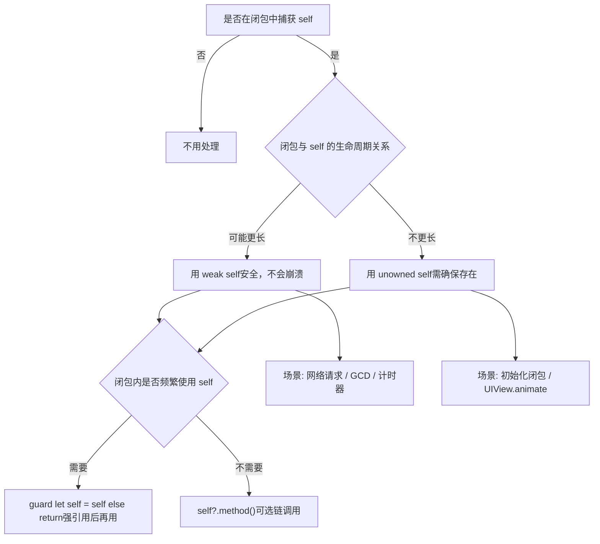

* `self` 弱引用

  👉[**弱引用的等价写法**](#弱引用的等价写法)

  ```swift
  /// [weak self]：在闭包中捕获 self 的弱引用，不会增加引用计数。
  /// guard let `self` = self else { return }：解包 self，如果对象已释放则直接退出闭包。
  /// 闭包内部再用 self，就是解包之后的强引用了，避免了 retain cycle。
  someAsyncOperation { [weak self] in
      guard let `self` = self else { return }// 固定写法（推荐）语义清晰
      self.doSomething()// 或者 self?.doSomething()
  }
  ```

* `self` 无主引用（有时 `self` 的生命周期保证比闭包长，可以用 `[unowned self]`）

  > ❌ 不要滥用 `[unowned self]`，一旦生命周期判断错了，会 **直接崩溃**。

  ```swift
  /// unowned 不会增加引用计数，也不需要解包。
  /// 但如果 self 已经释放，再调用就会 野指针崩溃。
  someAsyncOperation { [unowned self] in
      self.doSomething()
  }
  ```

### 24、为什么在[**Masonry**](https://github.com/SnapKit/Masonry)/[**SnapKit**](https://github.com/SnapKit/SnapKit)里面可以不用**weak**化的`self`❓<a href="#前言" style="font-size:17px; color:green;"><b>🔼</b></a> <a href="#🔚" style="font-size:17px; color:green;"><b>🔽</b></a>

* 因为 [**Masonry**](https://github.com/SnapKit/Masonry)/[**SnapKit**](https://github.com/SnapKit/SnapKit) 的约束闭包是**同步执行、不会被保存（非逃逸闭包）**的

  > `mas_makeConstraints:` 的实现本质上就是：创建一个 `MASConstraintMaker`，**立刻**调用你传进来的 **block**，然后安装约束，整个过程当场结束，不会把 **block** 存到任何被 `self` 持有的地方，自然也就**不会形成 self ↔︎ block 的循环引用**。

* 只有当**闭包会被保存/逃逸**时才需要 `weak self`，例如：

  - 把 **block** 存成 `self.someBlock = ^{ ... self ... };`（典型循环引用）
  - 传给会把 **block** 保存在属性里的对象，而这个对象又被 `self` 强持有

### 25、**Objc**.字典 🆚 [**Swift**](https://developer.apple.com/swift/).字典 <a href="#前言" style="font-size:17px; color:green;"><b>🔼</b></a> <a href="#🔚" style="font-size:17px; color:green;"><b>🔽</b></a>

* **Objc**.字典`NSDictionary<id<NSCopying>, id> *dict;`

  * Key：对象类型、实现了 `NSCopying` 协议、**最好是不可变对象** & 哈希稳定（唯一）、不可为<font color=red>**nil**</font>。
    * 👉 可以直接做OC.**NSDictionary**.Key的：`NSString *`、`NSNumber *`、`NSDate *`、自己实现了`NSCopying`的类
  * Value：可以是任意对象（原始类型要装箱成 `NSNumber` / `NSValue`）；不能是基本数据类型、不可为<font color=red>**nil**</font>（要用 `NSNull`）

* [**Swift**](https://developer.apple.com/swift/).字典（字典和数组都是用[]进行包裹）

  * Key：必须是 `Hashable`（即，必须能比较相等：`Equatable` ➕ 必须能提供哈希值：`func hash(into:)`）、**最好是不可变对象** & 哈希稳定（唯一）

    * 👉 可以直接做[**Swift**](https://developer.apple.com/swift/).**Dictionary**.Key的：`String`/`Int` / `Double` / `Bool`/`UUID`/`enum`（不带关联值的自动 Hashable；带关联值需让它遵守亦可以）/自定义的结构体/枚举/类，需遵守 `Hashable`

    * Key 可以是 Optional

      ```swift
      var dict: [String?: String] = [
          nil: "空 key",
          "a": "值 A"
      ]
      ```

  * Value：没有约束，任意类型都行（<font color=red>但字典里的 Value 类型必须统一</font>）

    ```swift
    // 全是 Int
    var d1: [String: Int] = [
        "sd": 1,
        "fg": 2
    ]
    // 全是 String
    var d2: [String: String] = [
        "sd": "1",
        "fg": "2"
    ]
    // 类似 OC 的 id
    var d3: [String: Any] = [
        "sd": 1,         // Int
        "fg": "2",       // String
        "arr": [1, 2, 3] // [Int]
    ]
    // 用的时候自己解：
    if let n = d3["sd"] as? Int { ... }
    if let s = d3["fg"] as? String { ... }
    ```

### 26、数组是引用类型还是值类型❓<a href="#前言" style="font-size:17px; color:green;"><b>🔼</b></a> <a href="#🔚" style="font-size:17px; color:green;"><b>🔽</b></a>

*  语言视角：**Array** 是 **struct**，属于值类型

  ```swift
  var a = [1, 2, 3]
  var b = a     // 这里从语义上讲是「复制了一份」
  
  b.append(4)
  
  print(a)  // [1, 2, 3]
  print(b)  // [1, 2, 3, 4]
  ```

* 实现视角：底层确实有“对象”，但对其隐藏了

  * 虽然语义是值类型，但为了性能，[**Swift**](https://developer.apple.com/swift/) **不会每次赋值就真的立刻拷贝整块内存**，而是：数组本体 (`Array<T>`) 是一个 `struct`，里面持有一个指向堆上 buffer（一个 **引用类型的存储对象**） 的引用

    ```swift
    var a = [1, 2, 3]
    var b = a     // 此时 a 和 b 共享同一个底层 buffer（RC = 2）
    b.append(4)   // 发现 buffer 被多方共享 ⇒ 触发 Copy-on-Write ⇒ 为 b 拷贝一份新 buffer
    ```

### 27、<font color=red id=COW>**C**</font>opy-<font color=red>**O**</font>n-<font color=red>**W**</font>rite（**第一次写入且有共享时**：才真的复制）<a href="#前言" style="font-size:17px; color:green;"><b>🔼</b></a> <a href="#🔚" style="font-size:17px; color:green;"><b>🔽</b></a>

> * **定义**：当你复制一个值类型的时候，[**Swift**](https://developer.apple.com/swift/) 不会立即复制它的底层存储，而是让两个变量共享同一块内存
> * **触发拷贝的时机**：一旦其中一个变量尝试 **写入（修改）** 数据，[**Swift**](https://developer.apple.com/swift/) 才会真正复制一份新的内存，以保证<u>值语义</u>的正确性
> * 为什么这样设计？
>   * **性能优化**：避免不必要的深拷贝，提升效率
>   * **值语义安全**：对外表现上 `Array` 仍然是<u>值类型</u>，互不影响
>   * **内存友好**：只有在真的需要修改时，才额外分配内存
> * 内存管理细节（**COW**的运行机制）
>   * [**Swift**](https://developer.apple.com/swift/) 底层用一个 **引用计数的 buffer** 来存放元素
>   * 每次赋值，引用计数 +1；
>   * 当有人写入时，发现引用计数 > 1，就触发拷贝 → 新 buffer

* 没有修改 → 不会拷贝

  ```swift
  var a = [1, 2, 3]
  var b = a   // 这里只是增加引用计数，共享存储
  print(a === b) // Swift 不允许直接 === 比较数组，但内部确实指向同一块存储
  ```

* 修改时 → 才会拷贝

  ```swift
  var a = [1, 2, 3]
  var b = a   // 共享存储
  b.append(4) // 🚨 此刻触发 copy-on-write，b 拷贝一份新的存储
  print(a)    // [1, 2, 3]
  print(b)    // [1, 2, 3, 4]
  ```

* 概念图

  * **COW**概念图（共享→写入→分裂）

    ```mermaid
    graph LR
        subgraph "赋值后（尚未写入）"
            A["var a"]
            B["var b"]
            Buf1["Buffer #1: [1,2,3]"]
            A --> Buf1
            B --> Buf1
            note1["引用计数 = 2"]
            Buf1 --- note1
        end
    
        subgraph "b 发生写入（append 4）"
            A2["var a"]
            B2["var b"]
            Buf1b["Buffer #1: [1,2,3]"]
            Buf2["Buffer #2: [1,2,3,4]"]
            A2 --> Buf1b
            B2 --> Buf2
            note2["写时拷贝触发 → b 获得新缓冲"]
            Buf2 --- note2
        end
    
        A -.-> A2
        B -.-> B2
    ```
  
  * 时间线（谁什么时候共享/拷贝）
  
    ```mermaid
    sequenceDiagram
        participant Dev as 你（代码）
        participant A as 变量 a
        participant B as 变量 b
        participant Buf1 as Buffer #1([1,2,3])
        participant Buf2 as Buffer #2
    
        Dev->>A: var a = [1,2,3]
        A->>Buf1: 绑定存储（RC=1）
    
        Dev->>B: var b = a
        B->>Buf1: 共享存储（RC=2）\n（尚未拷贝）
    
        Dev->>B: b.append(4)
        Note over B,Buf1: 发现 RC>1 -> 触发 COW
        B-->>Buf2: 复制 Buffer（新建）\n写入 4 -> [1,2,3,4]
    
        A-->>Buf1: 仍指向旧缓冲\n值保持 [1,2,3]
        B-->>Buf2: 指向新缓冲\n值为 [1,2,3,4]
    ```
  
  * 状态流转（决策视角）
  
    ```mermaid
    flowchart TD
        S["复制赋值: b = a"] --> C{"是否写入?"}
        C -- 否 --> Share["共享同一缓冲<br/>(无拷贝, RC+=1)"]
        C -- 是 --> RC{"引用计数 > 1 ?"}
        RC -- 否 --> InPlace["独占缓冲<br/>原地修改"]
        RC -- 是 --> Copy["分配新缓冲<br/>拷贝后写入"]
    ```

## 六、📎 附件 <a href="#前言" style="font-size:17px; color:green;"><b>🔼</b></a> <a href="#🔚" style="font-size:17px; color:green;"><b>🔽</b></a>

### 1、<font id=关闭页面@实现逻辑>关闭页面@实现逻辑</font> <a href="#前言" style="font-size:17px; color:green;"><b>🔼</b></a> <a href="#🔚" style="font-size:17px; color:green;"><b>🔽</b></a>

```swift
/// 因为呈现页面除了push就是present，但是push是需要有导航控制器作支撑的。
/// 那么就先判断是否存在导航控制器push呈现的，没有就是present呈现的
@discardableResult
func closeByResult(_ result: Any?, animated: Bool = true) -> Self {
    if let r = result { sendResult(r) }
    if let nav = navigationController { nav.popViewController(animated: animated) }
    else { dismiss(animated: animated) }
    return self
}
```

### 2、<font id=全局比例尺@实现逻辑>全局比例尺@实现逻辑</font> <a href="#前言" style="font-size:17px; color:green;"><b>🔼</b></a> <a href="#🔚" style="font-size:17px; color:green;"><b>🔽</b></a>

```swift
import UIKit

// MARK: - 核心比例器
public enum JXScale {
    private static var designW: CGFloat = 375
    private static var designH: CGFloat = 812
    private static var useSafeArea: Bool = false
    
    public static func setup(designWidth: CGFloat, designHeight: CGFloat, useSafeArea: Bool = false) {
        self.designW = designWidth
        self.designH = designHeight
        self.useSafeArea = useSafeArea
    }
    
    private static var screenSize: CGSize {
        guard let window = UIApplication.shared.windows.first(where: { $0.isKeyWindow }) else {
            return UIScreen.main.bounds.size
        }
        if useSafeArea {
            let insets = window.safeAreaInsets
            return CGSize(
                width: max(0, window.bounds.width - (insets.left + insets.right)),
                height: max(0, window.bounds.height - (insets.top + insets.bottom))
            )
        } else {
            return window.bounds.size
        }
    }
    
    public static var x: CGFloat { screenSize.width / designW }
    public static var y: CGFloat { screenSize.height / designH }
}

// MARK: - 扩展 Int / CGFloat
public extension BinaryInteger {
    var w: CGFloat { CGFloat(self) * JXScale.x }
    var h: CGFloat { CGFloat(self) * JXScale.y }
    var fz: CGFloat { CGFloat(self) * JXScale.x }   // 字体缩放，默认跟随 X
}

public extension BinaryFloatingPoint {
    var w: CGFloat { CGFloat(self) * JXScale.x }
    var h: CGFloat { CGFloat(self) * JXScale.y }
    var fz: CGFloat { CGFloat(self) * JXScale.x }
}
```

### 3、<font id=获取屏幕尺寸@实现逻辑>获取屏幕尺寸@实现逻辑</font> <a href="#前言" style="font-size:17px; color:green;"><b>🔼</b></a> <a href="#🔚" style="font-size:17px; color:green;"><b>🔽</b></a>

```swift
// MARK: - 屏幕宽高（兼容设备横竖屏）
public enum Screen {
    /// 当前界面方向（iOS 13+；拿不到时为 .unknown）
    private static var orientation: UIInterfaceOrientation {
        (UIApplication.shared.connectedScenes.first as? UIWindowScene)?
            .interfaceOrientation ?? .unknown
    }
    /// 屏幕尺寸（以点为单位，已按当前横竖屏纠正宽高）
    public static var size: CGSize {
        let s = UIScreen.main.bounds.size   // iOS 8+ 始终是竖屏坐标
        let w = s.width, h = s.height
        switch orientation {
        case .landscapeLeft, .landscapeRight:
            return CGSize(width: max(w, h), height: min(w, h))
        case .portrait, .portraitUpsideDown:
            return CGSize(width: min(w, h), height: max(w, h))
        default:
            // 拿不到方向时，兜底返回系统给的
            return s
        }
    }
    /// 便捷：当前屏幕宽 / 高（按横竖屏纠正）
    public static var width: CGFloat  { size.width }
    public static var height: CGFloat { size.height }
}
```

### 4、<font id=给UILabel里的文字加下划线并且可以指定下划线的颜色@实现逻辑>给 `UILabel` 里的文字加下划线并且可以指定下划线的颜色@实现逻辑</font> <a href="#前言" style="font-size:17px; color:green;"><b>🔼</b></a> <a href="#🔚" style="font-size:17px; color:green;"><b>🔽</b></a>

```swift
extension UILabel {
    func underline(color: UIColor) {
        if let textString = self.text {
            let attributedString = NSMutableAttributedString(string: textString)
            attributedString.addAttribute(NSAttributedString.Key.underlineStyle,
                                          value: NSUnderlineStyle.single.rawValue,
                                          range: NSRange(location: 0, length: attributedString.length))
            attributedString.addAttribute(NSAttributedString.Key.underlineColor,
                                          value: color,
                                          range: NSRange(location: 0, length: attributedString.length))
            self.attributedText = attributedString
        }
    }
}
```

### 5、<font size=5>`UIScrollView`</font> 的减速函数 <a href="#前言" style="font-size:17px; color:green;"><b>🔼</b></a> <a href="#🔚" style="font-size:17px; color:green;"><b>🔽</b></a>

> 苹果虽然没把 <font size=5>`UIScrollView`</font> 的内部源码开出来，但 [**WWDC**]() + 反推基本已经确定：**本质就是一个按 <font size=5>`decelerationRate`</font> 做指数衰减的速度函数**。

* 设：

  - 初始速度：`v₀`（单位：pt/s，滚动结束时 `withVelocity:` 传进来的那个）
  - `d = decelerationRate.rawValue`（`.normal ≈ 0.998`，`.fast ≈ 0.99`）[Apple Developer+1](https://developer.apple.com/documentation/uikit/uiscrollview/decelerationrate-swift.property?utm_source=chatgpt.com)
  - 时间 `t` 单位：秒

* 速度随时间：<font size=5>`UIScrollView`</font> 的约定是：「**每毫秒**把速度乘以一次 `d`」

* 所以：

  - 毫秒记为 `k = 1000·t`

  - 第 `k` 毫秒的速度：`v(k) = v₀ · dᵏ`

  - 换成以秒为自变量的连续形式：

    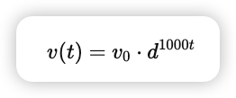
    
  - 位移（相对初始位置）：
  
    > 注意：`0 < d < 1`，因此 `ln d < 0`，式子整体是正的（往前滚）
    
    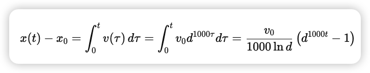
    
  - 最终停止时的总位移（t → ∞）：
  
    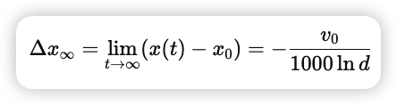
  
  - WWDC 的投射函数里给的是一个**近似**（为了少算一次 log）：
  
    > 当 `d` 很接近 1（0.99 / 0.998 这种）时，这个近似和上面精确公式非常接近
  
    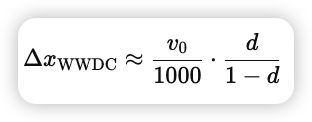

### 6、<font color=red id=内置的HTML代码>**内置的HTML代码**</font> <a href="#前言" style="font-size:17px; color:green;"><b>🔼</b></a> <a href="#🔚" style="font-size:17px; color:green;"><b>🔽</b></a>

```swift
static let demoHTML = """
<!doctype html>
<html>
<head>
  <meta charset="utf-8">
  <title>BaseWebView Usage Demo</title>
  <meta name="viewport" content="width=device-width, initial-scale=1">
  <style>
    html,body { margin:0; padding:0; font-family:-apple-system,Helvetica; }
    header { position:sticky; top:0; background:#111; color:#fff; padding:12px 16px; font-weight:600; }
    main { padding:16px; }
    button { padding:10px 14px; margin:6px 6px 6px 0; border-radius:8px; border:1px solid #ccc; background:#fafafa; }
    pre { background:#f6f8fa; padding:10px; border-radius:6px; white-space:pre-wrap; word-break:break-word; max-height:40vh; overflow:auto; }
    .row { display:flex; gap:8px; flex-wrap:wrap; }
    a { color:#0a84ff; }
  </style>
</head>
<body>
  <header>BaseWebView · JS ↔︎ Native</header>
  <main>
    <div class="row">
      <button id="btnPing">JS→Native ping()</button>
      <button id="btnAlert">JS→Native openAlert()</button>
      <button id="btnDisableSel">禁用选择 ON</button>
      <button id="btnEnableSel">禁用选择 OFF</button>
    </div>

    <p>外链/下载：</p>
    <div class="row">
      <a href="mailto:test@example.com">mailto</a>
      <a href="https://example.com" target="_blank">_blank 打开 example.com</a>
      <a href="data:text/plain,hello" download="hello.txt">下载 data: 文本</a>
    </div>

    <p>日志：</p>
    <pre id="log"></pre>
  </main>

  <script>
    const logEl = document.getElementById('log');
    function log(){ const line=[...arguments].map(a=>typeof a==='string'?a:JSON.stringify(a)).join(' ');
      console.log(line); logEl.textContent=(line+"\\n"+logEl.textContent).slice(0, 10000); }

    document.addEventListener('nativeReady', e => log('[event] nativeReady:', e.detail));

    document.getElementById('btnPing').addEventListener('click', async () => {
      const res = await Native.call('ping', { msg:'hello from JS', rnd: Math.random() });
      log('[reply] ping =>', res);
    });

    document.getElementById('btnAlert').addEventListener('click', async () => {
      const res = await Native.call('openAlert', { message:'JS 请求原生 Alert' });
      log('[reply] openAlert =>', res);
    });

    document.getElementById('btnDisableSel').addEventListener('click', async () => {
      const res = await Native.call('toggleSelection', { disabled:true });
      log('[reply] toggleSelection =>', res);
    });
    document.getElementById('btnEnableSel').addEventListener('click', async () => {
      const res = await Native.call('toggleSelection', { disabled:false });
      log('[reply] toggleSelection =>', res);
    });
  </script>
</body>
</html>
"""
```

<a id="🔚" href="#前言" style="font-size:17px; color:green; font-weight:bold;">我是有底线的👉点我回到首页</a>
