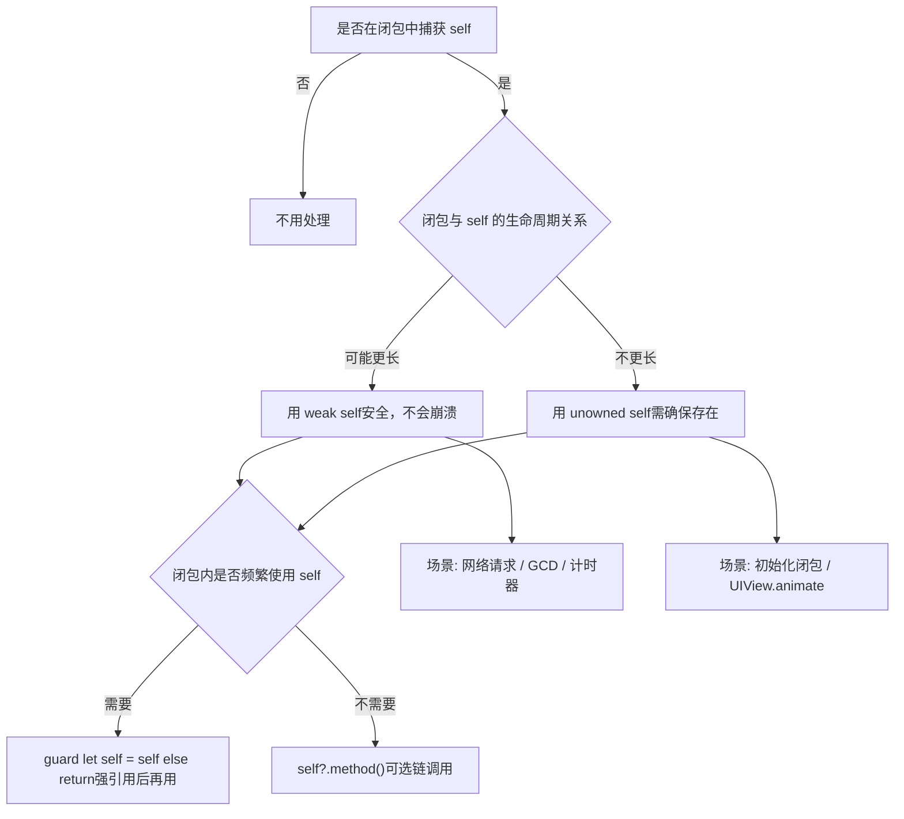

# **iOS**.[**Swift**](https://developer.apple.com/swift/)@<font color=red>靶场项目</font>蓝皮书📘


<p align="left">
  <a></a>
  <a></a>
  <a></a>
  <a></a>
  <a></a>
  <a href="https://github.com/295060456/JobsSwiftBaseConfigDemo"></a>
  <a></a>
  <a href="https://github.com/295060456/JobsSwiftBaseConfigDemo/stargazers"></a>
  <a href="https://github.com/295060456/JobsSwiftBaseConfigDemo/network"></a>
  <a></a>
  <a></a>
  <a></a>
</p>

[toc]

当前总行数：

## 🔥 <font id=前言>前言</font>

> 温馨提示🔔：本文较长，需要⏬下载到本地以后，方能完整阅读。推荐阅读器👉[**Typora**](https://typora.io/)

* **工欲善其事必先利其器**
* **站在巨人的肩膀上，才能看得更远**
* **面向信仰编程**

## 一、🎯 项目白皮书 <a href="#前言" style="font-size:17px; color:green;"><b>🔼</b></a> <a href="#🔚" style="font-size:17px; color:green;"><b>🔽</b></a>

> 程序员是一个高消耗的职业，除了日常基本的业务开发以外，新事物的不断涌现也需要持续性的学习，所以是一件非常消耗精力的事；而且由于长期的高压、高情绪、熬夜，**会打乱人体内正常的内分泌节奏**，大概率也会逐渐的引发各种职业疾病。业内普遍认为程序员的**黄金年龄在25～35周岁**。那么，还是希望，在我们（亦或者是暂时性的）离开这个行业的时候，一定要为自己或者后人，留下点什么，算是这么多年的一个工作总结。此外，能最大化的辅助人，帮助其在极短的时间内去：<u>回忆/上手/学习/实验</u>这个编程语言下的工程项目。所以，此项目就一定是要结合商业需求去务实拓展，解决当前痛点。

* 品控标准（只能严格的保证编译器正常，而不能完全保证运行时的不出错）
  * 一定要保证这个工程的成功编译通过，方便以后项目直接进行引用，乃至开新版本
  * <font color=blue>**示例Demo可能因为相关Api的升级，没有及时的覆盖处理，可能会出现闪退。修复即可**</font>
* 自此以后，所有新开的项目都可以根据这个**根项目**来进行统一的调配和使用
  * 将它作为所有项目的母版和基类，最大限度的做到全局的统一
  * 日积月累的记录一些平时生产生活中萌发的一些优秀的想法、灵光一现的创意。包括但不仅限于：<u>语法糖的封装</u>、<u>方法的调用</u>，<u>第三方的选用</u>、以及一些心得体会
* 作为某些代码**实践靶场**，在实际开发过程中，是非常有必要的
  * 为我们快速且稳定的复现一些业务场景，作为代码实验室🧪，而搭建的一个平台
* 作为代码笔记，记录一些常用的代码，方便查阅
  * 主要形式是可以运行的代码 + 文字性叙述 + 图文混编讲解
  * 作为学习的资料，可以快速了解到一些常用的知识，大幅**降低学习成本**
  * 作为其他项目的参考，可以快速的了解到项目的架构，代码规范，以及一些设计模式
  * 这么一些优秀的成果，其来源不仅仅是来自于作者本身的持续付出与积累。更是这个领域大家庭中各路优秀作者的智慧结晶

## 二、👥 项目配置 <a href="#前言" style="font-size:17px; color:green;"><b>🔼</b></a> <a href="#🔚" style="font-size:17px; color:green;"><b>🔽</b></a>

### 1、软件支持 <a href="#前言" style="font-size:17px; color:green;"><b>🔼</b></a> <a href="#🔚" style="font-size:17px; color:green;"><b>🔽</b></a>

* [**过期的模拟器配件**](https://github.com/295060456/Xcode_Sys_lib) 

* [**quicktype**](https://app.quicktype.io/)：从 **JSON** / **GraphQL** /其它数据格式 自动生成对应语言的类型定义

* [**snipaste**](https://www.snipaste.com/)：截图工具

* [**Sip**](https://sipapp.io/)：取色器

### 2、第三方管理 <a href="#前言" style="font-size:17px; color:green;"><b>🔼</b></a> <a href="#🔚" style="font-size:17px; color:green;"><b>🔽</b></a>

* **Mac OS 15** 以后，苹果采取了更加严格的权限写入机制。新[**Swift**](https://developer.apple.com/swift/)项目如果要利用[**`Cocoapods`**](https://cocoapods.org/)来集成第三方，就比如在**xcode**里面做如下设置，否则编译失败：`TARGETS`->`Build Settings`->`ENABLE_USER_SCRIPT_SANDBOXING`-><font color=red>`NO`</font>

  

  [**脚本处理**](./【MacOS】⚙️双击禁用沙盒保证Cocoapods构建流程.command)

  ```shell
  #!/bin/zsh
  
  print_green()  { echo "\033[0;32m$1\033[0m"; }
  print_red()    { echo "\033[0;31m$1\033[0m"; }
  print_yellow() { echo "\033[0;33m$1\033[0m"; }
  
  print_green "🛠️ 脚本功能："
  echo "1️⃣ 自动识别 Flutter 或原生 iOS 工程"
  echo "2️⃣ 自动定位 Xcode 工程（.xcodeproj）文件"
  echo "3️⃣ 修改 ENABLE_USER_SCRIPT_SANDBOXING = NO，防止 CocoaPods 构建失败"
  echo ""
  
  SCRIPT_DIR=$(cd "$(dirname "$0")"; pwd)
  XCODEPROJ=""
  
  # 尝试自动识别 Flutter / iOS 工程路径
  if [[ -d "$SCRIPT_DIR/ios" && -d "$SCRIPT_DIR/lib" ]]; then
    print_green "📦 检测到 Flutter 工程，进入 ios 子目录查找 Xcode 工程..."
    PROJECT_DIR="$SCRIPT_DIR/ios"
  else
    print_green "📱 尝试在当前目录查找原生 iOS 工程..."
    PROJECT_DIR="$SCRIPT_DIR"
  fi
  
  # 自动寻找 .xcodeproj
  XCODEPROJ=$(find "$PROJECT_DIR" -maxdepth 1 -name "*.xcodeproj" | head -n 1)
  
  # 如果找不到，就让用户手动拖入
  if [[ -z "$XCODEPROJ" ]]; then
    print_red "❌ 未自动找到 .xcodeproj 文件"
    echo ""
    read "?👉 请手动拖入你的 .xcodeproj 工程文件，然后按回车：" XCODEPROJ
    XCODEPROJ=${XCODEPROJ%\"}
    XCODEPROJ=${XCODEPROJ#\"}
  fi
  
  # 校验路径有效性
  PBXPROJ_PATH="$XCODEPROJ/project.pbxproj"
  if [[ ! -f "$PBXPROJ_PATH" ]]; then
    print_red "❌ 找不到 project.pbxproj 文件，请确认路径正确"
    exit 1
  fi
  
  print_yellow "📂 目标工程：$XCODEPROJ"
  print_green  "🔍 正在查找 ENABLE_USER_SCRIPT_SANDBOXING 设置..."
  
  # ✅ 若已存在，则替换为 NO
  grep -q "ENABLE_USER_SCRIPT_SANDBOXING" "$PBXPROJ_PATH"
  if [[ $? -eq 0 ]]; then
    print_green "✅ 已找到 ENABLE_USER_SCRIPT_SANDBOXING，正在替换为 NO..."
    sed -i '' 's/ENABLE_USER_SCRIPT_SANDBOXING = YES;/ENABLE_USER_SCRIPT_SANDBOXING = NO;/g' "$PBXPROJ_PATH"
    sed -i '' 's/ENABLE_USER_SCRIPT_SANDBOXING = YES/ENABLE_USER_SCRIPT_SANDBOXING = NO/g' "$PBXPROJ_PATH"
  else
    print_green "➕ 未显式设置，添加 ENABLE_USER_SCRIPT_SANDBOXING = NO 到所有 buildSettings..."
    sed -i '' '/buildSettings = {/a\
  \        ENABLE_USER_SCRIPT_SANDBOXING = NO;
  ' "$PBXPROJ_PATH"
  fi
  
  print_green "🎉 修改完成！已将 ENABLE_USER_SCRIPT_SANDBOXING 设置为 NO"

* <font color=red id=SPM>**S**</font>wift <font color=red>**P**</font>ackage <font color=red>**M**</font>anager

  <div style="text-align: center;">
    
    
  </div>

### 3、一些适用于[Swift](https://developer.apple.com/swift/)的第三方框架（持续更新...） <a href="#前言" style="font-size:17px; color:green;"><b>🔼</b></a> <a href="#🔚" style="font-size:17px; color:green;"><b>🔽</b></a>

#### 3.1、[**DeviceKit**](https://github.com/devicekit/DeviceKit) <a href="#前言" style="font-size:17px; color:green;"><b>🔼</b></a> <a href="#🔚" style="font-size:17px; color:green;"><b>🔽</b></a>

#### 3.2、[**HandyJSON**](https://github.com/alibaba/HandyJSON) <a href="#前言" style="font-size:17px; color:green;"><b>🔼</b></a> <a href="#🔚" style="font-size:17px; color:green;"><b>🔽</b></a>

> 1、阿里巴巴开发
>
> 2、 **[Swift](https://developer.apple.com/swift/) 的 JSON 与模型映射库**
>
> 3、**简化 [Swift](https://developer.apple.com/swift/)  与 JSON 数据之间的序列化 / 反序列化过程**，避免传统方式下大量手写 `Codable`、`init(from:)` 或者 `Mappable` 的模板化代码
>
> 4、[**Swift**](https://developer.apple.com/swift/).[**Codable**](https://developer.apple.com/documentation/swift/codable) 🆚 [**HandyJSON**](https://github.com/alibaba/HandyJSON)
>
> ​	4.1、**Codable** 是苹果官方的，类型安全，但需要写 `CodingKeys`，代码量较大。适合 **严格的数据结构、编译期安全** 的项目。
>
> ​	4.2、**HandyJSON** 偏动态映射，更“自动化”，开发效率高，但类型安全性稍差（运行期做解析）。适合 **快速开发 / 需求变动大的场景**。
* 基本用法

  *  **JSON** ↔️ 模型

    定义模型

    ```swift
    import HandyJSON
    
    struct User: HandyJSON {
        var id: Int?
        var name: String?
        var age: Int?
    }
    ```

    JSON → 模型

    ```swift
    let json = "{\"id\":123, \"name\":\"Jobs\", \"age\":18}"
    if let user = User.deserialize(from: json) {
        print(user.name ?? "")  // 输出 "Jobs"
    }
    ```

    模型 → JSON

    ```swift
    let user = User(id: 123, name: "Jobs", age: 18)
    let jsonString = user.toJSONString()
    print(jsonString ?? "")
    ```
    
  * 枚举 + `HandyJSONEnum`： [**HandyJSON**](https://github.com/alibaba/HandyJSON) 对 **枚举序列化 / 反序列化** 的支持

    ```swift
    /**
     让枚举（必须是 原始值枚举，比如 Int 或 String）可以直接和 JSON 中的原始值互转。
     例如 JSON 返回 "status": 2，可以直接映射到 JXLoginStatus.normal_login。
     反过来，枚举转 JSON 时会自动输出原始值。
     */
    enum JXLoginStatus: Int, HandyJSONEnum {
        case didnot_login = 1
        case normal_login = 2
    }
    ```

#### 3.3、[**SnapKit**](https://github.com/SnapKit/SnapKit) <a href="#前言" style="font-size:17px; color:green;"><b>🔼</b></a> <a href="#🔚" style="font-size:17px; color:green;"><b>🔽</b></a>

  * 安装
  
    * [**Cocoapods**](https://cocoapods.org/)
    
      > 在 `Podfile` 中添加：
    
      ```ruby
      pod 'SnapKit'
      ```
    
    * [<font color=red>**S**</font>wift <font color=red>**P**</font>ackage <font color=red>**M**</font>anager](#SPM)
    
      > Xcode → File → Add Packages Dependency → 输入：
    
      ```url
      https://github.com/SnapKit/SnapKit
      ```
    
  * 导入
  
    ```swift
    import SnapKit
    ```
  
  * 调用
    
    * 创建视图并添加约束
    
      > 先加后用
      >
      > ```swift
      > let box = UIView()
      > box.backgroundColor = .red
      > view.addSubview(box)
      > 
      > box.snp.makeConstraints { make in
      >     make.center.equalToSuperview()    // 居中
      >     make.width.height.equalTo(100)    // 宽高 = 100
      > }
      > ```
    
    * 常用约束写法
    
      * 相对父视图
    
        ```swift
        make.top.equalToSuperview().offset(20)      // 距离父视图顶部 20
        make.left.equalToSuperview().offset(15)     // 左边距 15
        make.right.equalToSuperview().inset(15)     // 右边距 15（inset = -offset）
        make.bottom.equalToSuperview().offset(-20)  // 底边距 20
        ```
    
      * 相对其它视图
    
        ```swift
        make.top.equalTo(titleLabel.snp.bottom).offset(10)  // 距离 titleLabel 底部 10
        make.left.equalTo(icon.snp.right).offset(8)         // 距离 icon 右边 8
        ```
    
      * 固定大小
    
        ```swift
        make.width.equalTo(120)
        make.height.equalTo(50)
        ```
    
      * 宽高比
    
        ```swift
        make.width.equalTo(view.snp.height).multipliedBy(0.5) // 宽 = 高 * 0.5
        ```
    
      * 居中
    
        ```swift
        make.center.equalToSuperview()     // 完全居中
        make.centerX.equalToSuperview()    // 横向居中
        make.centerY.equalToSuperview()    // 纵向居中
        ```
    
      * 更新约束（`updateConstraints`）

        > 适合要修改部分约束的情况

        ```swift
        box.snp.updateConstraints { make in
            make.width.equalTo(200)   // 原来100 → 更新为200
        }
        ```

      * 重新设置约束（`remakeConstraints`）

        > 会先移除旧约束，再重新添加

        ```swift
        box.snp.remakeConstraints { make in
            make.center.equalToSuperview()
            make.size.equalTo(CGSize(width: 50, height: 50))
        }
        ```
      
      * 高级用法@优先级

        ```swift
        make.width.lessThanOrEqualTo(300).priority(.high)
        ```

      * 高级用法@SafeArea

        ```swift
        make.top.equalTo(view.safeAreaLayoutGuide.snp.top).offset(10)
        ```

      * 高级用法@链式多条件

        ```swift
        make.edges.equalToSuperview().inset(UIEdgeInsets(top: 10, left: 15, bottom: 20, right: 15))
        ```

#### 3.4、[**Alamofire**](https://github.com/Alamofire/Alamofire) <a href="#前言" style="font-size:17px; color:green;"><b>🔼</b></a> <a href="#🔚" style="font-size:17px; color:green;"><b>🔽</b></a>

> **Alamofire** 是 Swift 社区最流行的 **网络请求库**，基于 **URLSession** 封装，简化了 HTTP 请求、响应处理、JSON 解析、文件上传下载等操作。
>  它的特点是：
>
> - 语法简洁，链式调用
> - 内置 JSON/Plist 参数编码与解析
> - 支持上传/下载（含进度回调）
> - 支持认证（Basic Auth、OAuth Bearer Token 等）
> - 集成了网络请求队列、响应序列化、错误处理等常见功能
>
> 在 iOS 开发中，它相当于 Objective-C 时代的 **AFNetworking** 的 Swift 替代。

* 安装
  
    * [**Cocoapods**](https://cocoapods.org/)
    
      > 在 `Podfile` 中添加：
    
      ```ruby
      pod 'Alamofire'
      ```
    
    * [<font color=red>**S**</font>wift <font color=red>**P**</font>ackage <font color=red>**M**</font>anager](#SPM)
    
      > Xcode → File → Add Packages Dependency → 输入：
    
      ```url
      https://github.com/Alamofire/Alamofire.git
      ```
    
* 导入
  
    ```swift
  import Alamofire
  ```
  
* 调用
  
    * GET 请求
    
      ```swift
      import Alamofire
      
      AF.request("https://api.example.com/users").response { response in
          debugPrint(response)
      }
      ```
    
    * GET + JSON 解析
    
      ```swift
      AF.request("https://api.example.com/users")
          .responseJSON { response in
              switch response.result {
              case .success(let value):
                  print("返回 JSON: \(value)")
              case .failure(let error):
                  print("请求失败: \(error)")
              }
          }
      ```
    
    * POST 请求（带参数）
    
      ```swift
      let params: [String: Any] = [
          "username": "jobs",
          "password": "123456"
      ]
      
      AF.request("https://api.example.com/login",
                 method: .post,
                 parameters: params,
                 encoding: JSONEncoding.default)
          .responseJSON { response in
              print(response)
          }
      ```
    
    * 文件上传
    
      ```swift
      AF.upload(multipartFormData: { formData in
          formData.append(Data("jobs".utf8), withName: "username")
          formData.append(URL(fileURLWithPath: "/path/to/file.png"), withName: "file")
      }, to: "https://api.example.com/upload")
      .responseJSON { response in
          print(response)
      }
      ```
    
    * 文件下载
    
      ```swift
      let destination: DownloadRequest.Destination = { _, _ in
          let documentsURL = FileManager.default.urls(for: .documentDirectory, in: .userDomainMask)[0]
          let fileURL = documentsURL.appendingPathComponent("file.zip")
      
          return (fileURL, [.removePreviousFile, .createIntermediateDirectories])
      }
      
      AF.download("https://example.com/file.zip", to: destination)
          .downloadProgress { progress in
              print("下载进度: \(progress.fractionCompleted)")
          }
          .response { response in
              print("下载完成: \(response.fileURL)")
          }
      
      ```
    
    * 全局配置（比如统一 Header、超时设置）
    
      ```swift
      let configuration = URLSessionConfiguration.default
      configuration.timeoutIntervalForRequest = 30
      
      let session = Session(configuration: configuration)
      
      session.request("https://api.example.com/data").responseJSON { response in
          print(response)
      }
      ```
    
    * 链式调用
    
      ```swift
      AF.request("https://api.example.com/user")
          .validate(statusCode: 200..<300)
          .responseDecodable(of: User.self) { response in
              switch response.result {
              case .success(let user):
                  print("用户数据: \(user)")
              case .failure(let error):
                  print("错误: \(error)")
              }
          }

#### 3.5、[**Moya**](https://github.com/Moya/Moya) <a href="#前言" style="font-size:17px; color:green;"><b>🔼</b></a> <a href="#🔚" style="font-size:17px; color:green;"><b>🔽</b></a>

> - **定位**：[**Moya**](https://github.com/Moya/Moya) 是一个 **网络抽象层**（Networking Abstraction Layer）。
> - **底层**：它基于 [**Alamofire**](https://github.com/Alamofire/Alamofire) 实现请求发送，但对业务开发者屏蔽了繁琐的配置。
> - **核心思想**：用 **枚举（enum）+ 协议（TargetType）** 来定义接口。
>
> 这样做的好处：
>
> 1. **接口集中管理**：所有 API 路径、参数、请求方式写在一个地方，清晰可维护。
> 2. **避免魔法字符串**：不需要在代码里到处拼接 URL、HTTP 方法。
> 3. **更适合多人协作**：规范化 API 层，降低出错率。

* 安装
  
    * [**Cocoapods**](https://cocoapods.org/)
    
      > 在 `Podfile` 中添加：
    
      ```ruby
      pod 'Moya'
      ```
    
    * [<font color=red>**S**</font>wift <font color=red>**P**</font>ackage <font color=red>**M**</font>anager](#SPM)
    
      > Xcode → File → Add Packages Dependency → 输入：
    
      ```url
      https://github.com/Moya/Moya.git
      ```
    
* 导入
  
    ```swift
  import Moya
  ```

* 调用

  * 定义 API 枚举

    ```swift
    enum MyService {
        case getUser(id: Int)
        case createUser(name: String, age: Int)
    }
    
    // 遵循 TargetType 协议
    extension MyService: TargetType {
        var baseURL: URL { URL(string: "https://api.example.com")! }
    
        var path: String {
            switch self {
            case .getUser(let id):
                return "/user/\(id)"
            case .createUser:
                return "/user"
            }
        }
    
        var method: Moya.Method {
            switch self {
            case .getUser:
                return .get
            case .createUser:
                return .post
            }
        }
    
        var task: Task {
            switch self {
            case .getUser:
                return .requestPlain
            case .createUser(let name, let age):
                return .requestParameters(parameters: ["name": name, "age": age],
                                          encoding: JSONEncoding.default)
            }
        }
    
        var headers: [String: String]? {
            ["Content-Type": "application/json"]
        }
    }
    ```

  * 创建 Provider

    ```swift
    let provider = MoyaProvider<MyService>()
    ```

  * 发送请求

    ```swift
    // GET
    provider.request(.getUser(id: 1)) { result in
        switch result {
        case .success(let response):
            print("返回: \(response.data)")
        case .failure(let error):
            print("错误: \(error)")
        }
    }
    
    // POST
    provider.request(.createUser(name: "Jobs", age: 18)) { result in
        switch result {
        case .success(let response):
            print("创建成功: \(response.data)")
        case .failure(let error):
            print("失败: \(error)")
        }
    }
    ```

  * 插件机制（可以拦截请求/响应，例如统一打印日志、添加 token）

    ```swift
    final class NetworkLogger: PluginType {
        func willSend(_ request: RequestType, target: TargetType) {
            print("➡️ 请求: \(request.request?.url?.absoluteString ?? "")")
        }
    
        func didReceive(_ result: Result<Response, MoyaError>, target: TargetType) {
            print("⬅️ 响应: \(result)")
        }
    }
    
    let provider = MoyaProvider<MyService>(plugins: [NetworkLogger()])
    ```

  * 响应模型解析

    ```swift
    provider.request(.getUser(id: 1)) { result in
        switch result {
        case .success(let response):
            do {
                let user = try JSONDecoder().decode(User.self, from: response.data)
                print("用户: \(user)")
            } catch {
                print("解析失败: \(error)")
            }
        case .failure(let error):
            print("请求错误: \(error)")
        }
    }
    ```

  * **Stub（模拟数据）**：适合写单元测试或本地开发

    ```swift
    let stubProvider = MoyaProvider<MyService>(stubClosure: MoyaProvider.immediatelyStub)
    stubProvider.request(.getUser(id: 1)) { result in
        print(result)
    }
    ```

#### 3.6、[**RxSwift**](https://github.com/ReactiveX/RxSwift) <a href="#前言" style="font-size:17px; color:green;"><b>🔼</b></a> <a href="#🔚" style="font-size:17px; color:green;"><b>🔽</b></a>

> **最小依赖**：只用 `RxSwift`。
>
> **MVVM 开发**：通常 `RxSwift + RxCocoa + RxRelay` 一起用。
>
> ✅ **优点**
>
> - 统一事件流（UI、网络、通知、定时器等）
> - 代码声明式，可读性好
> - 天然适合 MVVM 架构
>
> ⚠️ **缺点**
>
> - 学习曲线陡峭（操作符多）
> - 调试不直观（需要习惯事件流思维）
> - 不注意释放可能导致 **内存泄漏**

* 安装
  
    * [**Cocoapods**](https://cocoapods.org/)
    
      > 在 `Podfile` 中添加：
    
      ```ruby
      # 核心库
      pod 'RxSwift', # 核心
      pod 'RxCocoa', # UI 绑定：UIKit、AppKit 的扩展
      pod 'RxRelay', # 安全替代 Variable，常用于 ViewModel
      ```
    
    * [<font color=red>**S**</font>wift <font color=red>**P**</font>ackage <font color=red>**M**</font>anager](#SPM)
    
      > Xcode → File → Add Packages Dependency → 输入：
    
      ```url
      https://github.com/ReactiveX/RxSwift.git
      ```
    
* 导入
  
    ```swift
  import RxSwift    // 核心 Observable / Observer / Disposable
  import RxCocoa    // UI 控件绑定（如 textField.rx.text、button.rx.tap）
  import RxRelay    // BehaviorRelay / PublishRelay
  ```
  
* 调用
  
    > **按钮**：`tap.throttle + withLatestFrom(最新输入)`
  >
  > **输入**：`debounce + distinctUntilChanged + filter`
  >
  > **UI 绑定**：尽量用 `Driver/Signal`（主线程、无 error、共享）
  >
  > **监听**：`NotificationCenter.default.rx.notification(name[, object])`
  >
  > **解析**：`compactMap` 安全取 `userInfo`
  >
  > **性能**：`debounce/throttle/distinctUntilChanged/share(replay:)`
  >
  > **释放**：`disposed(by: bag)` 即可，无需 `removeObserver`
  
  * 按钮防连点（节流）
  
    ```swift
    loginBtn.rx.tap
        .throttle(.milliseconds(500), scheduler: MainScheduler.instance) // 500ms 内只认第一次
        .withLatestFrom(Observable.combineLatest(vm.username, vm.password)) // 点一下带最新输入
        .subscribe(onNext: { (u, p) in
            // do login(u, p)
        })
        .disposed(by: bag)
    ```
  
  * 输入框实时校验（长度/邮箱等）
  
    ```swift
    let usernameValid = usernameTF.rx.text.orEmpty
        .map { $0.count >= 3 }
        .distinctUntilChanged()
        .share(replay: 1)
    
    let passwordValid = passwordTF.rx.text.orEmpty
        .map { $0.count >= 6 }
        .distinctUntilChanged()
        .share(replay: 1)
    
    // 邮箱示例（可选）
    let emailValid = usernameTF.rx.text.orEmpty
        .map { text in
            let pattern = #"^[A-Z0-9._%+-]+@[A-Z0-9.-]+\.[A-Z]{2,}$"#
            return text.range(of: pattern, options: [.regularExpression, .caseInsensitive]) != nil
        }
        .share(replay: 1)
    ```
  
  * 启用按钮 + 视觉态
  
    ```swift
    Observable.combineLatest(usernameValid, passwordValid) { $0 && $1 }
        .bind(to: loginBtn.rx.isEnabled)
        .disposed(by: bag)
    
    Observable.combineLatest(usernameValid, passwordValid) { $0 && $1 }
        .map { $0 ? 1.0 : 0.5 }
        .bind(to: loginBtn.rx.alpha)
        .disposed(by: bag)
    ```
  
  * 搜索输入：去抖 + 去重 + 非空
  
    ```swift
    let searchText = searchTF.rx.text.orEmpty
        .debounce(.milliseconds(300), scheduler: MainScheduler.instance) // 停止输入300ms再发
        .distinctUntilChanged()
        .filter { !$0.isEmpty } // 过滤空串
        .share(replay: 1)
    
    searchText
        .subscribe(onNext: { query in
            // fire search(query)
        })
        .disposed(by: bag)
    ```
  
  * 限制最大长度（回写 UI）
  
    ```swift
    let limitedPwd = passwordTF.rx.text.orEmpty
        .map { String($0.prefix(20)) } // 最多 20 位
        .share(replay: 1)
    
    limitedPwd
        .bind(to: passwordTF.rx.text)
        .disposed(by: bag)
    ```
  
  * Return 键行为（下一步 / 提交）
  
    ```swift
    // 用户名回车 -> 焦点移到密码
    usernameTF.rx.controlEvent(.editingDidEndOnExit)
        .subscribe(onNext: { [weak self] in self?.passwordTF.becomeFirstResponder() })
        .disposed(by: bag)
    
    // 密码回车 -> 触发登录（带最新输入）
    passwordTF.rx.controlEvent(.editingDidEndOnExit)
        .withLatestFrom(Observable.combineLatest(vm.username, vm.password))
        .subscribe(onNext: { (u, p) in
            // do login(u, p)
        })
        .disposed(by: bag)
    ```
  
  * 用 Driver 做 UI 绑定（推荐）
  
    ```swift
    let canLogin = Observable.combineLatest(usernameValid, passwordValid) { $0 && $1 }
        .asDriver(onErrorJustReturn: false)
    
    canLogin
        .drive(loginBtn.rx.isEnabled)
        .disposed(by: bag)
    
    canLogin
        .map { $0 ? 1.0 : 0.5 }
        .drive(loginBtn.rx.alpha)
        .disposed(by: bag)
    ```
  
  * 实战最小组合（按钮点击 + 最新值 + 节流）
  
    ```swift
    let creds = Observable.combineLatest(usernameTF.rx.text.orEmpty,
                                         passwordTF.rx.text.orEmpty) { ($0, $1) }
        .share(replay: 1)
    
    loginBtn.rx.tap
        .throttle(.milliseconds(500), scheduler: MainScheduler.instance)
        .withLatestFrom(creds)
        .subscribe(onNext: { (u, p) in
            // do login(u, p)
        })
        .disposed(by: bag)
    ```
  
  * 监听系统通知（NotificationCenter → Rx）
  
    ```swift
    import RxSwift
    import RxCocoa
    
    let bag = DisposeBag()
    
    NotificationCenter.default.rx.notification(UIApplication.didBecomeActiveNotification)
        .subscribe(onNext: { _ in
            print("app 回到前台")
        })
        .disposed(by: bag)
    ```
  
  * 监听 + 取 `userInfo`（安全解包）
  
    ```swift
    extension Notification.Name {
        static let loginStateChanged = Notification.Name("loginStateChanged")
    }
    
    // 监听
    NotificationCenter.default.rx.notification(.loginStateChanged)
        .compactMap { $0.userInfo?["isLogin"] as? Bool }
        .distinctUntilChanged()
        .subscribe(onNext: { isLogin in
            print("登录态：\(isLogin)")
        })
        .disposed(by: bag)
    
    // 发送
    NotificationCenter.default.post(name: .loginStateChanged, object: nil, userInfo: ["isLogin": true])
    ```
  
  * 键盘通知：拿高度 & 动画时长（实战常用）
  
    ```swift
    let willChange = NotificationCenter.default.rx.notification(UIResponder.keyboardWillChangeFrameNotification)
    
    let keyboardInfo = willChange
        .compactMap { note -> (height: CGFloat, duration: TimeInterval) in
            let endFrame = (note.userInfo?[UIResponder.keyboardFrameEndUserInfoKey] as? NSValue)?.cgRectValue ?? .zero
            let duration = (note.userInfo?[UIResponder.keyboardAnimationDurationUserInfoKey] as? NSNumber)?.doubleValue ?? 0.25
            return (height: endFrame.height, duration: duration)
        }
        .share(replay: 1)
    
    keyboardInfo
        .subscribe(onNext: { info in
            // 调整底部约束 / contentInset
            // self.bottomConstraint.constant = info.height
            // UIView.animate(withDuration: info.duration) { self.view.layoutIfNeeded() }
        })
        .disposed(by: bag)
    ```
  
  * 搭配 `Driver`（主线程、无 error，用于驱动 UI）
  
    ```swift
    let becameActiveDriver: Driver<Void> =
        NotificationCenter.default.rx.notification(UIApplication.didBecomeActiveNotification)
            .map { _ in () }
            .asDriver(onErrorDriveWith: .empty())
    
    becameActiveDriver
        .drive(onNext: { print("刷新 UI") })
        .disposed(by: bag)
    ```
  
  * 过滤指定对象的通知（`object:`）
  
    ```swift
    let object = someObject
    
    NotificationCenter.default.rx.notification(.someName, object: object)
        .subscribe(onNext: { _ in print("只响应这个 object 的通知") })
        .disposed(by: bag)
    ```
  
  * throttle / debounce（通知风暴去抖）
  
    ```swift
    NotificationCenter.default.rx.notification(.NSManagedObjectContextDidSave)
        .debounce(.milliseconds(300), scheduler: MainScheduler.instance)
        .subscribe(onNext: { _ in
            // 合并短时间内的多次变更
        })
        .disposed(by: bag)
    ```
  
  * 生命周期通知（常用清单）
  
    ```swift
    NotificationCenter.default.rx.notification(UIApplication.willEnterForegroundNotification)
    NotificationCenter.default.rx.notification(UIApplication.didEnterBackgroundNotification)
    NotificationCenter.default.rx.notification(UIApplication.didReceiveMemoryWarningNotification)
    ```
  
  * 通知更适合**跨模块/系统级广播**；模块内通信优先 `Relay/Subject`。
  
    > **同模块/同层内**传播事件：用 `PublishRelay` / `BehaviorRelay` 比通知更类型安全、可测试。
  
    ```swift
    let evt = PublishRelay<Void>()
    evt.accept(())          // 发送
    evt.asSignal()          // 给 UI 绑定
    ```
  

### 3、其他 <a href="#前言" style="font-size:17px; color:green;"><b>🔼</b></a> <a href="#🔚" style="font-size:17px; color:green;"><b>🔽</b></a>

* 个别地区（比如：柬埔寨），需要将浏览器语言改为英文状态，方可进入[**苹果开发者网站**](https://developer.apple.com/)

* 打开苹果的[<font color=red>**反馈助理**</font>](applefeedback://)

  > ```url
  > feedbackassistant://
  > ```

* <font color=red>**C**</font>ommand <font color=red>**L**</font>ine <font color=red>**T**</font>ools <a href="#前言" style="font-size:17px; color:green;"><b>🔼</b></a> <a href="#🔚" style="font-size:17px; color:green;"><b>🔽</b></a>
  
  * 安装
  
    * （通过终端）下载安装`Command Line Tools`
  
      ```
      xcode-select --install
      ```
  
    * 通过 Xcode 安装
  
      * 打开 Xcode
      * 在菜单栏选择 **Xcode > Settings > Locations**
      * 在 <font color=red>**C**</font>ommand <font color=red>**L**</font>ine <font color=red>**T**</font>ools 下拉菜单中选择对应的 Xcode 版本
  
  * 卸载
  
    ```shell
    sudo rm -rf /Library/Developer/CommandLineTools
    xcode-select --install
    ```
  
  * 切换
  
    ```shell
    sudo xcode-select -s /Applications/Xcode.app/Contents/Developer
    ```
  
  * 验证命令
  
    ```shell
    ➜  ~ xcode-select -p
    /Applications/Xcode.app/Contents/Developer
    ```
  
  * 查看<font color=red>**C**</font>ommand <font color=red>**L**</font>ine <font color=red>**T**</font>ools版本
  
    ```shell
    ➜  ~ pkgutil --pkg-info=com.apple.pkg.CLTools_Executables
    package-id: com.apple.pkg.CLTools_Executables
    version: 26.0.0.0.1.1757719676
    volume: /
    location: /
    install-time: 1758341956
    ```
  
* **ObjC**和[**Swift**](https://developer.apple.com/swift/)混编以后，📦打包的体积会变大
  
  * [**Swift**](https://developer.apple.com/swift/) 标准库要随 App 打包：iOS 系统里不内置 [**Swift**](https://developer.apple.com/swift/) 标准库（至少不能依赖它一定存在），只要项目里用了 [**Swift**](https://developer.apple.com/swift/)，就得把 `libswift*.dylib` 一起带上。**体感增量：~2–7 MB/架构（压缩后更小）**，取决于用到的模块数量
  * 混编本身不会重复打包 **ObjC** 运行时：**ObjC** Runtime 属于系统，纯 **ObjC** 和混编在这方面没差
  * 链接器选项可能放大：比如 `-ObjC` 可能把静态库里很多不需要的对象一起拉进来，造成膨胀（和是否混编无关，但混编项目更容易“全都要”）

## 三、💻代码讲解 <a href="#前言" style="font-size:17px; color:green;"><b>🔼</b></a> <a href="#🔚" style="font-size:17px; color:green;"><b>🔽</b></a>

### 1、平台区分引用库 <a href="#前言" style="font-size:17px; color:green;"><b>🔼</b></a> <a href="#🔚" style="font-size:17px; color:green;"><b>🔽</b></a>

```swift
#if os(OSX)
    import AppKit
#endif

#if os(iOS) || os(tvOS)
    import UIKit
#endif
```

### 2、⛓️链式调用 <a href="#前言" style="font-size:17px; color:green;"><b>🔼</b></a> <a href="#🔚" style="font-size:17px; color:green;"><b>🔽</b></a>

* `UILabel`

  ```swift
  let label = UILabel()
     .byFont(.systemFont(ofSize: 16))
     .byTextColor(.black)
     .byText("目录".localized())
     .byTextAlignment(.center)
     .makeLabelByShowingType(.oneLineTruncatingTail)
     .bgImage(UIImage(named: "bg_pattern"))
     .byNextText(" → More")
  ```

* `UIBUtton`

* `UITableView`

* `UICollectionView`

* `UIImageView`

* TODO

### 3、📏全局比例尺 <a href="#前言" style="font-size:17px; color:green;"><b>🔼</b></a> <a href="#🔚" style="font-size:17px; color:green;"><b>🔽</b></a>

* 实现

  ```swift
  import UIKit
  
  // MARK: - 核心比例器
  public enum JXScale {
      private static var designW: CGFloat = 375
      private static var designH: CGFloat = 812
      private static var useSafeArea: Bool = false
      
      public static func setup(designWidth: CGFloat, designHeight: CGFloat, useSafeArea: Bool = false) {
          self.designW = designWidth
          self.designH = designHeight
          self.useSafeArea = useSafeArea
      }
      
      private static var screenSize: CGSize {
          guard let window = UIApplication.shared.windows.first(where: { $0.isKeyWindow }) else {
              return UIScreen.main.bounds.size
          }
          if useSafeArea {
              let insets = window.safeAreaInsets
              return CGSize(
                  width: max(0, window.bounds.width - (insets.left + insets.right)),
                  height: max(0, window.bounds.height - (insets.top + insets.bottom))
              )
          } else {
              return window.bounds.size
          }
      }
      
      public static var x: CGFloat { screenSize.width / designW }
      public static var y: CGFloat { screenSize.height / designH }
  }
  
  // MARK: - 扩展 Int / CGFloat
  public extension BinaryInteger {
      var w: CGFloat { CGFloat(self) * JXScale.x }
      var h: CGFloat { CGFloat(self) * JXScale.y }
      var fz: CGFloat { CGFloat(self) * JXScale.x }   // 字体缩放，默认跟随 X
  }
  
  public extension BinaryFloatingPoint {
      var w: CGFloat { CGFloat(self) * JXScale.x }
      var h: CGFloat { CGFloat(self) * JXScale.y }
      var fz: CGFloat { CGFloat(self) * JXScale.x }
  }
  ```

* 入口配置

  ```swift
  import UIKit
  
  @main
  class AppDelegate: UIResponder, UIApplicationDelegate {
  
      func application(
          _ application: UIApplication,
          didFinishLaunchingWithOptions launchOptions: [UIApplication.LaunchOptionsKey: Any]?
      ) -> Bool {
          JXScale.setup(designWidth: 375, designHeight: 812, useSafeArea: false)
          return true
      }
  
      // MARK: UISceneSession Lifecycle
      func application(
          _ application: UIApplication,
          configurationForConnecting connectingSceneSession: UISceneSession,
          options: UIScene.ConnectionOptions
      ) -> UISceneConfiguration {
          return UISceneConfiguration(name: "Default Configuration", sessionRole: connectingSceneSession.role)
      }
  }
  ```

* 调用

  ```swift
  CGRect(x: 20.w, y: 100.h, width: 200.w, height: 40.h)
  ```

### 4、🖨️ 日志打印工具的封装 <a href="#前言" style="font-size:17px; color:green;"><b>🔼</b></a> <a href="#🔚" style="font-size:17px; color:green;"><b>🔽</b></a>

> ✅ 统一格式，自动带上文件名、行号、函数名
>
> ✅ 区分 `print` / `debugPrint` 使用场景
>
> ✅ 可以加开关（`isDebugEnabled` / `#if DEBUG`）来控制是否输出
>
> ✅ 日志等级清晰（info / warning / error / debug）

```swift
enum LogLevel: String {
    case info = "ℹ️ INFO"
    case warning = "⚠️ WARNING"
    case error = "❌ ERROR"
    case debug = "🐞 DEBUG"
}

struct JobsLogger {
    // 是否开启调试模式
    static var isDebugEnabled: Bool = true

    /// 普通日志（print）
    static func log(_ items: Any..., level: LogLevel = .info,
                    file: String = #file, line: Int = #line, function: String = #function) {
        #if DEBUG
        let fileName = (file as NSString).lastPathComponent
        let message = items.map { "\($0)" }.joined(separator: " ")
        Swift.print("[\(level.rawValue)] \(fileName):\(line) \(function) → \(message)")
        #endif
    }

    /// 调试日志（debugPrint）
    static func debug(_ items: Any..., file: String = #file, line: Int = #line, function: String = #function) {
        #if DEBUG
        guard isDebugEnabled else { return }
        let fileName = (file as NSString).lastPathComponent
        Swift.debugPrint("[\(LogLevel.debug.rawValue)] \(fileName):\(line) \(function) →", terminator: " ")
        for item in items {
            Swift.debugPrint(item, terminator: " ")
        }
        Swift.debugPrint("") // 换行
        #endif
    }
}
```

> ```swift
> struct User: CustomStringConvertible, CustomDebugStringConvertible {
>     let name: String
>     var description: String { "👤 用户名: \(name)" }
>     var debugDescription: String { "User(name: \(name))" }
> }
> 
> let u = User(name: "Jobs")
> 
> JobsLogger.log("应用启动成功")  
> // [ℹ️ INFO] AppDelegate.swift:23 application(_:didFinishLaunchingWithOptions:) → 应用启动成功
> 
> JobsLogger.log("网络超时", level: .warning)
> // [⚠️ WARNING] NetworkManager.swift:87 request() → 网络超时
> 
> JobsLogger.debug(u)
> // [🐞 DEBUG] ViewController.swift:45 viewDidLoad() → User(name: Jobs)
> ```

### 5、避免从 `XIB`/`Storyboard` 初始化 <a href="#前言" style="font-size:17px; color:green;"><b>🔼</b></a> <a href="#🔚" style="font-size:17px; color:green;"><b>🔽</b></a>

```swift
required init?(coder: NSCoder) {
    fatalError()
}
```

### 6、使用`Color Set` <a href="#前言" style="font-size:17px; color:green;"><b>🔼</b></a> <a href="#🔚" style="font-size:17px; color:green;"><b>🔽</b></a>

<p align="center">
  
  
</p>
```swift
if #available(iOS 11.0, *) {
    UIColor(named: "TextColor0")
}
```

### 7、网络鉴权`Code`的封装 <a href="#前言" style="font-size:17px; color:green;"><b>🔼</b></a> <a href="#🔚" style="font-size:17px; color:green;"><b>🔽</b></a>

> - `r0.code` 是 `Int?`
>
> - `JXAuthCode.tokenEmpty` 是一个 **枚举值 (`JXAuthCode`)**
>
> - [**Swift**](https://developer.apple.com/swift/) 不允许直接比较 `Int` 和 `JXAuthCode`。
>
>   ```swift
>   if r0.code == JXAuthCode.tokenEmpty.rawValue
>       || r0.code == JXAuthCode.tokenInvalid.rawValue
>       || r0.code == JXAuthCode.loginExpired.rawValue
>       || r0.code == JXAuthCode.authorizationFail.rawValue {
>       print("需要重新登录")
>   }
>   ```

* 定义封装

  ```swift
  // MARK: -网络鉴权
  public enum JXAuthCode: UInt {
      case tokenEmpty        = 10006  // 令牌为空
      case tokenInvalid      = 10007  // 令牌错误
      case loginExpired      = 10008  // 登陆过期
      case authorizationFail = 10014  // 授权失败
      case success           = 10000  // 成功
  }
  ```

  ```swift
  // MARK: - 扩展 Int 与 JXAuthCode 的比较。避免写rawValue
  public func ==(lhs: Int?, rhs: JXAuthCode) -> Bool {
      guard let lhs = lhs else { return false }
      return lhs == Int(rhs.rawValue)
  }
  
  public func ==(lhs: Int, rhs: JXAuthCode) -> Bool {
      return lhs == Int(rhs.rawValue)
  }
  
  public func ==(lhs: JXAuthCode, rhs: Int?) -> Bool {
      guard let rhs = rhs else { return false }
      return Int(lhs.rawValue) == rhs
  }
  
  public func ==(lhs: JXAuthCode, rhs: Int) -> Bool {
      return Int(lhs.rawValue) == rhs
  }
  
  // MARK: - 扩展 Int 与 JXAuthCode 的不等于
  public func !=(lhs: Int?, rhs: JXAuthCode) -> Bool {
      !(lhs == rhs)
  }
  
  public func !=(lhs: Int, rhs: JXAuthCode) -> Bool {
      !(lhs == rhs)
  }
  
  public func !=(lhs: JXAuthCode, rhs: Int?) -> Bool {
      !(lhs == rhs)
  }
  
  public func !=(lhs: JXAuthCode, rhs: Int) -> Bool {
      !(lhs == rhs)
  }
  ```

* 使用

  ```swift
  if (r0.code == JXAuthCode.tokenEmpty // 令牌为空
   || r0.code == 10007 // 令牌错误
   || r0.code == 10008 // 登陆过期
   || r0.code == 10056
   || r0.code == 10014)// 授权失败
  {/*TODO*/}
  ```

### 7、`UILabel` <a href="#前言" style="font-size:17px; color:green;"><b>🔼</b></a> <a href="#🔚" style="font-size:17px; color:green;"><b>🔽</b></a>

* 给 `UILabel` 里的文字加 **下划线**，并且可以指定下划线的颜色

  > ```swift
  > UILabel().underline(color:PYConst.main_color)
  > ```

  ```swift
  extension UILabel {
      func underline(color: UIColor) {
          if let textString = self.text {
              let attributedString = NSMutableAttributedString(string: textString)
              attributedString.addAttribute(NSAttributedString.Key.underlineStyle,
                                            value: NSUnderlineStyle.single.rawValue,
                                            range: NSRange(location: 0, length: attributedString.length))
              attributedString.addAttribute(NSAttributedString.Key.underlineColor,
                                            value: color,
                                            range: NSRange(location: 0, length: attributedString.length))
              self.attributedText = attributedString
          }
      }
  }
  ```

### 8、`UIButton` <a href="#前言" style="font-size:17px; color:green;"><b>🔼</b></a> <a href="#🔚" style="font-size:17px; color:green;"><b>🔽</b></a>

* **防止用户快速连续点按钮**

  > ```swift
  > sender.disableAfterClick(interval: 2)
  > ```

  ```swift
  extension UIButton {
      func disableAfterClick(interval: TimeInterval = 1.0) {
          self.isUserInteractionEnabled = false
          DispatchQueue.main.asyncAfter(deadline: .now() + interval) {
              self.isUserInteractionEnabled = true
          }
      }
  }
  ```

* **给按钮添加闭包回调**

  > ```swift
  > button.addAction { sender in
  >   /// TODO
  > }
  > ```

  ```swift
  private var actionKey: Void?
  extension UIButton {
      func addAction(_ action: @escaping (UIButton) -> Void) {
          objc_setAssociatedObject(self, &actionKey, action, .OBJC_ASSOCIATION_COPY_NONATOMIC)
          self.addTarget(self, action: #selector(handleAction(_:)), for: .touchUpInside)
      }
  
      @objc private func handleAction(_ sender: UIButton) {
          if let action = objc_getAssociatedObject(self, &actionKey) as? (UIButton) -> Void {
              action(sender)
          }
      }
  }
  ```

### 9、`UIScrollView` <a href="#前言" style="font-size:17px; color:green;"><b>🔼</b></a> <a href="#🔚" style="font-size:17px; color:green;"><b>🔽</b></a>

```swift
/// TODO
```

### 10、`UITableView` <a href="#前言" style="font-size:17px; color:green;"><b>🔼</b></a> <a href="#🔚" style="font-size:17px; color:green;"><b>🔽</b></a>

```swift
mainTableView = GKPageTableView(frame: .zero, style: .plain)
    .byDataSource(self)
    .byDelegate(self)
    .bySeparatorStyle(.none)
    .byShowsVerticalScrollIndicator(false)
    .byShowsHorizontalScrollIndicator(false)
    .registerCellByID(CellCls: UITableViewCell.self, ID: "cell")
    .byNoContentInsetAdjustment()
    .byNoSectionHeaderTopPadding()
addSubview(mainTableView)
```

### 11、`UICollectionView` <a href="#前言" style="font-size:17px; color:green;"><b>🔼</b></a> <a href="#🔚" style="font-size:17px; color:green;"><b>🔽</b></a>

```swift
/// TODO
```

### 12、<font id=弱引用的等价写法>**弱引用的等价写法**</font> <a href="#前言" style="font-size:17px; color:green;"><b>🔼</b></a> <a href="#🔚" style="font-size:17px; color:green;"><b>🔽</b></a>

* ```swift
  guard let `self` = self else { return }
  ```

  * 传统写法，[用了反引号 ``self``，把关键字 <font color=red>**`self`**</font> 当作常量名，避开关键字冲突](#swift关键字用作变量名) 

  * 实际意义：

    ```swift
    if let tmp = self {
        let `self` = tmp   // 临时强引用
    } else {
        return
    }
    ```

  * 后续用的就是新的强引用 `self`

* ```swift
  someAsync { [weak self] in
      self?.doSomething()// 每次都要写 ?，如果要调用多行逻辑就会很啰嗦。
  }
  ```

* ```swift
  guard let self else { return }
  ```

  * [**Swift**](https://developer.apple.com/swift/) 5.7+ 简写写法，更简洁

  * 相当于

    ```swift
    guard let self = self else { return }
    ```

  * 编译器自动把右边的 `self` 当作可选（`Self?`），左边的 `self` 当作新的解包常量。

* ```swift
  guard let strongSelf = self else { return }
  ```

  * 兼容**Objc**的代码风格
  * 命名不同，读起来更直观，避免关键字混淆
  * 后续用`strongSelf`

* 模式匹配

  ```swift
  someAsync { [weak self] in
      guard case let self? = self else { return }
      self.doSomething()
  }
  ```

* 更函数式

  > 可读性差，不常见。

  ```swift
  someAsync { [weak self] in
      self.map { $0.doSomething() }// 这里 self 是 Optional，用 map 只在有值时执行。
  }
  ```

### 13、对通知名的封装 <a href="#前言" style="font-size:17px; color:green;"><b>🔼</b></a> <a href="#🔚" style="font-size:17px; color:green;"><b>🔽</b></a>

* ```swift
  import Foundation
  /// 通知分类
  extension Notification.Name {
      /// 用户登陆
      static let userDidLogin = Notification.Name("userDidLogin")
      /// 跳转在线客服通知
      static let pushOnlineCustomerService = Notification.Name("pushOnlineCustomerService")
  }
  ```

  > ```swift
  > Notification.Name.userDidLogin
  > NotificationCenter.default.post(name: .userDidLogin, object: nil)
  > ```

* ```swift
  import Foundation
  /// 通知分类
  extension Notification {
      struct Jobs {
      /// 用户登陆
      static let userDidLogin = Notification.Name("userDidLogin")
      /// 跳转在线客服通知
      static let pushOnlineCustomerService = Notification.Name("pushOnlineCustomerService")
      }
  }
  ```

  > ```swift
  > Notification.Jobs.userDidLogin
  > NotificationCenter.default.post(name: .userDidLogin, object: nil)
  > ```

## 四、[**Swift**](https://developer.apple.com/swift/) 语言特性 <a href="#前言" style="font-size:17px; color:green;"><b>🔼</b></a> <a href="#🔚" style="font-size:17px; color:green;"><b>🔽</b></a>

### 1、注解 <a href="#前言" style="font-size:17px; color:green;"><b>🔼</b></a> <a href="#🔚" style="font-size:17px; color:green;"><b>🔽</b></a>

> [**Swift**](https://developer.apple.com/swift/) 不支持运行时反射注解

#### 1.1、系统注解 <a href="#前言" style="font-size:17px; color:green;"><b>🔼</b></a> <a href="#🔚" style="font-size:17px; color:green;"><b>🔽</b></a>

- <font color=red>**`@available(...)`**</font>/ <font color=red>**`@unavailable(...)`**</font>

  > 控制平台/版本可用性、弃用信息

  ```swift
  @available(iOS 14, *) 
  func foo() {}
  
  @available(*, deprecated, message: "Use newFoo()")
  func oldFoo() {}
  
  @unavailable(iOS, message: "Not on iOS")
  func macOnly() {}

- <font color=red>**`@main`**</font>指定程序入口 

  > 取代旧的 `@UIApplicationMain` / `@NSApplicationMain`

  ```swift
  @main
  struct AppMain {
    static func main() { /* ... */ }
  }
  ```

- <font color=red>**`@inlinable`**</font>/ <font color=red>**`@usableFromInline`**</font>

  > 跨模块内联/符号可见性微控（发布库时常用）

  ```swift
  @inlinable public func add(_ a:Int,_ b:Int)->Int { a+b }
  @usableFromInline internal let cache = ...
  ```
  
- <font color=red>**`@frozen`**</font>

  > * 冻结 `enum` 的布局，保证 **ABI** 稳定（库作者用）
  >   *  [**API 🆚 ABI**](#API🆚ABI)
  >   * [**ABI不兼容**](#ABI不兼容)

  ```swift
  @frozen public enum ColorSpace { case srgb, displayP3 }
  ```

- <font color=red>**`@discardableResult`**</font>

  > 允许丢弃返回值（链式 API 常用）

  ```swift
  @discardableResult
  func setTitle(_ s:String) -> Self { /* ... */ return self }
  ```

-  <font color=red>**`@escaping`**</font>

  > 标记逃逸闭包参数

  ```swift
  func asyncOp(_ block: @escaping ()->Void) { /* store & call later */ }
  ```

- <font color=red>**`@autoclosure`**</font>

  > 调用端可省略 `{}` 延迟求值

  ```swift
  func assert(_ cond: @autoclosure ()->Bool) {}
  assert(1 < 2)   // 等价于 { 1 < 2 }
  ```

- <font color=red>**`@Sendable`**</font>

  > 并发安全闭包（跨 **actor**/线程）

  ```swift
  func run(_ job: @Sendable ()->Void) {}
  ```

- <font color=red>**`@MainActor`**</font>/ 自定义 <font color=red>**`@globalActor`**</font>

  > 将函数/类型限定在主线程或某个 **actor** 上

  ```swift
  @MainActor
  class ViewModel {
    func updateUI() {}
  }
  ```

- <font color=red>**`@preconcurrency`**</font>

  > 为旧接口提供向后兼容的并发注释（迁移期会见到）

- <font color=red>**`@objc`**</font>/ <font color=red>**`@objcMembers`**</font>/ <font color=red>**`@nonobjc`**</font>

  > 暴露/隐藏给 **Objective-C** 运行时（<font color=red>**Selector**</font>、**KVC/KVO**、**IB** 需要）

  ```swift
  @objcMembers class Foo: NSObject {
    func bar() {}          // 全部默认 @objc
    @nonobjc func swiftOnly() {}
  }
  ```

- <font color=red>**`@warn_unqualified_access`**</font>

  > 未加类型前缀调用时产生警告，逼调用方加前缀，避免 API 名称冲突

  ```swift
  @warn_unqualified_access
  func ambiguous() {}
  ```

- <font color=red>**`@dynamicMemberLookup`**</font>& <font color=red>**`@dynamicCallable`**</font>

  > 让类型支持 `obj.someName` 动态解析或像函数一样被“调用”

  ```swift
  @dynamicMemberLookup
  struct JSON {
    subscript(dynamicMember key: String) -> JSON { /* ... */ JSON() }
  }
  ```

- <font color=red>**`@resultBuilder`**</font>

  > **SwiftUI** 等 **DSL** 背后的机制。你用到的多是框架提供的具体 **builder**

  ```swift
  @resultBuilder
  struct HTMLBuilder { /* ... */ }
  ```

- <font color=red>**`@testable`**</font> **import ModuleName** 

  > 允许测试访问目标模块的 **internal** 成员

- <font color=red>**`@IBAction`**</font>/ <font color=red>**`@IBOutlet`**</font>

  > 连接 storyboard/xib

  ```swift
  @IBAction func didTap(_ sender: UIButton) {}
  @IBOutlet weak var titleLabel: UILabel!
  ```

-  <font color=red>**`@IBInspectable`**</font>/ <font color=red>**`@IBDesignable`**</font>

  > 在 IB 可编辑/实时渲染自定义视图属性

  ```swift
  @IBDesignable
  class CardView: UIView {
    @IBInspectable var corner: CGFloat = 8
  }
  ```

- <font color=red>**`@NSManaged`**</font>

  > **Core Data**动态解析属性/方法（不需要自己实现存取器）

  ```swift
  class User: NSManagedObject {
    @NSManaged var name: String
  }
  ```

- <font color=red>**`@NSCopying`**</font>

  > 属性赋值时自动拷贝（要求值类型实现 `NSCopying`）

  ```swift
  class Foo: NSObject {
    @NSCopying var path: NSString = ""
  }
  ```

- <font color=red>**`@State`**</font>/<font color=red>**`@Binding`**</font>/<font color=red>**`@StateObject`**</font>/<font color=red>**`@ObservedObject`**</font>/<font color=red>**`@Environment`**</font>/<font color=red>**`@EnvironmentObject`**</font>/<font color=red>**`@AppStorage`**</font>/<font color=red>**`@SceneStorage`**</font>/<font color=red>**`@FocusState`**</font>

  ```swift
  struct Counter: View {
    @State private var count = 0
    var body: some View { Text("\(count)") }
  }
  ```

- <font color=red>**`@Published`**</font>

  ```swift
  class VM: ObservableObject {
    @Published var name = ""
  }
  ```

- <font color=red>**`@unchecked`**</font>

  > 它是 **[Swift](https://developer.apple.com/swift/) 的一个属性修饰符**，目前主要和 **协议 `Sendable`** 结合使用
  >
  > 本质就是 [**Swift**](https://developer.apple.com/swift/) 提供的一个 **安全逃生口**

  ```swift
  /// 跳过编译器的并发安全检查，由开发者自己保证。
  @unchecked Sendable
  ```

  * 背景：并发安全检查

    > 从 [**Swift**](https://developer.apple.com/swift/) 5.5 引入并发（`async/await`、`Task` 等）开始，苹果为了防止 **数据竞争**，提出了一个协议：
    >
    > ```swift
    > protocol Sendable { }
    > ```
    >
    > 一个类型如果要在 **多线程 / 并发任务** 中安全传递，就必须是 `Sendable`
    >
    > - 值类型（`struct`，内部全是 `Sendable` 成员） → 自动符合 `Sendable`。
    > - 引用类型（`class`） → 默认 **不是 `Sendable`**，因为引用可能被多线程同时访问，造成数据竞争。

- <font color=red>**`@resultBuilder`**</font>

- <font color=red>**`@ViewBuilder`**</font>

- <font color=red>**`@SceneBuilder`**</font>

- <font color=red>**`@ToolbarContentBuilder`**</font>

- <font color=red>**`@CommandsBuilder`**</font>

- <font color=red>**`@LibraryContentBuilder`**</font>

#### 1.2、🙋 <font color=red>**自定义注解**</font> <a href="#前言" style="font-size:17px; color:green;"><b>🔼</b></a> <a href="#🔚" style="font-size:17px; color:green;"><b>🔽</b></a>

* **`propertyWrapper`**

  ```swift 
  @propertyWrapper
  struct Trimmed {
      private var value: String = ""
      var wrappedValue: String {
          get { value }
          set { value = newValue.trimmingCharacters(in: .whitespacesAndNewlines) }
      }
  }
  
  struct User {
      @Trimmed var name: String
  }
  
  var u = User()
  u.name = "   Jobs   "
  print(u.name)  // "Jobs"
  ```

* 宏 ([**Swift**](https://developer.apple.com/swift/) 5.9+ / [**Swift**](https://developer.apple.com/swift/) Macros)

  > [**Swift**](https://developer.apple.com/swift/) 5.9 引入了 **宏系统**，可以写类似 `@CodingKeys`、`@AddCompletionHandler` 的 **编译期注解/代码生成**。
  >  例如 Apple 提供的 `@freestanding(expression)` / `@attached(peer)` 等。
  >  未来这就是 [**Swift**](https://developer.apple.com/swift/) 版的“注解系统”。

  ```swift
  @MyMacro
  struct Foo { ... }
  ```

### 2、协议 <a href="#前言" style="font-size:17px; color:green;"><b>🔼</b></a> <a href="#🔚" style="font-size:17px; color:green;"><b>🔽</b></a>

* [**Swift**](https://developer.apple.com/swift/) 的系统协议大概分几大类

  * **值语义**：`RawRepresentable`, `CaseIterable`

    * 类型 <-> 原始值 双向映射，常用于枚举和 ID 包装类型

      ```swift
      protocol RawRepresentable {
          associatedtype RawValue
          init?(rawValue: RawValue)
          var rawValue: RawValue { get }
      }
      ```

    * 让枚举自动生成 `allCases`，可以遍历所有 case

      ```swift
      protocol CaseIterable {
          associatedtype AllCases: Collection where AllCases.Element == Self
          static var allCases: AllCases { get }
      }
      ```

  * **比较/哈希**：`Equatable`, `Comparable`, `Hashable`

    * 定义判等逻辑，`==` 运算符

      ```swift
      protocol Equatable {
          static func == (lhs: Self, rhs: Self) -> Bool
      }
      ```

    * 提供 `<` 实现，编译器能推导出 `>`, `<=`, `>=`

      ```swift
      protocol Comparable : Equatable {
          static func < (lhs: Self, rhs: Self) -> Bool
      }
      ```

    * 可作为 `Set` 元素或 `Dictionary` key，要和 `Equatable` 保持一致性

      ```swift
      protocol Hashable : Equatable {
          func hash(into hasher: inout Hasher)
      }
      ```

  * **集合**：`Sequence`, `Collection`

    * 可以被 `for-in` 遍历

      ```swift
      protocol Sequence {
          associatedtype Iterator: IteratorProtocol
          func makeIterator() -> Iterator
      }
      ```

    * 支持下标、索引

      ```swift
      /// Array、Dictionary、Set 都符合
      protocol Collection : Sequence {
          associatedtype Index : Comparable
          var startIndex: Index { get }
          var endIndex: Index { get }
          subscript(position: Index) -> Element { get }
          func index(after i: Index) -> Index
      }
      ```

  * **表示/调试**：`CustomStringConvertible`

    * 自定义 print() 显示的内容

      ```swift
      protocol CustomStringConvertible {
          var description: String { get }
      }
      ```

  * **序列化**：`Codable`

    * 自动/手动 JSON / Plist 序列化与反序列化

      ```swift
      typealias Codable = Decodable & Encodable
      
      protocol Encodable {
          func encode(to encoder: Encoder) throws
      }
      protocol Decodable {
          init(from decoder: Decoder) throws
      }
      ```

  * **并发**：`Sendable`

    * 表示类型在并发中安全传递。Swift Concurrency 的一部分

      ```swift
      protocol Sendable { }
      ```

  * **Foundation桥接**：`NSCopying`, `NSSecureCoding`

    * 用于对象复制 `copy()`

      ```swift
      @objc protocol NSCopying {
          func copy(with zone: NSZone? = nil) -> Any
      }
      ```

    * 用于持久化、传输

      ```swift
      /// 支持安全归档 / 解档 
      @objc protocol NSSecureCoding : NSCoding {
          static var supportsSecureCoding: Bool { get }
      }
      ```

*  `associatedtype`

  * `associatedtype` 表示 **协议里的占位类型**。
  * 它不是具体的类型，而是“类型参数”，等到**某个具体类型去遵守协议时再指定**。
  * 可以理解为 **泛型的协议版**。
  
*  在 [**Swift**](https://developer.apple.com/swift/) 里，**没实现**协议要求（包括属性的 getter/setter）会<font color=red>**编译期报错**</font>，**不会**等到运行期才“野指针崩溃”。只有走 **`@objc` 可选协议** 的老路，且**强行解包/不做判断**，才可能在运行期崩。

*  [**Swift**](https://developer.apple.com/swift/)  ↔ **Objc** 协议对照

  | Swift 协议                                                   | 作用                     | Swift 用法                                                | Objective-C 对应                                             |
  | ------------------------------------------------------------ | ------------------------ | --------------------------------------------------------- | ------------------------------------------------------------ |
  | <font color=red>`Equatable`</font>                           | 判等                     | `struct A: Equatable { let id:Int }`                      | 覆写 `-isEqual:`                                             |
  | <font color=red>`Comparable`</font>                          | 排序比较                 | `struct A: Comparable { static func < (...) -> Bool }`    | 实现 `-compare:`（返回 `NSComparisonResult`），或提供排序 block |
  | <font color=red>`Hashable`</font>                            | 可做 `Set`/字典键        | `struct A: Hashable { var id:Int }`                       | 覆写 `-isEqual:` + `-hash`                                   |
  | <font color=red>`Identifiable`</font>                        | 唯一标识（SwiftUI/List） | `struct Row: Identifiable { let id: UUID }`               | 自定义 `-identifier` 方法（无统一协议），或用主键字段        |
  | `RawRepresentable`                                           | 原始值映射               | `enum T:Int { case a=1 }`（自动符合）                     | `NS_ENUM(NSInteger, T){ T_a=1 }` + 自写“原始值 ↔ 枚举”转换函数 |
  | `CaseIterable`                                               | 枚举遍历                 | `enum T: CaseIterable { case a,b }`                       | 无等价；手写 `+allValues` 返回数组                           |
  | <font color=green>`CustomStringConvertible`</font>           | 打印友好文案             | `var description:String { ... }`                          | 覆写 `-description`                                          |
  | <font color=green>`CustomDebugStringConvertible`</font>      | 调试文案                 | `var debugDescription:String { ... }`                     | 覆写 `-debugDescription`                                     |
  | <font color=purple >`Error`</font>                           | 可抛出错误               | `enum E: Error { case bad }`                              | 约定 `NSError`（域/码/信息），或自定义 `NSError` 工厂        |
  | <font color=purple >`LocalizedError`</font>                  | 本地化错误               | `var errorDescription:String?`                            | 用 `NSError` 的 `localizedDescription`                       |
  | `Codable` (`Encodable`/`Decodable`)                          | JSON/Plist 编解码        | `struct A: Codable { ... }`                               | `NSSecureCoding`（归档）或第三方 JSON（YYModel/MJExtension），或手写 KVC |
  | <font color=blue>`Sequence`</font>                           | 可 for-in                | `struct S: Sequence { func makeIterator()->I }`           | 遵循 `NSFastEnumeration`（如 `NSArray`）                     |
  | <font color=blue>`IteratorProtocol`</font>                   | 迭代器                   | `struct I: IteratorProtocol { mutating func next()->T? }` | 自定义枚举器对象，配合 `NSFastEnumeration`                   |
  | <font color=blue>`Collection`</font>/<br>`BidirectionalCollection`/<br>`RandomAccessCollection` | 可下标/索引集合          | `struct C: Collection { ... }`                            | `NSArray`/`NSDictionary` 系列；自定义需实现 `NSFastEnumeration` + 下标方法 |
  | `ExpressibleBy*Literal` 系列                                 | 字面量初始化             | `struct A: ExpressibleByStringLiteral { ... }`            | 无等价；提供工厂方法或分类初始化                             |
  | `Sendable`                                                   | 并发可安全传递           | `struct A: Sendable { ... }`                              | 无等价；靠线程安全约束（不可变/锁/队列）                     |
  | `NSCopying`                                                  | 拷贝                     | `class A: NSCopying { -copyWithZone: }`                   | 同名协议（Foundation）                                       |
  | `NSMutableCopying`                                           | 可变拷贝                 | `-mutableCopyWithZone:`                                   | 同名协议（Foundation）                                       |
  | `NSSecureCoding`                                             | 安全归档                 | `+supportsSecureCoding` / 编解码                          | 同名协议（Foundation）                                       |
  | `NSObjectProtocol`                                           | 基础行为                 | ——                                                        | 同名协议（Objective-C 基础）                                 |

### 3、属性 <a href="#前言" style="font-size:17px; color:green;"><b>🔼</b></a> <a href="#🔚" style="font-size:17px; color:green;"><b>🔽</b></a>

#### 3.1、`存储属性` <a href="#前言" style="font-size:17px; color:green;"><b>🔼</b></a> <a href="#🔚" style="font-size:17px; color:green;"><b>🔽</b></a>

> 1️⃣ 真正存放在内存里的变量/常量。可以是 `var`（可变）或 `let`（不可变）
>
> 2️⃣ <font color=red>只能定义在 **类** 和 **结构体** 里</font>。<font color=blue>不能定义在拓展（**extension**）里</font>
>
> 3️⃣ `let` 的存储属性只能在初始化时赋值
>
> 4️⃣ 类里的存储属性如果不是可选，就必须在 `init` 前全部初始化

```swift
struct User {
    var name: String      // 可变存储属性
    let id: Int           // 不可变存储属性
}
```

#### 3.2、`计算属性` <a href="#前言" style="font-size:17px; color:green;"><b>🔼</b></a> <a href="#🔚" style="font-size:17px; color:green;"><b>🔽</b></a>

> 1️⃣ 不直接存储值，而是通过 **getter/setter** 计算出来。
>
> 2️⃣ <font color=red>可以定义在 **类、结构体、枚举**里</font>。

```swift
struct Rectangle {
    var width: Double
    var height: Double
    
    var area: Double {        // 只读计算属性
        width * height
    }
    
    var halfWidth: Double {   // 可读写计算属性
        get { width / 2 }
        set { width = newValue * 2 }
    }
}
```

#### 3.3、`类型属性` <a href="#前言" style="font-size:17px; color:green;"><b>🔼</b></a> <a href="#🔚" style="font-size:17px; color:green;"><b>🔽</b></a>

> 1️⃣ 属于 **类型本身**，而不是实例。类似于 **ObjC**/**Java** 的 `static` 成员。
>
> 2️⃣ 用关键字： <font color=red>**`static`**</font>（值不可被子类重写） 或 <font color=red>**`class`**</font> （只能用于类，允许子类重写）。

```swift
struct Config {
    static let maxCount = 10   // 类型属性
}

print(Config.maxCount)   // 直接通过类型访问
```

#### 3.4、`延迟存储属性` <a href="#前言" style="font-size:17px; color:green;"><b>🔼</b></a> <a href="#🔚" style="font-size:17px; color:green;"><b>🔽</b></a>

> 用 `lazy` 修饰，<font color=red>**只有第一次访问时才初始化**</font>。
>
> 常用于初始化成本较高，或者依赖外部数据的属性。

```swift
class DataManager {
    lazy var data = loadData()   // 第一次访问时才执行 loadData()
    
    func loadData() -> [String] {
        print("Loading data...")
        return ["A", "B", "C"]
    }
}
```

#### 3.5、<font id=属性观察器>`属性观察器`</font> <a href="#前言" style="font-size:17px; color:green;"><b>🔼</b></a> <a href="#🔚" style="font-size:17px; color:green;"><b>🔽</b></a>

> 1️⃣ 可以给存储属性加 `willSet` / `didSet`。用于监控属性值变化
>
> 2️⃣ <font color=red>**不能直接用在计算属性上**</font>（计算属性可以直接在 `set` 里写逻辑）

*  默认名

  > 在 [**Swift**](https://developer.apple.com/swift/) 的 **属性观察器** 里，如果不写参数名，系统默认给两个名字
  >
  > - `willSet` 里面的新值叫 **`newValue`**
  > - `didSet` 里面的旧值叫 **`oldValue`**

  ```swift
  var score: Int = 0 {
      willSet {   // 这里的 newValue 默认存在
          print("即将改成 \(newValue)")
      }
      didSet {    // 这里的 oldValue 默认存在
          print("从 \(oldValue) 改成 \(score)")
      }
  }
  ```

* 自定义参数名

  ```swift
  var score: Int = 0 {
      willSet(newScore) {
          print("即将改成 \(newScore)")   // 用 newScore 代替 newValue
      }
      didSet(previousScore) {
          print("从 \(previousScore) 改成 \(score)") // 用 previousScore 代替 oldValue
      }
  }
  ```

### 4、[**Swift**](https://developer.apple.com/swift/) 闭包 <a href="#前言" style="font-size:17px; color:green;"><b>🔼</b></a> <a href="#🔚" style="font-size:17px; color:green;"><b>🔽</b></a>

#### 4.1、**闭包表达式** <a href="#前言" style="font-size:17px; color:green;"><b>🔼</b></a> <a href="#🔚" style="font-size:17px; color:green;"><b>🔽</b></a>

* `{ (参数) -> 返回 in 语句 }`

#### 4.2、[**Swift**](https://developer.apple.com/swift/) 里的闭包分类 <a href="#前言" style="font-size:17px; color:green;"><b>🔼</b></a> <a href="#🔚" style="font-size:17px; color:green;"><b>🔽</b></a>

##### 4.2.1、🌪️ <font id=尾随闭包>**尾随闭包（语法糖）**</font> <a href="#前言" style="font-size:17px; color:green;"><b>🔼</b></a> <a href="#🔚" style="font-size:17px; color:green;"><b>🔽</b></a>

> 纯粹是 **语法糖**，和闭包本质没区别。
> 用在函数的最后一个参数是闭包时，让代码更简洁。

* 单个闭包参数

  ```swift
  func doSomething(action: () -> Void) { action() }
  
  // 尾随闭包写法
  doSomething {
      print("尾随闭包执行")
  }
  ```

* 多个参数 + 最后一个是闭包

  ```swift
  func fetchData(from url: String, completion: (String) -> Void) {
      print("开始请求：\(url)")
      completion("服务端返回数据")
  }
  
  // 调用：只有最后一个闭包能用尾随闭包语法
  fetchData(from: "https://api.xxx.com") { data in
      print("结果：\(data)")
  }
  ```

* 多个参数，闭包不在最后

  ```swift
  func doSomething(first: () -> Void, second: () -> Void) {
      first()
      second()
  }
  
  // 调用
  doSomething(first: {
      print("第一个闭包")
  }, second: {
      print("第二个闭包")
  })
  ```

* 多个闭包参数，最后一个用尾随闭包

  ```swift
  func animate(duration: Double,
               animations: () -> Void,
               completion: () -> Void) {
      print("动画开始，持续 \(duration)s")
      animations()
      completion()
  }
  
  // 调用：最后一个闭包可以尾随
  animate(duration: 0.3, animations: {
      print("执行动画内容")
  }) {
      print("动画结束")
  }
  ```

* 多个尾随闭包（[**Swift**](https://developer.apple.com/swift/) 5.3+ 新语法）

  ```swift
  func animate(duration: Double,
               animations: () -> Void,
               completion: () -> Void) {
      print("动画开始，持续 \(duration)s")
      animations()
      completion()
  }
  
  // 调用：两个闭包都能用尾随闭包写法
  animate(duration: 0.3) {
      print("执行动画内容")
  } completion: {
      print("动画结束")
  }
  ```

##### 4.2.2、逃逸<font color=red>**`@escaping`**</font>/非逃逸闭包 <a href="#前言" style="font-size:17px; color:green;"><b>🔼</b></a> <a href="#🔚" style="font-size:17px; color:green;"><b>🔽</b></a>

> 1️⃣ 逃逸闭包用 <font color=red>**`@escaping`**</font> 标记，会在函数返回后才调用
>
> 2️⃣ 常见于 **异步回调/存储/跨越生命周期**、任务完成时通知
>
> 3️⃣ **默认**：参数闭包是**非逃逸**（函数体内调用完就结束）
>
> 4️⃣ **判断口诀**：闭包被**保存**（属性/数组）或**异步**调用 ⇒ <font color=red>**`@escaping`**</font>

```swift
func asyncWork(completion: @escaping (String) -> Void) {
    DispatchQueue.global().async {
        completion("done")
    }
}
```

##### 4.2.3、自动闭包<font color=red>**`@autoclosure`**</font>  <a href="#前言" style="font-size:17px; color:green;"><b>🔼</b></a> <a href="#🔚" style="font-size:17px; color:green;"><b>🔽</b></a>

> 1️⃣ 用 <font color=red>**`@autoclosure`**</font> 标记，**把一个表达式自动包装成闭包**。
>
> 2️⃣ 常用于懒执行、断言、日志。

```swift
func log(_ msg: @autoclosure () -> String) {
    print(msg())
}

log("Hello")  // 自动变成 { "Hello" }
```

#### 4.3、闭包的简写 <a href="#前言" style="font-size:17px; color:green;"><b>🔼</b></a> <a href="#🔚" style="font-size:17px; color:green;"><b>🔽</b></a>

* [**尾随闭包的调用简写**](#尾随闭包)

* ```swift
  // 完整
  let f: (Int, Int) -> Int = { (a: Int, b: Int) -> Int in return a + b }
  
  // 省类型 + 省 return（单表达式自动返回）
  let f1 = { a, b in a + b }
  
  // 参数占位简写
  let f2: (Int, Int) -> Int = { $0 + $1 }
  
  // 运算符函数（此时涉及到运算符/函数的重载）
  // Swift 里的 + 所有定义都是二元函数：(T, T) -> T。
  let f3 = (+)
  
  // KeyPath 转函数（Swift 5.2+）
  struct User { let name: String }
  let names = [User(name:"A"), User(name:"B")].map(\.name)
  ```

#### 4.4、⛑️ <font>避免循环引用（强持有）</font> <a href="#前言" style="font-size:17px; color:green;"><b>🔼</b></a> <a href="#🔚" style="font-size:17px; color:green;"><b>🔽</b></a>

> 在 [**Swift**](https://developer.apple.com/swift/)  里，<font color=red>**闭包（block）默认会强引用 `self`**</font>。如果闭包被 `self` 持有，就会形成循环引用

| 写法             | 特点                                                         |
| ---------------- | ------------------------------------------------------------ |
| `[weak self]`    | 安全，不会崩溃；需要解包；推荐常用                           |
| `[unowned self]` | 更简洁，但不安全；适用于生命周期有保证的情况<br>`unowned` 不需要可选解包，比 `weak` 快一点（一般忽略不计） |



*  `self` 弱引用

  👉[**弱引用的等价写法**](#弱引用的等价写法)

  ```swift
  /// [weak self]：在闭包中捕获 self 的弱引用，不会增加引用计数。
  /// guard let `self` = self else { return }：解包 self，如果对象已释放则直接退出闭包。
  /// 闭包内部再用 self，就是解包之后的强引用了，避免了 retain cycle。
  someAsyncOperation { [weak self] in
      guard let `self` = self else { return }// 固定写法（推荐）语义清晰
      self.doSomething()// 或者 self?.doSomething()
  }
  ```

*  `self` 无主引用（有时 `self` 的生命周期保证比闭包长，可以用 `[unowned self]`）

  > ❌ 不要滥用 `[unowned self]`，一旦生命周期判断错了，会 **直接崩溃**。

  ```swift
  /// unowned 不会增加引用计数，也不需要解包。
  /// 但如果 self 已经释放，再调用就会 野指针崩溃。
  someAsyncOperation { [unowned self] in
      self.doSomething()
  }
  ```

### 5、[**Swift**](https://developer.apple.com/swift/) 运算符重载 <a href="#前言" style="font-size:17px; color:green;"><b>🔼</b></a> <a href="#🔚" style="font-size:17px; color:green;"><b>🔽</b></a>

> 1️⃣ 运算符重载本质就是函数调用，性能没有特别损耗
>
> 2️⃣ 过度滥用会降低可读性
>
> 3️⃣ Apple 的 API 指南建议：只有在“语义非常明确”的情况下才定义运算符。复杂操作建议用函数方法而不是运算符。

* **本质**：运算符就是一个函数，只是有特殊符号写法而已

* **运算符重载**：给已有的运算符（如 `+`、`-`、`==`）提供新的实现，或者为自定义类型添加支持

* 自定义运算符

  > [**Swift**](https://developer.apple.com/swift/)  运算符分类：
  >
  > - `prefix` 前缀运算符
  > - `postfix` 后缀运算符
  > - `infix` 中缀运算符（要定义优先级组）

  ```swift
  // 声明一个中缀运算符
  infix operator **: MultiplicationPrecedence
  
  // 定义实现
  func ** (lhs: Int, rhs: Int) -> Int {
      return Int(pow(Double(lhs), Double(rhs)))
  }
  
  print(2 ** 3) // 8
  ```

* 示例

  * 重载等于号

    > [**Swift**](https://developer.apple.com/swift/) 更推荐让类型遵守 `Equatable` / `Comparable` 协议，编译器会自动合成 `==` 和 `<`

    ```swift
    struct User {
        let id: Int
    }
    
    func == (lhs: User, rhs: User) -> Bool {
        lhs.id == rhs.id
    }
    ```

### 6、[**Swift**](https://developer.apple.com/swift/) <font color=red>**单例**</font>的写法 <a href="#前言" style="font-size:17px; color:green;"><b>🔼</b></a> <a href="#🔚" style="font-size:17px; color:green;"><b>🔽</b></a>

#### 6.1、线程安全懒加载单例（推荐写法）<a href="#前言" style="font-size:17px; color:green;"><b>🔼</b></a> <a href="#🔚" style="font-size:17px; color:green;"><b>🔽</b></a>

> 1️⃣ <font color=red>**`static let` **</font>**懒加载**： [**Swift**](https://developer.apple.com/swift/) 中 `static let` 天生就是线程安全的懒加载。不会提前初始化，也不用额外加锁。
>
> 2️⃣ <font color=red>**`final` **</font>**修饰类**：防止被继承，避免子类化破坏单例模式。
>
> 3️⃣ <font color=red>**`private` **</font>**私有化 init**：避免 `MySingleton()` 被外部直接调用，保证唯一性。

```swift
final class MySingleton {
    // 唯一实例（静态常量，懒加载 + 线程安全）
    static let shared = MySingleton()
    
    // 私有化初始化方法，避免外部 new
    private init() {
        print("MySingleton 初始化了")
    }
    
    // 你可以在这里写各种方法或属性
    func doSomething() {
        print("做点事情")
    }
}

MySingleton.shared.doSomething()
```

#### 6.2、其他写法（对比） <a href="#前言" style="font-size:17px; color:green;"><b>🔼</b></a> <a href="#🔚" style="font-size:17px; color:green;"><b>🔽</b></a>

* **延迟存储属性 + `static var`**（不推荐，代码更复杂）

  ```swift 
  class MySingleton {
      static var shared: MySingleton = {
          let instance = MySingleton()
          return instance
      }()
      private init() {}
  }
  ```

* ****ObjC** 风格的 `dispatch_once`**（Swift 1/2 时代用的，现在多余）本质等价于 `static let`

  ```swift 
  class MySingleton {
      static let shared: MySingleton = {
          return MySingleton()
      }()
      private init() {}
  }
  ```

### 7、[**Swift**](https://developer.apple.com/swift/)派发（Dispatch）<a href="#前言" style="font-size:17px; color:green;"><b>🔼</b></a> <a href="#🔚" style="font-size:17px; color:green;"><b>🔽</b></a>

> 🔹 性能对比 (快 → 慢)
> * **静态派发**（最优化，可能内联）
> * **虚拟派发**（vtable 查表）
> * **协议 witness table 派发**
> * **动态派发**（objc_msgSend）
>
> 🔹 开发中常用的修饰符与派发关系
> * `final` → 强制静态派发（不能被 override）
> * `private` / `fileprivate` → 静态派发
> * `dynamic` → 强制动态派发（objc runtime）
> * `@objc` → 走 objc runtime
> * 协议方法 → witness table
> * 值类型 (struct/enum) → 静态派发


#### 7.1、静态派发 <a href="#前言" style="font-size:17px; color:green;"><b>🔼</b></a> <a href="#🔚" style="font-size:17px; color:green;"><b>🔽</b></a>

> 1️⃣ 编译期就确定调用哪个方法。
>
> 2️⃣ 运行时不需要查表，最快。
>
> 3️⃣ 适用场景：
>
> - `struct` / `enum`（值类型的方法）
> - `final class` 或 `final` 方法
> - `private` / `fileprivate` 方法
> - `static` 方法

 ```swift
 struct Foo {
     func bar() { print("bar") }
 }
 
 let foo = Foo()
 foo.bar()   // 静态派发，编译器直接内联
 ```

#### 7.2、虚拟派发 <a href="#前言" style="font-size:17px; color:green;"><b>🔼</b></a> <a href="#🔚" style="font-size:17px; color:green;"><b>🔽</b></a>

> 1️⃣ 经典的 **vtable (虚函数表)** 派发。
>
> 2️⃣ 编译器会生成一个方法表，运行时查表决定调用哪个实现。
>
> 3️⃣ 适用场景：
>
> - class 的实例方法（默认）

```swift
class A {
    func foo() { print("A") }
}
class B: A {
    override func foo() { print("B") }
}

let a: A = B()
a.foo()   // 虚拟派发，通过 vtable 查找 -> "B"
```

#### 7.3、动态派发 <a href="#前言" style="font-size:17px; color:green;"><b>🔼</b></a> <a href="#🔚" style="font-size:17px; color:green;"><b>🔽</b></a>

> 1️⃣ 通过 **Objective-C runtime 的消息发送机制 (`objc_msgSend`)**。
>
> 2️⃣ 性能比 vtable 慢，但更灵活。
>
> 3️⃣ 适用场景：
>
> - `@objc` 方法
> - `dynamic` 修饰的方法

```swift
class C: NSObject {
    @objc dynamic func foo() { print("C") }
}
let c = C()
c.foo()   // objc_msgSend 动态派发
```

#### 7.4、直接派发 <a href="#前言" style="font-size:17px; color:green;"><b>🔼</b></a> <a href="#🔚" style="font-size:17px; color:green;"><b>🔽</b></a>

> 1️⃣ 用在 **协议的默认实现**，通过 **witness table (见证表)** 来调用。
>
> 2️⃣ 编译时不能确定实现，运行时查表决定。

```swift
protocol P {
    func foo()
}

extension P {
    func foo() { print("default") }
}

struct S: P {}
let p: P = S()
p.foo()   // witness table 派发
```

### 8、`joined()` <a href="#前言" style="font-size:17px; color:green;"><b>🔼</b></a> <a href="#🔚" style="font-size:17px; color:green;"><b>🔽</b></a>

* 正常拼接

  ```Swift
  let words = ["Hello", "World", "Swift"]
  
  let sentence = words.joined()
  print(sentence)   // HelloWorldSwift
  ```

* 指定拼接时的分隔符

  ```Swift
  let words = ["Hello", "World", "Swift"]
  
  let sentence = words.joined(separator: " ")
  print(sentence)   // Hello World Swift
  ```

### 9、[**Swift**](https://developer.apple.com/swift/) 没有直接的<font color=red>**KVO**</font> <a href="#前言" style="font-size:17px; color:green;"><b>🔼</b></a> <a href="#🔚" style="font-size:17px; color:green;"><b>🔽</b></a>

* <font color=red>**KVO**</font>的特点
  * 依赖 **runtime 动态生成子类（isa-swizzling）** 来拦截属性 setter
  * 能监听几乎任意属性（只要符合<font color=red>**KVO**</font>规则）
  * 写法繁琐（`addObserver/removeObserver`）
  * 崩溃风险大（没移除、属性没标<font color=red>**KVO**</font>）
  * 不透明（调试时很难看出背后发生了啥）
* [**Swift**](https://developer.apple.com/swift/) 为什么不直接给出<font color=red>**KVO**</font>？
  * [**Swift**](https://developer.apple.com/swift/) 的核心设计理念是 **类型安全 + 可预测性**
  * 因此 [**Swift**](https://developer.apple.com/swift/) 并没有把 **ObjC** 那套 runtime hack 级的东西搬过来，而是提供了 **更安全的选择**。
* 🔑[**Swift**](https://developer.apple.com/swift/) 中替代 <font color=red>**KVO**</font> 的方式
  *  <a href="#属性观察器" style="font-size:17px; color:green;"><b>属性观察器</b></a>
  * `ObservableObject` + `@Published`（SwiftUI / Combine）
  * 桥接**ObjC**后使用<font color=red>**KVO**</font>
  * 开源库支持：[**Bond**](https://github.com/DeclarativeHub/Bond)、[**RxSwift**](https://github.com/ReactiveX/RxSwift)、[**ReactiveSwift**](https://github.com/ReactiveCocoa/ReactiveSwift)

### 10、`throw`/`do`/`try`/`catch`/`finally` <a href="#前言" style="font-size:17px; color:green;"><b>🔼</b></a> <a href="#🔚" style="font-size:17px; color:green;"><b>🔽</b></a>

* <font color=red>**`throw`**</font>

  > 抛出一个错误（必须是 `Error` 协议类型）

  ```swift
  enum MyError: Error { case bad }
  func work() throws {
      throw MyError.bad
  }
  ```

* <font color=red>**`do`**</font>

  ```swift
do {
      let data = try encoder.encode(self)  // 可能抛错
      print("成功: \(data)")
  } catch {
      print("失败: \(error)")
  }
  ```

* <font color=red>**`try`**</font>

  * `try` → 正常抛错，必须在 `do-catch` 或者 `throws` 函数里
  * `try?` → 错误转成 `nil`
  * `try!` → 错误会直接崩溃

* <font color=red>**`catch`**</font>

  ```swift
  do {
      try work()
  } catch MyError.bad {
      print("捕获到 bad 错误")
  } catch {
      print("未知错误: \(error)")
  }
  ```

* **`finally`**（[**Swift**](https://developer.apple.com/swift/) 用 <font color=red>**`defer`**</font> 实现）

  > **[Swift](https://developer.apple.com/swift/) 没有 `finally`关键字**

  ```swift
  // 进入 test → 注册 defer
  // 执行 do/try，如果抛错跳到 catch
  // 在作用域退出时，defer 一定会执行（不管有没有抛错）
  func test() {
      defer {
          print("一定会执行（类似 finally）")
      }
  
      do {
          try work()
          print("这里可能抛错")
      } catch {
          print("捕获错误: \(error)")
      }
  }
  ```

### 11、⏰ 定时器 <a href="#前言" style="font-size:17px; color:green;"><b>🔼</b></a> <a href="#🔚" style="font-size:17px; color:green;"><b>🔽</b></a>

> 1️⃣ UI 层、简单重复 → `Timer`（配合 `.common` 模式 & `tolerance`）
>
> 2️⃣ 对精度稳定性更敏感、跑在后台队列 → `DispatchSourceTimer`
>
> 3️⃣ 动画或逐帧逻辑 → `CADisplayLink`（或 Core Animation）
>
> 4️⃣ SwiftUI/声明式 → Combine 的 `Timer.publish(...).autoconnect()` 或 `Task` 循环
>
> 5️⃣ 纯异步任务、易取消 → `Task.sleep` 循环，或（更现代）基于 `Clock`

#### 11.1、定时器分类 <a href="#前言" style="font-size:17px; color:green;"><b>🔼</b></a> <a href="#🔚" style="font-size:17px; color:green;"><b>🔽</b></a>

##### 11.1.1、Foundation.Timer（`NSTimer`）<a href="#前言" style="font-size:17px; color:green;"><b>🔼</b></a> <a href="#🔚" style="font-size:17px; color:green;"><b>🔽</b></a>

> 1️⃣ **RunLoop 依赖**：`Timer` 只会在其所附的 RunLoop 运行时触发。
>
> - 放主线程：默认 OK。
> - 放子线程：你得自己让该线程有 RunLoop 且在跑（`RunLoop.current.run()` 或有别的事件源）。
>
> 2️⃣ **RunLoop 模式**：
>
> - `.default`：滚动 UIScrollView 等 UI 追踪时会暂停。
> - `.common`：把定时器加入 Common Modes，滚动时也会跑。**通常业务推荐 `.common`**。
>
> 3️⃣ **强引用循环**：闭包里要用 `[weak self]`；selector 风格中 Timer 会强持有 target。
>
> 4️⃣ **销毁/停止**：调用 `invalidate()`；否则重复定时器会一直占着 RunLoop & 内存。
>
> 5️⃣ **容忍度 `tolerance`**：让系统合并唤醒，省电；一般设为 `≤ timeInterval * 0.1`。
>
> 6️⃣ **精度与漂移**：主线程卡顿/RunLoop 被占用 → 触发会延后；Timer 会按时间推进而非追帧补发。
>
> 7️⃣ **后台限制**：App 进后台后，普通 `Timer` 触发会被系统挂起（除非特定后台模式）。不要指望后台长期走时钟，改用推送、`BGTaskScheduler`、VoIP、定位等系统能力。

* 闭包风格（推荐）

  ```swift
  class Foo {
      private var timer: Timer?
  
      func start() {
          timer = Timer.scheduledTimer(withTimeInterval: 1.0, repeats: true) { [weak self] t in
              guard let self else { return }
              // 你的逻辑
              print("tick: \(Date())")
          }
          // 注意 RunLoop 模式（见下方）
          RunLoop.current.add(timer!, forMode: .common)
          // 可选：容忍度，省电
          timer?.tolerance = 0.1
      }
  
      func stop() {
          timer?.invalidate()
          timer = nil
      }
  }
  ```

* `selector` 风格（**ObjC** 兼容）

  * 创建/定义 定时器

    ```swift
    timer = Timer.scheduledTimer(timeInterval: 1.0,
                                 target: self,
                                 selector: #selector(tick),
                                 userInfo: nil,
                                 repeats: true)
    ```

  * 手动添加到 RunLoop

    ```swift
    RunLoop.current.add(timer!, forMode: .common)
    ```

  * 定时器方法实现

    ```swift
    @objc private func tick() {
        // ...
    }
    ```

##### 11.1.2、`DispatchSourceTimer`（GCD 计时器） <a href="#前言" style="font-size:17px; color:green;"><b>🔼</b></a> <a href="#🔚" style="font-size:17px; color:green;"><b>🔽</b></a>

> 1️⃣ **不依赖 RunLoop**，任何队列都能准点触发；更适合“服务型”任务。
>
> 2️⃣ **必须 `resume()` 一次**（新建时是 suspended）。
>
> 3️⃣ **`leeway` 非常重要**：合适的 leeway 能显著省电。
>
> 4️⃣ **线程安全**：回调在你指定的队列上，不要在里头做重 UI；要回主线程就 `DispatchQueue.main.async {}`。
>
> 5️⃣ **取消后不可复用**：取消即废，需重建。

```swift
final class Ticker {
    private var timer: DispatchSourceTimer?

    func start() {
        let queue = DispatchQueue(label: "com.example.ticker")
        let t = DispatchSource.makeTimerSource(queue: queue)
        t.schedule(deadline: .now() + 1.0,        // 首次延迟
                   repeating: 1.0,                 // 周期
                   leeway: .milliseconds(100))     // 容忍度（省电）
        t.setEventHandler { [weak self] in
            // 后台队列执行
            self?.doWork()
        }
        t.resume()     // ⚠️ 必须 resume 一次
        timer = t
    }

    func stop() {
        timer?.cancel()  // 终止事件源
        timer = nil
    }

    private func doWork() { /* ... */ }
}
```

##### 11.1.3、`CADisplayLink`（逐帧定时）<a href="#前言" style="font-size:17px; color:green;"><b>🔼</b></a> <a href="#🔚" style="font-size:17px; color:green;"><b>🔽</b></a>

> 1️⃣ **用途**：自绘动画、游戏循环、进度条平滑更新。
> 2️⃣ **不要用它** 做“每 1s 一次”的业务定时，浪费电。

```swift
class DisplayDriver {
    private var link: CADisplayLink?

    func start() {
        link = CADisplayLink(target: self, selector: #selector(step))
        // 跟随 UI 交互，用 common 模式
        link?.add(to: .main, forMode: .common)
        // iOS 15+（可选）更细的帧率范围
        // link?.preferredFrameRateRange = CAFrameRateRange(minimum: 30, maximum: 120, preferred: 60)
    }

    func stop() {
        link?.invalidate()
        link = nil
    }

    @objc private func step() {
        // 每帧调用；受屏幕刷新率影响
    }
}
```

##### 11.1.4、`Combine` 的 `Timer.TimerPublisher`  <a href="#前言" style="font-size:17px; color:green;"><b>🔼</b></a> <a href="#🔚" style="font-size:17px; color:green;"><b>🔽</b></a>

* **UIKit**

  ```swift
  import Combine
  
  final class VM {
      private var bag = Set<AnyCancellable>()
  
      func start() {
          Timer.publish(every: 1.0, on: .main, in: .common)
              .autoconnect()
              .sink { _ in
                  // 每秒触发
              }
              .store(in: &bag)
      }
  
      func stop() {
          bag.removeAll()
      }
  }
  ```

* **SwiftUI**

  > **特点**：响应式、易组合、和 SwiftUI 天然契合。
  > **本质**：仍受 RunLoop/队列与前台状态影响，精度 ≈ `Timer`。

  ```swift
  struct ContentView: View {
      @State private var tick = 0
      private let timer = Timer.publish(every: 1, on: .main, in: .common).autoconnect()
  
      var body: some View {
          Text("tick: \(tick)")
              .onReceive(timer) { _ in
                  tick += 1
              }
      }
  }
  ```

##### 11.1.5、[**Swift**](https://developer.apple.com/swift/)  并发的<u>软定时器</u>（`Task.sleep` / `Clock`） <a href="#前言" style="font-size:17px; color:green;"><b>🔼</b></a> <a href="#🔚" style="font-size:17px; color:green;"><b>🔽</b></a>

> **优点**：无 RunLoop 依赖；天然支持取消；写法直观。
> **注意**：这不是系统级“定时器事件源”，而是协程里“睡眠 + 循环”的模式。不要在里头做阻塞工作；需要 UI 更新就回主线程。

* 最通用写法（所有系统版本可用）

  ```swift
  final class Worker {
      private var task: Task<Void, Never>?
  
      func start() {
          task = Task {
              while !Task.isCancelled {
                  // 你的逻辑
                  try? await Task.sleep(nanoseconds: 1_000_000_000) // 1s
              }
          }
      }
  
      func stop() {
          task?.cancel()
          task = nil
      }
  }
  ```

* 使用 Clock（较新的、更语义化的 API；如果你的 Swift/OS 支持）

  ```swift
  import Foundation
  
  let clock = ContinuousClock()   // 不受系统时间调整影响的单调时钟
  
  task = Task {
      var next = clock.now
      while !Task.isCancelled {
          next += .seconds(1)
          // do work
          try? await clock.sleep(until: next)
      }
  }
  ```

#### 11.2、精度、耗电与后台的硬约束 <a href="#前言" style="font-size:17px; color:green;"><b>🔼</b></a> <a href="#🔚" style="font-size:17px; color:green;"><b>🔽</b></a>

* **精度现实**：移动端不追求纳秒级。主线程卡顿、CPU 负载、系统省电合并都会让你**延后**。

* **省电策略**：

  - 设定 `tolerance`（Timer）或合理 `leeway`（GCD）。
  - 不要把周期设得过小（<16ms 这类除非做音视频/动画）。
  - 业务上合并任务（批处理）替代高频唤醒。

* **后台限制（iOS）**：应用进入后台，普通 Timer/GCD 事件大概率被系统挂起。需要真正后台执行，用**系统支持的后台能力**：

  - `BGTaskScheduler`（后台处理/刷新）、
  - 后台音频、VoIP、定位、蓝牙等**特定**后台模式、
  - Push/静默推送（APNs + Background Fetch）。**不要**试图用定时器“偷跑”后台——会被系统杀/限。

#### 11.3、`RunLoop` 模式与线程模型 <a href="#前言" style="font-size:17px; color:green;"><b>🔼</b></a> <a href="#🔚" style="font-size:17px; color:green;"><b>🔽</b></a>

* **模式**：

  - `.default`：普通事件。
  - `.tracking`：滚动跟踪等交互阶段。
  - `.common`：一个“标签集合”，把定时器加入 `.common` ⇒ 在多个模式下都有效（如边滚边触发）。
  - UI 层通用建议：把定时器加入 `.common`。

* **线程**：

  - `Timer` 绑定创建它的线程的 RunLoop。子线程需要手动跑 RunLoop。
  - `DispatchSourceTimer` 绑定 `DispatchQueue`，不需要 RunLoop。

#### 11.4、典型场景代码片段 <a href="#前言" style="font-size:17px; color:green;"><b>🔼</b></a> <a href="#🔚" style="font-size:17px; color:green;"><b>🔽</b></a>

* 倒计时（UI 安全、不卡顿）

  ```swift
  final class Countdown {
      private var remain: Int
      private var timer: DispatchSourceTimer?
  
      init(seconds: Int) { self.remain = seconds }
  
      func start(tick: @escaping (Int) -> Void, done: @escaping () -> Void) {
          let q = DispatchQueue(label: "countdown")
          let t = DispatchSource.makeTimerSource(queue: q)
          t.schedule(deadline: .now(), repeating: 1, leeway: .milliseconds(50))
          t.setEventHandler { [weak self] in
              guard let self else { return }
              if self.remain <= 0 {
                  t.cancel()
                  DispatchQueue.main.async { done() }
                  return
              }
              self.remain -= 1
              DispatchQueue.main.async { tick(self.remain) }
          }
          t.resume()
          timer = t
      }
  
      func stop() {
          timer?.cancel()
          timer = nil
      }
  }
  ```

* 防抖/节流（主线程）

  ```swift
  /// 防抖（debounce）：只在“停止触发后一段时间”执行
  final class Debouncer {
      private var workItem: DispatchWorkItem?
  
      func schedule(after delay: TimeInterval, _ block: @escaping () -> Void) {
          workItem?.cancel()
          let item = DispatchWorkItem(block: block)
          workItem = item
          DispatchQueue.main.asyncAfter(deadline: .now() + delay, execute: item)
      }
  }
  ```

  ```swift
  /// 节流（throttle）：固定窗口内最多执行一次
  final class Throttler {
      private var lastFire: DispatchTime = .now()
      private var scheduled = false
  
      func call(interval: TimeInterval, _ block: @escaping () -> Void) {
          let now = DispatchTime.now()
          let delta = now.uptimeNanoseconds - lastFire.uptimeNanoseconds
          if delta >= UInt64(interval * 1_000_000_000) {
              lastFire = now
              block()
          } else if !scheduled {
              scheduled = true
              let delay = Double(UInt64(interval * 1_000_000_000) - delta) / 1_000_000_000
              DispatchQueue.main.asyncAfter(deadline: .now() + delay) { [weak self] in
                  guard let self else { return }
                  self.lastFire = .now()
                  self.scheduled = false
                  block()
              }
          }
      }
  }
  ```

#### 11.5、`SwiftUI`@定时器 <a href="#前言" style="font-size:17px; color:green;"><b>🔼</b></a> <a href="#🔚" style="font-size:17px; color:green;"><b>🔽</b></a>

* **Timer + onReceive**：简单列表/倒计时 UI 用这个够了
* **`Task` + `sleep`**：在 `task { }` 里写循环，支持取消，逻辑更直
* **TimelineView**（做时间驱动的视图刷新，如表盘/秒针）比生 Timer 更语义化
* **不要在 View 里直接持有 GCD timer**；把它放到 **ViewModel**/**ObservableObject** 管理

#### 11.6、时间来源与校正 <a href="#前言" style="font-size:17px; color:green;"><b>🔼</b></a> <a href="#🔚" style="font-size:17px; color:green;"><b>🔽</b></a>

* **系统时间 🆚 单调时钟**：用户改系统时钟可能影响基于<u>**挂钟时间**</u>的调度
  - 对抗：使用单调时间（GCD/Clock），或基于相对时间推进
  
* **长任务漂移**：如果每轮处理时间接近周期，漂移不可避免；控制回调里工作量，必要时异步化

* **纠偏策略**：记录基准 `Date/Instant`，每次计算“应该的下一次”而非<u>**当前时间 + 固定周期**</u>

### 12、` enum codingkeys : String, CodingKey` <a href="#前言" style="font-size:17px; color:green;"><b>🔼</b></a> <a href="#🔚" style="font-size:17px; color:green;"><b>🔽</b></a>

> 当需要让一个 `struct` 或 `class` 遵守 `Codable`（即 `Encodable & Decodable`）协议时，[**Swift**](https://developer.apple.com/swift/)  默认会做 **属性名 <-> JSON key** 的自动映射。
>
> 但是有些情况：
>
> - 你的属性名和 **JSON** 字段名 **不一样**
> - 你想 **忽略某些字段**
> - 你需要 **手动控制映射**
>
> 这时候就需要写一个 **嵌套枚举 `CodingKeys`**，它遵循 `CodingKey` 协议

```json
{
  "hi": "Hello",
  "full_name": "Jobs"
}
```

* 如果属性 **不写在 `CodingKeys` 里**，就不会被编解码

  ```swift
  struct Person: Codable {
      var greeting: String
      var name: String
      var age: Int   // 👈 想忽略
  
      enum CodingKeys: String, CodingKey {
          case greeting, name  // age 不写 → 不会出现在 JSON
      }
  }
  ```

* 进阶：手动实现 `init(from:)`

  ```swift
  /// CodingKeys 也常配合手写解析
  struct Person: Codable {
      var greeting: String
      var name: String
  
      enum CodingKeys: String, CodingKey {
          case greeting
          case name
      }
  
      init(from decoder: Decoder) throws {
          let container = try decoder.container(keyedBy: CodingKeys.self)
          greeting = try container.decode(String.self, forKey: .greeting)
          name = try container.decode(String.self, forKey: .name)
      }
  }
  ```

### 13、`Subscript` <a href="#前言" style="font-size:17px; color:green;"><b>🔼</b></a> <a href="#🔚" style="font-size:17px; color:green;"><b>🔽</b></a>

### 14、<font color=red>**`inout`**</font> <a href="#前言" style="font-size:17px; color:green;"><b>🔼</b></a> <a href="#🔚" style="font-size:17px; color:green;"><b>🔽</b></a>

> - <font color=red>**`inout`**</font> 用来 **把参数当作引用传递**（类似 **C++** 的引用 / 指针，或者 **Objc** 的 `&` 参数）
> - 默认情况下，[**Swift**](https://developer.apple.com/swift/) 的函数参数是 **值传递**，函数里修改不会影响外部
> - 用 <font color=red>**`inout`**</font> 修饰后，函数里修改的就是外部变量本身

#### 1、基本用法 <a href="#前言" style="font-size:17px; color:green;"><b>🔼</b></a> <a href="#🔚" style="font-size:17px; color:green;"><b>🔽</b></a>

> 为什么要写 `&`
> - [**Swift**](https://developer.apple.com/swift/) 很强调安全性，不允许你<u>无意中</u>把一个值传进去就被函数改掉。
> - `&` 是一个 **显式标记**，告诉编译器和读代码的人：⚠️ 这个函数会修改传进去的值。

```swift
func addTen(to number: inout Int) {
    number += 10
}

var value = 5
addTen(to: &value)   // 传参时要加 & 符号
print(value)         // 15
```

#### 2、[**参数传递的比较**](#普通参数传递🆚inout参数传递) <a href="#前言" style="font-size:17px; color:green;"><b>🔼</b></a> <a href="#🔚" style="font-size:17px; color:green;"><b>🔽</b></a>

#### 3、<font color=red>**`inout`**</font>的限制 <a href="#前言" style="font-size:17px; color:green;"><b>🔼</b></a> <a href="#🔚" style="font-size:17px; color:green;"><b>🔽</b></a>

* 只能传变量，不能传常量 / 字面量

  ```swift
  var a = 10
  addTen(to: &a)   // ✅ OK
  
  addTen(to: &5)   // ❌ 报错：不能直接传字面量
  ```

* **不能默认值**（比如 `inout Int = 0` 这种写法不行）

* **不能和可变参数 `...` 一起用**

#### 4、使用场景 <a href="#前言" style="font-size:17px; color:green;"><b>🔼</b></a> <a href="#🔚" style="font-size:17px; color:green;"><b>🔽</b></a>

* 交换两个变量

  ```swift
  func mySwap<T>(_ a: inout T, _ b: inout T) {
      let tmp = a
      a = b
      b = tmp
  }
  
  var x = 1, y = 2
  mySwap(&x, &y)
  print(x, y) // 2 1
  ```

* 原地修改集合

  ```swift
  func doubleAll(_ numbers: inout [Int]) {
      for i in numbers.indices {
          numbers[i] *= 2
      }
  }
  
  var list = [1, 2, 3]
  doubleAll(&list)
  print(list)  // [2, 4, 6]
  
  ```

#### 5、底层理解 <a href="#前言" style="font-size:17px; color:green;"><b>🔼</b></a> <a href="#🔚" style="font-size:17px; color:green;"><b>🔽</b></a>

> `inout` 本质上是 **Copy-In Copy-Out**：

- 调用时，把变量的地址传进函数。
- 函数内部操作的是临时引用。
- 函数返回时，把修改同步回原变量。

所以它比真正的<u>**指针**</u>安全一些，但语义上等价于<u>**引用传递**</u>

### 15、[**Swift**](https://developer.apple.com/swift/) 数值类型 <a href="#前言" style="font-size:17px; color:green;"><b>🔼</b></a> <a href="#🔚" style="font-size:17px; color:green;"><b>🔽</b></a>

#### 15.1、整数类型（内建） <a href="#前言" style="font-size:17px; color:green;"><b>🔼</b></a> <a href="#🔚" style="font-size:17px; color:green;"><b>🔽</b></a>

> 来源：**Swift 标准库 (Swift Standard Library)** 

* 有符号整数 (signed)
  * `Int`：默认整数类型（和平台位宽一致，32 位系统上就是 32 位，64 位系统上就是 64 位）
  * `Int8`：8 位，范围 -128 ~ 127
  * `Int16`：16 位，范围 -32,768 ~ 32,767
  * `Int32`：32 位，范围 -2,147,483,648 ~ 2,147,483,647
  * `Int64`：64 位，范围 -9,223,372,036,854,775,808 ~ 9,223,372,036,854,775,807
* 无符号整数 (unsigned)
  * `UInt`：**和平台位宽一致**
  * `UInt8`：0 ~ 255
  * `UInt16`：0 ~ 65,535
  * `UInt32`：0 ~ 4,294,967,295
  * `UInt64`：0 ~ 18,446,744,073,709,551,615

#### 15.2、浮点数类型（内建） <a href="#前言" style="font-size:17px; color:green;"><b>🔼</b></a> <a href="#🔚" style="font-size:17px; color:green;"><b>🔽</b></a>

> 来源：[**Swift**](https://developer.apple.com/swift/) **标准库 (Swift Standard Library)** 
>
> [**Swift**](https://developer.apple.com/swift/) 遵循 **IEEE 754** 标准

* `Float`：32 位浮点数（约 6 位十进制精度）
* `Double`：64 位浮点数（约 15 位十进制精度）
* `Float16`：16 位半精度浮点数（精度低，常用于图形/机器学习优化）
* `Float80`：80 位扩展精度浮点数（仅在某些平台可用，比如 **macOS** 的 `x86_64`；**Apple Silicon** 上已经没有）

#### 15.3、其他数值相关类型 <a href="#前言" style="font-size:17px; color:green;"><b>🔼</b></a> <a href="#🔚" style="font-size:17px; color:green;"><b>🔽</b></a>

* `Decimal`（来自 **`Foundation`**）：高精度十进制浮点数，常用于金融/货币计算，避免 `Double` 的精度误差。
* `NSNumber`（来自 **`Foundation`**，**Objc** 桥接）：可以包装 **Int**、**Float**、**Double**、**Bool** 等。
* `CGFloat`（来自 **CoreGraphics**）：<font color=red>**在 32 位平台是 `Float`，在 64 位平台是 `Double`，常用于 UI 框架。**</font>

#### 15.4、特殊类型 / 标记 <a href="#前言" style="font-size:17px; color:green;"><b>🔼</b></a> <a href="#🔚" style="font-size:17px; color:green;"><b>🔽</b></a>

* `Bool`：严格来说不是数值类型，但只有 `true` / `false`，底层存储为 1 bit/1 byte。
* `Character`、`UnicodeScalar` 虽然能转成数值（`asciiValue` / `value`），但不算数值类型。
* `SIMD` 向量类型（`SIMD2<Float>`、`SIMD4<Double>` 等）：Apple 针对并行计算/Metal 提供的数值向量。

### 16、<font id=swift关键字用作变量名>[**Swift**](https://developer.apple.com/swift/)关键字用作变量名</font> <a href="#前言" style="font-size:17px; color:green;"><b>🔼</b></a> <a href="#🔚" style="font-size:17px; color:green;"><b>🔽</b></a>

> 将[**Swift**](https://developer.apple.com/swift/)关键字用反引号包起来

```swift
let `class` = "Jobs"
print(`class`)   // 输出 "Jobs"
```

### 17、[**Swift**](https://developer.apple.com/swift/)方法的重载 <a href="#前言" style="font-size:17px; color:green;"><b>🔼</b></a> <a href="#🔚" style="font-size:17px; color:green;"><b>🔽</b></a>

> 在 [**Swift**](https://developer.apple.com/swift/) 里，只要 **方法签名（方法名 + 参数标签 + 参数类型）不同**，就可以视为不同的方法，不会冲突。

```swift
func resizableImage(edge: UIEdgeInsets = UIEdgeInsets(top: 10.h,
                                                      left: 20.w,
                                                      bottom: 10.h,
                                                      right: 20.w)) -> UIImage {
    return self.resizableImage(
        withCapInsets: edge,
        resizingMode: .stretch
    )
}
```

### 18、[**Swift**](https://developer.apple.com/swift/).<font color=red>**extension**</font> <a href="#前言" style="font-size:17px; color:green;"><b>🔼</b></a> <a href="#🔚" style="font-size:17px; color:green;"><b>🔽</b></a>

> **能做的事**：
>
> * 添加 **计算属性**（不能加存储属性）
> * 添加 **方法**（实例方法、静态方法）
> * 添加 **下标**
> * 添加 **嵌套类型**
> * 添加 **协议适配**
>
> **能做的事**：
>
> * 不能加存储属性
> * 不能 <font color=red>**@override**</font>

#### 18.1、[**Swift**](https://developer.apple.com/swift/).<font color=red>**extension**</font>的基本使用 <a href="#前言" style="font-size:17px; color:green;"><b>🔼</b></a> <a href="#🔚" style="font-size:17px; color:green;"><b>🔽</b></a>

> [**Swift**](https://developer.apple.com/swift/) 里面 <font color=red>**extension**</font> 可以加在任何类型上，不局限于类（<font color=red>**class**</font>），也可以是 <font color=red>**struct**</font>、<font color=red>**enum**</font>、甚至 <font color=red>**protocol**</font>

* **class**

  ```swift
  class Dog {
      var name: String
      init(name: String) { self.name = name }
  }
  
  extension Dog {
      func bark() { print("\(name) is barking!") }
  }
  
  let d = Dog(name: "Buddy")
  d.bark()  // Buddy is barking!
  ```

* **struct**

  ```swift
  struct Point {
      var x: Double
      var y: Double
  }
  
  extension Point {
      var distance: Double {
          sqrt(x * x + y * y)
      }
  }
  
  let p = Point(x: 3, y: 4)
  print(p.distance)  // 5.0
  
  ```

* **enum**

  ```swift
  enum Direction {
      case north, south, east, west
  }
  
  extension Direction {
      var description: String {
          switch self {
          case .north: return "⬆️"
          case .south: return "⬇️"
          case .east:  return "➡️"
          case .west:  return "⬅️"
          }
      }
  }
  
  print(Direction.north.description)  // ⬆️
  ```

* **protocol**

  ```swift
  protocol Flyable {
      func fly()
  }
  
  // 提供默认实现（伪继承）
  extension Flyable {
      func fly() {
          print("Default flying...")
      }
  }
  
  struct Bird: Flyable {}
  Bird().fly()  // Default flying...
  ```

#### 18.2、[**Swift**](https://developer.apple.com/swift/).<font color=red>**extension**</font>的限制使用 <a href="#前言" style="font-size:17px; color:green;"><b>🔼</b></a> <a href="#🔚" style="font-size:17px; color:green;"><b>🔽</b></a>

> ```swift
> extension <类型> where <条件> {
>     // 只有满足条件时才生效的方法 / 属性
> }
> ```

* 扩展只对 `String?` 生效，`Int?` 就不能用

  ```swift
  extension Optional where Wrapped == String {
      var isEmptyOrNil: Bool {
          return self?.isEmpty ?? true
      }
  }
  
  let a: String? = nil
  print(a.isEmptyOrNil)  // true
  
  let b: String? = ""
  print(b.isEmptyOrNil)  // true
  ```

### 19、返回类对象 <a href="#前言" style="font-size:17px; color:green;"><b>🔼</b></a> <a href="#🔚" style="font-size:17px; color:green;"><b>🔽</b></a>

* **Objc**写法

  ```objective-c
  UITableViewCell.class
  ```

* [**Swift**](https://developer.apple.com/swift/)写法

  ```swift
  UITableViewCell.self
  ```

## 五、<font color=red>**F**</font><font color=green>**A**</font><font color=blue>**Q**</font> <a href="#前言" style="font-size:17px; color:green;"><b>🔼</b></a> <a href="#🔚" style="font-size:17px; color:green;"><b>🔽</b></a>

### 1、[**Swift**](https://developer.apple.com/swift/) 纯类 🆚 `NSObject` 子类 <a href="#前言" style="font-size:17px; color:green;"><b>🔼</b></a> <a href="#🔚" style="font-size:17px; color:green;"><b>🔽</b></a>

### 2、[**Swift**](https://developer.apple.com/swift/) `属性观察器` 🆚 **Objc** `KVO` <a href="#前言" style="font-size:17px; color:green;"><b>🔼</b></a> <a href="#🔚" style="font-size:17px; color:green;"><b>🔽</b></a>

| 特性     | [**Swift**](https://developer.apple.com/swift/) 属性观察器 | **ObjC** KVO               |
| -------- | ---------------------------------------------------------- | -------------------------- |
| 监听范围 | 自身属性                                                   | 其他对象属性               |
| 实现方式 | 编译器注入                                                 | Runtime 动态子类           |
| 简洁度   | 简单（`willSet` / `didSet`）                               | 繁琐（add/removeObserver） |
| 使用场景 | 内部逻辑、状态更新                                         | 跨对象监听、数据绑定       |
| 可替代性 | 不能完全替代 KVO                                           | 比观察器更强大，但更复杂   |

* [**Swift**](https://developer.apple.com/swift/) `属性观察器`：`willSet` / `didSet` → **轻量级、自用**的属性变化钩子。

  > **作用范围**：只能用于 **本类属性**。
  >
  > **触发时机**：属性被直接赋值时触发。
  >
  > **感知能力**：只能感知“我自己的属性变化”。
  >
  > **实现机制**：编译器在 setter 后面自动插入逻辑。
  >
  > **限制**：不能用在计算属性上（因为计算属性你可以直接在 `set` 写逻辑）。

  ```swift
  class Person {
      var age: Int = 0 {
          willSet {
              print("即将设置 age = \(newValue)")
          }
          didSet {
              print("age 从 \(oldValue) 改为 \(age)")
          }
      }
  }
  ```

* **Objc** `KVO` ：**通用、跨对象**的观察机制。

  > **作用范围**：可以观察 **其他对象的属性**。
  >
  > **触发时机**：不仅直接赋值会触发，KVC（`setValue:forKey:`）、有时 even Core Data 这种底层都能 hook。
  >
  > **感知能力**：跨对象，只要对象支持 KVO，就能监听。
  >
  > **实现机制**：运行时动态派生子类 + 方法替换（isa-swizzling）。
  >
  > **限制**：
  >
  > - API 比较繁琐。
  > - 线程安全和崩溃风险需要自己处理。

  ```objective-c
  [self.person addObserver:self
                forKeyPath:@"age"
                   options:NSKeyValueObservingOptionNew | NSKeyValueObservingOptionOld
                   context:nil];
  
  - (void)observeValueForKeyPath:(NSString *)keyPath
                        ofObject:(id)object
                          change:(NSDictionary<NSKeyValueChangeKey,id> *)change
                         context:(void *)context {
      NSLog(@"age 变化: %@", change);
  }
  ```

### 3、[**Swift**](https://developer.apple.com/swift/) 中 `struct` 和 `class` 的主要区别 <a href="#前言" style="font-size:17px; color:green;"><b>🔼</b></a> <a href="#🔚" style="font-size:17px; color:green;"><b>🔽</b></a>

* 值类型 🆚 引用类型

  > <font color=red>`struct` 是 **值类型**</font>：赋值/传参时会复制一份。
  >
  > <font color=red>`class` 是 **引用类型**</font>：赋值/传参时只是引用同一个对象。

  ```swift
  struct S { var x = 0 }
  class C { var x = 0 }
  
  var s1 = S()
  var s2 = s1
  s2.x = 10
  print(s1.x)  // 0   （互不影响）
  
  var c1 = C()
  var c2 = c1
  c2.x = 10
  print(c1.x)  // 10  （指向同一个对象）
  ```
  
* 继承

  > `struct` ❌ 不支持继承
  >
  > `class` ✅ 可以继承

* **ARC** 管理

  > `struct`：因为是值类型，不需要 **ARC** 管理，生命周期简单。
  >
  > `class`：由 **ARC** 管理，可能有 **循环引用** 问题，需要 `weak` / `unowned`。

* 可变性

  > `struct`：在 `let` 常量下是完全不可变的（包括属性）。
  >
  > `class`：在 `let` 常量下对象本身不可变，但属性仍然可改。

  ```swift
  struct S {
      var x = 0
  }
  let s = S()
  // s.x = 10  ❌ 不允许
  
  class C {
      var x = 0
  }
  let c = C()
  c.x = 10  ✅ 可以改属性
  ```

* 类型特性

  > `struct`：自动有 **逐一成员初始化器（memberwise init）**。
  >
  > `class`：没有，需要自己写 `init`

  ```swift
  struct User { var name: String; var age: Int }
  let u = User(name: "Jobs", age: 18)  ✅
  ```

* 语义

  * `struct` 更偏向 **数据模型（封装数据 + 小逻辑）**
  * `class` 更偏向 **对象、身份、继承、多态**

#### 🔹 <font color=blue>**为什么[Swift](https://developer.apple.com/swift/) 推荐：多用 `struct`，少用 `class`？**</font> <a href="#前言" style="font-size:17px; color:green;"><b>🔼</b></a> <a href="#🔚" style="font-size:17px; color:green;"><b>🔽</b></a>

* **安全性更高（值语义避免共享副作用）**
  * 值类型在传递时复制，避免了对象在多处被修改带来的 bug
  * 更容易推断代码行为

* **没有循环引用问题**
  * <font color=red>**`struct` 不依赖 ARC，不会因为互相持有导致内存泄漏**</font>

* **性能更优（很多情况下）**
  * 小的 `struct` 会被编译器优化为栈上分配，访问速度快
  * 避免了 class 的 堆 分配和 ARC 引用计数开销

* **语义更清晰**
  * `struct` 强调值的不可变性，适合建模“数据”。
  * `class` 强调身份和共享，适合建模“对象”。

* **和 [Swift](https://developer.apple.com/swift/)  标准库一致**
  * [**Swift**](https://developer.apple.com/swift/) 里大量核心类型都是 `struct`：`String`, `Array`, `Dictionary`, `Set`
  * Apple 官方风格就是：能用值语义的地方优先用 `struct`

#### 📌 <font color=blue>**什么时候一定要用 `class`?**</font> <a href="#前言" style="font-size:17px; color:green;"><b>🔼</b></a> <a href="#🔚" style="font-size:17px; color:green;"><b>🔽</b></a>

* 需要 **继承**
* 需要 **引用语义**（比如 UI 控件，多处共享状态）
* 需要和 **ObjC 桥接**（**ObjC** 里只有类）

### 4、[**Swift**](https://developer.apple.com/swift/) 可以像**ObjC**那样访问内存吗？<a href="#前言" style="font-size:17px; color:green;"><b>🔼</b></a> <a href="#🔚" style="font-size:17px; color:green;"><b>🔽</b></a>

> **可以，但受更多限制**，因为 [**Swift**](https://developer.apple.com/swift/)  默认是安全的
>
> 如果确实需要（比如性能优化、与 **C**/**ObjC** 库交互），可以用 **`UnsafePointer` 系列**。

#### 4.1、[**Swift**](https://developer.apple.com/swift/) 内存访问方式 <a href="#前言" style="font-size:17px; color:green;"><b>🔼</b></a> <a href="#🔚" style="font-size:17px; color:green;"><b>🔽</b></a>

* Unsafe 指针系列

  > `UnsafePointer<T>`（相当于 `const T *`）
  >
  > `UnsafeMutablePointer<T>`（相当于 `T *`）
  >
  > `UnsafeRawPointer` / `UnsafeMutableRawPointer`（无类型指针，类似 `void *`）
  >
  > `OpaquePointer`（只保存地址，不可直接解引用）

  ```swift
  var num = 42
  
  // 获取指针
  let ptr = withUnsafePointer(to: &num) { $0 }
  print(ptr.pointee)  // 42
  
  // 修改值
  withUnsafeMutablePointer(to: &num) { p in
      p.pointee = 100
  }
  print(num)  // 100
  ```

* 原始内存操作（`malloc`/`free`）

  ```swift
  let raw = UnsafeMutableRawPointer.allocate(byteCount: 4, alignment: 4)
  raw.storeBytes(of: 1234, as: Int32.self)
  
  let value = raw.load(as: Int32.self)
  print(value) // 1234
  
  raw.deallocate()
  ```

* 和 **C/Objc** 互操作

  > [**Swift**](https://developer.apple.com/swift/)  的 Unsafe 指针和 **C** 指针可以无缝桥接

  ```swift
  let arr: [Int32] = [1, 2, 3]
  /// **ObjC** 方法里需要 int * 参数，Swift 会自动映射成 UnsafePointer<Int32>
  arr.withUnsafeBufferPointer { buffer in
      c_function(buffer.baseAddress, Int32(buffer.count))
  }
  ```

### 5、`print` 🆚 `debugPrint` <a href="#前言" style="font-size:17px; color:green;"><b>🔼</b></a> <a href="#🔚" style="font-size:17px; color:green;"><b>🔽</b></a>

> ```swift
> let array = ["A", "B", "C"]
> 
> print(array)       // [A, B, C]     ← 用户友好
> debugPrint(array)  // ["A", "B", "C"] ← 包含引号，真实表达
> ```
>
> ```swift
> let str = "Hello\nWorld"
> print(str)       // Hello
>                  // World   ← 直接换行
> debugPrint(str)  // "Hello\nWorld" ← 原始字符转义
> ```

* `print`（业务日志、用户可见的日志 ）

  * **面向用户的输出**
  * 输出时调用对象的 **`CustomStringConvertible`** 协议中的 `description`。
  * 如果对象没实现 `description`，则会用默认的简短描述。
  * **适合<u>给人看</u>的日志**。

  ```swift
  struct User: CustomStringConvertible {
      let name: String
      var description: String {
          return "👤 用户名: \(name)"
      }
  }
  
  let u = User(name: "Jobs")
  
  print(u)
  // 输出：👤 用户名: Jobs
  ```

* `debugPrint`（调试 / 排查问题、需要看到对象细节）

  * **面向开发者/调试的输出**
  * 输出时调用对象的 **`CustomDebugStringConvertible`** 协议中的 `debugDescription`。
  * 如果对象没实现 `debugDescription`，会 fallback 到 `description`，再不行就输出类型信息和内存地址。
  * **适合<u>调试场景</u>**，比如要看对象的内部细节，而不是用户友好的描述。

  ```swift
  struct User: CustomStringConvertible, CustomDebugStringConvertible {
      let name: String
      var description: String {
          return "👤 用户名: \(name)"
      }
      var debugDescription: String {
          return "User(name: \(name))"
      }
  }
  
  let u = User(name: "Jobs")
  
  print(u)       // 👤 用户名: Jobs
  debugPrint(u)  // User(name: Jobs)
  ```
### 6、[**Swift**](https://developer.apple.com/swift/) 纯类 🆚 **`NSObject`** 子类 <a href="#前言" style="font-size:17px; color:green;"><b>🔼</b></a> <a href="#🔚" style="font-size:17px; color:green;"><b>🔽</b></a>

> **不继承 `NSObject`**：用于 **纯 [Swift](https://developer.apple.com/swift/)  逻辑/模型**，轻量、性能好、安全
>
> **继承 `NSObject`**：用于 **UI 层 / 和 Objc 互操作**，需要 **KVC/KVO/Selector** 或使用 **Foundation/UIKit API** 时必须用

* [**Swift**](https://developer.apple.com/swift/) 纯类（不继承 `NSObject`）

  > 1️⃣ **值语义只靠 Swift**，不依赖 ObjC Runtime
  >
  > 2️⃣ 不能直接用 **KVC / KVO**
  >
  > 3️⃣ 不能直接用 **Selector** 调用
  >
  > 4️⃣ 不能直接存放在需要 `AnyObject & NSObjectProtocol` 的 API 中（如 `NSDictionary`）
  >
  > 5️⃣ `isEqual`, `hash`, `description` 这些都没有 `NSObject` 默认实现，需要自己写
  >
  > 6️⃣ 纯 [**Swift**](https://developer.apple.com/swift/)  类型，**性能更好**，不需要动态派发（除非你标记 `dynamic` 或 `@objc`）
  >
  > 7️⃣ **数据层/逻辑层** → 用 **纯 Swift 类** 或 `struct`

  ```swift
  class Person {
      var name: String
      init(name: String) { self.name = name }
  }
  ```

* 继承自 `NSObject`

  > 1️⃣ 自动获得 **`NSObject` 基础功能**
  >
  > 2️⃣ 可以使用 **KVC/KVO**
  >
  > 3️⃣ 可以使用 **Selector / perform**
  >
  > 4️⃣ 与 **Objc API 无缝互通**（`UIKit/AppKit` 里绝大多数 API 要求 `NSObject`）
  >
  > 5️⃣ 需要 ARC 管理，有一定性能开销
  >
  > 6️⃣ **跟 UIKit/AppKit 打交道的层** → 必须继承 `NSObject`

  ```swift 
  class Person: NSObject {
      @objc var name: String
      init(name: String) { self.name = name }
  }
  ```

### 7、<font id=普通参数传递🆚inout参数传递>**普通参数传递** 🆚 <font color=red>**`inout`**</font> **参数传递**</font> <a href="#前言" style="font-size:17px; color:green;"><b>🔼</b></a> <a href="#🔚" style="font-size:17px; color:green;"><b>🔽</b></a>

* 普通参数传递（值传递）

  ```swift
  func addTen(_ number: Int) {
      var num = number
      num += 10
  }
  
  var value = 5
  addTen(value)
  print(value)   // 5
  ```

  ```mermaid
  flowchart TD
      A["value = 5 (外部变量)"]
      B["number = 5 (函数参数副本)"]
  
      A -- "复制" --> B
      B -- "修改后=15" --> B
      A -. "不受影响" .-> A
  ```

* <font color=red>**`inout`**</font> 参数传递（引用传递）

  ```	swift
  func addTen(_ number: inout Int) {
      number += 10
  }
  
  var value = 5
  addTen(&value)
  print(value)   // 15
  ```

  ```mermaid
  flowchart TD
      A["value = 5 (外部变量)"]
      B["number 引用 -> value"]
  
      A <--> B
      B -- "修改=15" --> A
  ```

### 8、`throw`/`do`/`try`/`catch`/`finally` 为什么在**Objc**里面几乎不用，而[**Swift**](https://developer.apple.com/swift/)里面却被大量使用？<a href="#前言" style="font-size:17px; color:green;"><b>🔼</b></a> <a href="#🔚" style="font-size:17px; color:green;"><b>🔽</b></a>

| 特性               | Objc                                 | Swift                                       |
| ------------------ | ------------------------------------ | ------------------------------------------- |
| 异常 (`try/catch`) | 有，但性能差，ARC 下危险，官方不推荐 | 有，零成本设计，推荐用于“可预期错误”        |
| 推荐方式           | `NSError **` 输出参数                | `throws` + `try`，或 `Result<T,Error>`      |
| 编译器检查         | ❌ 没有                               | ✅ 调用点必须显式 `try`                      |
| 典型场景           | 系统 API 报错：传 `NSError**`        | 文件 IO / JSON 解析 / 网络请求 等可恢复错误 |
| 异常语义           | Fatal bug，不建议捕获                | 业务逻辑错误，必须处理                      |

* **Objc**

  * Apple 官方文档明确说

    * 👉 **Exceptions 用来表示程序员错误（编程 bug），不推荐用来做错误处理**

    * 比如数组越界、访问野指针，都是 fatal bug，应该直接 crash，而不是 recover

    * 正常的错误返回，Apple 推广 **NSError** 模式

      ```objective-c
      - (BOOL)writeToFile:(NSString *)path error:(NSError **)error;
      ```

  * **运行时模型原因**

    * **Objc** 的异常处理开销大（基于 setjmp/longjmp），性能差
    * ARC 下异常还可能导致内存泄漏（对象没来得及 release）
    * 所以苹果官方在 ARC 文档里直接写：**不要用 @try/@catch 捕捉一般错误**

* [**Swift**](https://developer.apple.com/swift/)

  * 安全性 & 显式性

    * [**Swift**](https://developer.apple.com/swift/) 不希望错误通过魔法方式“悄悄发生”，而是要你在调用点显式写 `try`。

    * 这样一眼就能看出这个函数可能失败

      ```swift
      func readFile(_ path: String) throws -> String
      let content = try readFile("foo.txt")
      ```

  * 性能：[**Swift**](https://developer.apple.com/swift/) 的 `throw` **不走 ObjC 的 setjmp/longjmp**，实现方式更接近 **C++ ** 的零成本异常模型

    * 不抛错时几乎没有开销；
    * 只有真的抛出时才走开销路径。

  * 和类型系统结合

    * [**Swift**](https://developer.apple.com/swift/) 的 `throws` 是函数签名的一部分，编译器会强制你处理。
    * **Objc** 的 **`NSError`** 靠文档和约定，没人强制。

  * 可选多种风格

    * 你可以用 `try/try? / try!` 根据需要选择安全级别。
    * 也可以把 `throws` 转换成 `Result<T, Error>`，和 `async/await`、`Combine`、[**Swift**](https://developer.apple.com/swift/) **Concurrency** 配合非常好。

### 9、<font id=API🆚ABI>**API 🆚 ABI**</font> <a href="#前言" style="font-size:17px; color:green;"><b>🔼</b></a> <a href="#🔚" style="font-size:17px; color:green;"><b>🔽</b></a>

* **API** = 代码层的接口（函数名、参数、返回值）

  > <font color=red>**A**</font>pplication <font color=red>**P**</font>rogramming <font color=red>**I**</font>nterface

* **ABI** = 编译之后，二进制层的接口（函数在内存里的布局、调用约定、结构体的内存排布）

  > <font color=red>**A**</font>pplication <font color=red>**B**</font>inary <font color=red>**I**</font>nterface

### 10、[**Swift**](https://developer.apple.com/swift/) 中`NSObject` 🆚 `NSObjectProtocol` <a href="#前言" style="font-size:17px; color:green;"><b>🔼</b></a> <a href="#🔚" style="font-size:17px; color:green;"><b>🔽</b></a>

> 主要起到 **桥接Objc和相关约束** 的作用，保证了相等比较、哈希、描述、动态调用等基础能力

#### 10.1、相关定义与继承关系 <a href="#前言" style="font-size:17px; color:green;"><b>🔼</b></a> <a href="#🔚" style="font-size:17px; color:green;"><b>🔽</b></a>

```swift
@available(iOS 2.0, *)
open class NSObject : NSObjectProtocol {
    deinit
    open class func load()
    open class func initialize()
    public init()
  
    @available(*, deprecated, message: "Objective-C garbage collection is no longer supported")
    open func finalize()

    open func copy() -> Any
    open func mutableCopy() -> Any
    open class func instancesRespond(to aSelector: Selector!) -> Bool
    open class func conforms(to protocol: Protocol) -> Bool
    open func method(for aSelector: Selector!) -> IMP!
    open class func instanceMethod(for aSelector: Selector!) -> IMP!
    open func doesNotRecognizeSelector(_ aSelector: Selector!)
  
    @available(iOS 2.0, *)
    open func forwardingTarget(for aSelector: Selector!) -> Any?

    open class func isSubclass(of aClass: AnyClass) -> Bool

    @available(iOS 2.0, *)
    open class func resolveClassMethod(_ sel: Selector!) -> Bool

    @available(iOS 2.0, *)
    open class func resolveInstanceMethod(_ sel: Selector!) -> Bool

    open class func hash() -> Int
    open class func superclass() -> AnyClass?
    open class func description() -> String
    open class func debugDescription() -> String
}
```

#### 10.2、`NSObjectProtocol` 是 **Objc 世界所有对象的最小公共接口** <a href="#前言" style="font-size:17px; color:green;"><b>🔼</b></a> <a href="#🔚" style="font-size:17px; color:green;"><b>🔽</b></a>

* 生命周期相关

  * **`deinit`**：析构函数，对象销毁前调用。[**Swift**](https://developer.apple.com/swift/) 自动调用，不需要你手动写 `dealloc`。
  * **`init()`**：构造函数，创建实例时调用。 
  * **`finalize()`**（已废弃）：以前是给 **Objc 垃圾回收（GC）** 用的，现在 ARC 不支持了，所以废弃。

* 类加载 & 初始化

  * **`load()`**：**类第一次被加载进运行时时调用**（比 `initialize` 还早）。几乎不用在 [**Swift**](https://developer.apple.com/swift/) 里写，但在 OC 里可以用来做<u>类级别的 hook</u>
  * **`initialize()`**：**类第一次接收消息时调用**，只会调用一次。常用于旧时代的类初始化逻辑（[**Swift**](https://developer.apple.com/swift/) 里一般用 `static let` 来替代）

* 拷贝相关

  * **`copy()`**：返回一个不可变拷贝（浅拷贝/深拷贝取决于类实现）（遵守 `NSCopying` 协议的类会实现这个）
  * **`mutableCopy()`**：返回一个可变拷贝（遵守 `NSMutableCopying` 协议的类会实现这个）

* 消息转发 & 动态方法解析

  这些是 **Objc 动态派发机制**的核心：

  - **`instancesRespond(to:)`**：判断类的实例是否能响应某个 `Selector`

    ```swift
    UIButton.instancesRespond(to: #selector(UIButton.setTitle(_:for:)))
    ```

  - **`conforms(to:)`**：判断类是否遵守某个协议。

  - **`method(for:)`**：获取实例方法的函数指针（`IMP`），可以直接调用实现函数（底层调用）。

  - **`instanceMethod(for:)`**：类方法，获取实例方法的实现。

  - **`doesNotRecognizeSelector(_:)`**：当对象收到一个 **未实现的 Selector** 时会调用 → 默认直接 crash。可以 override 做拦截（但一般用于调试）。

  - **`forwardingTarget(for:)`**：消息转发：如果对象不能响应某个方法，可以转发给其他对象。

  - **`resolveClassMethod(_:)` / `resolveInstanceMethod(_:)`**：动态方法解析：运行时尝试给类/实例动态添加方法。常用于 **runtime 动态注入方法**。

* 运行时类型 & 继承

  **`isSubclass(of:)`**： 判断一个类是否是另一个类的子类

  ```swift
  UIView.isSubclass(of: UIResponder.self) // true
  ```

  **`superclass()`**：获取父类

* 标识 & 描述

  * **`hash()`**：返回对象的哈希值，用于集合（`Set`、`Dictionary` 的 key）
     👉 默认基于内存地址，可以 <font color=red>**`@override`**</font>
  * **`description()`**:返回对象的字符串描述，常用于 `print()`
     👉 默认返回 `<ClassName: memoryAddress>`
  * **`debugDescription()`**:调试时的描述，比 `description` 更详细
     👉 Xcode 调试器里 `po 对象` 打印出来的就是这个

### 11、<font id=ABI不兼容>什么是ABI不兼容？</font><a href="#前言" style="font-size:17px; color:green;"><b>🔼</b></a> <a href="#🔚" style="font-size:17px; color:green;"><b>🔽</b></a>

假设你用 [**Swift**](https://developer.apple.com/swift/) 5 编译了一个动态库：

```swift
public struct Point {
    var x: Int
    var y: Int
}
```

在 [**Swift**](https://developer.apple.com/swift/) 5 里，`Point` 的 ABI 规定：

- 内存布局：先 `x`，再 `y`，每个都是 8 字节 → 共 16 字节
- 调用时，参数怎么压栈，返回值怎么放寄存器

如果 [**Swift**](https://developer.apple.com/swift/) 6 突然决定改布局，比如：

```swift
struct Point {
    var y: Int
    var x: Int
}
```

那旧版本编译的 App 在运行时就会挂掉，因为它们以为 `Point` 的第一个字段是 `x`，结果新版本却把 `y` 放在了前面。

这就是 **ABI 不兼容**。

### 12、📃文件 `*.xcuserstate` <a href="#前言" style="font-size:17px; color:green;"><b>🔼</b></a> <a href="#🔚" style="font-size:17px; color:green;"><b>🔽</b></a>

> `*.xcworkspace`是由`pod install`生成

* 完整路径：`*.xcworkspace`/`xcuserdata`/`mac.xcuserdatad`/<font color=red>`UserInterfaceState.xcuserstate`</font> 
* 记录 **Xcode 界面状态**：比如工程窗口大小、面板布局、文件展开/折叠状态、光标位置、断点信息等。
* 属于 **用户本地个性化配置**，不同开发者的 `*.xcuserstate` 文件内容一般不同。
* 不影响代码逻辑和工程编译，只是为了下次打开工程时恢复你上次的编辑环境。

### 13、**OC**.`NSString` 🆚 [**Swift**](https://developer.apple.com/swift/).`String` <a href="#前言" style="font-size:17px; color:green;"><b>🔼</b></a> <a href="#🔚" style="font-size:17px; color:green;"><b>🔽</b></a>

> [**Swift**](https://developer.apple.com/swift/) 的 `String` 和 **OC** 的 `NSString` 是 **桥接类型**
>
> 编译器会在大多数场景下自动桥接，但不会做<u>隐式双向完全转换</u>

#### 13.1、**OC**.`NSString` <a href="#前言" style="font-size:17px; color:green;"><b>🔼</b></a> <a href="#🔚" style="font-size:17px; color:green;"><b>🔽</b></a>

* `NSString` 是一个 **类**（继承自 `NSObject`）
* 属于 **引用类型**（指针语义）
* `@"abc"` 这样的字符串字面量其实是一个 `NSString` 对象
* 不可变，修改会新建对象
* 有 `NSMutableString`，可变字符串
* 存储是 UTF-16 为主

#### 13.2、[**Swift**](https://developer.apple.com/swift/).`String` <a href="#前言" style="font-size:17px; color:green;"><b>🔼</b></a> <a href="#🔚" style="font-size:17px; color:green;"><b>🔽</b></a>

* `String` 是一个 **结构体**（`struct`）
* 属于 **值类型**（拷贝语义，但编译器做了写时拷贝优化）
* 底层是 `String` + `Substring`，实现更现代，支持 `Unicode Scalar`、`Extended Grapheme Cluster`
* 是值类型，但 [**Swift**](https://developer.apple.com/swift/) 优化了 [<font color=red>**C**</font>opy-<font color=red>**O**</font>n-<font color=red>**W**</font>rite](#COW)
* 底层存储是 UTF-8 优先，更现代，支持 Unicode 复杂字符
* 比 `NSString` 更高效，尤其在处理多语言/**emoji**

#### 13.3、互转方法 <a href="#前言" style="font-size:17px; color:green;"><b>🔼</b></a> <a href="#🔚" style="font-size:17px; color:green;"><b>🔽</b></a>

* ```swift
  let ns: NSString = "Hello ObjC"
  let swiftStr: String = ns as String   // 显式转换
  ```

* ```swift
  let swiftStr: String = "Hello Swift"
  let ns: NSString = swiftStr as NSString   // 显式转换
  ```

### 14、<font color=red id=COW>**C**</font>opy-<font color=red>**O**</font>n-<font color=red>**W**</font>rite（先共享，写的时候才真正拷贝） <a href="#前言" style="font-size:17px; color:green;"><b>🔼</b></a> <a href="#🔚" style="font-size:17px; color:green;"><b>🔽</b></a>

> * **定义**：当你复制一个值类型的时候，[**Swift**](https://developer.apple.com/swift/) 不会立即复制它的底层存储，而是让两个变量共享同一块内存
> * **触发拷贝的时机**：一旦其中一个变量尝试 **写入（修改）** 数据，[**Swift**](https://developer.apple.com/swift/) 才会真正复制一份新的内存，以保证<u>值语义</u>的正确性
> * 为什么这样设计？
>   * **性能优化**：避免不必要的深拷贝，提升效率
>   * **值语义安全**：对外表现上 `Array` 仍然是<u>值类型</u>，互不影响
>   * **内存友好**：只有在真的需要修改时，才额外分配内存
> * 内存管理细节（**COW**的运行机制）
>   * [**Swift**](https://developer.apple.com/swift/) 底层用一个 **引用计数的 buffer** 来存放元素
>   * 每次赋值，引用计数 +1；
>   * 当有人写入时，发现引用计数 > 1，就触发拷贝 → 新 buffer

* 没有修改 → 不会拷贝

  ```swift
  var a = [1, 2, 3]
  var b = a   // 这里只是增加引用计数，共享存储
  print(a === b) // Swift 不允许直接 === 比较数组，但内部确实指向同一块存储
  ```

* 修改时 → 才会拷贝

  ```swift
  var a = [1, 2, 3]
  var b = a   // 共享存储
  b.append(4) // 🚨 此刻触发 copy-on-write，b 拷贝一份新的存储
  print(a)    // [1, 2, 3]
  print(b)    // [1, 2, 3, 4]
  ```

* 概念图

  * **COW**概念图（共享→写入→分裂）

    ```mermaid
    graph LR
        subgraph "赋值后（尚未写入）"
            A["var a"]
            B["var b"]
            Buf1["Buffer #1: [1,2,3]"]
            A --> Buf1
            B --> Buf1
            note1["引用计数 = 2"]
            Buf1 --- note1
        end
    
        subgraph "b 发生写入（append 4）"
            A2["var a"]
            B2["var b"]
            Buf1b["Buffer #1: [1,2,3]"]
            Buf2["Buffer #2: [1,2,3,4]"]
            A2 --> Buf1b
            B2 --> Buf2
            note2["写时拷贝触发 → b 获得新缓冲"]
            Buf2 --- note2
        end
    
        A -.-> A2
        B -.-> B2
    ```
  
  * 时间线（谁什么时候共享/拷贝）
  
    ```mermaid
    sequenceDiagram
        participant Dev as 你（代码）
        participant A as 变量 a
        participant B as 变量 b
        participant Buf1 as Buffer #1([1,2,3])
        participant Buf2 as Buffer #2
    
        Dev->>A: var a = [1,2,3]
        A->>Buf1: 绑定存储（RC=1）
    
        Dev->>B: var b = a
        B->>Buf1: 共享存储（RC=2）\n（尚未拷贝）
    
        Dev->>B: b.append(4)
        Note over B,Buf1: 发现 RC>1 -> 触发 COW
        B-->>Buf2: 复制 Buffer（新建）\n写入 4 -> [1,2,3,4]
    
        A-->>Buf1: 仍指向旧缓冲\n值保持 [1,2,3]
        B-->>Buf2: 指向新缓冲\n值为 [1,2,3,4]
    ```
  
  * 状态流转（决策视角）
  
    ```mermaid
    flowchart TD
        S["复制赋值: b = a"] --> C{"是否写入?"}
        C -- 否 --> Share["共享同一缓冲<br/>(无拷贝, RC+=1)"]
        C -- 是 --> RC{"引用计数 > 1 ?"}
        RC -- 否 --> InPlace["独占缓冲<br/>原地修改"]
        RC -- 是 --> Copy["分配新缓冲<br/>拷贝后写入"]
    ```
  
  * 


<a id="🔚" href="#前言" style="font-size:17px; color:green; font-weight:bold;">我是有底线的👉点我回到首页</a>
